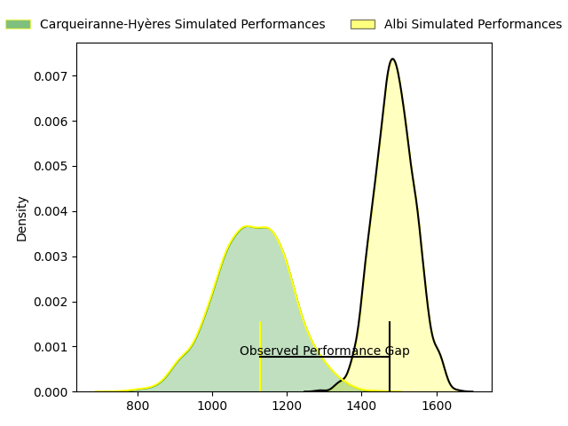
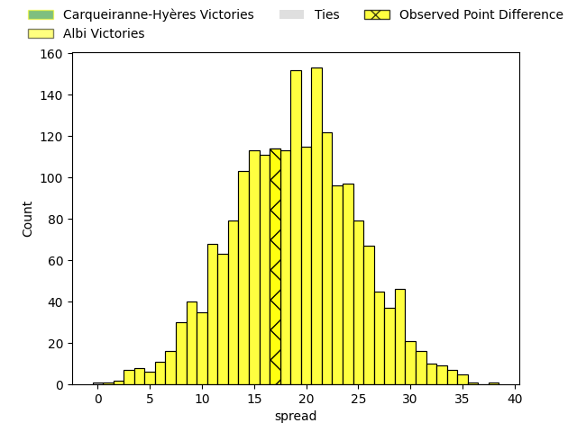
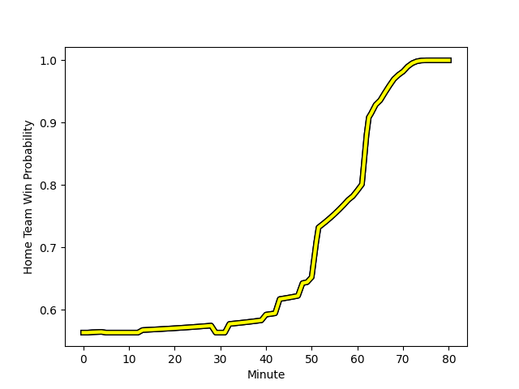

---  
layout: page  
title: Carqueiranne-Hyères at Albi; 6-23  
date: 2023-01-21 18:30:00 18:00:00 -0500  
categories: match review  
---
# Carqueiranne-Hyères at Albi; 6-23

# Club Level Predictions

The first set of predictions treats a club as the smallest object, as the club develops its members, organizes a gameplan, and deploys its players as needed for each match. This club model has a prediction of 0.889, which translates to predicting Albi to win by 19.0.

Each club has a rating and a rating deviation (simiar to a Glicko system), and expected performances can be generated. This allows for simulated matches and spreads like the ones below.
## Projected Performances

## Projected Spreads

# Player Level Predictions

Treating teams instead as an entity made up of the currently active players, I have ratings for each player in an altogether different system. These can be combined to form team ratings once teamsheets are announced, weighting starters a bit higher than the reserves. After the match is played, players can be weighted by their minutes on the field, allowing for an accurate measure of the team's composition. With these compiled team ratings, we can make predictions, measure inaccuracy, and update the individual player ratings.
## Prediction with Player Minutes: Albi by 15.1

Albi by 11.1 on a neutral field
## Scores over Time

## Win Probability over Time

## Prediction without Player Minutes: Albi by 12.2

Albi by 8.2 on a neutral pitch

|   Away Minutes | Away Player                                                                   |   Away elo |   Away Percentile |   Number |   Home Percentile |   Home elo | Home Player                                                           |   Home Minutes |
|---------------:|:------------------------------------------------------------------------------|-----------:|------------------:|---------:|------------------:|-----------:|:----------------------------------------------------------------------|---------------:|
|             70 | [Eli Serra-Miglietti](..//playerfiles//EliSerra-Miglietti_cleaned.md)         |      89.54 |                22 |        1 |                15 |      83.24 | [Maxime Escur](..//playerfiles//MaximeEscur_cleaned.md)               |             48 |
|             70 | [Michael Tyumenev](..//playerfiles//MichaelTyumenev_cleaned.md)               |      77.22 |                 7 |        2 |               nan |      98.28 | [Romain Maurice](..//playerfiles//RomainMaurice_cleaned.md)           |             48 |
|             64 | [Costel Burtila](..//playerfiles//CostelBurtila_cleaned.md)                   |      93.96 |                42 |        3 |                46 |      96    | [Dimitri Tchapnga](..//playerfiles//DimitriTchapnga_cleaned.md)       |             69 |
|             70 | [Lucas Cazac](..//playerfiles//LucasCazac_cleaned.md)                         |      56.31 |                 1 |        4 |                59 |      98.88 | [Charles Foures](..//playerfiles//CharlesFoures_cleaned.md)           |             40 |
|             80 | [Geoffrey Nouhaillaguet](..//playerfiles//GeoffreyNouhaillaguet_cleaned.md)   |      83.92 |                18 |        5 |                51 |      96.34 | [Jacques Engelbrecht](..//playerfiles//JacquesEngelbrecht_cleaned.md) |             80 |
|             80 | [Nicolas Baquer](..//playerfiles//NicolasBaquer_cleaned.md)                   |      94.93 |                50 |        6 |                 8 |      76.17 | [Hugo Boutin](..//playerfiles//HugoBoutin_cleaned.md)                 |             80 |
|             70 | [Joachim Beaumont](..//playerfiles//JoachimBeaumont_cleaned.md)               |     110.52 |                81 |        7 |                87 |     115.56 | [Lucas Guillaume](..//playerfiles//LucasGuillaume_cleaned.md)         |             69 |
|             80 | [Cristian Chirica](..//playerfiles//CristianChirica_cleaned.md)               |      65.1  |                 2 |        8 |                69 |     103.8  | [Mohsen Essid](..//playerfiles//MohsenEssid_cleaned.md)               |             80 |
|             70 | [Rémi Dubié](..//playerfiles//RémiDubié_cleaned.md)                           |      85.23 |                16 |        9 |                52 |      96.92 | [Gilen Queheille](..//playerfiles//GilenQueheille_cleaned.md)         |             65 |
|             70 | [Ionel Melinte](..//playerfiles//IonelMelinte_cleaned.md)                     |      99.98 |                56 |       10 |                14 |      81.3  | [Théo Vidal](..//playerfiles//ThéoVidal_cleaned.md)                   |             43 |
|             80 | [Josselyn Bouchon](..//playerfiles//JosselynBouchon_cleaned.md)               |     112.38 |                80 |       11 |                28 |      88.49 | [Gautier Lacointa](..//playerfiles//GautierLacointa_cleaned.md)       |             80 |
|             80 | [Dylan Sage](..//playerfiles//DylanSage_cleaned.md)                           |      91.4  |                30 |       12 |                27 |      87.06 | [Simon Andreu](..//playerfiles//SimonAndreu_cleaned.md)               |             50 |
|             59 | [Charles Brousse](..//playerfiles//CharlesBrousse_cleaned.md)                 |     116.75 |                88 |       13 |                89 |     118.64 | [Baptiste Couchinave](..//playerfiles//BaptisteCouchinave_cleaned.md) |             80 |
|             80 | [David Smith](..//playerfiles//DavidSmith_cleaned.md)                         |      96.06 |                49 |       14 |                20 |      85.43 | [Charly Trussardi](..//playerfiles//CharlyTrussardi_cleaned.md)       |             80 |
|             80 | [Adrien Amans](..//playerfiles//AdrienAmans_cleaned.md)                       |      73.72 |                 9 |       15 |                75 |     109.35 | [Téo Dospital](..//playerfiles//TéoDospital_cleaned.md)               |             80 |
|             10 | [Miguel Mathieu](..//playerfiles//MiguelMathieu_cleaned.md)                   |      89.34 |                30 |       16 |                73 |     103.01 | [Antoine Soave](..//playerfiles//AntoineSoave_cleaned.md)             |             32 |
|             10 | [Pierre Traiter](..//playerfiles//PierreTraiter_cleaned.md)                   |     100.58 |                65 |       17 |                78 |     106.27 | [Arthur Castant](..//playerfiles//ArthurCastant_cleaned.md)           |             32 |
|             16 | [Jean-Baptiste Reggiardo](..//playerfiles//Jean-BaptisteReggiardo_cleaned.md) |      85.31 |                24 |       18 |                22 |      87.09 | [Kevin Brou](..//playerfiles//KevinBrou_cleaned.md)                   |             11 |
|             10 | [Nathan Gendre](..//playerfiles//NathanGendre_cleaned.md)                     |      97.94 |                56 |       19 |                80 |     110.44 | [Sandrick Maciotta](..//playerfiles//SandrickMaciotta_cleaned.md)     |             40 |
|             10 | [Julien Ormea](..//playerfiles//JulienOrmea_cleaned.md)                       |      97.3  |                49 |       20 |                55 |      97.5  | [Gael Ekpe](..//playerfiles//GaelEkpe_cleaned.md)                     |             11 |
|             10 | [Jérémy Fleury](..//playerfiles//JérémyFleury_cleaned.md)                     |      93.76 |               nan |       21 |                80 |     112.5  | [Benjamin Pehau](..//playerfiles//BenjaminPehau_cleaned.md)           |             37 |
|             10 | [Théo Defrance](..//playerfiles//ThéoDefrance_cleaned.md)                     |      84    |                17 |       22 |                 8 |      76.72 | [Titouan Pouzoullic](..//playerfiles//TitouanPouzoullic_cleaned.md)   |             15 |
|             21 | [Romain Leveque](..//playerfiles//RomainLeveque_cleaned.md)                   |     121.61 |                92 |       23 |                51 |      96.58 | [François Fontaine](..//playerfiles//FrançoisFontaine_cleaned.md)     |             30 |

