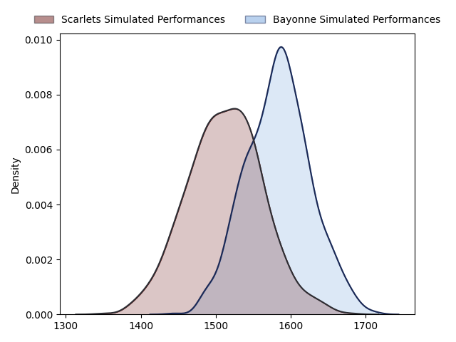
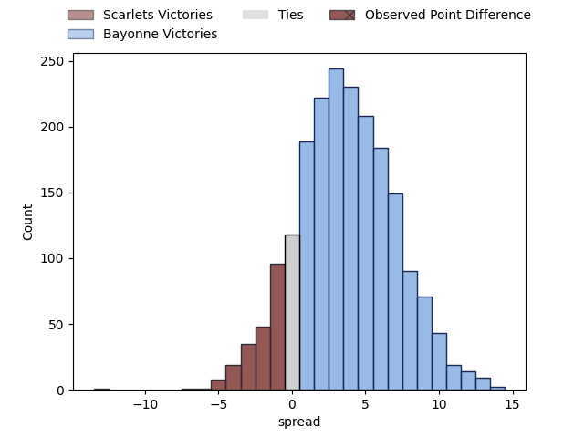

---  
layout: page  
title: Scarlets at Bayonne; 20-7  
date: 2023-01-21 14:00:00 18:00:00 -0500  
categories: match review  
---
# Scarlets at Bayonne; 20-7

# Club Level Predictions

The first set of predictions treats a club as the smallest object, as the club develops its members, organizes a gameplan, and deploys its players as needed for each match. This club model has a prediction of 0.601, which translates to predicting Bayonne to win by 3.6.

Each club has a rating and a rating deviation (simiar to a Glicko system), and expected performances can be generated. This allows for simulated matches and spreads like the ones below.
## Projected Performances

## Projected Spreads

# Player Level Predictions

Treating teams instead as an entity made up of the currently active players, I have ratings for each player in an altogether different system. These can be combined to form team ratings once teamsheets are announced, weighting starters a bit higher than the reserves. After the match is played, players can be weighted by their minutes on the field, allowing for an accurate measure of the team's composition. With these compiled team ratings, we can make predictions, measure inaccuracy, and update the individual player ratings.
## Prediction with Player Minutes: Scarlets by 4.4

Scarlets by 8.4 on a neutral field
## Scores over Time

## Win Probability over Time

## Prediction without Player Minutes: Scarlets by 1.3

Scarlets by 2.7 on a neutral pitch

|   Away Minutes | Away Player                                                     |   Away elo |   Away Percentile |   Number |   Home Percentile |   Home elo | Home Player                                                                  |   Home Minutes |
|---------------:|:----------------------------------------------------------------|-----------:|------------------:|---------:|------------------:|-----------:|:-----------------------------------------------------------------------------|---------------:|
|             47 | [Wyn Jones](..//playerfiles//WynJones_cleaned.md)               |     118.73 |                94 |        1 |                34 |      91.05 | [Pieter Scholtz](..//playerfiles//PieterScholtz_cleaned.md)                  |             55 |
|             60 | [Ken Owens](..//playerfiles//KenOwens_cleaned.md)               |     107.37 |                81 |        2 |                87 |     113.91 | [Torsten van Jaarsveld](..//playerfiles//TorstenvanJaarsveld_cleaned.md)     |             45 |
|             51 | [Javan Sebastian](..//playerfiles//JavanSebastian_cleaned.md)   |      71.12 |                 4 |        3 |                 6 |      74.77 | [Chris Talakai](..//playerfiles//ChrisTalakai_cleaned.md)                    |             41 |
|             80 | [Vaea Fifita](..//playerfiles//VaeaFifita_cleaned.md)           |     126.08 |                94 |        4 |                99 |     161.4  | [Denis Marchois](..//playerfiles//DenisMarchois_cleaned.md)                  |             70 |
|             80 | [Sam Lousi](..//playerfiles//SamLousi_cleaned.md)               |     126.04 |                95 |        5 |                63 |     100.26 | [Manuel Leindekar](..//playerfiles//ManuelLeindekar_cleaned.md)              |             80 |
|             80 | [Aaron Shingler](..//playerfiles//AaronShingler_cleaned.md)     |      93.29 |                42 |        6 |                20 |      85.49 | [Jean Monribot](..//playerfiles//JeanMonribot_cleaned.md)                    |             80 |
|             80 | [Dan Davis](..//playerfiles//DanDavis_cleaned.md)               |     109.31 |                80 |        7 |                23 |      86.34 | [Esteban Capilla](..//playerfiles//EstebanCapilla_cleaned.md)                |             50 |
|             47 | [Carwyn Tuipulotu](..//playerfiles//CarwynTuipulotu_cleaned.md) |      85.79 |                23 |        8 |                55 |      97.29 | [Mateaki Kafatolu](..//playerfiles//MateakiKafatolu_cleaned.md)              |             80 |
|             54 | [Gareth Davies](..//playerfiles//GarethDavies_cleaned.md)       |      64.09 |                 2 |        9 |                86 |     112.74 | [Maxime Machenaud](..//playerfiles//MaximeMachenaud_cleaned.md)              |             46 |
|             67 | [Sam Costelow](..//playerfiles//SamCostelow_cleaned.md)         |      77.31 |                 8 |       10 |                86 |     117.53 | [Thomas Dolhagaray](..//playerfiles//ThomasDolhagaray_cleaned.md)            |             45 |
|             80 | [Steffan Evans](..//playerfiles//SteffanEvans_cleaned.md)       |     110.11 |                81 |       11 |                 0 |      43.37 | [Bastien Pourailly](..//playerfiles//BastienPourailly_cleaned.md)            |             80 |
|             62 | [Jonathan Davies](..//playerfiles//JonathanDavies_cleaned.md)   |     122.98 |                93 |       12 |                 4 |      73.2  | [Guillaume Martocq](..//playerfiles//GuillaumeMartocq_cleaned.md)            |             80 |
|             80 | [Joe Roberts](..//playerfiles//JoeRoberts_cleaned.md)           |      91.54 |                38 |       13 |                84 |     113.42 | [Peyo Muscarditz](..//playerfiles//PeyoMuscarditz_cleaned.md)                |             60 |
|             80 | [Johnny McNicholl](..//playerfiles//JohnnyMcNicholl_cleaned.md) |     116.4  |                87 |       14 |               nan |     105.63 | [Marland Yarde](..//playerfiles//MarlandYarde_cleaned.md)                    |             80 |
|             80 | [Leigh Halfpenny](..//playerfiles//LeighHalfpenny_cleaned.md)   |     103.2  |                64 |       15 |                46 |      94.06 | [Yohan Orabé](..//playerfiles//YohanOrabé_cleaned.md)                        |             80 |
|             33 | [Kemsley Mathias](..//playerfiles//KemsleyMathias_cleaned.md)   |      92.13 |                38 |       16 |                80 |     105.04 | [Swan Cormenier](..//playerfiles//SwanCormenier_cleaned.md)                  |             25 |
|             20 | [Shaun Evans](..//playerfiles//ShaunEvans_cleaned.md)           |      76.82 |                15 |       17 |               nan |      94.2  | [Badri Tsikhistavi](..//playerfiles//BadriTsikhistavi_cleaned.md)            |             39 |
|             29 | [Sam Wainwright](..//playerfiles//SamWainwright_cleaned.md)     |      88.45 |                36 |       18 |                93 |     119    | [Thomas Acquier](..//playerfiles//ThomasAcquier_cleaned.md)                  |             35 |
|             33 | [Sione Kalamafoni](..//playerfiles//SioneKalamafoni_cleaned.md) |      97.41 |                49 |       19 |                89 |     117.92 | [Baptiste Heguy](..//playerfiles//BaptisteHeguy_cleaned.md)                  |             10 |
|             26 | [Kieran Hardy](..//playerfiles//KieranHardy_cleaned.md)         |     106.76 |                82 |       20 |                 5 |      71.83 | [Aitor Hourcade](..//playerfiles//AitorHourcade_cleaned.md)                  |             30 |
|             13 | [Rhys Patchell](..//playerfiles//RhysPatchell_cleaned.md)       |     145.51 |                99 |       21 |                84 |     111.36 | [Guillaume Rouet Piffard](..//playerfiles//GuillaumeRouetPiffard_cleaned.md) |             34 |
|             18 | [Ioan Nicholas](..//playerfiles//IoanNicholas_cleaned.md)       |      90.84 |                37 |       22 |                 6 |      75.06 | [Jason Robertson](..//playerfiles//JasonRobertson_cleaned.md)                |             35 |
|            nan | nan                                                             |     nan    |               nan |       23 |                25 |      86.04 | [Eneriko Buliruarua](..//playerfiles//EnerikoBuliruarua_cleaned.md)          |             20 |

