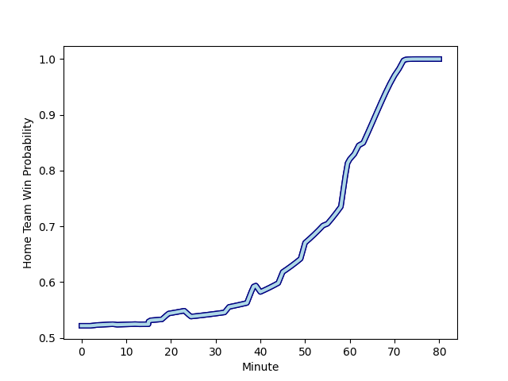

---  
layout: page  
title: Cornish Pirates at Bedford; 13-55  
date: 2023-01-21 16:00:00 18:00:00 -0500  
categories: match review  
---
# Cornish Pirates (1439.07) at Bedford (1476.6); 13-55

# Prediction: Bedford by 7.8

Bedford by 3.8 on a neutral field
## Scores over Time

## Win Probability over Time

# Pre-Match Prediction: Bedford by 8.9

Bedford by 4.9 on a neutral pitch

|   Away Minutes | Away Player                                                                 |   Away elo |   Away Percentile |   Number |   Home Percentile |   Home elo | Home Player                                                             |   Home Minutes |
|---------------:|:----------------------------------------------------------------------------|-----------:|------------------:|---------:|------------------:|-----------:|:------------------------------------------------------------------------|---------------:|
|             55 | [Marlen Walker](..//playerfiles//MarlenWalker_cleaned.md)                   |     114.91 |                90 |        1 |                41 |      93.01 | [Joey Conway](..//playerfiles//JoeyConway_cleaned.md)                   |             70 |
|             63 | [William Crane](..//playerfiles//WilliamCrane_cleaned.md)                   |      99.84 |                62 |        2 |                54 |      96.41 | [Jack Hughes](..//playerfiles//JackHughes_cleaned.md)                   |             63 |
|             55 | [Matt Johnson](..//playerfiles//MattJohnson_cleaned.md)                     |     100.93 |                72 |        3 |                22 |      92.7  | [Corrie Barrett](..//playerfiles//CorrieBarrett_cleaned.md)             |             55 |
|             80 | [James Fender](..//playerfiles//JamesFender_cleaned.md)                     |      99.52 |                61 |        4 |                76 |     106.49 | [Robin Williams](..//playerfiles//RobinWilliams_cleaned.md)             |             80 |
|             61 | [Cory Teague](..//playerfiles//CoryTeague_cleaned.md)                       |      75.11 |                 8 |        5 |                65 |     101.19 | [Tom Lockett](..//playerfiles//TomLockett_cleaned.md)                   |             55 |
|             80 | [Sebastian Nagle-Taylor](..//playerfiles//SebastianNagle-Taylor_cleaned.md) |     108    |                75 |        6 |                81 |     110.95 | [Luke Frost](..//playerfiles//LukeFrost_cleaned.md)                     |             80 |
|             80 | [Alex Everett](..//playerfiles//AlexEverett_cleaned.md)                     |      97.84 |                55 |        7 |                16 |      82.76 | [Jac Arthur](..//playerfiles//JacArthur_cleaned.md)                     |             63 |
|             55 | [Rusiate Tuima](..//playerfiles//RusiateTuima_cleaned.md)                   |      74.12 |                 6 |        8 |                17 |      82.7  | [Tui Uru](..//playerfiles//TuiUru_cleaned.md)                           |             80 |
|             13 | [Ruaridh Dawson](..//playerfiles//RuaridhDawson_cleaned.md)                 |      92.55 |                39 |        9 |                93 |     120.87 | [Alex Day](..//playerfiles//AlexDay_cleaned.md)                         |             55 |
|             80 | [Arwel Robson](..//playerfiles//ArwelRobson_cleaned.md)                     |      92    |                39 |       10 |                96 |     137.51 | [William Maisey](..//playerfiles//WilliamMaisey_cleaned.md)             |             63 |
|             80 | [Tom Wyatt](..//playerfiles//TomWyatt_cleaned.md)                           |     107.68 |                77 |       11 |                44 |      93.94 | [Dean Adamson](..//playerfiles//DeanAdamson_cleaned.md)                 |             80 |
|             80 | [Garyn Smith](..//playerfiles//GarynSmith_cleaned.md)                       |     105.05 |                71 |       12 |                68 |     103.52 | [Michael Le Bourgeois](..//playerfiles//MichaelLeBourgeois_cleaned.md)  |             80 |
|             50 | [Rory Parata](..//playerfiles//RoryParata_cleaned.md)                       |     108.94 |                78 |       13 |                38 |      94.79 | [Tom Litchfield](..//playerfiles//TomLitchfield_cleaned.md)             |             80 |
|             80 | [Robin Wedlake](..//playerfiles//RobinWedlake_cleaned.md)                   |      90.12 |                33 |       14 |                13 |      80.86 | [Matthew Worley](..//playerfiles//MatthewWorley_cleaned.md)             |             80 |
|             40 | [Will Trewin](..//playerfiles//WillTrewin_cleaned.md)                       |      93.6  |               nan |       15 |                80 |     113.3  | [George Hendy](..//playerfiles//GeorgeHendy_cleaned.md)                 |             40 |
|             67 | [Alex Schwarz](..//playerfiles//AlexSchwarz_cleaned.md)                     |      88.33 |                29 |       16 |                 6 |      72.52 | [Sean French](..//playerfiles//SeanFrench_cleaned.md)                   |             40 |
|             40 | [Carwyn Penny](..//playerfiles//CarwynPenny_cleaned.md)                     |      88.79 |                32 |       17 |               nan |      97.84 | [Kieran Curran](..//playerfiles//KieranCurran_cleaned.md)               |             25 |
|             30 | [Callum Sirker](..//playerfiles//CallumSirker_cleaned.md)                   |      52.86 |                 0 |       18 |                43 |      93.06 | [Jake Garside](..//playerfiles//JakeGarside_cleaned.md)                 |             25 |
|             25 | [Will Gibson](..//playerfiles//WillGibson_cleaned.md)                       |      83.65 |                17 |       19 |                92 |     112.92 | [Ed Prowse](..//playerfiles//EdProwse_cleaned.md)                       |             25 |
|             25 | [Harvey Beaton](..//playerfiles//HarveyBeaton_cleaned.md)                   |      93.36 |                42 |       20 |                21 |      88.47 | [Louis Grimoldby](..//playerfiles//LouisGrimoldby_cleaned.md)           |             17 |
|             25 | [Jack Andrew](..//playerfiles//JackAndrew_cleaned.md)                       |     117.31 |                89 |       21 |                31 |      82    | [Charles Rylands](..//playerfiles//CharlesRylands_cleaned.md)           |             17 |
|             19 | [Josh Williams](..//playerfiles//JoshWilliams_cleaned.md)                   |      96.2  |               nan |       22 |               nan |      95    | [Aston Gradwick-Light](..//playerfiles//AstonGradwick-Light_cleaned.md) |             17 |
|             17 | [Morgan Nelson](..//playerfiles//MorganNelson_cleaned.md)                   |      97.19 |               nan |       23 |               nan |      95.4  | [Monty Royston](..//playerfiles//MontyRoyston_cleaned.md)               |             10 |

