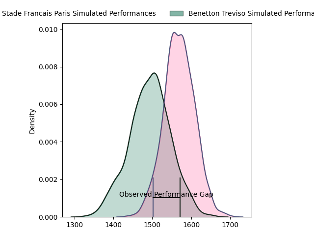
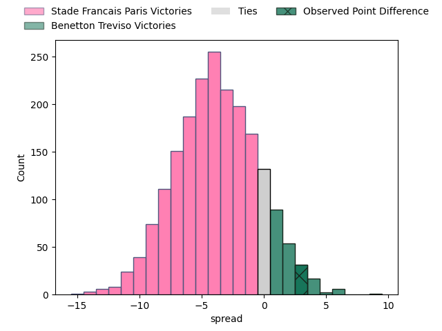
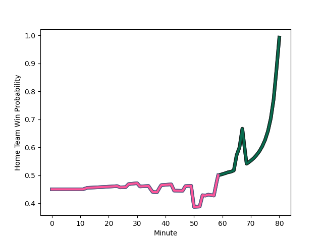

---  
layout: page  
title: Stade Francais Paris at Benetton Treviso; 32-35  
date: 2023-01-21 16:15:00 18:00:00 -0500  
categories: match review  
---
# Stade Francais Paris at Benetton Treviso; 32-35

# Club Level Predictions

The first set of predictions treats a club as the smallest object, as the club develops its members, organizes a gameplan, and deploys its players as needed for each match. This club model has a prediction of 0.396, which translates to predicting Stade Francais Paris to win by 3.7.

Each club has a rating and a rating deviation (simiar to a Glicko system), and expected performances can be generated. This allows for simulated matches and spreads like the ones below.
## Projected Performances

## Projected Spreads

# Player Level Predictions

Treating teams instead as an entity made up of the currently active players, I have ratings for each player in an altogether different system. These can be combined to form team ratings once teamsheets are announced, weighting starters a bit higher than the reserves. After the match is played, players can be weighted by their minutes on the field, allowing for an accurate measure of the team's composition. With these compiled team ratings, we can make predictions, measure inaccuracy, and update the individual player ratings.
## Prediction with Player Minutes: Stade Francais Paris by 4.7

Stade Francais Paris by 8.7 on a neutral field
## Scores over Time

## Win Probability over Time

## Prediction without Player Minutes: Stade Francais Paris by 16.2

Stade Francais Paris by 20.2 on a neutral pitch

|   Away Minutes | Away Player                                                             |   Away elo |   Away Percentile |   Number |   Home Percentile |   Home elo | Home Player                                                              |   Home Minutes |
|---------------:|:------------------------------------------------------------------------|-----------:|------------------:|---------:|------------------:|-----------:|:-------------------------------------------------------------------------|---------------:|
|             59 | [Sergo Abramishvili](..//playerfiles//SergoAbramishvili_cleaned.md)     |      98.51 |                66 |        1 |                66 |     100.56 | [Federico Zani](..//playerfiles//FedericoZani_cleaned.md)                |             50 |
|             50 | [Laurent Panis](..//playerfiles//LaurentPanis_cleaned.md)               |      84.1  |                14 |        2 |                78 |     106.91 | [Giacomo Nicotera](..//playerfiles//GiacomoNicotera_cleaned.md)          |             80 |
|             50 | [Paul Alo-Emile](..//playerfiles//PaulAlo-Emile_cleaned.md)             |      92.73 |                43 |        3 |                67 |     100.76 | [Simone Ferrari](..//playerfiles//SimoneFerrari_cleaned.md)              |             53 |
|             67 | [Nathan Huguen](..//playerfiles//NathanHuguen_cleaned.md)               |      88.96 |                30 |        4 |                 0 |      52.3  | [Niccolo Cannone](..//playerfiles//NiccoloCannone_cleaned.md)            |             80 |
|             24 | [JJ van der Mescht](..//playerfiles//JJvanderMescht_cleaned.md)         |     116.91 |                89 |        5 |                53 |      96.84 | [Federico Ruzza](..//playerfiles//FedericoRuzza_cleaned.md)              |             80 |
|             80 | [Giorgi Tsutskeridze](..//playerfiles//GiorgiTsutskeridze_cleaned.md)   |     120.93 |                92 |        6 |                17 |      83.48 | [Sebastian Negri](..//playerfiles//SebastianNegri_cleaned.md)            |             59 |
|             80 | [Sekou Macalou](..//playerfiles//SekouMacalou_cleaned.md)               |     112.34 |                83 |        7 |                35 |      90.55 | [Manuel Zuliani](..//playerfiles//ManuelZuliani_cleaned.md)              |             80 |
|             80 | [Juan Martin Scelzo](..//playerfiles//JuanMartinScelzo_cleaned.md)      |      91.86 |                38 |        8 |                87 |     115.5  | [Michele Lamaro](..//playerfiles//MicheleLamaro_cleaned.md)              |             80 |
|             80 | [Arthur Coville](..//playerfiles//ArthurCoville_cleaned.md)             |      86.08 |                30 |        9 |                31 |      89.86 | [Alessandro Garbisi](..//playerfiles//AlessandroGarbisi_cleaned.md)      |             55 |
|             63 | [Leo Barre](..//playerfiles//LeoBarre_cleaned.md)                       |     121.23 |                89 |       10 |                90 |     122.29 | [Tomas Albornoz](..//playerfiles//TomasAlbornoz_cleaned.md)              |             80 |
|             66 | [Stéphane Ahmed](..//playerfiles//StéphaneAhmed_cleaned.md)             |     138.96 |                98 |       11 |                 8 |      75.23 | [Mattia Bellini](..//playerfiles//MattiaBellini_cleaned.md)              |             80 |
|             67 | [Alex Arrate](..//playerfiles//AlexArrate_cleaned.md)                   |      79.53 |                12 |       12 |                81 |     111.03 | [Tommaso Menoncello](..//playerfiles//TommasoMenoncello_cleaned.md)      |             80 |
|             80 | [Julien Delbouis](..//playerfiles//JulienDelbouis_cleaned.md)           |     133.95 |                97 |       13 |                82 |     111.89 | [Juan Ignacio Brex](..//playerfiles//JuanIgnacioBrex_cleaned.md)         |             80 |
|             80 | [Sione Tui](..//playerfiles//SioneTui_cleaned.md)                       |     112.29 |                83 |       14 |                86 |     115.72 | [Edoardo Padovani](..//playerfiles//EdoardoPadovani_cleaned.md)          |             80 |
|             80 | [Kylan Hamdaoui](..//playerfiles//KylanHamdaoui_cleaned.md)             |     119.29 |                88 |       15 |                65 |     103.92 | [Rhyno Smith](..//playerfiles//RhynoSmith_cleaned.md)                    |             80 |
|             30 | [Lucas Peyresblanques](..//playerfiles//LucasPeyresblanques_cleaned.md) |     105.42 |                76 |       16 |                78 |     104.82 | [Nahuel Tetaz Chaparro](..//playerfiles//NahuelTetazChaparro_cleaned.md) |             30 |
|             21 | [Clement Castets](..//playerfiles//ClementCastets_cleaned.md)           |     109.65 |                85 |       17 |                63 |      99.96 | [Tiziano Pasquali](..//playerfiles//TizianoPasquali_cleaned.md)          |             27 |
|             30 | [Vincent Koch](..//playerfiles//VincentKoch_cleaned.md)                 |      80.72 |                11 |       18 |                10 |      78.24 | [Henry Time-Stowers](..//playerfiles//HenryTime-Stowers_cleaned.md)      |             21 |
|             13 | [Sitaleki Timani](..//playerfiles//SitalekiTimani_cleaned.md)           |     117.15 |                89 |       19 |                63 |     101.55 | [Manfredi Albanese](..//playerfiles//ManfrediAlbanese_cleaned.md)        |             25 |
|             56 | [Ryan Chapuis](..//playerfiles//RyanChapuis_cleaned.md)                 |      65.67 |                 3 |       20 |               nan |     nan    | nan                                                                      |            nan |
|             17 | [Morgan Parra](..//playerfiles//MorganParra_cleaned.md)                 |     103.31 |                69 |       21 |               nan |     nan    | nan                                                                      |            nan |
|             14 | [Peniasi Dakuwaqa](..//playerfiles//PeniasiDakuwaqa_cleaned.md)         |      94.38 |               nan |       22 |               nan |     nan    | nan                                                                      |            nan |
|             13 | [Harry Glover](..//playerfiles//HarryGlover_cleaned.md)                 |     118.25 |                89 |       23 |               nan |     nan    | nan                                                                      |            nan |

