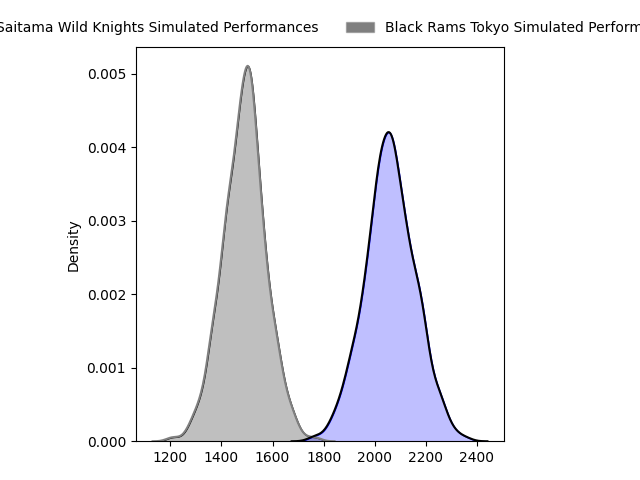
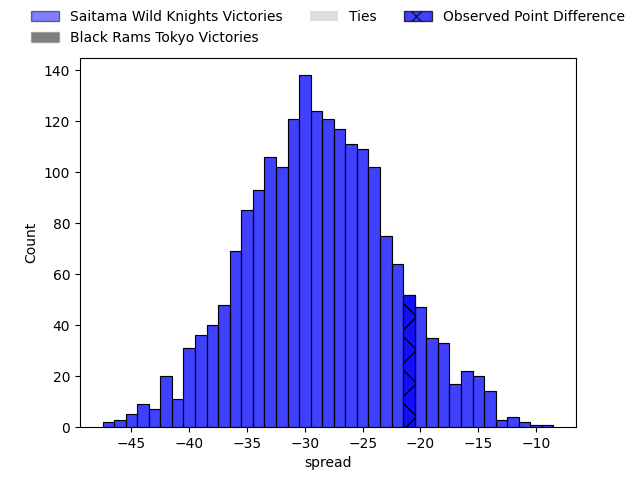
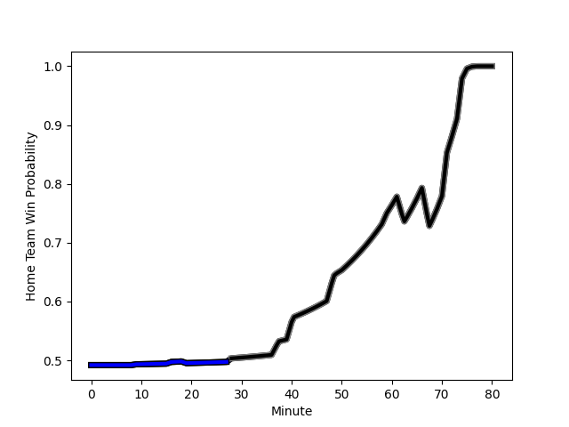

---  
layout: page  
title: Saitama Wild Knights at Black Rams Tokyo; 38-17  
date: 2023-01-21 05:00:00 18:00:00 -0500  
categories: match review  
---
# Saitama Wild Knights at Black Rams Tokyo; 38-17

# Club Level Predictions

The first set of predictions treats a club as the smallest object, as the club develops its members, organizes a gameplan, and deploys its players as needed for each match. This club model has a prediction of 0.041, which translates to predicting Saitama Wild Knights to win by 28.5.

Each club has a rating and a rating deviation (simiar to a Glicko system), and expected performances can be generated. This allows for simulated matches and spreads like the ones below.
## Projected Performances

## Projected Spreads

# Player Level Predictions

Treating teams instead as an entity made up of the currently active players, I have ratings for each player in an altogether different system. These can be combined to form team ratings once teamsheets are announced, weighting starters a bit higher than the reserves. After the match is played, players can be weighted by their minutes on the field, allowing for an accurate measure of the team's composition. With these compiled team ratings, we can make predictions, measure inaccuracy, and update the individual player ratings.
## Prediction with Player Minutes: Black Rams Tokyo by 2.6

Saitama Wild Knights by 1.4 on a neutral field
## Scores over Time

## Win Probability over Time

## Prediction without Player Minutes: Saitama Wild Knights by 1.8

Saitama Wild Knights by 2.2 on a neutral pitch

|   Away Minutes | Away Player                                                     |   Away elo |   Away Percentile |   Number |   Home Percentile |   Home elo | Home Player                                                         |   Home Minutes |
|---------------:|:----------------------------------------------------------------|-----------:|------------------:|---------:|------------------:|-----------:|:--------------------------------------------------------------------|---------------:|
|             60 | [Craig Millar](..//playerfiles//CraigMillar_cleaned.md)         |      97.78 |                64 |        1 |                85 |     110.14 | [Yuichiro Taniguchi](..//playerfiles//YuichiroTaniguchi_cleaned.md) |             59 |
|             79 | [Atsushi Sakate](..//playerfiles//AtsushiSakate_cleaned.md)     |     105.61 |                76 |        2 |                23 |      86.53 | [Masaaki Onishi](..//playerfiles//MasaakiOnishi_cleaned.md)         |             59 |
|             60 | [Asaeli Ai Valu](..//playerfiles//AsaeliAiValu_cleaned.md)      |     118.83 |                94 |        3 |                67 |     100.9  | [Daigo Sasagawa](..//playerfiles//DaigoSasagawa_cleaned.md)         |             59 |
|             80 | [Liam Mitchell](..//playerfiles//LiamMitchell_cleaned.md)       |      80.41 |                14 |        4 |                67 |     102.24 | [Jacob Skeen](..//playerfiles//JacobSkeen_cleaned.md)               |             68 |
|             60 | [Lood de Jager](..//playerfiles//LooddeJager_cleaned.md)        |      92.78 |                41 |        5 |                93 |     121.65 | [Pohiva Lotoahea](..//playerfiles//PohivaLotoahea_cleaned.md)       |             80 |
|             80 | [Ryota Hasegawa](..//playerfiles//RyotaHasegawa_cleaned.md)     |     137.36 |                98 |        6 |                49 |      97.72 | [Talau Fakatava](..//playerfiles//TalauFakatava_cleaned.md)         |             80 |
|             75 | [Lachlan Boshier](..//playerfiles//LachlanBoshier_cleaned.md)   |      97.56 |                53 |        7 |                46 |      94.64 | [Shuhei Matsuhashi](..//playerfiles//ShuheiMatsuhashi_cleaned.md)   |             80 |
|             80 | [Shota Fukui](..//playerfiles//ShotaFukui_cleaned.md)           |     103.76 |                61 |        8 |                86 |     116.01 | [Nathan Hughes](..//playerfiles//NathanHughes_cleaned.md)           |             50 |
|             79 | [Keisuke Uchida](..//playerfiles//KeisukeUchida_cleaned.md)     |     106.38 |                76 |        9 |                94 |     121.74 | [Syota Yamamoto](..//playerfiles//SyotaYamamoto_cleaned.md)         |             40 |
|             80 | [Rikiya Matsuda](..//playerfiles//RikiyaMatsuda_cleaned.md)     |      96.61 |                46 |       10 |                43 |      94.93 | [Kohei Horigome](..//playerfiles//KoheiHorigome_cleaned.md)         |             50 |
|             80 | [Marika Koroibete](..//playerfiles//MarikaKoroibete_cleaned.md) |      87.11 |                24 |       11 |                68 |     102.53 | [Netani Vakayalia](..//playerfiles//NetaniVakayalia_cleaned.md)     |             80 |
|             80 | [Tomoki Osada](..//playerfiles//TomokiOsada_cleaned.md)         |      95    |               nan |       12 |                74 |     106.58 | [Hadleigh Parkes](..//playerfiles//HadleighParkes_cleaned.md)       |             80 |
|             75 | [Dylan Riley](..//playerfiles//DylanRiley_cleaned.md)           |     117.29 |                88 |       13 |                92 |     121.81 | [Ryohei Isoda](..//playerfiles//RyoheiIsoda_cleaned.md)             |             73 |
|             80 | [Ryuji Noguchi](..//playerfiles//RyujiNoguchi_cleaned.md)       |     103.91 |                65 |       14 |                22 |      86.42 | [Main Taira](..//playerfiles//MainTaira_cleaned.md)                 |             80 |
|             62 | [Takuya Yamasawa](..//playerfiles//TakuyaYamasawa_cleaned.md)   |     123.94 |                92 |       15 |                90 |     122.98 | [Matt McGahan](..//playerfiles//MattMcGahan_cleaned.md)             |             80 |
|             20 | [Keita Inagaki](..//playerfiles//KeitaInagaki_cleaned.md)       |     118.93 |                94 |       16 |                32 |      94.46 | [Toshiya Takahashi](..//playerfiles//ToshiyaTakahashi_cleaned.md)   |             40 |
|             20 | [Taiki Fujii](..//playerfiles//TaikiFujii_cleaned.md)           |      93.69 |                43 |       17 |                91 |     123.32 | [Brodi McCurran](..//playerfiles//BrodiMcCurran_cleaned.md)         |             30 |
|             20 | [Esei Ha'angana](..//playerfiles//EseiHa'angana_cleaned.md)     |     118.87 |                90 |       18 |                30 |      93.89 | [Isaac Lucas](..//playerfiles//IsaacLucas_cleaned.md)               |             30 |
|             18 | [Koki Takeyama](..//playerfiles//KokiTakeyama_cleaned.md)       |     153.31 |                99 |       19 |               nan |      94.22 | [Kazuhiro Koike](..//playerfiles//KazuhiroKoike_cleaned.md)         |             21 |
|              5 | [Masaki Tani](..//playerfiles//MasakiTani_cleaned.md)           |     130.92 |               nan |       20 |                14 |      87.21 | [Kazuma Nishi](..//playerfiles//KazumaNishi_cleaned.md)             |             21 |
|              5 | [Vince Aso](..//playerfiles//VinceAso_cleaned.md)               |     107.64 |                76 |       21 |                37 |      94.63 | [Taichi Chiba](..//playerfiles//TaichiChiba_cleaned.md)             |             21 |
|              1 | [Kazuma Shimane](..//playerfiles//KazumaShimane_cleaned.md)     |      95    |               nan |       22 |                 5 |      72.47 | [Mike Stolberg](..//playerfiles//MikeStolberg_cleaned.md)           |             12 |
|              1 | [Taiki Koyama](..//playerfiles//TaikiKoyama_cleaned.md)         |     125.53 |                96 |       23 |                59 |     104.1  | [Yuki Ikeda](..//playerfiles//YukiIkeda_cleaned.md)                 |              7 |

