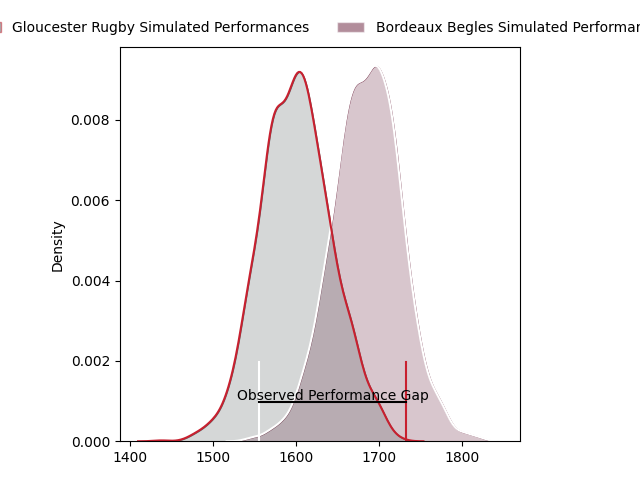
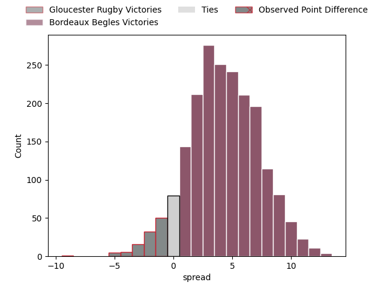

---  
layout: page  
title: Gloucester Rugby at Bordeaux Begles; 26-17  
date: 2023-01-21 16:15:00 18:00:00 -0500  
categories: match review  
---
# Gloucester Rugby at Bordeaux Begles; 26-17

# Club Level Predictions

The first set of predictions treats a club as the smallest object, as the club develops its members, organizes a gameplan, and deploys its players as needed for each match. This club model has a prediction of 0.619, which translates to predicting Bordeaux Begles to win by 4.3.

Each club has a rating and a rating deviation (simiar to a Glicko system), and expected performances can be generated. This allows for simulated matches and spreads like the ones below.
## Projected Performances

## Projected Spreads

# Player Level Predictions

Treating teams instead as an entity made up of the currently active players, I have ratings for each player in an altogether different system. These can be combined to form team ratings once teamsheets are announced, weighting starters a bit higher than the reserves. After the match is played, players can be weighted by their minutes on the field, allowing for an accurate measure of the team's composition. With these compiled team ratings, we can make predictions, measure inaccuracy, and update the individual player ratings.
## Prediction with Player Minutes: Bordeaux Begles by 10.4

Bordeaux Begles by 6.4 on a neutral field
## Scores over Time

## Win Probability over Time

## Prediction without Player Minutes: Bordeaux Begles by 24.2

Bordeaux Begles by 20.2 on a neutral pitch

|   Away Minutes | Away Player                                                         |   Away elo |   Away Percentile |   Number |   Home Percentile |   Home elo | Home Player                                                                      |   Home Minutes |
|---------------:|:--------------------------------------------------------------------|-----------:|------------------:|---------:|------------------:|-----------:|:---------------------------------------------------------------------------------|---------------:|
|             80 | [Val Rapava-Ruskin](..//playerfiles//ValRapava-Ruskin_cleaned.md)   |      85.47 |                19 |        1 |                65 |      97.04 | [Ugo Boniface](..//playerfiles//UgoBoniface_cleaned.md)                          |             70 |
|             76 | [George McGuigan](..//playerfiles//GeorgeMcGuigan_cleaned.md)       |      95.07 |                50 |        2 |                49 |      93.81 | [Connor Sa](..//playerfiles//ConnorSa_cleaned.md)                                |             62 |
|             80 | [Kirill Gotovtsev](..//playerfiles//KirillGotovtsev_cleaned.md)     |     114.51 |                90 |        3 |                80 |     105.64 | [Sipili Falatea](..//playerfiles//SipiliFalatea_cleaned.md)                      |             67 |
|             65 | [Cameron Jordan](..//playerfiles//CameronJordan_cleaned.md)         |     111.99 |                91 |        4 |                19 |      84.27 | [Thomas Jolmes](..//playerfiles//ThomasJolmes_cleaned.md)                        |             80 |
|             80 | [Matias Alemanno](..//playerfiles//MatiasAlemanno_cleaned.md)       |     115.25 |                87 |        5 |                86 |     114.11 | [Cyril Cazeaux](..//playerfiles//CyrilCazeaux_cleaned.md)                        |             62 |
|             80 | [Jack Clement](..//playerfiles//JackClement_cleaned.md)             |      94.19 |                52 |        6 |                92 |     118.47 | [Antoine Miquel](..//playerfiles//AntoineMiquel_cleaned.md)                      |             62 |
|             80 | [Lewis Ludlow](..//playerfiles//LewisLudlow_cleaned.md)             |      91.24 |                37 |        7 |                82 |     111.76 | [Mahamadou Diaby](..//playerfiles//MahamadouDiaby_cleaned.md)                    |             80 |
|             80 | [Albert Tuisue](..//playerfiles//AlbertTuisue_cleaned.md)           |      77.42 |                 9 |        8 |                77 |     108.68 | [Caleb Timu](..//playerfiles//CalebTimu_cleaned.md)                              |             80 |
|             80 | [Stephen Varney](..//playerfiles//StephenVarney_cleaned.md)         |      77.59 |                 8 |        9 |                10 |      77.51 | [Jules Gimbert](..//playerfiles//JulesGimbert_cleaned.md)                        |             70 |
|             80 | [Billy Twelvetrees](..//playerfiles//BillyTwelvetrees_cleaned.md)   |     130.11 |                96 |       10 |                70 |     105.39 | [Matthieu Jalibert](..//playerfiles//MatthieuJalibert_cleaned.md)                |             80 |
|             80 | [Ollie Thorley](..//playerfiles//OllieThorley_cleaned.md)           |     107.14 |                76 |       11 |                73 |     105.36 | [Madosh Tambwe](..//playerfiles//MadoshTambwe_cleaned.md)                        |             80 |
|             80 | [Sebastien Atkinson](..//playerfiles//SebastienAtkinson_cleaned.md) |      59.18 |                 1 |       12 |                18 |      82.91 | [Yoram Moefana](..//playerfiles//YoramMoefana_cleaned.md)                        |             80 |
|             80 | [Giorgi Kveseladze](..//playerfiles//GiorgiKveseladze_cleaned.md)   |     106.07 |                74 |       13 |                80 |     106.01 | [Pablo Uberti](..//playerfiles//PabloUberti_cleaned.md)                          |             73 |
|             80 | [Jonny May](..//playerfiles//JonnyMay_cleaned.md)                   |      95.94 |                49 |       14 |                25 |      87.42 | [Santiago Cordero](..//playerfiles//SantiagoCordero_cleaned.md)                  |             80 |
|             80 | [George Barton](..//playerfiles//GeorgeBarton_cleaned.md)           |      89.38 |                34 |       15 |                86 |     117.8  | [Nans Ducuing](..//playerfiles//NansDucuing_cleaned.md)                          |             65 |
|              4 | [Sebastian Blake](..//playerfiles//SebastianBlake_cleaned.md)       |      85.97 |               nan |       16 |                56 |      97.59 | [Maxime Lamothe](..//playerfiles//MaximeLamothe_cleaned.md)                      |             18 |
|             15 | [Freddie Clarke](..//playerfiles//FreddieClarke_cleaned.md)         |      95.28 |                49 |       17 |                85 |     109.69 | [Jefferson Poirot](..//playerfiles//JeffersonPoirot_cleaned.md)                  |             10 |
|            nan | nan                                                                 |     nan    |               nan |       18 |                68 |     101.22 | [Christopher Vaotoa](..//playerfiles//ChristopherVaotoa_cleaned.md)              |             13 |
|            nan | nan                                                                 |     nan    |               nan |       19 |                96 |     129.76 | [Jandré Marais](..//playerfiles//JandréMarais_cleaned.md)                        |             18 |
|            nan | nan                                                                 |     nan    |               nan |       20 |                64 |     101.55 | [Bastien Vergnes Taillefer](..//playerfiles//BastienVergnesTaillefer_cleaned.md) |             18 |
|            nan | nan                                                                 |     nan    |               nan |       21 |                23 |      87.61 | [Hugo Zabalza](..//playerfiles//HugoZabalza_cleaned.md)                          |             10 |
|            nan | nan                                                                 |     nan    |               nan |       22 |                43 |      93.33 | [Jean-Baptiste Dubie](..//playerfiles//Jean-BaptisteDubie_cleaned.md)            |              7 |
|            nan | nan                                                                 |     nan    |               nan |       23 |                10 |      79.84 | [Mateo Garcia](..//playerfiles//MateoGarcia_cleaned.md)                          |             15 |

