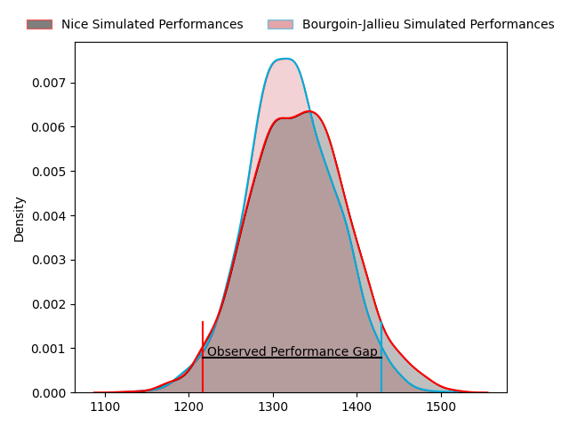
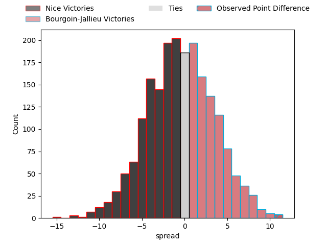

---  
layout: page  
title: Nice at Bourgoin-Jallieu; 16-27  
date: 2023-01-21 18:30:00 18:00:00 -0500  
categories: match review  
---
# Nice at Bourgoin-Jallieu; 16-27

# Club Level Predictions

The first set of predictions treats a club as the smallest object, as the club develops its members, organizes a gameplan, and deploys its players as needed for each match. This club model has a prediction of 0.485, which translates to predicting Nice to win by 0.5.

Each club has a rating and a rating deviation (simiar to a Glicko system), and expected performances can be generated. This allows for simulated matches and spreads like the ones below.
## Projected Performances

## Projected Spreads

# Player Level Predictions

Treating teams instead as an entity made up of the currently active players, I have ratings for each player in an altogether different system. These can be combined to form team ratings once teamsheets are announced, weighting starters a bit higher than the reserves. After the match is played, players can be weighted by their minutes on the field, allowing for an accurate measure of the team's composition. With these compiled team ratings, we can make predictions, measure inaccuracy, and update the individual player ratings.
## Prediction with Player Minutes: Nice by 6.0

Nice by 10.0 on a neutral field
## Scores over Time

## Win Probability over Time

## Prediction without Player Minutes: Nice by 6.2

Nice by 10.2 on a neutral pitch

|   Away Minutes | Away Player                                                               |   Away elo |   Away Percentile |   Number |   Home Percentile |   Home elo | Home Player                                                               |   Home Minutes |
|---------------:|:--------------------------------------------------------------------------|-----------:|------------------:|---------:|------------------:|-----------:|:--------------------------------------------------------------------------|---------------:|
|             63 | [Nika Neparidze](..//playerfiles//NikaNeparidze_cleaned.md)               |      89.42 |                28 |        1 |                13 |      81.36 | [Romain Favaretto](..//playerfiles//RomainFavaretto_cleaned.md)           |             56 |
|             47 | [Kurt Haupt](..//playerfiles//KurtHaupt_cleaned.md)                       |      91.14 |                38 |        2 |                16 |      84.05 | [Maxime Castant](..//playerfiles//MaximeCastant_cleaned.md)               |             56 |
|             57 | [Jeronimo Negrotto](..//playerfiles//JeronimoNegrotto_cleaned.md)         |      81.67 |                15 |        3 |                54 |      96.84 | [Maxime Caillet](..//playerfiles//MaximeCaillet_cleaned.md)               |             56 |
|             57 | [Jérôme Mondoulet](..//playerfiles//JérômeMondoulet_cleaned.md)           |      96.58 |                50 |        4 |                84 |     111.72 | [Kemueli Lavetanakoroi](..//playerfiles//KemueliLavetanakoroi_cleaned.md) |             63 |
|             80 | [Marvin Woki](..//playerfiles//MarvinWoki_cleaned.md)                     |     107.96 |                72 |        5 |                 8 |      72.94 | [Léandre Cotte](..//playerfiles//LéandreCotte_cleaned.md)                 |             80 |
|             80 | [Louis Suaud](..//playerfiles//LouisSuaud_cleaned.md)                     |     108.13 |                79 |        6 |                54 |      94.82 | [Kevin Chaudouard](..//playerfiles//KevinChaudouard_cleaned.md)           |             80 |
|             69 | [Arthur Vignolles](..//playerfiles//ArthurVignolles_cleaned.md)           |     100.38 |                62 |        7 |                11 |      79.22 | [Theophile Cotte](..//playerfiles//TheophileCotte_cleaned.md)             |             53 |
|             63 | [Steffon Armitage](..//playerfiles//SteffonArmitage_cleaned.md)           |     103.24 |                64 |        8 |                80 |     109.43 | [Poutasi Luafutu](..//playerfiles//PoutasiLuafutu_cleaned.md)             |             63 |
|             63 | [Mathieu Loree](..//playerfiles//MathieuLoree_cleaned.md)                 |     119.04 |                93 |        9 |                82 |     109.79 | [Tomas Munilla lo Duca](..//playerfiles//TomasMunillaloDuca_cleaned.md)   |             80 |
|             80 | [Mathis Viard](..//playerfiles//MathisViard_cleaned.md)                   |     100.99 |                59 |       10 |                15 |      83.8  | [Nicolas Vuillemin](..//playerfiles//NicolasVuillemin_cleaned.md)         |             80 |
|             80 | [Clement Egiziano](..//playerfiles//ClementEgiziano_cleaned.md)           |     100.4  |               nan |       11 |                11 |      78.12 | [Naibuka Rokua](..//playerfiles//NaibukaRokua_cleaned.md)                 |             80 |
|             80 | [Jens Torfs](..//playerfiles//JensTorfs_cleaned.md)                       |     107.36 |                76 |       12 |                18 |      82.97 | [Romain Sola](..//playerfiles//RomainSola_cleaned.md)                     |             60 |
|             80 | [Alban Conduche](..//playerfiles//AlbanConduche_cleaned.md)               |      87.61 |                28 |       13 |                65 |      99.16 | [Christopher Bosch](..//playerfiles//ChristopherBosch_cleaned.md)         |             80 |
|             80 | [Sakiusa Bureitakiyaca](..//playerfiles//SakiusaBureitakiyaca_cleaned.md) |      93.69 |                43 |       14 |                39 |      92.44 | [Quentin Lefort](..//playerfiles//QuentinLefort_cleaned.md)               |             70 |
|             60 | [Augustin Slowik](..//playerfiles//AugustinSlowik_cleaned.md)             |     104.17 |                71 |       15 |                69 |     103.33 | [Remi Bouet](..//playerfiles//RemiBouet_cleaned.md)                       |             80 |
|             17 | [Nicolas Ciancio](..//playerfiles//NicolasCiancio_cleaned.md)             |      95.67 |               nan |       16 |                22 |      84.46 | [Adrien Devisme](..//playerfiles//AdrienDevisme_cleaned.md)               |             24 |
|             33 | [Badri Alkhazashvili](..//playerfiles//BadriAlkhazashvili_cleaned.md)     |      85.53 |                21 |       17 |                24 |      85.51 | [Killian Tripier](..//playerfiles//KillianTripier_cleaned.md)             |             24 |
|             23 | [James Johnston](..//playerfiles//JamesJohnston_cleaned.md)               |      97.58 |                56 |       18 |                39 |      91.12 | [Oktay Yilmaz](..//playerfiles//OktayYilmaz_cleaned.md)                   |             24 |
|             23 | [Thibaud Rey](..//playerfiles//ThibaudRey_cleaned.md)                     |      99.57 |                61 |       19 |                48 |      97.4  | [Théo Lepage](..//playerfiles//ThéoLepage_cleaned.md)                     |             17 |
|             17 | [Laijiasa Bolenaivalu](..//playerfiles//LaijiasaBolenaivalu_cleaned.md)   |     127.5  |                94 |       20 |                69 |     103.56 | [Bynjamin Rabatel](..//playerfiles//BynjaminRabatel_cleaned.md)           |             27 |
|             11 | [Killian Taofifenua](..//playerfiles//KillianTaofifenua_cleaned.md)       |      97.32 |                57 |       21 |                51 |      96.62 | [Pieter Morton](..//playerfiles//PieterMorton_cleaned.md)                 |             20 |
|             17 | [Louis Peutin](..//playerfiles//LouisPeutin_cleaned.md)                   |      86.4  |                25 |       22 |                26 |      83.06 | [Pablo Patilla](..//playerfiles//PabloPatilla_cleaned.md)                 |             10 |
|             20 | [Loic Le Gal](..//playerfiles//LoicLeGal_cleaned.md)                      |      70.25 |                 6 |       23 |                55 |     101.4  | [Joketani Koroi](..//playerfiles//JoketaniKoroi_cleaned.md)               |             17 |

