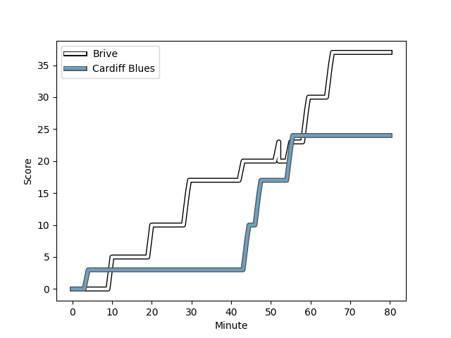
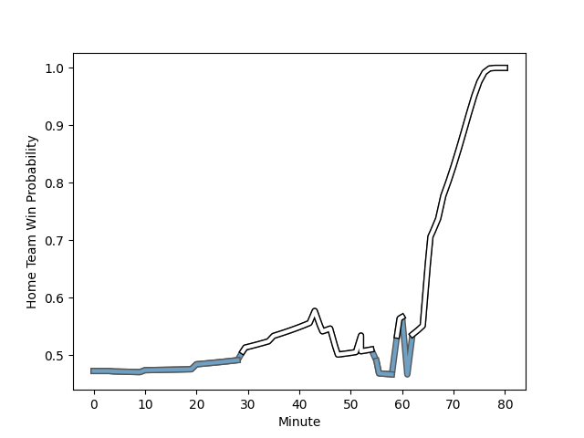

---  
layout: page  
title: Cardiff Blues at Brive; 24-37  
date: 2023-01-21 21:00:00 18:00:00 -0500  
categories: match review  
---
# Cardiff Blues (1566.81) at Brive (1518.59); 24-37

# Prediction: Cardiff Blues by 0.8

Cardiff Blues by 4.8 on a neutral field
## Scores over Time

## Win Probability over Time

# Pre-Match Prediction: Cardiff Blues by 2.0

Cardiff Blues by 6.0 on a neutral pitch

|   Away Minutes | Away Player                                                           |   Away elo |   Away Percentile |   Number |   Home Percentile |   Home elo | Home Player                                                                      |   Home Minutes |
|---------------:|:----------------------------------------------------------------------|-----------:|------------------:|---------:|------------------:|-----------:|:---------------------------------------------------------------------------------|---------------:|
|             74 | [Rhys Carré](..//playerfiles//RhysCarré_cleaned.md)                   |      94.04 |                42 |        1 |                33 |      90.54 | [Daniel Brennan](..//playerfiles//DanielBrennan_cleaned.md)                      |             52 |
|             61 | [Kirby Myhill](..//playerfiles//KirbyMyhill_cleaned.md)               |      88.48 |                29 |        2 |                12 |      80.27 | [Motu Matu'u](..//playerfiles//MotuMatu'u_cleaned.md)                            |             62 |
|             68 | [Keiron Assiratti](..//playerfiles//KeironAssiratti_cleaned.md)       |     101.95 |                71 |        3 |               nan |      81.88 | [Francisco Coria Marchetti](..//playerfiles//FranciscoCoriaMarchetti_cleaned.md) |             35 |
|             54 | [Lopeti Timani](..//playerfiles//LopetiTimani_cleaned.md)             |      84.61 |                20 |        4 |                36 |      91.18 | [Julien Delannoy](..//playerfiles//JulienDelannoy_cleaned.md)                    |             62 |
|             60 | [Teddy Williams](..//playerfiles//TeddyWilliams_cleaned.md)           |     107.97 |                78 |        5 |                67 |     102.77 | [Lucas Paulos](..//playerfiles//LucasPaulos_cleaned.md)                          |             80 |
|             80 | [James Botham](..//playerfiles//JamesBotham_cleaned.md)               |     107.07 |                72 |        6 |                32 |      89.8  | [Tevita Ratuva](..//playerfiles//TevitaRatuva_cleaned.md)                        |             52 |
|             68 | [Ellis Jenkins](..//playerfiles//EllisJenkins_cleaned.md)             |     115.16 |                87 |        7 |                99 |     156.19 | [Said Hireche](..//playerfiles//SaidHireche_cleaned.md)                          |             80 |
|             80 | [James Ratti](..//playerfiles//JamesRatti_cleaned.md)                 |     103.69 |                64 |        8 |                89 |     116.69 | [Retief Marais](..//playerfiles//RetiefMarais_cleaned.md)                        |             80 |
|             75 | [Tomos Williams](..//playerfiles//TomosWilliams_cleaned.md)           |     113.94 |                87 |        9 |                 9 |      81.91 | [Enzo Sanga](..//playerfiles//EnzoSanga_cleaned.md)                              |             52 |
|             80 | [Rhys Priestland](..//playerfiles//RhysPriestland_cleaned.md)         |      88.52 |                24 |       10 |                96 |     137.24 | [Nicolas Sanchez](..//playerfiles//NicolasSanchez_cleaned.md)                    |             46 |
|             80 | [Jason Harries](..//playerfiles//JasonHarries_cleaned.md)             |     151.94 |                99 |       11 |                43 |      93.46 | [Arthur Bonneval](..//playerfiles//ArthurBonneval_cleaned.md)                    |             80 |
|             80 | [Ben Thomas](..//playerfiles//BenThomas_cleaned.md)                   |     104.64 |                71 |       12 |                94 |     126.92 | [Setareki Bituniyata](..//playerfiles//SetarekiBituniyata_cleaned.md)            |             62 |
|             80 | [Mason Grady](..//playerfiles//MasonGrady_cleaned.md)                 |      96.83 |                52 |       13 |                32 |      89.03 | [Seta Tuicuvu](..//playerfiles//SetaTuicuvu_cleaned.md)                          |             80 |
|             80 | [Aled Summerhill](..//playerfiles//AledSummerhill_cleaned.md)         |      76.29 |                 9 |       14 |                46 |      94.97 | [Kevin Fabien](..//playerfiles//KevinFabien_cleaned.md)                          |             80 |
|             68 | [Liam Williams](..//playerfiles//LiamWilliams_cleaned.md)             |     140.3  |                97 |       15 |                31 |      88.24 | [Mathis Ferté](..//playerfiles//MathisFerté_cleaned.md)                          |             80 |
|             19 | [Efan Daniel](..//playerfiles//EfanDaniel_cleaned.md)                 |      97.38 |               nan |       16 |                54 |     100.44 | [Nathan Fraissenon](..//playerfiles//NathanFraissenon_cleaned.md)                |             18 |
|             12 | [William Davies-King](..//playerfiles//WilliamDavies-King_cleaned.md) |      99.43 |                55 |       17 |                79 |     105.65 | [Pietro Ceccarelli](..//playerfiles//PietroCeccarelli_cleaned.md)                |             28 |
|             26 | [Seb Davies](..//playerfiles//SebDavies_cleaned.md)                   |      89.01 |                31 |       18 |                50 |      95.43 | [Tietie Tuimauga](..//playerfiles//TietieTuimauga_cleaned.md)                    |             45 |
|             20 | [Rory Thornton](..//playerfiles//RoryThornton_cleaned.md)             |      86.86 |                26 |       19 |                33 |      90.15 | [Oskar Rixen](..//playerfiles//OskarRixen_cleaned.md)                            |             18 |
|             12 | [Shane Lewis-Hughes](..//playerfiles//ShaneLewis-Hughes_cleaned.md)   |      87.15 |                26 |       20 |                12 |      80.26 | [Sasha Gue](..//playerfiles//SashaGue_cleaned.md)                                |             28 |
|              5 | [Lloyd Williams](..//playerfiles//LloydWilliams_cleaned.md)           |     114.68 |                88 |       21 |                28 |      85.76 | [Leo Carbonneau](..//playerfiles//LeoCarbonneau_cleaned.md)                      |             28 |
|             12 | [Jarrod Evans](..//playerfiles//JarrodEvans_cleaned.md)               |     114.21 |                82 |       22 |                95 |     129.61 | [Enzo Herve](..//playerfiles//EnzoHerve_cleaned.md)                              |             34 |
|              6 | [Bradley Thyer](..//playerfiles//BradleyThyer_cleaned.md)             |     114.8  |                85 |       23 |                 2 |      62.64 | [Wesley Douglas](..//playerfiles//WesleyDouglas_cleaned.md)                      |             18 |

