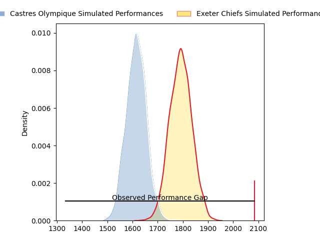
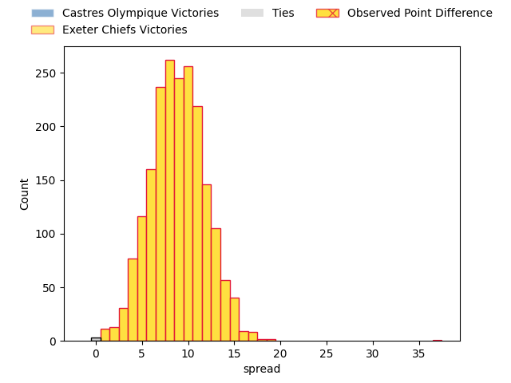
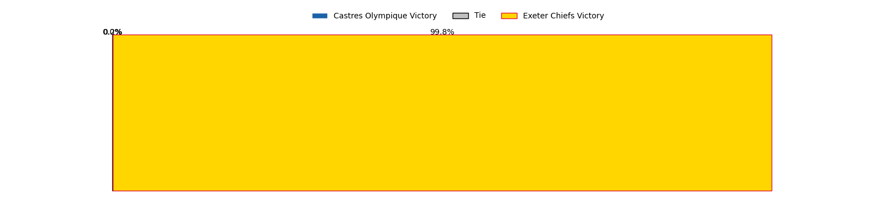
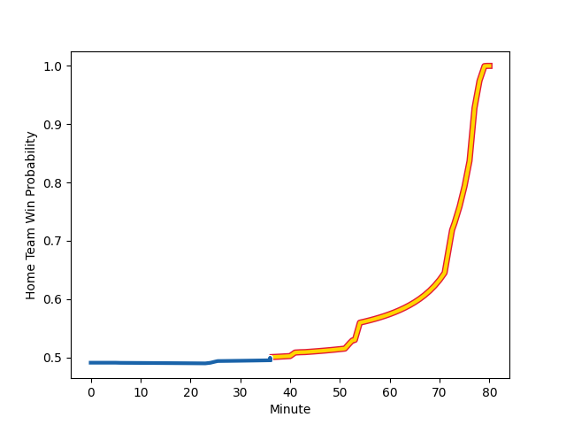

---  
layout: page  
title: Castres Olympique at Exeter Chiefs; 3-40  
date: 2023-01-21 18:30:00 18:00:00 -0500  
categories: match review  
---
# Castres Olympique at Exeter Chiefs; 3-40

# Club Level Predictions

The first set of predictions treats a club as the smallest object, as the club develops its members, organizes a gameplan, and deploys its players as needed for each match. This club model has a prediction of 0.735, which translates to predicting Exeter Chiefs to win by 8.9.

Each club has a rating and a rating deviation (simiar to a Glicko system), and expected performances can be generated. This allows for simulated matches and spreads like the ones below.
## Projected Performances

## Projected Spreads

## Projected Results

# Player Level Predictions

Treating teams instead as an entity made up of the currently active players, I have ratings for each player in an altogether different system. These can be combined to form team ratings once teamsheets are announced, weighting starters a bit higher than the reserves. After the match is played, players can be weighted by their minutes on the field, allowing for an accurate measure of the team's composition. With these compiled team ratings, we can make predictions, measure inaccuracy, and update the individual player ratings.
## Prediction with Player Minutes: Exeter Chiefs by 2.4

Castres Olympique by 1.6 on a neutral field
## Scores over Time

## Win Probability over Time

## Prediction without Player Minutes: Castres Olympique by 4.6

Castres Olympique by 8.6 on a neutral pitch

|   Away Minutes | Away Player                                                             |   Away elo |   Away Percentile |   Number |   Home Percentile |   Home elo | Home Player                                                       |   Home Minutes |
|---------------:|:------------------------------------------------------------------------|-----------:|------------------:|---------:|------------------:|-----------:|:------------------------------------------------------------------|---------------:|
|             54 | [Antoine Tichit](..//playerfiles//AntoineTichit_cleaned.md)             |     101.74 |                71 |        1 |                15 |      80.98 | [James Kenny](..//playerfiles//JamesKenny_cleaned.md)             |             41 |
|             54 | [Gaetan Barlot](..//playerfiles//GaetanBarlot_cleaned.md)               |     130.16 |                98 |        2 |                18 |      84.55 | [Jack Innard](..//playerfiles//JackInnard_cleaned.md)             |             59 |
|             41 | [Levan Chilachava](..//playerfiles//LevanChilachava_cleaned.md)         |      95.87 |               nan |        3 |               nan |      90.35 | [Josh Iosefa-Scott](..//playerfiles//JoshIosefa-Scott_cleaned.md) |             41 |
|             54 | [Gauthier Maravat](..//playerfiles//GauthierMaravat_cleaned.md)         |     101.52 |                63 |        4 |                83 |     112.55 | [Jannes Kirsten](..//playerfiles//JannesKirsten_cleaned.md)       |             54 |
|             54 | [Florent Vanverberghe](..//playerfiles//FlorentVanverberghe_cleaned.md) |     116.91 |                88 |        5 |                74 |     105.5  | [Dafydd Jenkins](..//playerfiles//DafyddJenkins_cleaned.md)       |             80 |
|             66 | [Mathieu Babillot](..//playerfiles//MathieuBabillot_cleaned.md)         |     105.88 |                74 |        6 |                98 |     140.83 | [Dave Ewers](..//playerfiles//DaveEwers_cleaned.md)               |             74 |
|             80 | [Baptiste Delaporte](..//playerfiles//BaptisteDelaporte_cleaned.md)     |      99.53 |                54 |        7 |                32 |      89.65 | [Christ Tshiunza](..//playerfiles//ChristTshiunza_cleaned.md)     |             80 |
|             80 | [Feibyan Tukino](..//playerfiles//FeibyanTukino_cleaned.md)             |      95    |               nan |        8 |                94 |     127.32 | [Sam Simmonds](..//playerfiles//SamSimmonds_cleaned.md)           |             80 |
|             66 | [Rory Kockott](..//playerfiles//RoryKockott_cleaned.md)                 |     113.28 |                87 |        9 |                18 |      84.16 | [Sam Maunder](..//playerfiles//SamMaunder_cleaned.md)             |             43 |
|             80 | [Ben Botica](..//playerfiles//BenBotica_cleaned.md)                     |     131    |                94 |       10 |                93 |     130.48 | [Joe Simmonds](..//playerfiles//JoeSimmonds_cleaned.md)           |             80 |
|             80 | [Thomas Larregain](..//playerfiles//ThomasLarregain_cleaned.md)         |      97.04 |                50 |       11 |                96 |     130.68 | [Olly Woodburn](..//playerfiles//OllyWoodburn_cleaned.md)         |             80 |
|             80 | [Adrea Cocagi](..//playerfiles//AdreaCocagi_cleaned.md)                 |     135.26 |                97 |       12 |                34 |      90.18 | [Rory O'Loughlin](..//playerfiles//RoryO'Loughlin_cleaned.md)     |             54 |
|             80 | [Adrien Seguret](..//playerfiles//AdrienSeguret_cleaned.md)             |      96.06 |                50 |       13 |                79 |     109.77 | [Henry Slade](..//playerfiles//HenrySlade_cleaned.md)             |             80 |
|             24 | [Antoine Bouzerand](..//playerfiles//AntoineBouzerand_cleaned.md)       |     106.1  |                74 |       14 |                34 |      90.53 | [Jack Nowell](..//playerfiles//JackNowell_cleaned.md)             |             80 |
|             80 | [Julien Dumora](..//playerfiles//JulienDumora_cleaned.md)               |     111.26 |                79 |       15 |                10 |      75.25 | [Josh Hodge](..//playerfiles//JoshHodge_cleaned.md)               |             80 |
|             26 | [Brice Humbert](..//playerfiles//BriceHumbert_cleaned.md)               |     116.34 |               nan |       16 |                 9 |      78.8  | [Scott Sio](..//playerfiles//ScottSio_cleaned.md)                 |             39 |
|             26 | [Matt Tierney](..//playerfiles//MattTierney_cleaned.md)                 |      86.06 |               nan |       17 |                98 |     131.57 | [Dan Frost](..//playerfiles//DanFrost_cleaned.md)                 |             21 |
|             39 | [Aurélien Azar](..//playerfiles//AurélienAzar_cleaned.md)               |      60.5  |                 1 |       18 |                89 |     113.77 | [Harry Williams](..//playerfiles//HarryWilliams_cleaned.md)       |             39 |
|             26 | [Kevin Kornath](..//playerfiles//KevinKornath_cleaned.md)               |      90.88 |                47 |       19 |                67 |     102.68 | [Jack Dunne](..//playerfiles//JackDunne_cleaned.md)               |             26 |
|             26 | [Ryno Pieterse](..//playerfiles//RynoPieterse_cleaned.md)               |      81.03 |                17 |       20 |                23 |      87.31 | [Greg Fisilau](..//playerfiles//GregFisilau_cleaned.md)           |              6 |
|             14 | [Teariki Ben-Nicholas](..//playerfiles//TearikiBen-Nicholas_cleaned.md) |      98.55 |                52 |       21 |                10 |      80.63 | [Jack Maunder](..//playerfiles//JackMaunder_cleaned.md)           |             37 |
|             14 | [Julien Blanc](..//playerfiles//JulienBlanc_cleaned.md)                 |     110.28 |                83 |       22 |                95 |     129.38 | [Solomone Kata](..//playerfiles//SolomoneKata_cleaned.md)         |             26 |
|             56 | [Théo Chabouni](..//playerfiles//ThéoChabouni_cleaned.md)               |      95    |               nan |       23 |               nan |     nan    | nan                                                               |            nan |

