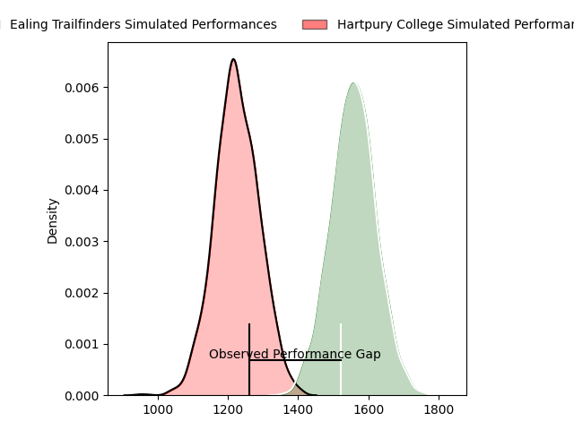
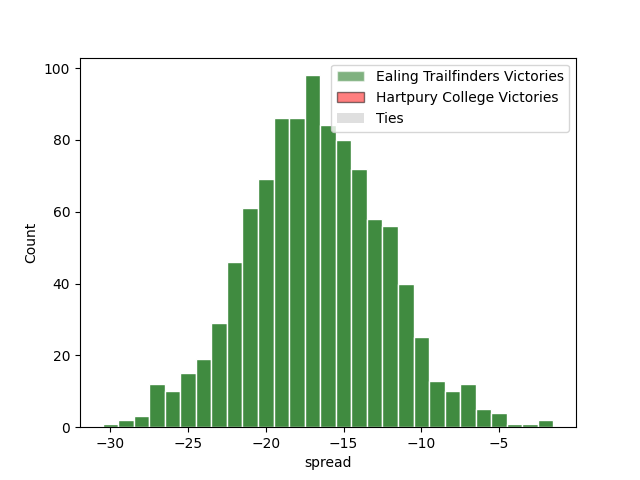
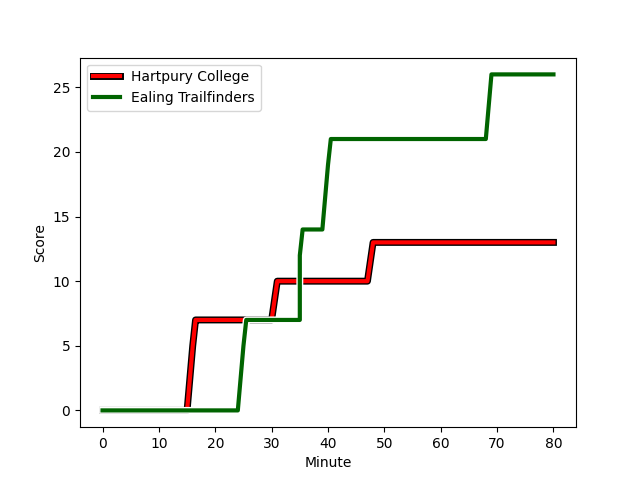
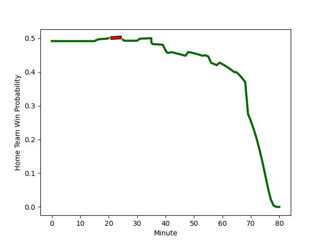

---  
layout: page  
title: Ealing Trailfinders at Hartpury College; 26-13  
date: 2023-01-21 15:30:00 18:00:00 -0500  
categories: match review  
---
# Ealing Trailfinders at Hartpury College; 26-13

# Club Level Predictions

The first set of predictions treats a club as the smallest object, as the club develops its members, organizes a gameplan, and deploys its players as needed for each match. This club model has a prediction of 0.133, which translates to predicting Ealing Trailfinders to win by 16.6.

Each club has a rating and a rating deviation (simiar to a Glicko system), and expected performances can be generated. This allows for simulated matches and spreads like the ones below.
## Projected Performances

## Projected Spreads

# Player Level Predictions

Treating teams instead as an entity made up of the currently active players, I have ratings for each player in an altogether different system. These can be combined to form team ratings once teamsheets are announced, weighting starters a bit higher than the reserves. After the match is played, players can be weighted by their minutes on the field, allowing for an accurate measure of the team's composition. With these compiled team ratings, we can make predictions, measure inaccuracy, and update the individual player ratings.
## Prediction with Player Minutes: Hartpury College by 2.5

Ealing Trailfinders by 1.5 on a neutral field
## Scores over Time

## Win Probability over Time

## Prediction without Player Minutes: Ealing Trailfinders by 6.7

Ealing Trailfinders by 10.7 on a neutral pitch

|   Away Minutes | Away Player                                                           |   Away elo |   Away Percentile |   Number |   Home Percentile |   Home elo | Home Player                                                               |   Home Minutes |
|---------------:|:----------------------------------------------------------------------|-----------:|------------------:|---------:|------------------:|-----------:|:--------------------------------------------------------------------------|---------------:|
|             56 | [James Gibbons](..//playerfiles//JamesGibbons_cleaned.md)             |      76.59 |                 9 |        1 |                66 |     100.55 | [Joe Wrafter](..//playerfiles//JoeWrafter_cleaned.md)                     |             80 |
|             78 | [Shaun Malton](..//playerfiles//ShaunMalton_cleaned.md)               |     121.7  |                94 |        2 |                13 |      81.23 | [Will Tanner](..//playerfiles//WillTanner_cleaned.md)                     |             42 |
|             59 | [Lewis Thiede](..//playerfiles//LewisThiede_cleaned.md)               |     119.32 |                95 |        3 |                22 |      86.76 | [Jonathan Benz-Salomon](..//playerfiles//JonathanBenz-Salomon_cleaned.md) |             80 |
|             80 | [Bobby de Wee](..//playerfiles//BobbydeWee_cleaned.md)                |     116.5  |                92 |        4 |                56 |      98.11 | [Jack Davies](..//playerfiles//JackDavies_cleaned.md)                     |             80 |
|             65 | [Simon Linsell](..//playerfiles//SimonLinsell_cleaned.md)             |     106.11 |                74 |        5 |                79 |     108.51 | [Dale Lemon](..//playerfiles//DaleLemon_cleaned.md)                       |             80 |
|             79 | [Rob Farrar](..//playerfiles//RobFarrar_cleaned.md)                   |      70.71 |                 4 |        6 |                21 |      85.6  | [Samuel Lewis](..//playerfiles//SamuelLewis_cleaned.md)                   |             80 |
|             54 | [Simon Uzokwe](..//playerfiles//SimonUzokwe_cleaned.md)               |      94.06 |                45 |        7 |                44 |      93.98 | [Oli Robinson](..//playerfiles//OliRobinson_cleaned.md)                   |             65 |
|             80 | [Callum Chick](..//playerfiles//CallumChick_cleaned.md)               |      94.8  |                46 |        8 |                25 |      86.83 | [Joe Howard](..//playerfiles//JoeHoward_cleaned.md)                       |             54 |
|             79 | [Craig Hampson](..//playerfiles//CraigHampson_cleaned.md)             |     101.71 |                65 |        9 |                86 |     112.41 | [Matty Jones](..//playerfiles//MattyJones_cleaned.md)                     |             42 |
|             80 | [Craig Willis](..//playerfiles//CraigWillis_cleaned.md)               |     131.04 |                94 |       10 |                75 |     108.18 | [Tommy Mathews](..//playerfiles//TommyMathews_cleaned.md)                 |             80 |
|             20 | [Cian Kelleher](..//playerfiles//CianKelleher_cleaned.md)             |     106.26 |                74 |       11 |                95 |     129.73 | [Sam Smith](..//playerfiles//SamSmith_cleaned.md)                         |             80 |
|             80 | [Pat Howard](..//playerfiles//PatHoward_cleaned.md)                   |      90.33 |                35 |       12 |                80 |     110.61 | [Harry Tarling](..//playerfiles//HarryTarling_cleaned.md)                 |             80 |
|             80 | [Max Bodilly](..//playerfiles//MaxBodilly_cleaned.md)                 |      50.82 |                 0 |       13 |                 7 |      74.22 | [Charlie Foley](..//playerfiles//CharlieFoley_cleaned.md)                 |             80 |
|             80 | [Luke Daniels](..//playerfiles//LukeDaniels_cleaned.md)               |      87.3  |                24 |       14 |                71 |     104.31 | [Bradley Denty](..//playerfiles//BradleyDenty_cleaned.md)                 |             80 |
|             80 | [Jonah Holmes](..//playerfiles//JonahHolmes_cleaned.md)               |     119.73 |                88 |       15 |                15 |      79.16 | [Jake Morris](..//playerfiles//JakeMorris_cleaned.md)                     |             80 |
|             60 | [Steve Shingler](..//playerfiles//SteveShingler_cleaned.md)           |     102.52 |                81 |       16 |               nan |     101.37 | [Arthur William Lennon](..//playerfiles//ArthurWilliamLennon_cleaned.md)  |             38 |
|             26 | [Carlo Tizzano](..//playerfiles//CarloTizzano_cleaned.md)             |      94    |                44 |       17 |                74 |     105.02 | [Luke Stratford](..//playerfiles//LukeStratford_cleaned.md)               |             38 |
|             24 | [Kyle John Whyte](..//playerfiles//KyleJohnWhyte_cleaned.md)          |     126.7  |                97 |       18 |               nan |      98.54 | [Ethan Staddon](..//playerfiles//EthanStaddon_cleaned.md)                 |             26 |
|             21 | [George Davis](..//playerfiles//GeorgeDavis_cleaned.md)               |      83.05 |                56 |       19 |                37 |      95.01 | [Jake Holcombe](..//playerfiles//JakeHolcombe_cleaned.md)                 |             15 |
|             15 | [Daniel Cutmore](..//playerfiles//DanielCutmore_cleaned.md)           |      87.75 |                27 |       20 |               nan |     nan    | nan                                                                       |            nan |
|              2 | [Jan-Henning Campher](..//playerfiles//Jan-HenningCampher_cleaned.md) |      68.64 |                 2 |       21 |               nan |     nan    | nan                                                                       |            nan |
|              1 | [Jordan Burns](..//playerfiles//JordanBurns_cleaned.md)               |      97.96 |                76 |       22 |               nan |     nan    | nan                                                                       |            nan |
|              1 | [Jack Digby](..//playerfiles//JackDigby_cleaned.md)                   |      98.4  |                51 |       23 |               nan |     nan    | nan                                                                       |            nan |

