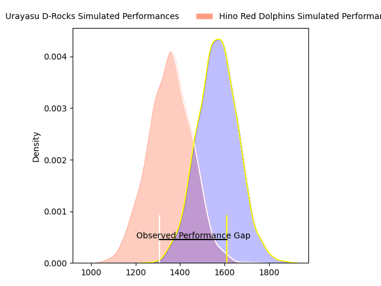
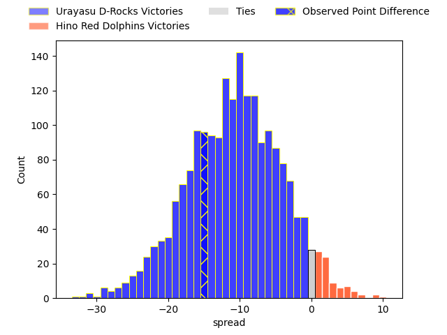
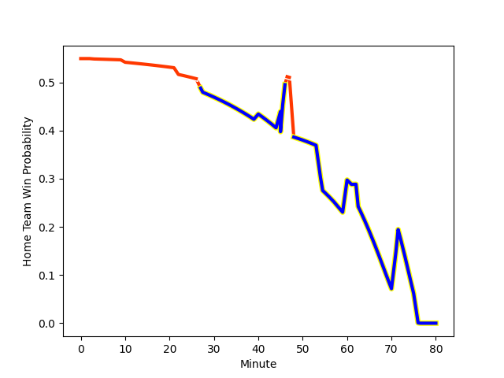

---  
layout: page  
title: Urayasu D-Rocks at Hino Red Dolphins; 41-26  
date: 2023-01-21 00:00:00 18:00:00 -0500  
categories: match review  
---
# Urayasu D-Rocks at Hino Red Dolphins; 41-26

# Club Level Predictions

The first set of predictions treats a club as the smallest object, as the club develops its members, organizes a gameplan, and deploys its players as needed for each match. This club model has a prediction of 0.238, which translates to predicting Urayasu D-Rocks to win by 10.5.

Each club has a rating and a rating deviation (simiar to a Glicko system), and expected performances can be generated. This allows for simulated matches and spreads like the ones below.
## Projected Performances

## Projected Spreads

# Player Level Predictions

Treating teams instead as an entity made up of the currently active players, I have ratings for each player in an altogether different system. These can be combined to form team ratings once teamsheets are announced, weighting starters a bit higher than the reserves. After the match is played, players can be weighted by their minutes on the field, allowing for an accurate measure of the team's composition. With these compiled team ratings, we can make predictions, measure inaccuracy, and update the individual player ratings.
## Prediction with Player Minutes: Hino Red Dolphins by 12.6

Hino Red Dolphins by 8.6 on a neutral field
## Scores over Time

## Win Probability over Time

## Prediction without Player Minutes: Hino Red Dolphins by 14.4

Hino Red Dolphins by 10.4 on a neutral pitch

|   Away Minutes | Away Player                                                            |   Away elo |   Away Percentile |   Number |   Home Percentile |   Home elo | Home Player                                                                   |   Home Minutes |
|---------------:|:-----------------------------------------------------------------------|-----------:|------------------:|---------:|------------------:|-----------:|:------------------------------------------------------------------------------|---------------:|
|             62 | [Ryutaro Ueda](..//playerfiles//RyutaroUeda_cleaned.md)                |      93.98 |               nan |        1 |                65 |     100.36 | [Yuto Tokuda](..//playerfiles//YutoTokuda_cleaned.md)                         |             58 |
|             66 | [Ryuji Fujimura](..//playerfiles//RyujiFujimura_cleaned.md)            |      93.89 |                23 |        2 |                36 |      90.56 | [Yuki Go](..//playerfiles//YukiGo_cleaned.md)                                 |             40 |
|             80 | [Kim Ryom](..//playerfiles//KimRyom_cleaned.md)                        |      82.16 |                12 |        3 |                29 |      89.62 | [Shosuke Funaki](..//playerfiles//ShosukeFunaki_cleaned.md)                   |             79 |
|             74 | [Wimpie van der Walt](..//playerfiles//WimpievanderWalt_cleaned.md)    |      93.18 |                42 |        4 |                96 |     127.25 | [Zephania Tuinona](..//playerfiles//ZephaniaTuinona_cleaned.md)               |             79 |
|             80 | [Ryeongji Kim](..//playerfiles//RyeongjiKim_cleaned.md)                |      76.38 |                 8 |        5 |                57 |      98.13 | [Takehiro Kimura](..//playerfiles//TakehiroKimura_cleaned.md)                 |             48 |
|             80 | [Shingo Nakashima](..//playerfiles//ShingoNakashima_cleaned.md)        |      93.7  |                43 |        6 |                21 |      85.81 | [Ash Parker](..//playerfiles//AshParker_cleaned.md)                           |             80 |
|             80 | [Liam Gill](..//playerfiles//LiamGill_cleaned.md)                      |      97.19 |                48 |        7 |                60 |      99.47 | [Noah Tovio](..//playerfiles//NoahTovio_cleaned.md)                           |             76 |
|             66 | [Tyler Paul](..//playerfiles//TylerPaul_cleaned.md)                    |     116.57 |                88 |        8 |                64 |     102.76 | [Kyosuke Horie](..//playerfiles//KyosukeHorie_cleaned.md)                     |             80 |
|             66 | [Tian Meyer](..//playerfiles//TianMeyer_cleaned.md)                    |      99.74 |                54 |        9 |                48 |      99.83 | [Norifumi Hashimoto](..//playerfiles//NorifumiHashimoto_cleaned.md)           |             80 |
|             80 | [Greig Laidlaw](..//playerfiles//GreigLaidlaw_cleaned.md)              |     103.47 |                66 |       10 |                48 |      97.66 | [Simon Hickey](..//playerfiles//SimonHickey_cleaned.md)                       |             80 |
|             80 | [Yuki Ishii](..//playerfiles//YukiIshii_cleaned.md)                    |      89.87 |                32 |       11 |                69 |     103.57 | [Chance Peni](..//playerfiles//ChancePeni_cleaned.md)                         |             80 |
|             80 | [Tone Tukufuka](..//playerfiles//ToneTukufuka_cleaned.md)              |     131.84 |                95 |       12 |                98 |     136.59 | [Augustine Pulu](..//playerfiles//AugustinePulu_cleaned.md)                   |             80 |
|             48 | [Shane Gates](..//playerfiles//ShaneGates_cleaned.md)                  |      80.19 |                14 |       13 |                66 |     102.63 | [Josefa Lilidamu](..//playerfiles//JosefaLilidamu_cleaned.md)                 |             66 |
|             80 | [Siosifa Lisala](..//playerfiles//SiosifaLisala_cleaned.md)            |     117.79 |                89 |       14 |                56 |      97.74 | [Ryo Kikkawa](..//playerfiles//RyoKikkawa_cleaned.md)                         |             80 |
|             80 | [Takuhei Yasuda](..//playerfiles//TakuheiYasuda_cleaned.md)            |     115.64 |                86 |       15 |                92 |     126.2  | [Riku Kitahara](..//playerfiles//RikuKitahara_cleaned.md)                     |             80 |
|             32 | [Samisoni Ahokovi Tua](..//playerfiles//SamisoniAhokoviTua_cleaned.md) |      81.78 |                16 |       16 |                87 |     116.05 | [Shunya Hamano](..//playerfiles//ShunyaHamano_cleaned.md)                     |             40 |
|             18 | [Masahide Yanagikawa](..//playerfiles//MasahideYanagikawa_cleaned.md)  |     101.34 |               nan |       17 |                53 |      99.08 | [Shun Nakashika](..//playerfiles//ShunNakashika_cleaned.md)                   |             32 |
|             14 | [Franco Marais](..//playerfiles//FrancoMarais_cleaned.md)              |      88.2  |                29 |       18 |                20 |      86.59 | [Yuichi Hisatomi](..//playerfiles//YuichiHisatomi_cleaned.md)                 |             22 |
|             14 | [Jimmy Tupou](..//playerfiles//JimmyTupou_cleaned.md)                  |      90.87 |                34 |       19 |                86 |     114.91 | [Taiki Kawai](..//playerfiles//TaikiKawai_cleaned.md)                         |             14 |
|             14 | [Ren Iinuma](..//playerfiles//RenIinuma_cleaned.md)                    |     103.1  |                69 |       20 |               nan |      96.38 | [Takehiro Nishimura](..//playerfiles//TakehiroNishimura_cleaned.md)           |              4 |
|              6 | [Shinya Osugi](..//playerfiles//ShinyaOsugi_cleaned.md)                |     102.27 |                67 |       21 |                81 |     110.09 | [Dayan van der Westhuizen](..//playerfiles//DayanvanderWesthuizen_cleaned.md) |              1 |
|            nan | nan                                                                    |     nan    |               nan |       22 |                88 |     116.8  | [Yuta Kasahara](..//playerfiles//YutaKasahara_cleaned.md)                     |              1 |

