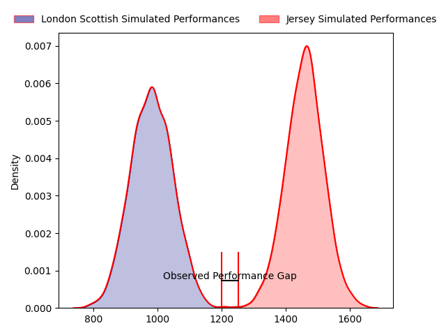
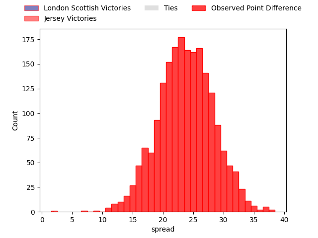

---  
layout: page  
title: London Scottish at Jersey; 22-24  
date: 2023-01-21 16:00:00 18:00:00 -0500  
categories: match review  
---
# London Scottish at Jersey; 22-24

# Club Level Predictions

The first set of predictions treats a club as the smallest object, as the club develops its members, organizes a gameplan, and deploys its players as needed for each match. This club model has a prediction of 0.937, which translates to predicting Jersey to win by 23.9.

Each club has a rating and a rating deviation (simiar to a Glicko system), and expected performances can be generated. This allows for simulated matches and spreads like the ones below.
## Projected Performances

## Projected Spreads

# Player Level Predictions

Treating teams instead as an entity made up of the currently active players, I have ratings for each player in an altogether different system. These can be combined to form team ratings once teamsheets are announced, weighting starters a bit higher than the reserves. After the match is played, players can be weighted by their minutes on the field, allowing for an accurate measure of the team's composition. With these compiled team ratings, we can make predictions, measure inaccuracy, and update the individual player ratings.
## Prediction with Player Minutes: Jersey by 33.8

Jersey by 29.8 on a neutral field
## Scores over Time

## Win Probability over Time

## Prediction without Player Minutes: Jersey by 33.0

Jersey by 29.0 on a neutral pitch

|   Away Minutes | Away Player                                                         |   Away elo |   Away Percentile |   Number |   Home Percentile |   Home elo | Home Player                                                   |   Home Minutes |
|---------------:|:--------------------------------------------------------------------|-----------:|------------------:|---------:|------------------:|-----------:|:--------------------------------------------------------------|---------------:|
|             59 | [Harrison Courtney](..//playerfiles//HarrisonCourtney_cleaned.md)   |     102.69 |                73 |        1 |                39 |      94.26 | [Greg McGrath](..//playerfiles//GregMcGrath_cleaned.md)       |             69 |
|             51 | [Harri Morris](..//playerfiles//HarriMorris_cleaned.md)             |      93.65 |                41 |        2 |                84 |     115.63 | [Eoghan Clarke](..//playerfiles//EoghanClarke_cleaned.md)     |             37 |
|             51 | [Joe Rees](..//playerfiles//JoeRees_cleaned.md)                     |      70.15 |                 3 |        3 |                82 |     110.46 | [Steven Longwell](..//playerfiles//StevenLongwell_cleaned.md) |             80 |
|             80 | [Matt Wilkinson](..//playerfiles//MattWilkinson_cleaned.md)         |     101.97 |                67 |        4 |                77 |     105.37 | [Hamish Bain](..//playerfiles//HamishBain_cleaned.md)         |             46 |
|             80 | [Bailey Ransom](..//playerfiles//BaileyRansom_cleaned.md)           |     118.7  |                90 |        5 |                50 |      95.99 | [James Scott](..//playerfiles//JamesScott_cleaned.md)         |             80 |
|             51 | [Brian Tuilagi](..//playerfiles//BrianTuilagi_cleaned.md)           |      61.34 |                 1 |        6 |                21 |      85.5  | [James Dun](..//playerfiles//JamesDun_cleaned.md)             |             80 |
|             80 | [Jack Ingall](..//playerfiles//JackIngall_cleaned.md)               |      61.52 |                 1 |        7 |                84 |     113.01 | [Lewis Wynne](..//playerfiles//LewisWynne_cleaned.md)         |             69 |
|             63 | [Viliami Taulani](..//playerfiles//ViliamiTaulani_cleaned.md)       |      77.44 |                 9 |        8 |                73 |     108.84 | [Tim Grey](..//playerfiles//TimGrey_cleaned.md)               |             26 |
|             70 | [Daniel Nutton](..//playerfiles//DanielNutton_cleaned.md)           |      55.85 |                 0 |        9 |                14 |      82.99 | [James Elliott](..//playerfiles//JamesElliott_cleaned.md)     |             80 |
|             59 | [Nathan Chamberlain](..//playerfiles//NathanChamberlain_cleaned.md) |      86.11 |                19 |       10 |                69 |     104.57 | [Russell Bennett](..//playerfiles//RussellBennett_cleaned.md) |             80 |
|             49 | [Noah Ferdinand](..//playerfiles//NoahFerdinand_cleaned.md)         |      39.6  |                 0 |       11 |                92 |     122.78 | [Will Brown](..//playerfiles//WillBrown_cleaned.md)           |             80 |
|             80 | [Hayden Hyde](..//playerfiles//HaydenHyde_cleaned.md)               |      62.11 |                 2 |       12 |                97 |     135.81 | [Dan Barnes](..//playerfiles//DanBarnes_cleaned.md)           |             80 |
|             80 | [Lennox Anyanwu](..//playerfiles//LennoxAnyanwu_cleaned.md)         |      88.19 |                27 |       13 |                64 |     100.35 | [Charlie Powell](..//playerfiles//CharliePowell_cleaned.md)   |             51 |
|             80 | [Luke Mehson](..//playerfiles//LukeMehson_cleaned.md)               |      87.68 |                26 |       14 |                16 |      85.06 | [Ryan Hutler](..//playerfiles//RyanHutler_cleaned.md)         |             80 |
|             80 | [Cameron Anderson](..//playerfiles//CameronAnderson_cleaned.md)     |      88.53 |                31 |       15 |                62 |     101.94 | [Brendan Owen](..//playerfiles//BrendanOwen_cleaned.md)       |             80 |
|             31 | [Vilikesa Wara](..//playerfiles//VilikesaWara_cleaned.md)           |      93.5  |               nan |       16 |                62 |     102.1  | [Hallam Chapman](..//playerfiles//HallamChapman_cleaned.md)   |             54 |
|             29 | [William Hobson](..//playerfiles//WilliamHobson_cleaned.md)         |     100.68 |                76 |       17 |                 7 |      78.31 | [James Hadfield](..//playerfiles//JamesHadfield_cleaned.md)   |             43 |
|             29 | [Matas Jurevicius](..//playerfiles//MatasJurevicius_cleaned.md)     |      99.07 |                59 |       18 |                90 |     118.59 | [Sean O'Connor](..//playerfiles//SeanO'Connor_cleaned.md)     |             34 |
|             29 | [Sam Riley](..//playerfiles//SamRiley_cleaned.md)                   |      90.94 |                34 |       19 |                30 |      88.46 | [Jordan Holgate](..//playerfiles//JordanHolgate_cleaned.md)   |             29 |
|             21 | [Jordan Els](..//playerfiles//JordanEls_cleaned.md)                 |      84.31 |                17 |       20 |                55 |      97.31 | [Huw Owen](..//playerfiles//HuwOwen_cleaned.md)               |             11 |
|             21 | [Harry Sheppard](..//playerfiles//HarrySheppard_cleaned.md)         |      87.42 |                38 |       21 |                77 |     109.01 | [Josh Gray](..//playerfiles//JoshGray_cleaned.md)             |             11 |
|             17 | [Austin Wallis](..//playerfiles//AustinWallis_cleaned.md)           |      90.42 |                34 |       22 |               nan |     nan    | nan                                                           |            nan |
|             10 | [Luca Petrozzi](..//playerfiles//LucaPetrozzi_cleaned.md)           |      80.05 |                11 |       23 |               nan |     nan    | nan                                                           |            nan |

