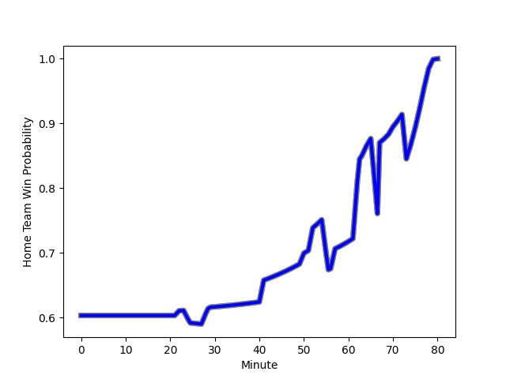

---  
layout: page  
title: Kobelco Kobe Steelers at Kubota Spears Funabashi Tokyo-Bay; 21-25  
date: 2023-01-21 06:30:00 18:00:00 -0500  
categories: match review  
---
# Kobelco Kobe Steelers (1520.47) at Kubota Spears Funabashi Tokyo-Bay (1702.04); 21-25

# Prediction: Kubota Spears Funabashi Tokyo-Bay by 22.2

Kubota Spears Funabashi Tokyo-Bay by 18.2 on a neutral field
## Scores over Time

## Win Probability over Time

# Pre-Match Prediction: Kubota Spears Funabashi Tokyo-Bay by 19.6

Kubota Spears Funabashi Tokyo-Bay by 15.6 on a neutral pitch

|   Away Minutes | Away Player                                                                    |   Away elo |   Away Percentile |   Number |   Home Percentile |   Home elo | Home Player                                                               |   Home Minutes |
|---------------:|:-------------------------------------------------------------------------------|-----------:|------------------:|---------:|------------------:|-----------:|:--------------------------------------------------------------------------|---------------:|
|             59 | [Isileli Nakajima Vakauta](..//playerfiles//IsileliNakajimaVakauta_cleaned.md) |      96.86 |                55 |        1 |                71 |     102.34 | [Kota Kaishi](..//playerfiles//KotaKaishi_cleaned.md)                     |             67 |
|             80 | [Kenta Matsuoka](..//playerfiles//KentaMatsuoka_cleaned.md)                    |      88.81 |                31 |        2 |                96 |     125.01 | [Malcolm Marx](..//playerfiles//MalcolmMarx_cleaned.md)                   |             80 |
|             50 | [Hiroshi Yamashita](..//playerfiles//HiroshiYamashita_cleaned.md)              |     124.72 |                97 |        3 |                84 |     108.71 | [Shoya Matsunami](..//playerfiles//ShoyaMatsunami_cleaned.md)             |             57 |
|             80 | [Seokhwan Jang](..//playerfiles//SeokhwanJang_cleaned.md)                      |     102.58 |                70 |        4 |                85 |     112.45 | [Uwe Helu](..//playerfiles//UweHelu_cleaned.md)                           |             80 |
|             80 | [JD Schickerling](..//playerfiles//JDSchickerling_cleaned.md)                  |      77.93 |                12 |        5 |                74 |     106.25 | [David Bulbring](..//playerfiles//DavidBulbring_cleaned.md)               |             54 |
|             80 | [Amanaki Saumaki](..//playerfiles//AmanakiSaumaki_cleaned.md)                  |      90.37 |                33 |        6 |                77 |     107.67 | [Lappies Labuschagne](..//playerfiles//LappiesLabuschagne_cleaned.md)     |             80 |
|             29 | [Hikaru Hashimoto](..//playerfiles//HikaruHashimoto_cleaned.md)                |      99.51 |                60 |        7 |                84 |     114.67 | [Takeo Suenaga](..//playerfiles//TakeoSuenaga_cleaned.md)                 |             64 |
|             80 | [Marcell Coetzee](..//playerfiles//MarcellCoetzee_cleaned.md)                  |     111.23 |                82 |        8 |                63 |     102.54 | [Faulua Makisi](..//playerfiles//FauluaMakisi_cleaned.md)                 |             80 |
|             80 | [Daiki Nakajima](..//playerfiles//DaikiNakajima_cleaned.md)                    |      83.6  |                16 |        9 |                72 |     106.3  | [Shinobu Fujiwara](..//playerfiles//ShinobuFujiwara_cleaned.md)           |             57 |
|             80 | [Seungsin Lee](..//playerfiles//SeungsinLee_cleaned.md)                        |     110.48 |                77 |       10 |               100 |     149.18 | [Bernard Foley](..//playerfiles//BernardFoley_cleaned.md)                 |             80 |
|             64 | [Rakuhei Yamashita](..//playerfiles//RakuheiYamashita_cleaned.md)              |     124.35 |                93 |       11 |                94 |     132.58 | [Gerhard van den Heever](..//playerfiles//GerhardvandenHeever_cleaned.md) |             80 |
|             67 | [Richard Buckman](..//playerfiles//RichardBuckman_cleaned.md)                  |     107.73 |                76 |       12 |                89 |     118.45 | [Harumichi Tatekawa](..//playerfiles//HarumichiTatekawa_cleaned.md)       |             80 |
|             80 | [Timothy Lafaele](..//playerfiles//TimothyLafaele_cleaned.md)                  |     107.05 |                75 |       13 |                74 |     106.41 | [Ryan Crotty](..//playerfiles//RyanCrotty_cleaned.md)                     |             57 |
|             70 | [Ataata Moeakiola](..//playerfiles//AtaataMoeakiola_cleaned.md)                |     115.35 |                86 |       14 |                60 |      99.25 | [Koga Nezuka](..//playerfiles//KogaNezuka_cleaned.md)                     |             80 |
|             80 | [Ryohei Yamanaka](..//playerfiles//RyoheiYamanaka_cleaned.md)                  |      93.85 |                45 |       15 |               nan |      95.77 | [Yuhei Shimada](..//playerfiles//YuheiShimada_cleaned.md)                 |             80 |
|             39 | [Takara Imamura](..//playerfiles//TakaraImamura_cleaned.md)                    |      96.65 |                52 |       16 |                95 |     126.62 | [Ruan Botha](..//playerfiles//RuanBotha_cleaned.md)                       |             19 |
|             30 | [Sho Maeda](..//playerfiles//ShoMaeda_cleaned.md)                              |     103.35 |                70 |       17 |                93 |     118.32 | [Opeti Helu](..//playerfiles//OpetiHelu_cleaned.md)                       |             23 |
|             21 | [Koki Yamamoto](..//playerfiles//KokiYamamoto_cleaned.md)                      |      99.26 |                58 |       18 |                94 |     122.32 | [Kazuhiro Taniguchi](..//playerfiles//KazuhiroTaniguchi_cleaned.md)       |             23 |
|             16 | [Shinsuke Iseki](..//playerfiles//ShinsukeIseki_cleaned.md)                    |      98.65 |                58 |       19 |                61 |     100.2  | [Sione Teaupa](..//playerfiles//SioneTeaupa_cleaned.md)                   |             23 |
|             13 | [Beaudein Waaka](..//playerfiles//BeaudeinWaaka_cleaned.md)                    |      98.24 |                45 |       20 |                97 |     133.87 | [Finau Tupa](..//playerfiles//FinauTupa_cleaned.md)                       |             16 |
|             10 | [Atsushi Hiwasa](..//playerfiles//AtsushiHiwasa_cleaned.md)                    |     122.5  |                95 |       21 |               nan |      98.97 | [Kenshi Yamamoto](..//playerfiles//KenshiYamamoto_cleaned.md)             |             13 |
|             12 | [Shohei Maekawa](..//playerfiles//ShoheiMaekawa_cleaned.md)                    |     103.68 |                54 |       22 |                84 |     114.73 | [Hiraoki Sugimoto](..//playerfiles//HiraokiSugimoto_cleaned.md)           |              7 |

