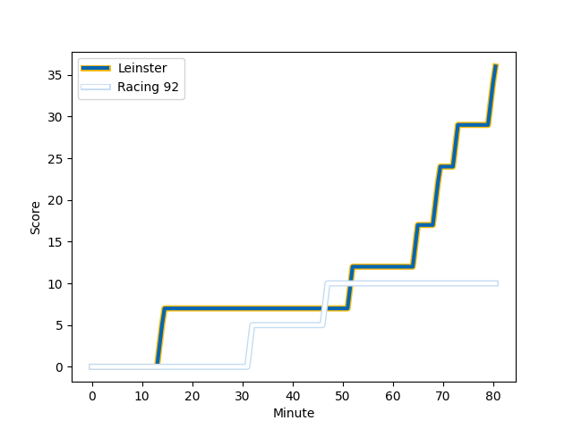
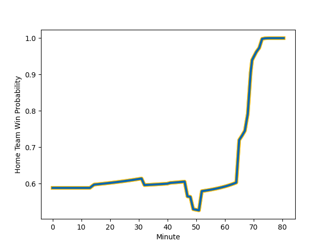

---  
layout: page  
title: Racing 92 at Leinster; 10-36  
date: 2023-01-21 16:15:00 18:00:00 -0500  
categories: match review  
---
# Racing 92 (1561.01) at Leinster (1716.23); 10-36

# Prediction: Leinster by 19.5

Leinster by 15.5 on a neutral field
## Scores over Time

## Win Probability over Time

# Pre-Match Prediction: Leinster by 19.2

Leinster by 15.2 on a neutral pitch

|   Away Minutes | Away Player                                                           |   Away elo |   Away Percentile |   Number |   Home Percentile |   Home elo | Home Player                                                           |   Home Minutes |
|---------------:|:----------------------------------------------------------------------|-----------:|------------------:|---------:|------------------:|-----------:|:----------------------------------------------------------------------|---------------:|
|             41 | [Eddy Ben Arous](..//playerfiles//EddyBenArous_cleaned.md)            |     106.11 |                81 |        1 |                41 |      92.93 | [Andrew Porter](..//playerfiles//AndrewPorter_cleaned.md)             |             72 |
|             67 | [Janick Tarrit](..//playerfiles//JanickTarrit_cleaned.md)             |      93.11 |                48 |        2 |                95 |     124.01 | [Ronan Kelleher](..//playerfiles//RonanKelleher_cleaned.md)           |             49 |
|             40 | [Trevor Nyakane](..//playerfiles//TrevorNyakane_cleaned.md)           |     104.86 |                79 |        3 |                27 |      88.79 | [Michael Alaalatoa](..//playerfiles//MichaelAlaalatoa_cleaned.md)     |             50 |
|             72 | [Baptiste Chouzenoux](..//playerfiles//BaptisteChouzenoux_cleaned.md) |      69.63 |                 3 |        4 |                78 |     107.68 | [Joe McCarthy](..//playerfiles//JoeMcCarthy_cleaned.md)               |             57 |
|             80 | [Boris Palu](..//playerfiles//BorisPalu_cleaned.md)                   |     107.96 |                78 |        5 |                87 |     115.81 | [James Ryan](..//playerfiles//JamesRyan_cleaned.md)                   |             80 |
|             80 | [Wenceslas Lauret](..//playerfiles//WenceslasLauret_cleaned.md)       |     118.77 |                90 |        6 |                95 |     128.14 | [Caelan Doris](..//playerfiles//CaelanDoris_cleaned.md)               |             57 |
|             49 | [Mahamadou Coulibaly](..//playerfiles//MahamadouCoulibaly_cleaned.md) |      95    |               nan |        7 |                94 |     126.89 | [Josh van der Flier](..//playerfiles//JoshvanderFlier_cleaned.md)     |             71 |
|             80 | [Kitione Kamikamica](..//playerfiles//KitioneKamikamica_cleaned.md)   |      88.38 |                30 |        8 |                99 |     144.5  | [Jack Conan](..//playerfiles//JackConan_cleaned.md)                   |             80 |
|             80 | [Nolann Le Garrec](..//playerfiles//NolannLeGarrec_cleaned.md)        |      90.75 |                34 |        9 |                88 |     114.17 | [Jamison Gibson-Park](..//playerfiles//JamisonGibson-Park_cleaned.md) |             65 |
|             80 | [Finn Russell](..//playerfiles//FinnRussell_cleaned.md)               |     139.15 |                97 |       10 |                46 |      96.03 | [Ross Byrne](..//playerfiles//RossByrne_cleaned.md)                   |             80 |
|             54 | [Louis Dupichot](..//playerfiles//LouisDupichot_cleaned.md)           |     107.04 |                76 |       11 |                97 |     133.42 | [Jimmy O'Brien](..//playerfiles//JimmyO'Brien_cleaned.md)             |             80 |
|             80 | [Gael Fickou](..//playerfiles//GaelFickou_cleaned.md)                 |     116.35 |                87 |       12 |                71 |     105.14 | [Jamie Osborne](..//playerfiles//JamieOsborne_cleaned.md)             |             68 |
|             68 | [Olivier Klemenczak](..//playerfiles//OlivierKlemenczak_cleaned.md)   |     113.3  |                86 |       13 |                28 |      87.31 | [Garry Ringrose](..//playerfiles//GarryRingrose_cleaned.md)           |             80 |
|             80 | [Christian Wade](..//playerfiles//ChristianWade_cleaned.md)           |     102.51 |                67 |       14 |                74 |     106.13 | [Jordan Larmour](..//playerfiles//JordanLarmour_cleaned.md)           |             80 |
|             70 | [Warrick Gelant](..//playerfiles//WarrickGelant_cleaned.md)           |     107.11 |                72 |       15 |                96 |     134.53 | [Hugo Keenan](..//playerfiles//HugoKeenan_cleaned.md)                 |             80 |
|             39 | [Guram Gogichashvili](..//playerfiles//GuramGogichashvili_cleaned.md) |     123.34 |                96 |       16 |                63 |      98.19 | [Michael Milne](..//playerfiles//MichaelMilne_cleaned.md)             |              8 |
|             13 | [Peniami Narisia](..//playerfiles//PeniamiNarisia_cleaned.md)         |      99.15 |                61 |       17 |                60 |      98.86 | [Dan Sheehan](..//playerfiles//DanSheehan_cleaned.md)                 |             31 |
|             40 | [Gia Kharaishvili](..//playerfiles//GiaKharaishvili_cleaned.md)       |     103.44 |                74 |       18 |                99 |     141.19 | [Cian Healy](..//playerfiles//CianHealy_cleaned.md)                   |             30 |
|              8 | [Anthime Hemery](..//playerfiles//AnthimeHemery_cleaned.md)           |     101.37 |                65 |       19 |                85 |     113.89 | [Ryan Baird](..//playerfiles//RyanBaird_cleaned.md)                   |             23 |
|             31 | [Maxime Baudonne](..//playerfiles//MaximeBaudonne_cleaned.md)         |      84.43 |                19 |       20 |                74 |     106.13 | [Scott Penny](..//playerfiles//ScottPenny_cleaned.md)                 |              9 |
|             26 | [Max Spring](..//playerfiles//MaxSpring_cleaned.md)                   |      90.3  |                38 |       21 |                89 |     115.46 | [Luke McGrath](..//playerfiles//LukeMcGrath_cleaned.md)               |             15 |
|             12 | [Francis Saili](..//playerfiles//FrancisSaili_cleaned.md)             |     106.93 |                75 |       22 |                90 |     122.2  | [Harry Byrne](..//playerfiles//HarryByrne_cleaned.md)                 |             12 |
|             10 | [Antoine Gibert](..//playerfiles//AntoineGibert_cleaned.md)           |     104.12 |                69 |       23 |                92 |     121.43 | [Ross Molony](..//playerfiles//RossMolony_cleaned.md)                 |             23 |

