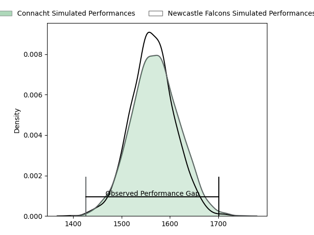
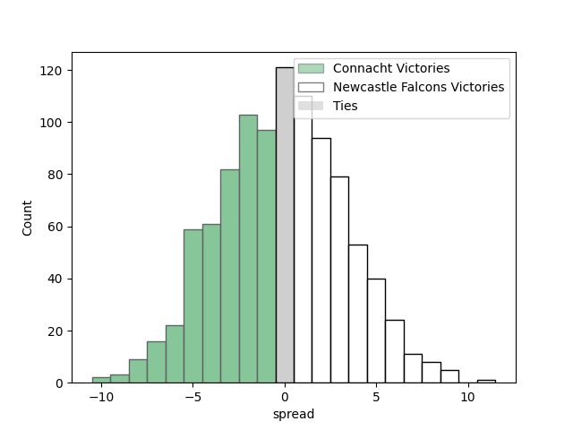
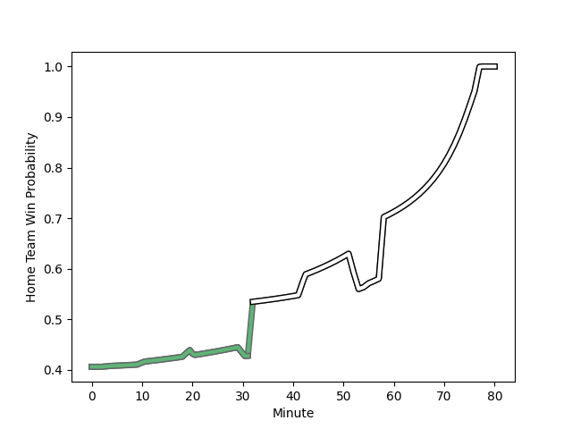

---  
layout: page  
title: Connacht at Newcastle Falcons; 21-35  
date: 2023-01-21 18:30:00 18:00:00 -0500  
categories: match review  
---
# Connacht at Newcastle Falcons; 21-35

# Club Level Predictions

The first set of predictions treats a club as the smallest object, as the club develops its members, organizes a gameplan, and deploys its players as needed for each match. This club model has a prediction of 0.493, which translates to predicting Connacht to win by 0.3.

Each club has a rating and a rating deviation (simiar to a Glicko system), and expected performances can be generated. This allows for simulated matches and spreads like the ones below.
## Projected Performances

## Projected Spreads

# Player Level Predictions

Treating teams instead as an entity made up of the currently active players, I have ratings for each player in an altogether different system. These can be combined to form team ratings once teamsheets are announced, weighting starters a bit higher than the reserves. After the match is played, players can be weighted by their minutes on the field, allowing for an accurate measure of the team's composition. With these compiled team ratings, we can make predictions, measure inaccuracy, and update the individual player ratings.
## Prediction with Player Minutes: Connacht by 12.5

Connacht by 16.5 on a neutral field
## Scores over Time

## Win Probability over Time

## Prediction without Player Minutes: Connacht by 11.2

Connacht by 15.2 on a neutral pitch

|   Away Minutes | Away Player                                                               |   Away elo |   Away Percentile |   Number |   Home Percentile |   Home elo | Home Player                                                          |   Home Minutes |
|---------------:|:--------------------------------------------------------------------------|-----------:|------------------:|---------:|------------------:|-----------:|:---------------------------------------------------------------------|---------------:|
|             62 | [Denis Buckley](..//playerfiles//DenisBuckley_cleaned.md)                 |     117.35 |                93 |        1 |                76 |     104.82 | [Logovi'i Mulipola](..//playerfiles//Logovi'iMulipola_cleaned.md)    |             55 |
|             58 | [Shane Delahunt](..//playerfiles//ShaneDelahunt_cleaned.md)               |     114.04 |                87 |        2 |                36 |      90.41 | [Jamie Blamire](..//playerfiles//JamieBlamire_cleaned.md)            |             80 |
|             62 | [Finlay Bealham](..//playerfiles//FinlayBealham_cleaned.md)               |      98.27 |                58 |        3 |                 1 |      61.48 | [Trevor Davison](..//playerfiles//TrevorDavison_cleaned.md)          |             62 |
|             58 | [Leva Fifita](..//playerfiles//LevaFifita_cleaned.md)                     |     123.05 |                93 |        4 |                40 |      92.27 | [Greg Peterson](..//playerfiles//GregPeterson_cleaned.md)            |             36 |
|             80 | [Josh Murphy](..//playerfiles//JoshMurphy_cleaned.md)                     |     130.17 |                96 |        5 |                58 |      98.61 | [Sebastian de Chaves](..//playerfiles//SebastiandeChaves_cleaned.md) |             80 |
|             62 | [Shamus Hurley-Langton](..//playerfiles//ShamusHurley-Langton_cleaned.md) |      92.59 |                38 |        6 |                21 |      85.57 | [Gary Graham](..//playerfiles//GaryGraham_cleaned.md)                |             80 |
|             80 | [Conor Oliver](..//playerfiles//ConorOliver_cleaned.md)                   |     116.42 |                88 |        7 |                10 |      74.96 | [Philip van der Walt](..//playerfiles//PhilipvanderWalt_cleaned.md)  |             67 |
|             80 | [Jarrad Butler](..//playerfiles//JarradButler_cleaned.md)                 |     101.44 |                60 |        8 |                94 |     127.3  | [Carl Fearns](..//playerfiles//CarlFearns_cleaned.md)                |             53 |
|             80 | [Colm Reilly](..//playerfiles//ColmReilly_cleaned.md)                     |     108.72 |                81 |        9 |                95 |     123.62 | [Michael Young](..//playerfiles//MichaelYoung_cleaned.md)            |             22 |
|             60 | [Conor Fitzgerald](..//playerfiles//ConorFitzgerald_cleaned.md)           |      78.52 |                13 |       10 |                59 |     100.92 | [Tian Schoeman](..//playerfiles//TianSchoeman_cleaned.md)            |             67 |
|             32 | [Alex Wootton](..//playerfiles//AlexWootton_cleaned.md)                   |     101.16 |                65 |       11 |                61 |      99.76 | [Mateo Carreras](..//playerfiles//MateoCarreras_cleaned.md)          |             80 |
|             80 | [Cathal Forde](..//playerfiles//CathalForde_cleaned.md)                   |     100.79 |                63 |       12 |                10 |      77.27 | [Pete Lucock](..//playerfiles//PeteLucock_cleaned.md)                |             80 |
|             60 | [Byron Ralston](..//playerfiles//ByronRalston_cleaned.md)                 |      93.76 |                44 |       13 |                15 |      80.74 | [Matias Orlando](..//playerfiles//MatiasOrlando_cleaned.md)          |             80 |
|             80 | [Adam Byrne](..//playerfiles//AdamByrne_cleaned.md)                       |     104.82 |                72 |       14 |                34 |      90.28 | [Ben Stevenson](..//playerfiles//BenStevenson_cleaned.md)            |             80 |
|             80 | [Mack Hansen](..//playerfiles//MackHansen_cleaned.md)                     |      90.34 |                38 |       15 |                11 |      75.92 | [Alex Tait](..//playerfiles//AlexTait_cleaned.md)                    |             62 |
|             18 | [Jordan Duggan](..//playerfiles//JordanDuggan_cleaned.md)                 |      97.45 |                57 |       16 |                75 |     103.8  | [Adam Brocklebank](..//playerfiles//AdamBrocklebank_cleaned.md)      |             25 |
|             18 | [Jack Aungier](..//playerfiles//JackAungier_cleaned.md)                   |     109.31 |                81 |       17 |                32 |      90.26 | [Richard Palframan](..//playerfiles//RichardPalframan_cleaned.md)    |             18 |
|             22 | [Dylan Tierney-Martin](..//playerfiles//DylanTierney-Martin_cleaned.md)   |      92.36 |                41 |       18 |                39 |      90.6  | [Pedro Rubiolo](..//playerfiles//PedroRubiolo_cleaned.md)            |             44 |
|             22 | [Darragh Murray](..//playerfiles//DarraghMurray_cleaned.md)               |      84.34 |                20 |       19 |                17 |      84.27 | [Charlie Maddison](..//playerfiles//CharlieMaddison_cleaned.md)      |             13 |
|             18 | [Ciaran Booth](..//playerfiles//CiaranBooth_cleaned.md)                   |      96.66 |               nan |       20 |                82 |     112.07 | [Freddie Lockwood](..//playerfiles//FreddieLockwood_cleaned.md)      |             27 |
|             20 | [Tom Daly](..//playerfiles//TomDaly_cleaned.md)                           |      83.33 |                18 |       21 |                87 |     109.07 | [Josh Barton](..//playerfiles//JoshBarton_cleaned.md)                |             58 |
|             48 | [Tom Farrell](..//playerfiles//TomFarrell_cleaned.md)                     |      92.33 |                41 |       22 |                 5 |      73.54 | [Josh Thomas](..//playerfiles//JoshThomas_cleaned.md)                |             13 |
|             20 | [Caolin Blade](..//playerfiles//CaolinBlade_cleaned.md)                   |      92.25 |                38 |       23 |                98 |     135.5  | [Adam Radwan](..//playerfiles//AdamRadwan_cleaned.md)                |             18 |

