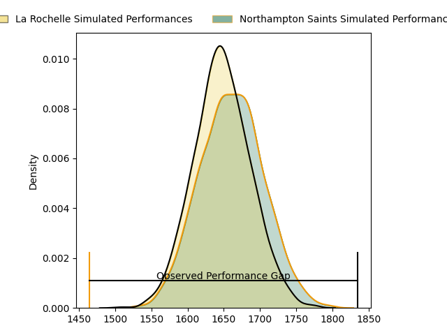
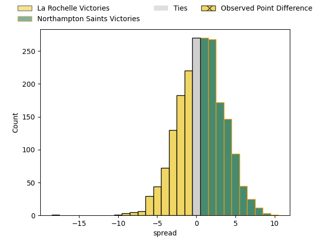

---  
layout: page  
title: La Rochelle at Northampton Saints; 31-13  
date: 2023-01-21 14:00:00 18:00:00 -0500  
categories: match review  
---
# La Rochelle at Northampton Saints; 31-13

# Club Level Predictions

The first set of predictions treats a club as the smallest object, as the club develops its members, organizes a gameplan, and deploys its players as needed for each match. This club model has a prediction of 0.519, which translates to predicting Northampton Saints to win by 0.7.

Each club has a rating and a rating deviation (simiar to a Glicko system), and expected performances can be generated. This allows for simulated matches and spreads like the ones below.
## Projected Performances

## Projected Spreads

# Player Level Predictions

Treating teams instead as an entity made up of the currently active players, I have ratings for each player in an altogether different system. These can be combined to form team ratings once teamsheets are announced, weighting starters a bit higher than the reserves. After the match is played, players can be weighted by their minutes on the field, allowing for an accurate measure of the team's composition. With these compiled team ratings, we can make predictions, measure inaccuracy, and update the individual player ratings.
## Prediction with Player Minutes: La Rochelle by 14.6

La Rochelle by 18.6 on a neutral field
## Scores over Time

## Win Probability over Time

## Prediction without Player Minutes: La Rochelle by 16.4

La Rochelle by 20.4 on a neutral pitch

|   Away Minutes | Away Player                                                               |   Away elo |   Away Percentile |   Number |   Home Percentile |   Home elo | Home Player                                                             |   Home Minutes |
|---------------:|:--------------------------------------------------------------------------|-----------:|------------------:|---------:|------------------:|-----------:|:------------------------------------------------------------------------|---------------:|
|             50 | [Reda Wardi](..//playerfiles//RedaWardi_cleaned.md)                       |     115.93 |                92 |        1 |                86 |     105.49 | [Ethan Waller](..//playerfiles//EthanWaller_cleaned.md)                 |             65 |
|             41 | [Samuel Lagrange](..//playerfiles//SamuelLagrange_cleaned.md)             |      97.85 |                57 |        2 |               nan |      68.53 | [Robbie Smith](..//playerfiles//RobbieSmith_cleaned.md)                 |             52 |
|             50 | [Uini Atonio](..//playerfiles//UiniAtonio_cleaned.md)                     |     122.24 |                96 |        3 |                73 |     102.96 | [Ehren Painter](..//playerfiles//EhrenPainter_cleaned.md)               |             41 |
|             41 | [Romain Sazy](..//playerfiles//RomainSazy_cleaned.md)                     |     134.16 |                98 |        4 |                34 |      90.22 | [Lukhan Salakaia-Loto](..//playerfiles//LukhanSalakaia-Loto_cleaned.md) |             80 |
|             80 | [Remi Picquette](..//playerfiles//RemiPicquette_cleaned.md)               |      97.76 |                55 |        5 |                72 |     104.82 | [David Ribbans](..//playerfiles//DavidRibbans_cleaned.md)               |             80 |
|             45 | [Levani Botia Veivuke](..//playerfiles//LevaniBotiaVeivuke_cleaned.md)    |     115.73 |                88 |        6 |                41 |      93.15 | [Courtney Lawes](..//playerfiles//CourtneyLawes_cleaned.md)             |             29 |
|             55 | [Remi Bourdeau](..//playerfiles//RemiBourdeau_cleaned.md)                 |     133.07 |                97 |        7 |                33 |      90.05 | [Aaron Hinkley](..//playerfiles//AaronHinkley_cleaned.md)               |             65 |
|             80 | [Gregory Alldritt](..//playerfiles//GregoryAlldritt_cleaned.md)           |     106.19 |                70 |        8 |                36 |      91.88 | [Lewis Ludlam](..//playerfiles//LewisLudlam_cleaned.md)                 |             80 |
|             80 | [Tawera Kerr-Barlow](..//playerfiles//TaweraKerr-Barlow_cleaned.md)       |     123.16 |                95 |        9 |                12 |      81.18 | [Callum Braley](..//playerfiles//CallumBraley_cleaned.md)               |             52 |
|             80 | [Antoine Hastoy](..//playerfiles//AntoineHastoy_cleaned.md)               |     100.09 |                57 |       10 |                15 |      83.83 | [Fin Smith](..//playerfiles//FinSmith_cleaned.md)                       |             65 |
|             80 | [Raymond Rhule](..//playerfiles//RaymondRhule_cleaned.md)                 |     112.96 |                84 |       11 |                94 |     125.59 | [Courtnall Skosan](..//playerfiles//CourtnallSkosan_cleaned.md)         |             45 |
|             80 | [Jules Favre](..//playerfiles//JulesFavre_cleaned.md)                     |     126.02 |                94 |       12 |                33 |      89.53 | [Rory Hutchinson](..//playerfiles//RoryHutchinson_cleaned.md)           |             80 |
|             80 | [Ulupano Seuteni](..//playerfiles//UlupanoSeuteni_cleaned.md)             |      87.69 |                28 |       13 |                 2 |      65.89 | [Fraser Dingwall](..//playerfiles//FraserDingwall_cleaned.md)           |             80 |
|             39 | [Dillyn Leyds](..//playerfiles//DillynLeyds_cleaned.md)                   |     101.78 |                66 |       14 |                90 |     119.35 | [Tommy Freeman](..//playerfiles//TommyFreeman_cleaned.md)               |             80 |
|             70 | [Brice Dulin](..//playerfiles//BriceDulin_cleaned.md)                     |     117.07 |                84 |       15 |                96 |     135.6  | [George Furbank](..//playerfiles//GeorgeFurbank_cleaned.md)             |             80 |
|             30 | [Joel Sclavi](..//playerfiles//JoelSclavi_cleaned.md)                     |     114.79 |                91 |       16 |                99 |     148.86 | [Mike Haywood](..//playerfiles//MikeHaywood_cleaned.md)                 |             28 |
|             39 | [Quentin Lespiaucq](..//playerfiles//QuentinLespiaucq_cleaned.md)         |      75.94 |                 2 |       17 |                 8 |      72.88 | [Alfie Petch](..//playerfiles//AlfiePetch_cleaned.md)                   |             39 |
|             30 | [Georges-Henri Colombe](..//playerfiles//Georges-HenriColombe_cleaned.md) |      67.27 |                 2 |       18 |                88 |     113.39 | [Danny Hobbs-Awoyemi](..//playerfiles//DannyHobbs-Awoyemi_cleaned.md)   |             15 |
|             39 | [Thomas Lavault](..//playerfiles//ThomasLavault_cleaned.md)               |     104.41 |                71 |       19 |                 1 |      57.23 | [Alex Coles](..//playerfiles//AlexColes_cleaned.md)                     |             51 |
|             35 | [Paul Boudehent](..//playerfiles//PaulBoudehent_cleaned.md)               |      87.2  |                25 |       20 |                76 |     107.64 | [Angus Scott-Young](..//playerfiles//AngusScott-Young_cleaned.md)       |             15 |
|             25 | [Ultan Dillane](..//playerfiles//UltanDillane_cleaned.md)                 |      98.77 |                58 |       21 |                21 |      86.06 | [Tom James](..//playerfiles//TomJames_cleaned.md)                       |             28 |
|             41 | [Teddy Thomas](..//playerfiles//TeddyThomas_cleaned.md)                   |     116.15 |                87 |       22 |                81 |     110.69 | [James Ramm](..//playerfiles//JamesRamm_cleaned.md)                     |             15 |
|             10 | [Thomas Berjon](..//playerfiles//ThomasBerjon_cleaned.md)                 |      96.83 |                51 |       23 |                70 |     104.05 | [Ollie Sleightholme](..//playerfiles//OllieSleightholme_cleaned.md)     |             35 |

