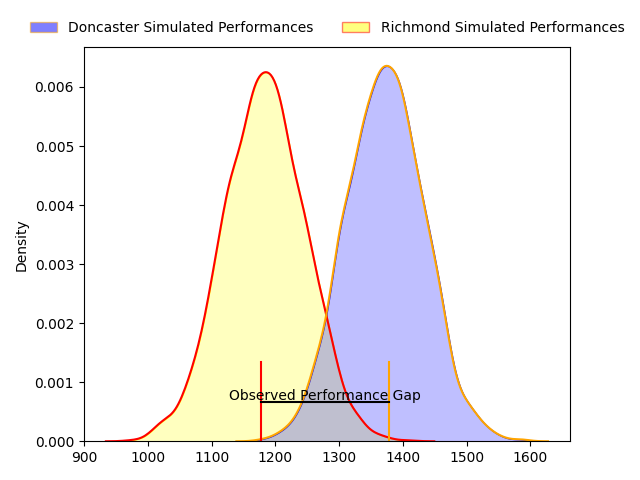
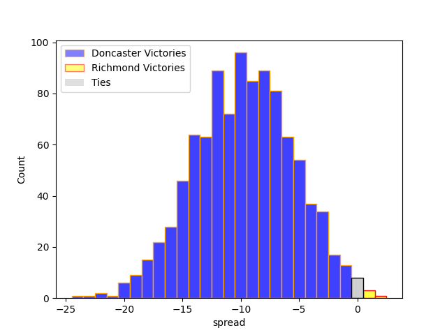
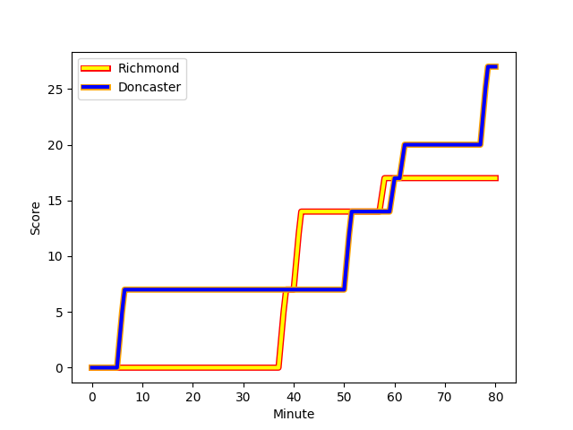
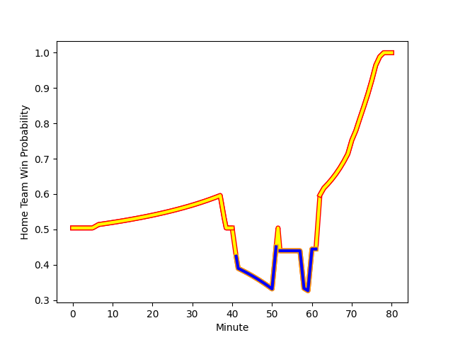

---  
layout: page  
title: Doncaster at Richmond; 27-17  
date: 2023-01-21 16:00:00 18:00:00 -0500  
categories: match review  
---
# Doncaster at Richmond; 27-17

# Club Level Predictions

The first set of predictions treats a club as the smallest object, as the club develops its members, organizes a gameplan, and deploys its players as needed for each match. This club model has a prediction of 0.253, which translates to predicting Doncaster to win by 9.5.

Each club has a rating and a rating deviation (simiar to a Glicko system), and expected performances can be generated. This allows for simulated matches and spreads like the ones below.
## Projected Performances

## Projected Spreads

# Player Level Predictions

Treating teams instead as an entity made up of the currently active players, I have ratings for each player in an altogether different system. These can be combined to form team ratings once teamsheets are announced, weighting starters a bit higher than the reserves. After the match is played, players can be weighted by their minutes on the field, allowing for an accurate measure of the team's composition. With these compiled team ratings, we can make predictions, measure inaccuracy, and update the individual player ratings.
## Prediction with Player Minutes: Richmond by 4.7

Richmond by 0.7 on a neutral field
## Scores over Time

## Win Probability over Time

## Prediction without Player Minutes: Richmond by 7.1

Richmond by 3.1 on a neutral pitch

|   Away Minutes | Away Player                                                 |   Away elo |   Away Percentile |   Number |   Home Percentile |   Home elo | Home Player                                                       |   Home Minutes |
|---------------:|:------------------------------------------------------------|-----------:|------------------:|---------:|------------------:|-----------:|:------------------------------------------------------------------|---------------:|
|             80 | [James Wayland](..//playerfiles//JamesWayland_cleaned.md)   |      96.06 |               nan |        1 |                18 |      84.71 | [Conor Maguire](..//playerfiles//ConorMaguire_cleaned.md)         |             70 |
|             76 | [Will Holling](..//playerfiles//WillHolling_cleaned.md)     |      90.4  |                53 |        2 |                23 |      85.43 | [Joseph Vajner](..//playerfiles//JosephVajner_cleaned.md)         |             70 |
|             80 | [Jake Armstrong](..//playerfiles//JakeArmstrong_cleaned.md) |      92.37 |                39 |        3 |                 2 |      66.53 | [Jimmy Litchfield](..//playerfiles//JimmyLitchfield_cleaned.md)   |             52 |
|             80 | [Ehize Ehizode](..//playerfiles//EhizeEhizode_cleaned.md)   |      56.55 |                 1 |        4 |                34 |      90.46 | [Sam Collingridge](..//playerfiles//SamCollingridge_cleaned.md)   |             63 |
|             80 | [Evan Mintern](..//playerfiles//EvanMintern_cleaned.md)     |     101.54 |                66 |        5 |                35 |      90.94 | [Jake Monson](..//playerfiles//JakeMonson_cleaned.md)             |             74 |
|             58 | [Martin Molina](..//playerfiles//MartinMolina_cleaned.md)   |      80.32 |                16 |        6 |                27 |      87.9  | [David Massey](..//playerfiles//DavidMassey_cleaned.md)           |             72 |
|             52 | [Jared Cardew](..//playerfiles//JaredCardew_cleaned.md)     |      87    |                25 |        7 |                80 |     109.92 | [Tobias Saysell](..//playerfiles//TobiasSaysell_cleaned.md)       |             80 |
|             80 | [Sam Hudson](..//playerfiles//SamHudson_cleaned.md)         |      95.25 |                47 |        8 |                12 |      79.58 | [Mark Bright](..//playerfiles//MarkBright_cleaned.md)             |             80 |
|             79 | [Alex Dolly](..//playerfiles//AlexDolly_cleaned.md)         |     101.11 |                63 |        9 |                58 |      99.43 | [Jack Stafford](..//playerfiles//JackStafford_cleaned.md)         |             70 |
|             80 | [Sam Olver](..//playerfiles//SamOlver_cleaned.md)           |      83.6  |                15 |       10 |                52 |      98.66 | [Bill Johnston](..//playerfiles//BillJohnston_cleaned.md)         |             80 |
|             76 | [Maliq Holden](..//playerfiles//MaliqHolden_cleaned.md)     |     117.65 |                85 |       11 |                 3 |      65.03 | [Will Kaye](..//playerfiles//WillKaye_cleaned.md)                 |             60 |
|             80 | [Connor Edwards](..//playerfiles//ConnorEdwards_cleaned.md) |      74.71 |                 7 |       12 |                18 |      83.25 | [Paul Kiernan](..//playerfiles//PaulKiernan_cleaned.md)           |             80 |
|             60 | [Robbie Smith](..//playerfiles//RobbieSmith_cleaned.md)     |      61.86 |               nan |       13 |                 7 |      73.66 | [Jack Caddy](..//playerfiles//JackCaddy_cleaned.md)               |             80 |
|             80 | [George Simpson](..//playerfiles//GeorgeSimpson_cleaned.md) |      81.73 |                14 |       14 |                40 |      92.61 | [Alexander O'Meara](..//playerfiles//AlexanderO'Meara_cleaned.md) |             80 |
|             80 | [Jack Metcalf](..//playerfiles//JackMetcalf_cleaned.md)     |      57.54 |                 2 |       15 |                 4 |      66.95 | [Darren Atkins](..//playerfiles//DarrenAtkins_cleaned.md)         |             80 |
|             28 | [Thom Smith](..//playerfiles//ThomSmith_cleaned.md)         |      70.65 |                 4 |       16 |                26 |      91.34 | [Ntinga Mpiko](..//playerfiles//NtingaMpiko_cleaned.md)           |             28 |
|             22 | [Sam Daly](..//playerfiles//SamDaly_cleaned.md)             |      85.43 |                21 |       17 |               nan |      91.47 | [Zuriel Makele](..//playerfiles//ZurielMakele_cleaned.md)         |             20 |
|             20 | [Joe Margetts](..//playerfiles//JoeMargetts_cleaned.md)     |      86.33 |                26 |       18 |                20 |      84.59 | [Miles Wakeling](..//playerfiles//MilesWakeling_cleaned.md)       |             17 |
|              4 | [George Edgson](..//playerfiles//GeorgeEdgson_cleaned.md)   |     119.99 |                93 |       19 |                 4 |      74.03 | [Callum Torpey](..//playerfiles//CallumTorpey_cleaned.md)         |             10 |
|              4 | [Billy McBryde](..//playerfiles//BillyMcBryde_cleaned.md)   |     106.48 |                74 |       20 |                39 |      87.31 | [Luke Spring](..//playerfiles//LukeSpring_cleaned.md)             |             10 |
|              1 | [Joe Green](..//playerfiles//JoeGreen_cleaned.md)           |      92.3  |                38 |       21 |                55 |      96.6  | [James Lennon](..//playerfiles//JamesLennon_cleaned.md)           |             10 |
|            nan | nan                                                         |     nan    |               nan |       22 |                18 |      83.89 | [Ethan Benson](..//playerfiles//EthanBenson_cleaned.md)           |              8 |
|            nan | nan                                                         |     nan    |               nan |       23 |               nan |      93.4  | [Alex Burrage](..//playerfiles//AlexBurrage_cleaned.md)           |              6 |

