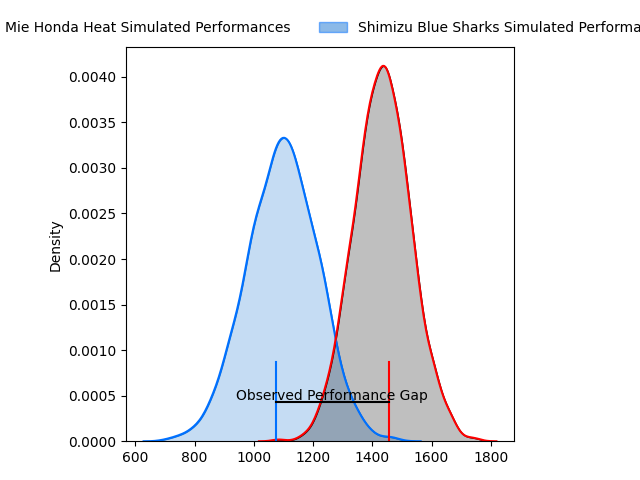
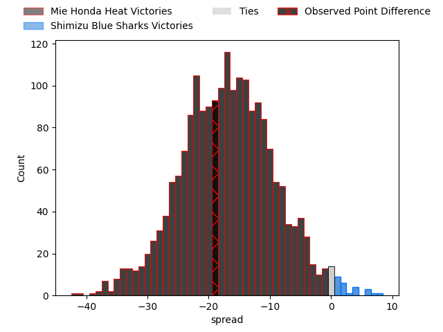

---  
layout: page  
title: Mie Honda Heat at Shimizu Blue Sharks; 29-10  
date: 2023-01-21 00:00:00 18:00:00 -0500  
categories: match review  
---
# Mie Honda Heat at Shimizu Blue Sharks; 29-10

# Club Level Predictions

The first set of predictions treats a club as the smallest object, as the club develops its members, organizes a gameplan, and deploys its players as needed for each match. This club model has a prediction of 0.137, which translates to predicting Mie Honda Heat to win by 16.7.

Each club has a rating and a rating deviation (simiar to a Glicko system), and expected performances can be generated. This allows for simulated matches and spreads like the ones below.
## Projected Performances

## Projected Spreads

# Player Level Predictions

Treating teams instead as an entity made up of the currently active players, I have ratings for each player in an altogether different system. These can be combined to form team ratings once teamsheets are announced, weighting starters a bit higher than the reserves. After the match is played, players can be weighted by their minutes on the field, allowing for an accurate measure of the team's composition. With these compiled team ratings, we can make predictions, measure inaccuracy, and update the individual player ratings.
## Prediction with Player Minutes: Mie Honda Heat by 18.2

Mie Honda Heat by 22.2 on a neutral field
## Scores over Time

## Win Probability over Time

## Prediction without Player Minutes: Mie Honda Heat by 20.5

Mie Honda Heat by 24.5 on a neutral pitch

|   Away Minutes | Away Player                                                           |   Away elo |   Away Percentile |   Number |   Home Percentile |   Home elo | Home Player                                                       |   Home Minutes |
|---------------:|:----------------------------------------------------------------------|-----------:|------------------:|---------:|------------------:|-----------:|:------------------------------------------------------------------|---------------:|
|             76 | [Tatsuhiko Tsurukawa](..//playerfiles//TatsuhikoTsurukawa_cleaned.md) |      80.07 |                10 |        1 |                39 |      92.54 | [Daiki Shimura](..//playerfiles//DaikiShimura_cleaned.md)         |             80 |
|             51 | [Tateo Kanai](..//playerfiles//TateoKanai_cleaned.md)                 |     125.85 |               nan |        2 |                43 |      89.59 | [Kaito Tamori](..//playerfiles//KaitoTamori_cleaned.md)           |             76 |
|             66 | [Masahiro Hibino](..//playerfiles//MasahiroHibino_cleaned.md)         |      86.74 |                32 |        3 |                11 |      80.32 | [Ryota Saitou](..//playerfiles//RyotaSaitou_cleaned.md)           |             76 |
|             80 | [Tetuhi Roberts](..//playerfiles//TetuhiRoberts_cleaned.md)           |      96.86 |                52 |        4 |               nan |      95    | [Tetsunori Osaki](..//playerfiles//TetsunoriOsaki_cleaned.md)     |             80 |
|             76 | [Franco Mostert](..//playerfiles//FrancoMostert_cleaned.md)           |     143.67 |                98 |        5 |                 2 |      60.42 | [Yutaro Shirako](..//playerfiles//YutaroShirako_cleaned.md)       |             80 |
|             80 | [Ryota Kobayashi](..//playerfiles//RyotaKobayashi_cleaned.md)         |      99.21 |                59 |        6 |                66 |     101.77 | [Koudai Takahashi](..//playerfiles//KoudaiTakahashi_cleaned.md)   |             80 |
|             80 | [Ryo Furuta](..//playerfiles//RyoFuruta_cleaned.md)                   |      75.36 |                 8 |        7 |                34 |      89.78 | [Haruki Matsudo](..//playerfiles//HarukiMatsudo_cleaned.md)       |             39 |
|             76 | [Pablo Matera](..//playerfiles//PabloMatera_cleaned.md)               |     135.58 |                97 |        8 |                15 |      81.15 | [Murphy Taramai](..//playerfiles//MurphyTaramai_cleaned.md)       |             64 |
|             58 | [Shogo Nezuka](..//playerfiles//ShogoNezuka_cleaned.md)               |      89.37 |                20 |        9 |                23 |      86.6  | [Kayne Hammington](..//playerfiles//KayneHammington_cleaned.md)   |             80 |
|             80 | [Gwangtee Oh](..//playerfiles//GwangteeOh_cleaned.md)                 |      93.96 |                26 |       10 |                 2 |      68.51 | [Orbyn Leger](..//playerfiles//OrbynLeger_cleaned.md)             |             79 |
|             80 | [Naoki Motomura](..//playerfiles//NaokiMotomura_cleaned.md)           |     107.5  |                77 |       11 |                28 |      88.16 | [Shuhei Sasaki](..//playerfiles//ShuheiSasaki_cleaned.md)         |             64 |
|             66 | [Dawid Kellerman](..//playerfiles//DawidKellerman_cleaned.md)         |      84.77 |                16 |       12 |                42 |      91.76 | [Siale Piutau](..//playerfiles//SialePiutau_cleaned.md)           |             55 |
|             80 | [Kanta Watanabe](..//playerfiles//KantaWatanabe_cleaned.md)           |      85.38 |                23 |       13 |                 1 |      56.74 | [Naoki Moriya](..//playerfiles//NaokiMoriya_cleaned.md)           |             80 |
|             80 | [Yoshizaku Fujita](..//playerfiles//YoshizakuFujita_cleaned.md)       |      99.97 |                62 |       14 |                64 |     100.83 | [Ryota Noda](..//playerfiles//RyotaNoda_cleaned.md)               |             80 |
|             76 | [Tom Banks](..//playerfiles//TomBanks_cleaned.md)                     |     133.87 |                95 |       15 |                19 |      84.73 | [Tatsuhiro Ozaki](..//playerfiles//TatsuhiroOzaki_cleaned.md)     |             80 |
|             29 | [Lee Seung Hyok](..//playerfiles//LeeSeungHyok_cleaned.md)            |      76.31 |                 6 |       16 |                91 |     121.16 | [Taiyo Ando](..//playerfiles//TaiyoAndo_cleaned.md)               |             41 |
|             22 | [Kenta Yamaji](..//playerfiles//KentaYamaji_cleaned.md)               |     112.12 |                85 |       17 |                88 |     116.55 | [John-Ben Kotze](..//playerfiles//John-BenKotze_cleaned.md)       |             25 |
|             14 | [Kaito Morikawa](..//playerfiles//KaitoMorikawa_cleaned.md)           |      90.22 |                35 |       18 |                46 |      94.5  | [Ryota Sakino](..//playerfiles//RyotaSakino_cleaned.md)           |             16 |
|             14 | [Matthys Basson](..//playerfiles//MatthysBasson_cleaned.md)           |      89.64 |                29 |       19 |                84 |     114.44 | [Sergeal Petersen](..//playerfiles//SergealPetersen_cleaned.md)   |             16 |
|              4 | [Takumi Fuji](..//playerfiles//TakumiFuji_cleaned.md)                 |      91.96 |               nan |       20 |                31 |      88.73 | [Naomichi Tatekawa](..//playerfiles//NaomichiTatekawa_cleaned.md) |              4 |
|              4 | [Paddy Butler](..//playerfiles//PaddyButler_cleaned.md)               |     102.48 |                59 |       21 |                75 |     102.39 | [Kazuki Kanazawa](..//playerfiles//KazukiKanazawa_cleaned.md)     |              4 |
|              4 | [Masaki Kondo](..//playerfiles//MasakiKondo_cleaned.md)               |     108.12 |                77 |       22 |                37 |      91.8  | [Taishi Sakurai](..//playerfiles//TaishiSakurai_cleaned.md)       |              1 |
|              4 | [Kengo Gunji](..//playerfiles//KengoGunji_cleaned.md)                 |      95    |               nan |       23 |               nan |     nan    | nan                                                               |            nan |

