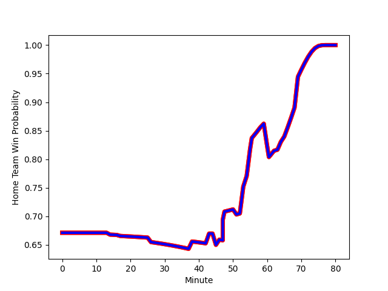

---  
layout: page  
title: Clermont Auvergne at Stormers; 16-30  
date: 2023-01-21 18:30:00 18:00:00 -0500  
categories: match review  
---
# Clermont Auvergne (1355.39) at Stormers (1660.94); 16-30

# Prediction: Stormers by 34.6

Stormers by 30.6 on a neutral field
## Scores over Time

## Win Probability over Time

# Pre-Match Prediction: Stormers by 32.9

Stormers by 28.9 on a neutral pitch

|   Away Minutes | Away Player                                                         |   Away elo |   Away Percentile |   Number |   Home Percentile |   Home elo | Home Player                                                              |   Home Minutes |
|---------------:|:--------------------------------------------------------------------|-----------:|------------------:|---------:|------------------:|-----------:|:-------------------------------------------------------------------------|---------------:|
|             59 | [Giorgi Beria](..//playerfiles//GiorgiBeria_cleaned.md)             |      85.27 |                30 |        1 |                95 |     119.97 | [Steven Kitshoff](..//playerfiles//StevenKitshoff_cleaned.md)            |             65 |
|             51 | [Etienne Fourcade](..//playerfiles//EtienneFourcade_cleaned.md)     |      71.97 |                 6 |        2 |                66 |     101.33 | [Joseph Dweba](..//playerfiles//JosephDweba_cleaned.md)                  |             57 |
|             51 | [Rabah Slimani](..//playerfiles//RabahSlimani_cleaned.md)           |      89.66 |                29 |        3 |                87 |     111.59 | [Neethling Fouche](..//playerfiles//NeethlingFouche_cleaned.md)          |             63 |
|             80 | [Paul Jedrasiak](..//playerfiles//PaulJedrasiak_cleaned.md)         |      79.82 |                13 |        4 |                61 |      99.48 | [Connor Evans](..//playerfiles//ConnorEvans_cleaned.md)                  |             63 |
|             80 | [Thibaud Lanen](..//playerfiles//ThibaudLanen_cleaned.md)           |      97.52 |                55 |        5 |                75 |     105.91 | [Marvin Orie](..//playerfiles//MarvinOrie_cleaned.md)                    |             80 |
|             54 | [Alexandre Fischer](..//playerfiles//AlexandreFischer_cleaned.md)   |     121.32 |                92 |        6 |                98 |     138.64 | [Deon Fourie](..//playerfiles//DeonFourie_cleaned.md)                    |             80 |
|             80 | [Killian Tixeront](..//playerfiles//KillianTixeront_cleaned.md)     |      86.42 |                23 |        7 |                72 |     105.75 | [Willie Engelbrecht](..//playerfiles//WillieEngelbrecht_cleaned.md)      |             46 |
|             17 | [Judicael Cancoriet](..//playerfiles//JudicaelCancoriet_cleaned.md) |      84.48 |                19 |        8 |                93 |     126.23 | [Hacjivah Dayimani](..//playerfiles//HacjivahDayimani_cleaned.md)        |             80 |
|             69 | [Baptiste Jauneau](..//playerfiles//BaptisteJauneau_cleaned.md)     |      82.39 |                14 |        9 |                 7 |      76.93 | [Stefan Ungerer](..//playerfiles//StefanUngerer_cleaned.md)              |             46 |
|             59 | [Anthony Belleau](..//playerfiles//AnthonyBelleau_cleaned.md)       |     105.12 |                70 |       10 |                58 |      99.56 | [Kade Wolhuter](..//playerfiles//KadeWolhuter_cleaned.md)                |             46 |
|             80 | [Bautista Delguy](..//playerfiles//BautistaDelguy_cleaned.md)       |     100.04 |                62 |       11 |                73 |     105.37 | [Angelo Davids](..//playerfiles//AngeloDavids_cleaned.md)                |             80 |
|             80 | [Samuel Ezeala](..//playerfiles//SamuelEzeala_cleaned.md)           |      72.25 |                 6 |       12 |                90 |     119.28 | [Daniel du Plessis](..//playerfiles//DanielduPlessis_cleaned.md)         |             68 |
|             59 | [Cheikh Tiberghien](..//playerfiles//CheikhTiberghien_cleaned.md)   |      63.04 |                 2 |       13 |                81 |     111.49 | [Ruhan Nel](..//playerfiles//RuhanNel_cleaned.md)                        |             80 |
|             80 | [Marvin O'Connor](..//playerfiles//MarvinO'Connor_cleaned.md)       |      88.06 |                27 |       14 |                50 |      96.28 | [Suleiman  Hartzenberg](..//playerfiles//SuleimanHartzenberg_cleaned.md) |             80 |
|             80 | [Alex Newsome](..//playerfiles//AlexNewsome_cleaned.md)             |     117.39 |                86 |       15 |                93 |     130.6  | [Damian Willemse](..//playerfiles//DamianWillemse_cleaned.md)            |             80 |
|             63 | [Lucas Dessaigne](..//playerfiles//LucasDessaigne_cleaned.md)       |      87.25 |                25 |       16 |                90 |     116.66 | [Herschel Jantjies](..//playerfiles//HerschelJantjies_cleaned.md)        |             34 |
|             29 | [Davit Kubriashvili](..//playerfiles//DavitKubriashvili_cleaned.md) |     111.07 |                87 |       17 |                82 |     111.65 | [Evan Roos](..//playerfiles//EvanRoos_cleaned.md)                        |             34 |
|             29 | [Benjamin Boudou](..//playerfiles//BenjaminBoudou_cleaned.md)       |      89.08 |                27 |       18 |                16 |      84.17 | [Jean-Luc du Plessis](..//playerfiles//Jean-LucduPlessis_cleaned.md)     |             34 |
|             26 | [Miles Amatosero](..//playerfiles//MilesAmatosero_cleaned.md)       |      64.65 |                 3 |       19 |                57 |      95.94 | [JJ Kotze](..//playerfiles//JJKotze_cleaned.md)                          |             23 |
|             21 | [Gabin Michet](..//playerfiles//GabinMichet_cleaned.md)             |      91.64 |                33 |       20 |                69 |     104.4  | [Ben-Jason Dixon](..//playerfiles//Ben-JasonDixon_cleaned.md)            |             17 |
|             21 | [Daniel Bibi Biziwu](..//playerfiles//DanielBibiBiziwu_cleaned.md)  |      94.25 |                45 |       21 |                99 |     136.42 | [Brok Harris](..//playerfiles//BrokHarris_cleaned.md)                    |             17 |
|             21 | [François Carlo Mey](..//playerfiles//FrançoisCarloMey_cleaned.md)  |      95    |               nan |       22 |                84 |     109.64 | [Alistair Vermaak](..//playerfiles//AlistairVermaak_cleaned.md)          |             15 |
|             11 | [Sebastien Bezy](..//playerfiles//SebastienBezy_cleaned.md)         |     123.96 |                95 |       23 |                48 |      98.23 | [Sacha Mngomezulu](..//playerfiles//SachaMngomezulu_cleaned.md)          |             12 |

