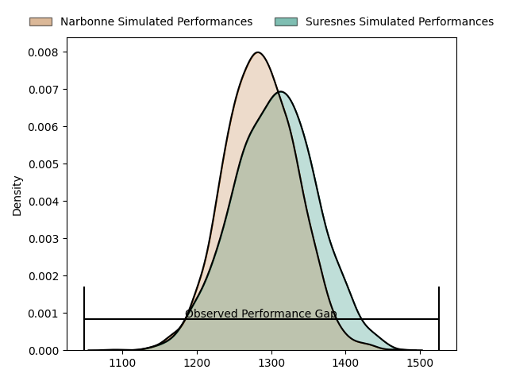
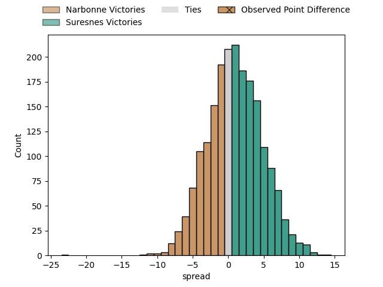
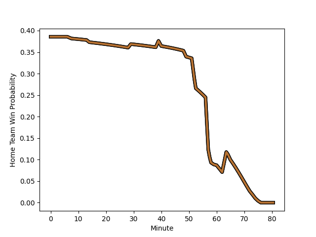

---  
layout: page  
title: Narbonne at Suresnes; 36-13  
date: 2023-01-21 18:30:00 18:00:00 -0500  
categories: match review  
---
# Narbonne at Suresnes; 36-13

# Club Level Predictions

The first set of predictions treats a club as the smallest object, as the club develops its members, organizes a gameplan, and deploys its players as needed for each match. This club model has a prediction of 0.527, which translates to predicting Suresnes to win by 0.9.

Each club has a rating and a rating deviation (simiar to a Glicko system), and expected performances can be generated. This allows for simulated matches and spreads like the ones below.
## Projected Performances

## Projected Spreads

# Player Level Predictions

Treating teams instead as an entity made up of the currently active players, I have ratings for each player in an altogether different system. These can be combined to form team ratings once teamsheets are announced, weighting starters a bit higher than the reserves. After the match is played, players can be weighted by their minutes on the field, allowing for an accurate measure of the team's composition. With these compiled team ratings, we can make predictions, measure inaccuracy, and update the individual player ratings.
## Prediction with Player Minutes: Narbonne by 16.2

Narbonne by 20.2 on a neutral field
## Scores over Time

## Win Probability over Time

## Prediction without Player Minutes: Narbonne by 14.1

Narbonne by 18.1 on a neutral pitch

|   Away Minutes | Away Player                                                         |   Away elo |   Away Percentile |   Number |   Home Percentile |   Home elo | Home Player                                                                  |   Home Minutes |
|---------------:|:--------------------------------------------------------------------|-----------:|------------------:|---------:|------------------:|-----------:|:-----------------------------------------------------------------------------|---------------:|
|             65 | [Geoffrey Moise](..//playerfiles//GeoffreyMoise_cleaned.md)         |      91.92 |                37 |        1 |                20 |      86.15 | [Lucas Dycke](..//playerfiles//LucasDycke_cleaned.md)                        |             57 |
|             49 | [Jordan Rochier](..//playerfiles//JordanRochier_cleaned.md)         |      88.4  |                21 |        2 |                72 |      97.59 | [Anthony Bajart](..//playerfiles//AnthonyBajart_cleaned.md)                  |             59 |
|             73 | [Théo Castinel](..//playerfiles//ThéoCastinel_cleaned.md)           |     117.26 |                84 |        3 |                79 |     105.17 | [Leandro Mario Assi](..//playerfiles//LeandroMarioAssi_cleaned.md)           |             58 |
|             80 | [Valentin Sese](..//playerfiles//ValentinSese_cleaned.md)           |     114.88 |                87 |        4 |                 8 |      74.41 | [Christopher van Leeuwen](..//playerfiles//ChristophervanLeeuwen_cleaned.md) |             80 |
|             40 | [Mohamed Kbaier](..//playerfiles//MohamedKbaier_cleaned.md)         |      97.16 |                54 |        5 |                78 |     107.52 | [Wian Vosloo](..//playerfiles//WianVosloo_cleaned.md)                        |             65 |
|             80 | [Thibault Clauzade](..//playerfiles//ThibaultClauzade_cleaned.md)   |     104.93 |                72 |        6 |                61 |     101.93 | [Louis-Mathieu Jazeix](..//playerfiles//Louis-MathieuJazeix_cleaned.md)      |             57 |
|             80 | [Paul Belzons](..//playerfiles//PaulBelzons_cleaned.md)             |      81.27 |                14 |        7 |                71 |     104.18 | [Bastien Berenguel](..//playerfiles//BastienBerenguel_cleaned.md)            |             80 |
|             65 | [Luke Nakobukobua](..//playerfiles//LukeNakobukobua_cleaned.md)     |     112.07 |                83 |        8 |                92 |     124.53 | [Antonie Claassen](..//playerfiles//AntonieClaassen_cleaned.md)              |             80 |
|             60 | [Pierrick Nova](..//playerfiles//PierrickNova_cleaned.md)           |     107.47 |                78 |        9 |                 8 |      76.58 | [Quentin Dauvergne](..//playerfiles//QuentinDauvergne_cleaned.md)            |             57 |
|             80 | [Tom Chauvet](..//playerfiles//TomChauvet_cleaned.md)               |      97.59 |                50 |       10 |                35 |      92.04 | [Gaëtan Robert](..//playerfiles//GaëtanRobert_cleaned.md)                    |             80 |
|             80 | [Sébastien Giorgis](..//playerfiles//SébastienGiorgis_cleaned.md)   |      95.16 |                47 |       11 |                 0 |      -2.27 | [Ervin Muric](..//playerfiles//ErvinMuric_cleaned.md)                        |             80 |
|             80 | [Jose Lima](..//playerfiles//JoseLima_cleaned.md)                   |     119.49 |                90 |       12 |                43 |      92.29 | [Petero Tuwai](..//playerfiles//PeteroTuwai_cleaned.md)                      |             80 |
|             80 | [Pierre Nueno](..//playerfiles//PierreNueno_cleaned.md)             |      94.2  |                45 |       13 |                56 |      98.61 | [Arthur Proult](..//playerfiles//ArthurProult_cleaned.md)                    |             14 |
|             59 | [Pierre-Hugo Ducom](..//playerfiles//Pierre-HugoDucom_cleaned.md)   |     110    |                80 |       14 |                17 |      84.07 | [Alexis Clement](..//playerfiles//AlexisClement_cleaned.md)                  |             80 |
|             49 | [Tom Homer](..//playerfiles//TomHomer_cleaned.md)                   |      90.92 |                39 |       15 |                26 |      85.8  | [Goulwen Gueho](..//playerfiles//GoulwenGueho_cleaned.md)                    |             65 |
|             15 | [Sylvain Abadie](..//playerfiles//SylvainAbadie_cleaned.md)         |      99.69 |                60 |       16 |                86 |     109.19 | [Beqa Kakabadze](..//playerfiles//BeqaKakabadze_cleaned.md)                  |             23 |
|             31 | [Christophe David](..//playerfiles//ChristopheDavid_cleaned.md)     |     105.6  |                76 |       17 |                51 |      93.97 | [Hayam El Bibouji](..//playerfiles//HayamElBibouji_cleaned.md)               |             21 |
|              7 | [Levi Tikoipau](..//playerfiles//LeviTikoipau_cleaned.md)           |      93.4  |               nan |       18 |                 3 |      70.05 | [Kakhaber Koberize](..//playerfiles//KakhaberKoberize_cleaned.md)            |             22 |
|             40 | [Morgan Maga](..//playerfiles//MorganMaga_cleaned.md)               |      88.61 |                25 |       19 |                11 |      77.43 | [Yakine Djebarri](..//playerfiles//YakineDjebarri_cleaned.md)                |             15 |
|             15 | [Guillem Montagne](..//playerfiles//GuillemMontagne_cleaned.md)     |      86.11 |                17 |       20 |                55 |      96.28 | [Youssouf Yatera](..//playerfiles//YoussoufYatera_cleaned.md)                |             23 |
|             20 | [Christopher Kaiser](..//playerfiles//ChristopherKaiser_cleaned.md) |      83.18 |                12 |       21 |                44 |      94.56 | [Théo Bachiri](..//playerfiles//ThéoBachiri_cleaned.md)                      |             23 |
|             21 | [Gauthier Wolf](..//playerfiles//GauthierWolf_cleaned.md)           |      95    |               nan |       22 |                37 |      90.86 | [Hugo Detre](..//playerfiles//HugoDetre_cleaned.md)                          |             66 |
|             31 | [James Kane](..//playerfiles//JamesKane_cleaned.md)                 |     110.64 |                77 |       23 |                17 |      81.11 | [Thomas Baudy](..//playerfiles//ThomasBaudy_cleaned.md)                      |             15 |

