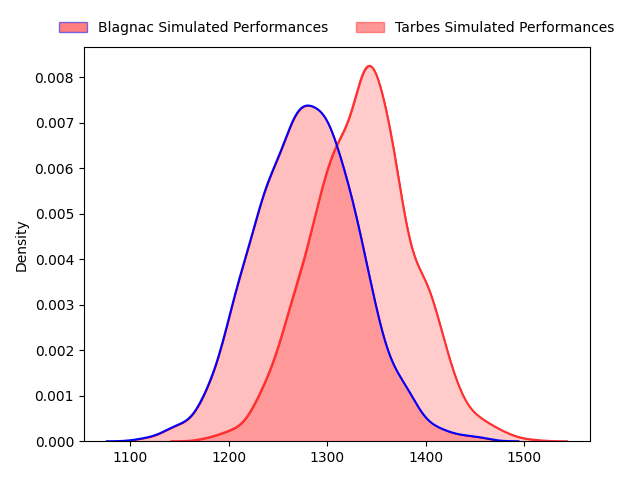
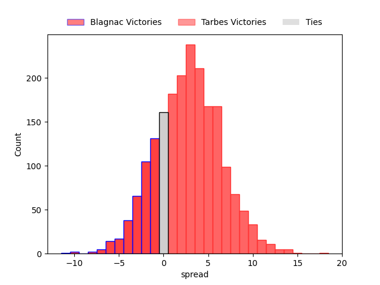
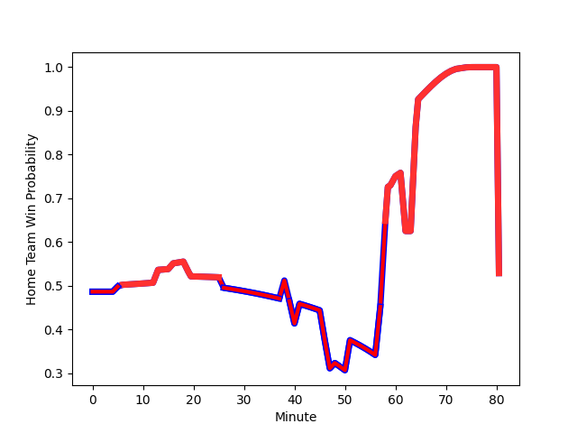

---  
layout: page  
title: Blagnac at Tarbes; 29-29  
date: 2023-01-21 19:00:00 18:00:00 -0500  
categories: match review  
---
# Blagnac at Tarbes; 29-29

# Club Level Predictions

The first set of predictions treats a club as the smallest object, as the club develops its members, organizes a gameplan, and deploys its players as needed for each match. This club model has a prediction of 0.575, which translates to predicting Tarbes to win by 2.7.

Each club has a rating and a rating deviation (simiar to a Glicko system), and expected performances can be generated. This allows for simulated matches and spreads like the ones below.
## Projected Performances

## Projected Spreads

## Projected Results

# Player Level Predictions

Treating teams instead as an entity made up of the currently active players, I have ratings for each player in an altogether different system. These can be combined to form team ratings once teamsheets are announced, weighting starters a bit higher than the reserves. After the match is played, players can be weighted by their minutes on the field, allowing for an accurate measure of the team's composition. With these compiled team ratings, we can make predictions, measure inaccuracy, and update the individual player ratings.
## Prediction with Player Minutes: Tarbes by 1.7

Blagnac by 2.3 on a neutral field
## Scores over Time

## Win Probability over Time

## Prediction without Player Minutes: Tarbes by 3.3

Blagnac by 0.7 on a neutral pitch

|   Away Minutes | Away Player                                                             |   Away elo |   Away Percentile |   Number |   Home Percentile |   Home elo | Home Player                                                                      |   Home Minutes |
|---------------:|:------------------------------------------------------------------------|-----------:|------------------:|---------:|------------------:|-----------:|:---------------------------------------------------------------------------------|---------------:|
|             47 | [Cesar Biscioni](..//playerfiles//CesarBiscioni_cleaned.md)             |     103.14 |                80 |        1 |                78 |     107.68 | [Johan Mees Erasmus](..//playerfiles//JohanMeesErasmus_cleaned.md)               |             48 |
|             47 | [Florian Bertrand](..//playerfiles//FlorianBertrand_cleaned.md)         |      89.64 |                40 |        2 |                11 |      79.88 | [Florian Lamothe](..//playerfiles//FlorianLamothe_cleaned.md)                    |             48 |
|             47 | [Fabien Lorenzon](..//playerfiles//FabienLorenzon_cleaned.md)           |      91.1  |                40 |        3 |                33 |      91.66 | [Mariano Ezequiel Filomeno](..//playerfiles//MarianoEzequielFilomeno_cleaned.md) |             48 |
|             80 | [Vincent Mutel](..//playerfiles//VincentMutel_cleaned.md)               |     100.85 |                64 |        4 |                34 |      90.34 | [Antoine Bousquet](..//playerfiles//AntoineBousquet_cleaned.md)                  |             80 |
|             64 | [Lilian Rousset](..//playerfiles//LilianRousset_cleaned.md)             |     101.41 |                67 |        5 |                18 |      83.18 | [Jone Trevor Seuvou](..//playerfiles//JoneTrevorSeuvou_cleaned.md)               |             13 |
|             80 | [Nekolo Tolofua](..//playerfiles//NekoloTolofua_cleaned.md)             |      97.63 |                54 |        6 |                72 |     104.4  | [Mattéo Coustalat](..//playerfiles//MattéoCoustalat_cleaned.md)                  |             80 |
|              5 | [Loïc Verdy](..//playerfiles//LoïcVerdy_cleaned.md)                     |      95.93 |                49 |        7 |                92 |     121.11 | [Aurelien Ricart](..//playerfiles//AurelienRicart_cleaned.md)                    |             57 |
|             80 | [Mathieu Vachon](..//playerfiles//MathieuVachon_cleaned.md)             |     100.45 |                57 |        8 |                 1 |      61.74 | [Len Massyn](..//playerfiles//LenMassyn_cleaned.md)                              |             80 |
|             79 | [Paul Ravier](..//playerfiles//PaulRavier_cleaned.md)                   |     112.59 |                86 |        9 |                19 |      89.02 | [Thibaut Dulucq](..//playerfiles//ThibautDulucq_cleaned.md)                      |             60 |
|             80 | [Valentin Delpy](..//playerfiles//ValentinDelpy_cleaned.md)             |      99.69 |                56 |       10 |                 4 |      72.81 | [Anthony Fuertes](..//playerfiles//AnthonyFuertes_cleaned.md)                    |             80 |
|             64 | [Lucas Martins](..//playerfiles//LucasMartins_cleaned.md)               |      95    |               nan |       11 |                93 |     124.78 | [Jonathan Duffau](..//playerfiles//JonathanDuffau_cleaned.md)                    |             80 |
|             80 | [Antoine Renaud](..//playerfiles//AntoineRenaud_cleaned.md)             |      57.4  |                 0 |       12 |                88 |     116.06 | [Josaia Vakacegu](..//playerfiles//JosaiaVakacegu_cleaned.md)                    |             80 |
|             80 | [Aurelien Labau](..//playerfiles//AurelienLabau_cleaned.md)             |      85.04 |                23 |       13 |                99 |     143    | [Alofa Alofa](..//playerfiles//AlofaAlofa_cleaned.md)                            |             57 |
|             80 | [Lukas Doyhenard](..//playerfiles//LukasDoyhenard_cleaned.md)           |      85.26 |                33 |       14 |                 4 |      68.83 | [Maxime Oltmann](..//playerfiles//MaximeOltmann_cleaned.md)                      |             73 |
|             47 | [Jean-Andre Vernetti](..//playerfiles//Jean-AndreVernetti_cleaned.md)   |     128.98 |                92 |       15 |                54 |      97.57 | [William Pees](..//playerfiles//WilliamPees_cleaned.md)                          |             80 |
|             33 | [Jean-Baptiste Martin](..//playerfiles//Jean-BaptisteMartin_cleaned.md) |      79.58 |                10 |       16 |                15 |      83.04 | [Alexandre Combier](..//playerfiles//AlexandreCombier_cleaned.md)                |             32 |
|             33 | [Nikita Bekov](..//playerfiles//NikitaBekov_cleaned.md)                 |      97.24 |                54 |       17 |                85 |     112.17 | [Enzo Mondon](..//playerfiles//EnzoMondon_cleaned.md)                            |             32 |
|             33 | [Marco Trauth](..//playerfiles//MarcoTrauth_cleaned.md)                 |      95.58 |                50 |       18 |                 4 |      70.88 | [Alexandre Duny](..//playerfiles//AlexandreDuny_cleaned.md)                      |             32 |
|             16 | [Maxence Boissière](..//playerfiles//MaxenceBoissière_cleaned.md)       |      93.05 |                38 |       19 |                 3 |      66    | [Paul Sajous](..//playerfiles//PaulSajous_cleaned.md)                            |             67 |
|             75 | [Gabin Villerouge](..//playerfiles//GabinVillerouge_cleaned.md)         |     103.02 |                71 |       20 |                26 |      87.69 | [Loan Real](..//playerfiles//LoanReal_cleaned.md)                                |             23 |
|              1 | [Corentin Penc'hoat](..//playerfiles//CorentinPenc'hoat_cleaned.md)     |      91.95 |                37 |       21 |                10 |      78.62 | [Alexis Levron](..//playerfiles//AlexisLevron_cleaned.md)                        |             20 |
|             16 | [Simon Villemur](..//playerfiles//SimonVillemur_cleaned.md)             |     100.6  |                64 |       22 |                67 |     104.53 | [Thibaut Trotta](..//playerfiles//ThibautTrotta_cleaned.md)                      |              7 |
|             33 | [Ugo Seunes](..//playerfiles//UgoSeunes_cleaned.md)                     |     103.18 |                64 |       23 |                65 |     102.29 | [Pierre Descoubet](..//playerfiles//PierreDescoubet_cleaned.md)                  |             23 |

