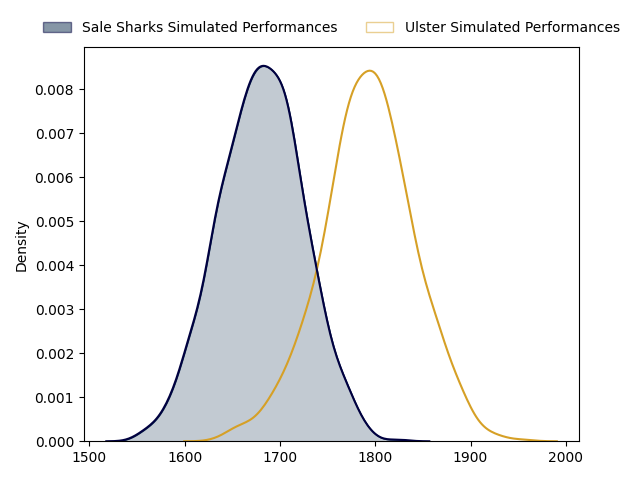
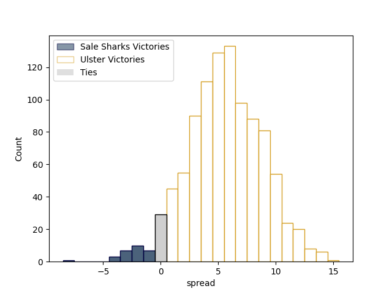
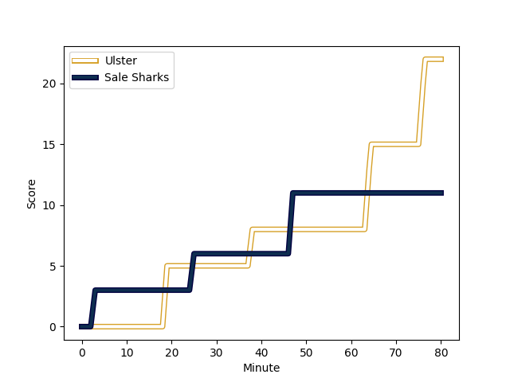
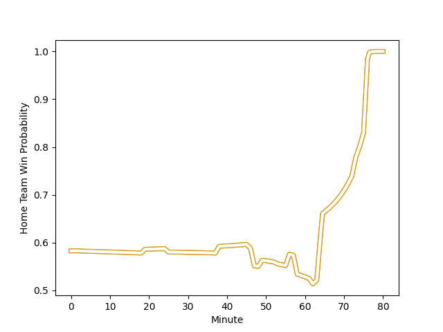

---  
layout: page  
title: Sale Sharks at Ulster; 11-22  
date: 2023-01-21 21:00:00 18:00:00 -0500  
categories: match review  
---
# Sale Sharks at Ulster; 11-22

# Club Level Predictions

The first set of predictions treats a club as the smallest object, as the club develops its members, organizes a gameplan, and deploys its players as needed for each match. This club model has a prediction of 0.652, which translates to predicting Ulster to win by 5.5.

Each club has a rating and a rating deviation (simiar to a Glicko system), and expected performances can be generated. This allows for simulated matches and spreads like the ones below.
## Projected Performances

## Projected Spreads

# Player Level Predictions

Treating teams instead as an entity made up of the currently active players, I have ratings for each player in an altogether different system. These can be combined to form team ratings once teamsheets are announced, weighting starters a bit higher than the reserves. After the match is played, players can be weighted by their minutes on the field, allowing for an accurate measure of the team's composition. With these compiled team ratings, we can make predictions, measure inaccuracy, and update the individual player ratings.
## Prediction with Player Minutes: Ulster by 18.5

Ulster by 14.5 on a neutral field
## Scores over Time

## Win Probability over Time

## Prediction without Player Minutes: Ulster by 14.1

Ulster by 10.1 on a neutral pitch

|   Away Minutes | Away Player                                                      |   Away elo |   Away Percentile |   Number |   Home Percentile |   Home elo | Home Player                                                         |   Home Minutes |
|---------------:|:-----------------------------------------------------------------|-----------:|------------------:|---------:|------------------:|-----------:|:--------------------------------------------------------------------|---------------:|
|             58 | [Bevan Rodd](..//playerfiles//BevanRodd_cleaned.md)              |     114.39 |                91 |        1 |                77 |     104.5  | [Andrew Warwick](..//playerfiles//AndrewWarwick_cleaned.md)         |             53 |
|             58 | [Ewan Ashman](..//playerfiles//EwanAshman_cleaned.md)            |      87.15 |                25 |        2 |                30 |      86.9  | [Tom Stewart](..//playerfiles//TomStewart_cleaned.md)               |             53 |
|             58 | [James Harper](..//playerfiles//JamesHarper_cleaned.md)          |      72.24 |               nan |        3 |                91 |     115.18 | [Jeff Toomaga-Allen](..//playerfiles//JeffToomaga-Allen_cleaned.md) |             53 |
|             63 | [Josh Beaumont](..//playerfiles//JoshBeaumont_cleaned.md)        |     111.34 |                83 |        4 |                92 |     120.71 | [Alan O'Connor](..//playerfiles//AlanO'Connor_cleaned.md)           |             80 |
|             80 | [Jonny Hill](..//playerfiles//JonnyHill_cleaned.md)              |      92.15 |                39 |        5 |                86 |     114.5  | [Sam Carter](..//playerfiles//SamCarter_cleaned.md)                 |             62 |
|             80 | [Jono Ross](..//playerfiles//JonoRoss_cleaned.md)                |      95.02 |                47 |        6 |               nan |      96.73 | [Harry Sheridan](..//playerfiles//HarrySheridan_cleaned.md)         |             50 |
|             80 | [Ben Curry](..//playerfiles//BenCurry_cleaned.md)                |      90.68 |                35 |        7 |                92 |     120.82 | [Nick Timoney](..//playerfiles//NickTimoney_cleaned.md)             |             80 |
|             80 | [Jean-Luc du Preez](..//playerfiles//Jean-LucduPreez_cleaned.md) |     106.77 |                72 |        8 |                87 |     116.66 | [Duane Vermeulen](..//playerfiles//DuaneVermeulen_cleaned.md)       |             80 |
|             46 | [Gus Warr](..//playerfiles//GusWarr_cleaned.md)                  |      85.06 |                19 |        9 |                 6 |      73.63 | [Nathan Doak](..//playerfiles//NathanDoak_cleaned.md)               |             56 |
|             80 | [Robert du Preez](..//playerfiles//RobertduPreez_cleaned.md)     |      85.12 |                18 |       10 |                85 |     116.41 | [Billy Burns](..//playerfiles//BillyBurns_cleaned.md)               |             80 |
|             49 | [Arron Reed](..//playerfiles//ArronReed_cleaned.md)              |     119.62 |                90 |       11 |                88 |     117.69 | [Jacob Stockdale](..//playerfiles//JacobStockdale_cleaned.md)       |             80 |
|             80 | [Manu Tuilagi](..//playerfiles//ManuTuilagi_cleaned.md)          |     106.39 |                75 |       12 |                98 |     138.99 | [Stuart McCloskey](..//playerfiles//StuartMcCloskey_cleaned.md)     |             80 |
|             73 | [Sam James](..//playerfiles//SamJames_cleaned.md)                |     146.53 |                99 |       13 |                78 |     109.02 | [James Hume](..//playerfiles//JamesHume_cleaned.md)                 |             80 |
|             80 | [Tom O'Flaherty](..//playerfiles//TomO'Flaherty_cleaned.md)      |     116.95 |                87 |       14 |                91 |     122.1  | [Rob Lyttle](..//playerfiles//RobLyttle_cleaned.md)                 |             80 |
|             80 | [Joe Carpenter](..//playerfiles//JoeCarpenter_cleaned.md)        |      71.8  |                 8 |       15 |                53 |      98.02 | [Michael Lowry](..//playerfiles//MichaelLowry_cleaned.md)           |             80 |
|             22 | [Tommy Taylor](..//playerfiles//TommyTaylor_cleaned.md)          |     118.75 |                92 |       16 |                32 |      91.71 | [Eric O'Sullivan](..//playerfiles//EricO'Sullivan_cleaned.md)       |             27 |
|             22 | [Ross Harrison](..//playerfiles//RossHarrison_cleaned.md)        |     129.45 |                97 |       17 |                33 |      89.26 | [Rob Herring](..//playerfiles//RobHerring_cleaned.md)               |             27 |
|             22 | [Joe Jones](..//playerfiles//JoeJones_cleaned.md)                |      93.89 |                44 |       18 |                50 |      95.47 | [Tom O'Toole](..//playerfiles//TomO'Toole_cleaned.md)               |             27 |
|             17 | [Sam Dugdale](..//playerfiles//SamDugdale_cleaned.md)            |      90.33 |                53 |       19 |                62 |     100.1  | [Kieran Treadwell](..//playerfiles//KieranTreadwell_cleaned.md)     |             18 |
|             34 | [Raffi Quirke](..//playerfiles//RaffiQuirke_cleaned.md)          |     101.28 |                65 |       20 |                54 |      97.86 | [John Cooney](..//playerfiles//JohnCooney_cleaned.md)               |             30 |
|             31 | [Tom Curry](..//playerfiles//TomCurry_cleaned.md)                |      93.82 |                44 |       21 |                92 |     121.58 | [Jordi Murphy](..//playerfiles//JordiMurphy_cleaned.md)             |             24 |
|              7 | [Tom Curtis](..//playerfiles//TomCurtis_cleaned.md)              |     100.79 |                51 |       22 |               nan |     nan    | nan                                                                 |            nan |

