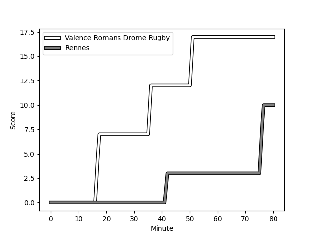
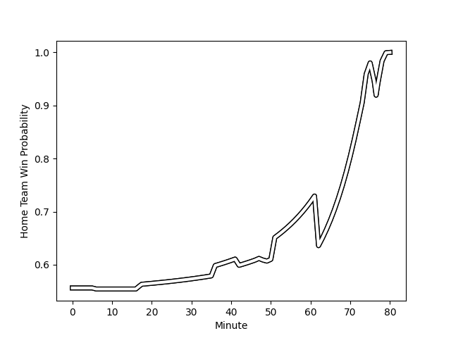

---  
layout: page  
title: Rennes at Valence Romans Drome Rugby; 10-17  
date: 2023-01-21 19:30:00 18:00:00 -0500  
categories: match review  
---
# Rennes (1400.88) at Valence Romans Drome Rugby (1498.94); 10-17

# Prediction: Valence Romans Drome Rugby by 13.8

Valence Romans Drome Rugby by 9.8 on a neutral field
## Scores over Time

## Win Probability over Time

# Pre-Match Prediction: Valence Romans Drome Rugby by 14.9

Valence Romans Drome Rugby by 10.9 on a neutral pitch

|   Away Minutes | Away Player                                                             |   Away elo |   Away Percentile |   Number |   Home Percentile |   Home elo | Home Player                                                        |   Home Minutes |
|---------------:|:------------------------------------------------------------------------|-----------:|------------------:|---------:|------------------:|-----------:|:-------------------------------------------------------------------|---------------:|
|              6 | [Baptiste Le Jallé](..//playerfiles//BaptisteLeJallé_cleaned.md)        |      94.92 |                48 |        1 |                71 |     101.97 | [Anthony Aléo](..//playerfiles//AnthonyAléo_cleaned.md)            |             63 |
|             67 | [Alexandre Fau](..//playerfiles//AlexandreFau_cleaned.md)               |      95.87 |                53 |        2 |                78 |     106.67 | [Dorian Marco Pena](..//playerfiles//DorianMarcoPena_cleaned.md)   |             72 |
|             47 | [Atonio Ulutuipalelei](..//playerfiles//AtonioUlutuipalelei_cleaned.md) |      96.38 |                53 |        3 |                56 |      97.47 | [John Henry Fincham](..//playerfiles//JohnHenryFincham_cleaned.md) |             49 |
|             47 | [Guillaume Cazette](..//playerfiles//GuillaumeCazette_cleaned.md)       |     101.85 |                64 |        4 |                66 |     101.95 | [Francois Uys](..//playerfiles//FrancoisUys_cleaned.md)            |             80 |
|             80 | [Alexandre Gueroult](..//playerfiles//AlexandreGueroult_cleaned.md)     |      96.71 |                52 |        5 |                26 |      86.73 | [Florian Goumat](..//playerfiles//FlorianGoumat_cleaned.md)        |             49 |
|             80 | [Téo Gazin](..//playerfiles//TéoGazin_cleaned.md)                       |      95.75 |                45 |        6 |                85 |     113.66 | [Alexis Armary](..//playerfiles//AlexisArmary_cleaned.md)          |             62 |
|             80 | [Luca Di Salvatore](..//playerfiles//LucaDiSalvatore_cleaned.md)        |      89.48 |                32 |        7 |                22 |      85.92 | [Matthew Gicquel](..//playerfiles//MatthewGicquel_cleaned.md)      |             80 |
|             48 | [Victor Fromenteze](..//playerfiles//VictorFromenteze_cleaned.md)       |      88.05 |                28 |        8 |               nan |      99.43 | [Philippe Laville](..//playerfiles//PhilippeLaville_cleaned.md)    |             80 |
|             62 | [Lucas Ollion](..//playerfiles//LucasOllion_cleaned.md)                 |      91.99 |                27 |        9 |                17 |      84.04 | [Tim Menzel](..//playerfiles//TimMenzel_cleaned.md)                |             74 |
|             62 | [Sam Leeming](..//playerfiles//SamLeeming_cleaned.md)                   |     110.86 |                78 |       10 |                23 |      88.13 | [Lucas Meret](..//playerfiles//LucasMeret_cleaned.md)              |             74 |
|             80 | [Romuald François](..//playerfiles//RomualdFrançois_cleaned.md)         |      72.98 |                 6 |       11 |                42 |      93.06 | [Mason Emerson](..//playerfiles//MasonEmerson_cleaned.md)          |             80 |
|             80 | [Ryan Dubois](..//playerfiles//RyanDubois_cleaned.md)                   |      83.77 |                10 |       12 |                86 |     114.82 | [Ben Neiceru](..//playerfiles//BenNeiceru_cleaned.md)              |             80 |
|             80 | [Clément Lepresle](..//playerfiles//ClémentLepresle_cleaned.md)         |      88.95 |                32 |       13 |                90 |     119.69 | [Jonathan Quinnez](..//playerfiles//JonathanQuinnez_cleaned.md)    |             74 |
|             80 | [Mathieu Brignonen](..//playerfiles//MathieuBrignonen_cleaned.md)       |      90.31 |                37 |       14 |                65 |     101.48 | [Adam Vargas](..//playerfiles//AdamVargas_cleaned.md)              |             80 |
|             80 | [Pedro Soto](..//playerfiles//PedroSoto_cleaned.md)                     |      92.74 |                42 |       15 |                81 |     115.75 | [Quentin Gobet](..//playerfiles//QuentinGobet_cleaned.md)          |             80 |
|             13 | [Patrick Tu'ugahala](..//playerfiles//PatrickTu'ugahala_cleaned.md)     |      92.32 |                35 |       16 |               nan |      96.67 | [Enzo Bailly](..//playerfiles//EnzoBailly_cleaned.md)              |             17 |
|             33 | [Luvuyo Pupuma](..//playerfiles//LuvuyoPupuma_cleaned.md)               |      99.92 |                49 |       17 |                78 |     104.85 | [Vincent Pelo](..//playerfiles//VincentPelo_cleaned.md)            |              8 |
|             33 | [Baptiste Beaujouan](..//playerfiles//BaptisteBeaujouan_cleaned.md)     |      97.14 |                49 |       18 |                21 |      86.12 | [Andrea Pontanier](..//playerfiles//AndreaPontanier_cleaned.md)    |             31 |
|             32 | [Clément Fontaine](..//playerfiles//ClémentFontaine_cleaned.md)         |     101.34 |               nan |       19 |                73 |     104.92 | [Ian Groenewald](..//playerfiles//IanGroenewald_cleaned.md)        |             31 |
|             18 | [Matéo Jeune-Joly](..//playerfiles//MatéoJeune-Joly_cleaned.md)         |      97.43 |                53 |       20 |                 4 |      66.29 | [Charles Brayer](..//playerfiles//CharlesBrayer_cleaned.md)        |             18 |
|             18 | [Joaquin Diaz Luzzi](..//playerfiles//JoaquinDiazLuzzi_cleaned.md)      |     114.58 |                82 |       21 |                13 |      83.01 | [Léopold Dupas](..//playerfiles//LéopoldDupas_cleaned.md)          |              6 |
|             74 | [Grégory Querin](..//playerfiles//GrégoryQuerin_cleaned.md)             |      99.18 |                55 |       22 |                 3 |      65.75 | [Guillaume Cazes](..//playerfiles//GuillaumeCazes_cleaned.md)      |              6 |
|            nan | nan                                                                     |     nan    |               nan |       23 |                78 |     109.58 | [Charles Bouldoire](..//playerfiles//CharlesBouldoire_cleaned.md)  |              6 |

