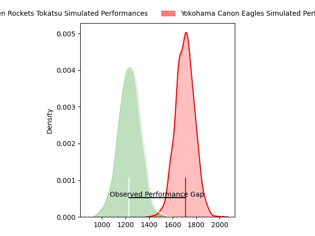
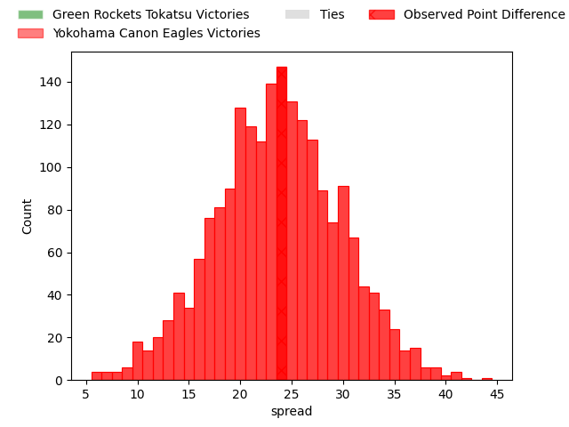
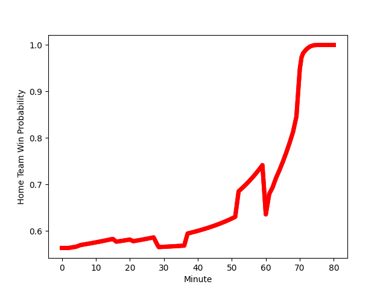

---  
layout: page  
title: Green Rockets Tokatsu at Yokohama Canon Eagles; 12-36  
date: 2023-01-21 04:00:00 18:00:00 -0500  
categories: match review  
---
# Green Rockets Tokatsu at Yokohama Canon Eagles; 12-36

# Club Level Predictions

The first set of predictions treats a club as the smallest object, as the club develops its members, organizes a gameplan, and deploys its players as needed for each match. This club model has a prediction of 0.932, which translates to predicting Yokohama Canon Eagles to win by 23.7.

Each club has a rating and a rating deviation (simiar to a Glicko system), and expected performances can be generated. This allows for simulated matches and spreads like the ones below.
## Projected Performances

## Projected Spreads

# Player Level Predictions

Treating teams instead as an entity made up of the currently active players, I have ratings for each player in an altogether different system. These can be combined to form team ratings once teamsheets are announced, weighting starters a bit higher than the reserves. After the match is played, players can be weighted by their minutes on the field, allowing for an accurate measure of the team's composition. With these compiled team ratings, we can make predictions, measure inaccuracy, and update the individual player ratings.
## Prediction with Player Minutes: Yokohama Canon Eagles by 15.1

Yokohama Canon Eagles by 11.1 on a neutral field
## Scores over Time

## Win Probability over Time

## Prediction without Player Minutes: Yokohama Canon Eagles by 16.9

Yokohama Canon Eagles by 12.9 on a neutral pitch

|   Away Minutes | Away Player                                                 |   Away elo |   Away Percentile |   Number |   Home Percentile |   Home elo | Home Player                                                         |   Home Minutes |
|---------------:|:------------------------------------------------------------|-----------:|------------------:|---------:|------------------:|-----------:|:--------------------------------------------------------------------|---------------:|
|             61 | [Gakuto Ishida](..//playerfiles//GakutoIshida_cleaned.md)   |     108.31 |                83 |        1 |                96 |     122.04 | [Takato Okabe](..//playerfiles//TakatoOkabe_cleaned.md)             |             71 |
|             71 | [Ash Dixon](..//playerfiles//AshDixon_cleaned.md)           |     115.44 |                89 |        2 |               nan |      98.78 | [Song Ho Park](..//playerfiles//SongHoPark_cleaned.md)              |             71 |
|             54 | [Takahiro Doi](..//playerfiles//TakahiroDoi_cleaned.md)     |      71.94 |                 4 |        3 |                76 |     104.26 | [Rento Tsukayama](..//playerfiles//RentoTsukayama_cleaned.md)       |             21 |
|             80 | [Daiki Yamagiwa](..//playerfiles//DaikiYamagiwa_cleaned.md) |      91.64 |                38 |        4 |                70 |     105.83 | [Max Douglas](..//playerfiles//MaxDouglas_cleaned.md)               |             53 |
|             69 | [Jake Ball](..//playerfiles//JakeBall_cleaned.md)           |     111.78 |                84 |        5 |                27 |      87.61 | [Liaki Moli](..//playerfiles//LiakiMoli_cleaned.md)                 |             80 |
|             80 | [Whetu Douglas](..//playerfiles//WhetuDouglas_cleaned.md)   |      94.15 |                45 |        6 |                66 |     102.15 | [Sioeli Vakalahi](..//playerfiles//SioeliVakalahi_cleaned.md)       |             69 |
|             60 | [Ryoi Kamei](..//playerfiles//RyoiKamei_cleaned.md)         |      85.27 |                20 |        7 |                54 |      97.33 | [Mitch Brown](..//playerfiles//MitchBrown_cleaned.md)               |             80 |
|             80 | [Aseri Masivou](..//playerfiles//AseriMasivou_cleaned.md)   |     106.52 |                72 |        8 |                85 |     114.29 | [Amanaki Mafi](..//playerfiles//AmanakiMafi_cleaned.md)             |             80 |
|             60 | [Nick Phipps](..//playerfiles//NickPhipps_cleaned.md)       |     111.88 |                85 |        9 |                46 |      93.92 | [Kouki Arai](..//playerfiles//KoukiArai_cleaned.md)                 |             63 |
|             60 | [Taisetsu Kanai](..//playerfiles//TaisetsuKanai_cleaned.md) |      97.94 |                50 |       10 |                77 |     110.03 | [Yu Tamura](..//playerfiles//YuTamura_cleaned.md)                   |             71 |
|             80 | [Kenta Omata](..//playerfiles//KentaOmata_cleaned.md)       |     122.1  |                91 |       11 |                 3 |      66.66 | [Masayoshi Takezawa](..//playerfiles//MasayoshiTakezawa_cleaned.md) |             80 |
|             74 | [Christian Laui](..//playerfiles//ChristianLaui_cleaned.md) |      98.66 |                56 |       12 |                93 |     121.23 | [Naoya Minamihashi](..//playerfiles//NaoyaMinamihashi_cleaned.md)   |             80 |
|             80 | [Tim Bennetts](..//playerfiles//TimBennetts_cleaned.md)     |      92.16 |                40 |       13 |                97 |     135.42 | [Jesse Kriel](..//playerfiles//JesseKriel_cleaned.md)               |             63 |
|             80 | [Yuma Sugimoto](..//playerfiles//YumaSugimoto_cleaned.md)   |      97.07 |                57 |       14 |                95 |     126.68 | [Viliame Takayawa](..//playerfiles//ViliameTakayawa_cleaned.md)     |             80 |
|             80 | [Lomano Lemeki](..//playerfiles//LomanoLemeki_cleaned.md)   |     107.4  |                72 |       15 |                93 |     129    | [SP Marais](..//playerfiles//SPMarais_cleaned.md)                   |             80 |
|             26 | [Keisuke Kikuta](..//playerfiles//KeisukeKikuta_cleaned.md) |      98.13 |                64 |       16 |               nan |      96.49 | [Shouta Matsuoka](..//playerfiles//ShoutaMatsuoka_cleaned.md)       |             59 |
|             20 | [Tatsuya Fujii](..//playerfiles//TatsuyaFujii_cleaned.md)   |      99.59 |                56 |       17 |                76 |     108.65 | [Kobus Van Dyk](..//playerfiles//KobusVanDyk_cleaned.md)            |             27 |
|             20 | [Tatsuru Owada](..//playerfiles//TatsuruOwada_cleaned.md)   |      81.85 |                 9 |       18 |                49 |      96.21 | [Faf de Klerk](..//playerfiles//FafdeKlerk_cleaned.md)              |             17 |
|             20 | [Tom Marshall](..//playerfiles//TomMarshall_cleaned.md)     |      84.7  |               nan |       19 |                67 |     103.03 | [Yusuke Kajimura](..//playerfiles//YusukeKajimura_cleaned.md)       |             17 |
|             19 | [Sunao Takizawa](..//playerfiles//SunaoTakizawa_cleaned.md) |      54.39 |                 0 |       20 |                77 |     104.6  | [Sione Halasili](..//playerfiles//SioneHalasili_cleaned.md)         |             11 |
|             11 | [Luke Porter](..//playerfiles//LukePorter_cleaned.md)       |      92.19 |                42 |       21 |               nan |      95    | [Yusaku Miyoshi](..//playerfiles//YusakuMiyoshi_cleaned.md)         |              9 |
|              9 | [Yo Sato](..//playerfiles//YoSato_cleaned.md)               |      69.07 |                 3 |       22 |                87 |     119.36 | [Jumpei Ogura](..//playerfiles//JumpeiOgura_cleaned.md)             |              9 |
|              6 | [Koichi Matsura](..//playerfiles//KoichiMatsura_cleaned.md) |      75.08 |                 7 |       23 |               nan |      96.95 | [Chang Ho Ahn](..//playerfiles//ChangHoAhn_cleaned.md)              |              9 |

