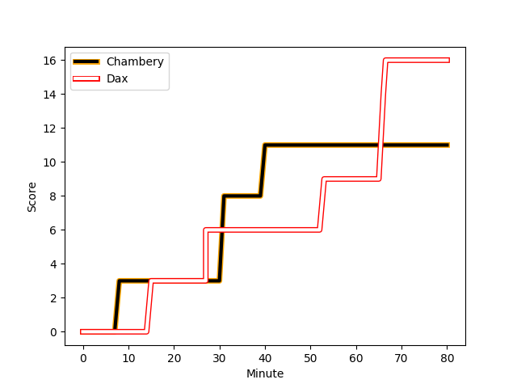
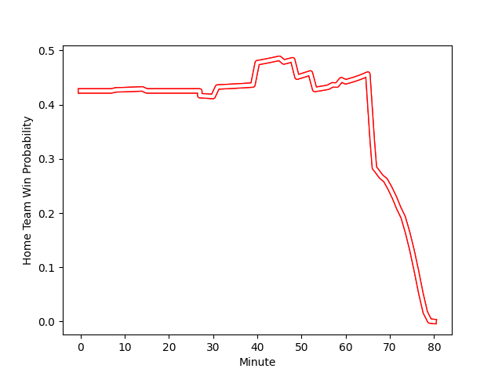

---  
layout: page  
title: Dax at Chambery; 16-11  
date: 2023-01-22 15:00:00 18:00:00 -0500  
categories: match review  
---
# Dax (1540.12) at Chambery (1409.6); 16-11

# Prediction: Dax by 9.1

Dax by 13.1 on a neutral field
## Scores over Time

## Win Probability over Time

# Pre-Match Prediction: Dax by 6.8

Dax by 10.8 on a neutral pitch

|   Away Minutes | Away Player                                                                |   Away elo |   Away Percentile |   Number |   Home Percentile |   Home elo | Home Player                                                                           |   Home Minutes |
|---------------:|:---------------------------------------------------------------------------|-----------:|------------------:|---------:|------------------:|-----------:|:--------------------------------------------------------------------------------------|---------------:|
|             60 | [Asa Faitotoa](..//playerfiles//AsaFaitotoa_cleaned.md)                    |     114.28 |                89 |        1 |                61 |      99.14 | [Géraud Clermont](..//playerfiles//GéraudClermont_cleaned.md)                         |             46 |
|             60 | [Maxime Delonca](..//playerfiles//MaximeDelonca_cleaned.md)                |     107.55 |                81 |        2 |                47 |      94.22 | [Gauthier Brute de Remur](..//playerfiles//GauthierBrutedeRemur_cleaned.md)           |             57 |
|             40 | [Anthony Pelmard](..//playerfiles//AnthonyPelmard_cleaned.md)              |      96.46 |                43 |        3 |                67 |     100.89 | [Lautaro Caro Saisi](..//playerfiles//LautaroCaroSaisi_cleaned.md)                    |             46 |
|             80 | [Mat Luamanu](..//playerfiles//MatLuamanu_cleaned.md)                      |      82.54 |                17 |        4 |                35 |      88.51 | [Fabien Witz](..//playerfiles//FabienWitz_cleaned.md)                                 |             78 |
|             40 | [Yoan Gaune](..//playerfiles//YoanGaune_cleaned.md)                        |     121.9  |                93 |        5 |                 5 |      68.35 | [Romain Guyot](..//playerfiles//RomainGuyot_cleaned.md)                               |             80 |
|             80 | [Arnaud Aletti](..//playerfiles//ArnaudAletti_cleaned.md)                  |      98.96 |                59 |        6 |                39 |      92.17 | [Colin Lebian](..//playerfiles//ColinLebian_cleaned.md)                               |             80 |
|             80 | [Paul Arnaud Ausset](..//playerfiles//PaulArnaudAusset_cleaned.md)         |      98.18 |                56 |        7 |                48 |      95.14 | [Steevy Cerqueira](..//playerfiles//SteevyCerqueira_cleaned.md)                       |             49 |
|             80 | [Brice Ferrer](..//playerfiles//BriceFerrer_cleaned.md)                    |      93.6  |                39 |        8 |                88 |     115.72 | [Jean-Baptiste Grenod](..//playerfiles//Jean-BaptisteGrenod_cleaned.md)               |             80 |
|             59 | [Simon Garrouteigt](..//playerfiles//SimonGarrouteigt_cleaned.md)          |      91.61 |                37 |        9 |                90 |     116.03 | [Thibault Dufau](..//playerfiles//ThibaultDufau_cleaned.md)                           |             80 |
|             80 | [Felipe Berchesi Pisano](..//playerfiles//FelipeBerchesiPisano_cleaned.md) |     108.24 |                75 |       10 |                69 |     104.9  | [Jean-Luc Alewyn Cilliers](..//playerfiles//Jean-LucAlewynCilliers_cleaned.md)        |             80 |
|             80 | [Guillaume Bouche](..//playerfiles//GuillaumeBouche_cleaned.md)            |     110.92 |                81 |       11 |                47 |      95.34 | [Paul Baptiste Florent Altier](..//playerfiles//PaulBaptisteFlorentAltier_cleaned.md) |             69 |
|             80 | [Hugo Fourquet](..//playerfiles//HugoFourquet_cleaned.md)                  |     113.81 |                89 |       12 |                41 |      92.11 | [Mattéo Faucher](..//playerfiles//MattéoFaucher_cleaned.md)                           |             80 |
|             80 | [Rodrigo Marta](..//playerfiles//RodrigoMarta_cleaned.md)                  |     111.65 |                82 |       13 |               nan |      85.85 | [Mickael Blanc](..//playerfiles//MickaelBlanc_cleaned.md)                             |             49 |
|             59 | [Théo Gatelier](..//playerfiles//ThéoGatelier_cleaned.md)                  |      95.72 |                49 |       14 |                56 |      98.04 | [Arthur Nennig](..//playerfiles//ArthurNennig_cleaned.md)                             |             80 |
|             73 | [Théo Duprat](..//playerfiles//ThéoDuprat_cleaned.md)                      |     116.91 |                84 |       15 |                35 |      89.79 | [Jules Dorrival](..//playerfiles//JulesDorrival_cleaned.md)                           |             58 |
|             40 | [Diogo Hasse Ferreira](..//playerfiles//DiogoHasseFerreira_cleaned.md)     |      79.32 |                 9 |       16 |                36 |      94.5  | [Giorgi Pertaia](..//playerfiles//GiorgiPertaia_cleaned.md)                           |             34 |
|             40 | [Mattieu Bidau](..//playerfiles//MattieuBidau_cleaned.md)                  |      99.52 |                61 |       17 |                33 |      90.8  | [Fabio Gonzalez](..//playerfiles//FabioGonzalez_cleaned.md)                           |             34 |
|             21 | [Julien Dechavanne](..//playerfiles//JulienDechavanne_cleaned.md)          |      92.8  |                41 |       18 |                 0 |      43.64 | [Vereniki Goneva](..//playerfiles//VerenikiGoneva_cleaned.md)                         |             31 |
|             21 | [Adrien Ayestaran](..//playerfiles//AdrienAyestaran_cleaned.md)            |      80.83 |                10 |       19 |                12 |      79.34 | [Martin Bertrand](..//playerfiles//MartinBertrand_cleaned.md)                         |             31 |
|             20 | [Elvis Levi](..//playerfiles//ElvisLevi_cleaned.md)                        |     131.09 |                97 |       20 |                53 |      99.16 | [Julien Primault](..//playerfiles//JulienPrimault_cleaned.md)                         |             23 |
|             20 | [Louis Mary](..//playerfiles//LouisMary_cleaned.md)                        |     100.79 |                62 |       21 |                25 |      86    | [Victor Pisano](..//playerfiles//VictorPisano_cleaned.md)                             |             22 |
|              7 | [Hugo Cerisier](..//playerfiles//HugoCerisier_cleaned.md)                  |     101.17 |                60 |       22 |                77 |     107.23 | [Thomas Hecquet](..//playerfiles//ThomasHecquet_cleaned.md)                           |             11 |
|            nan | nan                                                                        |     nan    |               nan |       23 |                44 |      93.5  | [Revan Gautier](..//playerfiles//RevanGautier_cleaned.md)                             |              2 |

