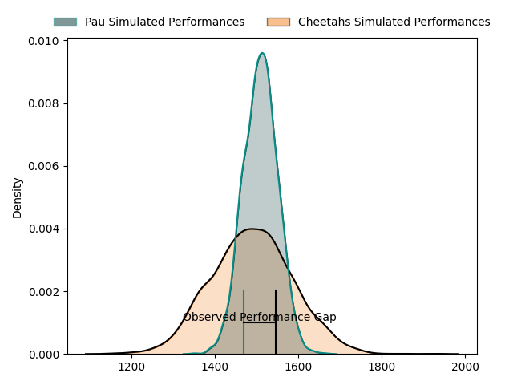
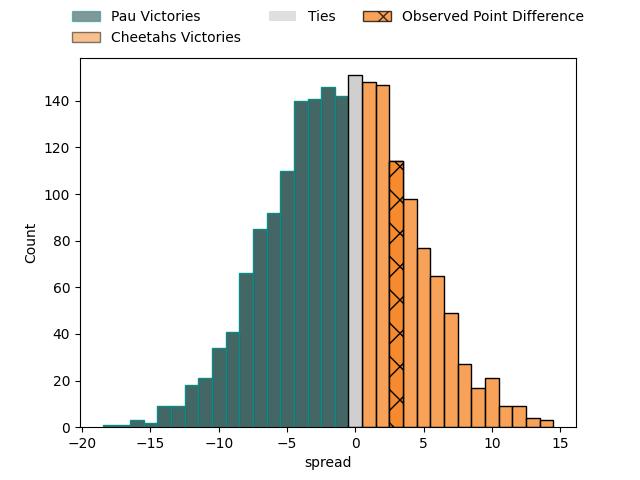
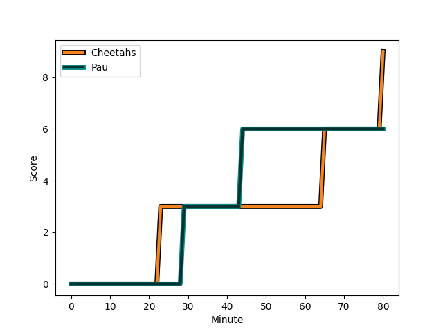
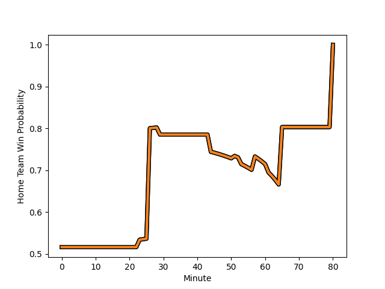

---  
layout: page  
title: Pau at Cheetahs; 6-9  
date: 2023-01-22 16:15:00 18:00:00 -0500  
categories: match review  
---
# Pau at Cheetahs; 6-9

# Club Level Predictions

The first set of predictions treats a club as the smallest object, as the club develops its members, organizes a gameplan, and deploys its players as needed for each match. This club model has a prediction of 0.472, which translates to predicting Pau to win by 1.0.

Each club has a rating and a rating deviation (simiar to a Glicko system), and expected performances can be generated. This allows for simulated matches and spreads like the ones below.
## Projected Performances

## Projected Spreads

# Player Level Predictions

Treating teams instead as an entity made up of the currently active players, I have ratings for each player in an altogether different system. These can be combined to form team ratings once teamsheets are announced, weighting starters a bit higher than the reserves. After the match is played, players can be weighted by their minutes on the field, allowing for an accurate measure of the team's composition. With these compiled team ratings, we can make predictions, measure inaccuracy, and update the individual player ratings.
## Prediction with Player Minutes: Cheetahs by 6.9

Cheetahs by 2.9 on a neutral field
## Scores over Time

## Win Probability over Time

## Prediction without Player Minutes: Cheetahs by 0.0

Pau by 4.0 on a neutral pitch

|   Away Minutes | Away Player                                                           |   Away elo |   Away Percentile |   Number |   Home Percentile |   Home elo | Home Player                                                                              |   Home Minutes |
|---------------:|:----------------------------------------------------------------------|-----------:|------------------:|---------:|------------------:|-----------:|:-----------------------------------------------------------------------------------------|---------------:|
|             53 | [Ignacio Calles](..//playerfiles//IgnacioCalles_cleaned.md)           |     110.05 |                86 |        1 |                 7 |      76.03 | [Schalk Ferreira](..//playerfiles//SchalkFerreira_cleaned.md)                            |             51 |
|             57 | [Romain Ruffenach](..//playerfiles//RomainRuffenach_cleaned.md)       |     103.78 |                73 |        2 |                94 |     120.75 | [Louis van der Westhuizen](..//playerfiles//LouisvanderWesthuizen_cleaned.md)            |             51 |
|             53 | [Siate Tokolahi](..//playerfiles//SiateTokolahi_cleaned.md)           |      94.68 |                48 |        3 |                83 |     108.11 | [Aranos Coetzee](..//playerfiles//AranosCoetzee_cleaned.md)                              |             65 |
|             80 | [Guillaume Ducat](..//playerfiles//GuillaumeDucat_cleaned.md)         |      72.53 |                 6 |        4 |                75 |     106.3  | [Rynier Bernardo](..//playerfiles//RynierBernardo_cleaned.md)                            |             67 |
|             12 | [Mickael Capelli](..//playerfiles//MickaelCapelli_cleaned.md)         |     120.81 |                92 |        5 |                50 |      95.72 | [Victor Kutlwano Sekekete](..//playerfiles//VictorKutlwanoSekekete_cleaned.md)           |             80 |
|             61 | [Sacha Zegueur](..//playerfiles//SachaZegueur_cleaned.md)             |      61.84 |                 1 |        6 |                77 |     109.11 | [Daniel Johannes Maartens](..//playerfiles//DanielJohannesMaartens_cleaned.md)           |             80 |
|             72 | [Martin Puech](..//playerfiles//MartinPuech_cleaned.md)               |     103.41 |                81 |        7 |                82 |     112.46 | [Friedle Olivier](..//playerfiles//FriedleOlivier_cleaned.md)                            |             80 |
|             80 | [Jordan Joseph](..//playerfiles//JordanJoseph_cleaned.md)             |      79.84 |                13 |        8 |                41 |      92.8  | [Jeandre Rudolph](..//playerfiles//JeandreRudolph_cleaned.md)                            |             80 |
|             53 | [Clovis Le bail](..//playerfiles//ClovisLebail_cleaned.md)            |     115.76 |                90 |        9 |                60 |      99.87 | [Rewan Kruger](..//playerfiles//RewanKruger_cleaned.md)                                  |             77 |
|             80 | [Thibault Debaes](..//playerfiles//ThibaultDebaes_cleaned.md)         |     112.01 |                79 |       10 |                86 |     116.94 | [Siya Masuku](..//playerfiles//SiyaMasuku_cleaned.md)                                    |             80 |
|             80 | [Daniel Ikpefan](..//playerfiles//DanielIkpefan_cleaned.md)           |      80.32 |                12 |       11 |                55 |      97.72 | [Munier Hartzenberg](..//playerfiles//MunierHartzenberg_cleaned.md)                      |             80 |
|             80 | [Nathan Decron](..//playerfiles//NathanDecron_cleaned.md)             |     115.82 |                87 |       12 |                13 |      81.6  | [Robert Ebersohn](..//playerfiles//RobertEbersohn_cleaned.md)                            |             26 |
|             63 | [Yvan Reilhac](..//playerfiles//YvanReilhac_cleaned.md)               |      83.64 |                19 |       13 |                79 |     110.1  | [David Benjamin Brits](..//playerfiles//DavidBenjaminBrits_cleaned.md)                   |             80 |
|             80 | [Clement Laporte](..//playerfiles//ClementLaporte_cleaned.md)         |     151.47 |                99 |       14 |                53 |      97.5  | [Daniel Kasende Kalepula](..//playerfiles//DanielKasendeKalepula_cleaned.md)             |             80 |
|             80 | [Théo Attissogbe](..//playerfiles//ThéoAttissogbe_cleaned.md)         |      91.05 |                38 |       15 |                21 |      83.03 | [Tapiwa Lloyd Mafura](..//playerfiles//TapiwaLloydMafura_cleaned.md)                     |             80 |
|             27 | [Remi Seneca](..//playerfiles//RemiSeneca_cleaned.md)                 |     115.11 |                93 |       16 |                64 |      96.38 | [Alulutho Tshakweni](..//playerfiles//AluluthoTshakweni_cleaned.md)                      |             29 |
|             23 | [Lucas Rey](..//playerfiles//LucasRey_cleaned.md)                     |      71.37 |                 3 |       17 |                79 |     107.6  | [Marko Louis Janse van Rensburg](..//playerfiles//MarkoLouisJansevanRensburg_cleaned.md) |             29 |
|             27 | [Guram Papidze](..//playerfiles//GuramPapidze_cleaned.md)             |      74.72 |                 6 |       18 |                41 |      95.07 | [Hencus van Wyk](..//playerfiles//HencusvanWyk_cleaned.md)                               |             15 |
|             68 | [Lekima Tagitagivalu](..//playerfiles//LekimaTagitagivalu_cleaned.md) |      97.82 |                55 |       19 |                10 |      76.9  | [Mzwanele Richman Zito](..//playerfiles//MzwaneleRichmanZito_cleaned.md)                 |             13 |
|             19 | [Reece Hewat](..//playerfiles//ReeceHewat_cleaned.md)                 |      89.03 |                30 |       20 |                12 |      78.76 | [Evardi Boshoff](..//playerfiles//EvardiBoshoff_cleaned.md)                              |             54 |
|              8 | [Thibault Hamonou](..//playerfiles//ThibaultHamonou_cleaned.md)       |      82.49 |                16 |       21 |               nan |      95    | [Branden de Kock](..//playerfiles//BrandendeKock_cleaned.md)                             |              3 |
|             27 | [Dan Robson](..//playerfiles//DanRobson_cleaned.md)                   |     104.63 |                73 |       22 |               nan |     nan    | nan                                                                                      |            nan |
|             17 | [Tumua Manu](..//playerfiles//TumuaManu_cleaned.md)                   |     125.5  |                94 |       23 |               nan |     nan    | nan                                                                                      |            nan |

