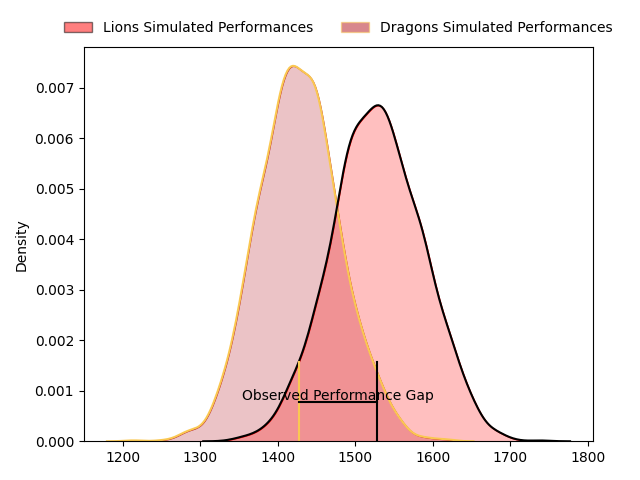
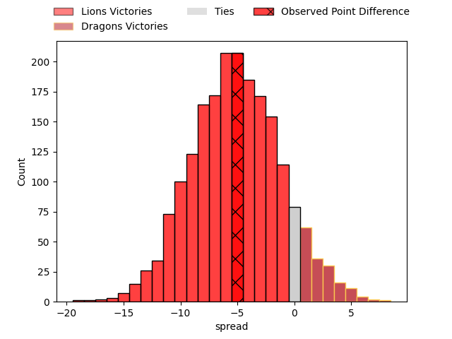
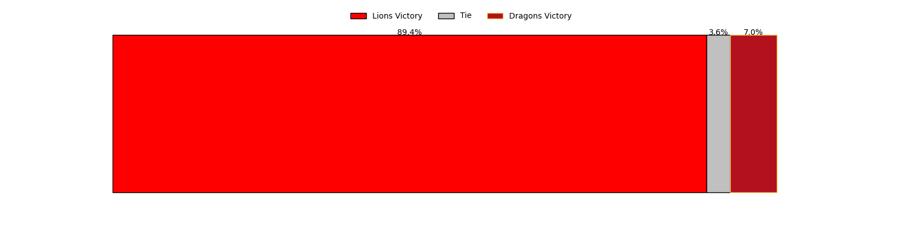
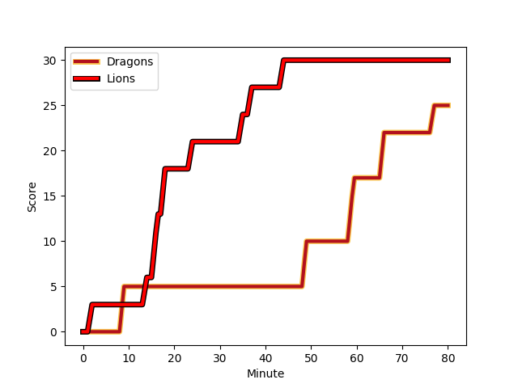
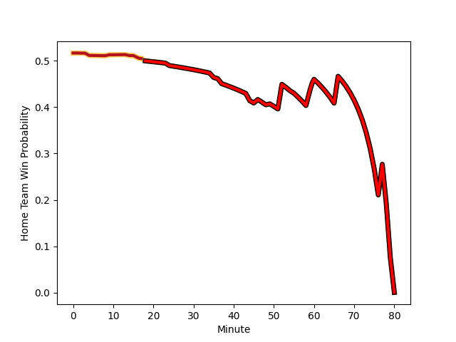

---  
layout: page  
title: Lions at Dragons; 30-25  
date: 2023-01-22 14:00:00 18:00:00 -0500  
categories: match review  
---
# Lions at Dragons; 30-25

# Club Level Predictions

The first set of predictions treats a club as the smallest object, as the club develops its members, organizes a gameplan, and deploys its players as needed for each match. This club model has a prediction of 0.358, which translates to predicting Lions to win by 5.2.

Each club has a rating and a rating deviation (simiar to a Glicko system), and expected performances can be generated. This allows for simulated matches and spreads like the ones below.
## Projected Performances

## Projected Spreads

## Projected Results

# Player Level Predictions

Treating teams instead as an entity made up of the currently active players, I have ratings for each player in an altogether different system. These can be combined to form team ratings once teamsheets are announced, weighting starters a bit higher than the reserves. After the match is played, players can be weighted by their minutes on the field, allowing for an accurate measure of the team's composition. With these compiled team ratings, we can make predictions, measure inaccuracy, and update the individual player ratings.
## Prediction with Player Minutes: Dragons by 6.8

Dragons by 2.8 on a neutral field
## Scores over Time

## Win Probability over Time

## Prediction without Player Minutes: Dragons by 14.2

Dragons by 10.2 on a neutral pitch

|   Away Minutes | Away Player                                                                   |   Away elo |   Away Percentile |   Number |   Home Percentile |   Home elo | Home Player                                                       |   Home Minutes |
|---------------:|:------------------------------------------------------------------------------|-----------:|------------------:|---------:|------------------:|-----------:|:------------------------------------------------------------------|---------------:|
|             52 | [Jean-Pierre Smith](..//playerfiles//Jean-PierreSmith_cleaned.md)             |      91.65 |                36 |        1 |                93 |     117.66 | [Rob Evans](..//playerfiles//RobEvans_cleaned.md)                 |             46 |
|             80 | [Michael van Vuuren](..//playerfiles//MichaelvanVuuren_cleaned.md)            |      89.17 |               nan |        2 |                27 |      88.01 | [Bradley Roberts](..//playerfiles//BradleyRoberts_cleaned.md)     |             46 |
|             52 | [Asenathi Ntlabakanye](..//playerfiles//AsenathiNtlabakanye_cleaned.md)       |      74.91 |                 6 |        3 |                12 |      73.62 | [Lloyd Fairbrother](..//playerfiles//LloydFairbrother_cleaned.md) |             46 |
|             55 | [Willem Alberts](..//playerfiles//WillemAlberts_cleaned.md)                   |     105.62 |                74 |        4 |                23 |      85.76 | [Joseph Davies](..//playerfiles//JosephDavies_cleaned.md)         |             80 |
|             80 | [Darrien-Lane Landsberg](..//playerfiles//Darrien-LaneLandsberg_cleaned.md)   |      95.79 |                51 |        5 |                27 |      87.63 | [Ben Carter](..//playerfiles//BenCarter_cleaned.md)               |             80 |
|             75 | [Jaco Kriel](..//playerfiles//JacoKriel_cleaned.md)                           |     126.32 |                94 |        6 |                30 |      88.82 | [George Nott](..//playerfiles//GeorgeNott_cleaned.md)             |             80 |
|             80 | [Emile van Heerden](..//playerfiles//EmilevanHeerden_cleaned.md)              |      86.54 |                23 |        7 |                74 |     105.62 | [Taine Basham](..//playerfiles//TaineBasham_cleaned.md)           |             80 |
|             80 | [Emmanuel Tshituka](..//playerfiles//EmmanuelTshituka_cleaned.md)             |      74.44 |                 7 |        8 |                86 |     115.47 | [Ross Moriarty](..//playerfiles//RossMoriarty_cleaned.md)         |              4 |
|             60 | [Andre Warner](..//playerfiles//AndreWarner_cleaned.md)                       |      90.26 |                35 |        9 |                70 |     103.36 | [Lewis Jones](..//playerfiles//LewisJones_cleaned.md)             |             52 |
|             80 | [Jordan Hendrikse](..//playerfiles//JordanHendrikse_cleaned.md)               |      74.21 |                 5 |       10 |                68 |     104.4  | [Will Reed](..//playerfiles//WillReed_cleaned.md)                 |             60 |
|             80 | [Edwill van der Merwe](..//playerfiles//EdwillvanderMerwe_cleaned.md)         |     112.01 |                83 |       11 |                81 |     110.74 | [Ashton Hewitt](..//playerfiles//AshtonHewitt_cleaned.md)         |             80 |
|             80 | [Marius Louw](..//playerfiles//MariusLouw_cleaned.md)                         |     117.59 |                89 |       12 |                97 |     134.45 | [Max Clark](..//playerfiles//MaxClark_cleaned.md)                 |             49 |
|             80 | [Henco van Wyk](..//playerfiles//HencovanWyk_cleaned.md)                      |     112.21 |                82 |       13 |                96 |     131.23 | [Steffan Hughes](..//playerfiles//SteffanHughes_cleaned.md)       |             80 |
|             80 | [Quan Horn](..//playerfiles//QuanHorn_cleaned.md)                             |     114.97 |                86 |       14 |                 2 |      63.54 | [Rio Dyer](..//playerfiles//RioDyer_cleaned.md)                   |             80 |
|             80 | [Andries Coetzee](..//playerfiles//AndriesCoetzee_cleaned.md)                 |     106.3  |                70 |       15 |                79 |     111.02 | [Jordan Williams](..//playerfiles//JordanWilliams_cleaned.md)     |             80 |
|             28 | [Ruan Smith](..//playerfiles//RuanSmith_cleaned.md)                           |     111.01 |                87 |       16 |               nan |      95.33 | [Brodie Coghlan](..//playerfiles//BrodieCoghlan_cleaned.md)       |             34 |
|             28 | [Morgan Naude](..//playerfiles//MorganNaude_cleaned.md)                       |     106.74 |               nan |       17 |                79 |     105.4  | [Aki Seiuli](..//playerfiles//AkiSeiuli_cleaned.md)               |             34 |
|             25 | [Pieter Jansen van Vuuren](..//playerfiles//PieterJansenvanVuuren_cleaned.md) |      99.7  |                62 |       18 |                15 |      82.91 | [Leon Brown](..//playerfiles//LeonBrown_cleaned.md)               |             34 |
|              5 | [Johannes JC Pretorius](..//playerfiles//JohannesJCPretorius_cleaned.md)      |      95.22 |               nan |       19 |                64 |     101.31 | [Aaron Wainwright](..//playerfiles//AaronWainwright_cleaned.md)   |             76 |
|             20 | [Morne Van den Berg](..//playerfiles//MorneVandenBerg_cleaned.md)             |      82.25 |                13 |       20 |                80 |     108    | [Rhodri Williams](..//playerfiles//RhodriWilliams_cleaned.md)     |             28 |
|            nan | nan                                                                           |     nan    |               nan |       21 |                95 |     136.1  | [JJ Hanrahan](..//playerfiles//JJHanrahan_cleaned.md)             |             20 |
|            nan | nan                                                                           |     nan    |               nan |       22 |                87 |     117.11 | [Jack Dixon](..//playerfiles//JackDixon_cleaned.md)               |             31 |

