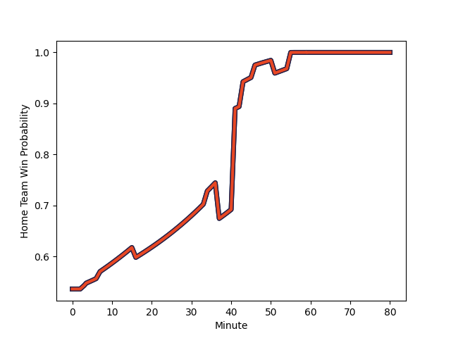

---  
layout: page  
title: Saracens at Edinburgh; 14-20  
date: 2023-01-22 18:30:00 18:00:00 -0500  
categories: match review  
---
# Saracens (1612.79) at Edinburgh (1676.17); 14-20

# Prediction: Edinburgh by 10.3

Edinburgh by 6.3 on a neutral field
## Scores over Time

## Win Probability over Time

# Pre-Match Prediction: Edinburgh by 0.7

Saracens by 4.7 on a neutral pitch

|   Away Minutes | Away Player                                                   |   Away elo |   Away Percentile |   Number |   Home Percentile |   Home elo | Home Player                                                   |   Home Minutes |
|---------------:|:--------------------------------------------------------------|-----------:|------------------:|---------:|------------------:|-----------:|:--------------------------------------------------------------|---------------:|
|             49 | [Robin Hislop](..//playerfiles//RobinHislop_cleaned.md)       |      97.28 |                62 |        1 |                27 |      88.95 | [Pierre Schoeman](..//playerfiles//PierreSchoeman_cleaned.md) |             80 |
|             41 | [Jamie George](..//playerfiles//JamieGeorge_cleaned.md)       |     154.89 |               100 |        2 |                73 |     103.93 | [Dave Cherry](..//playerfiles//DaveCherry_cleaned.md)         |             75 |
|             34 | [Marco Riccioni](..//playerfiles//MarcoRiccioni_cleaned.md)   |     102.34 |                72 |        3 |                98 |     135.84 | [WP Nel](..//playerfiles//WPNel_cleaned.md)                   |             80 |
|             80 | [Maro Itoje](..//playerfiles//MaroItoje_cleaned.md)           |     104.81 |                73 |        4 |                89 |     117.34 | [Sam Skinner](..//playerfiles//SamSkinner_cleaned.md)         |             80 |
|             56 | [Hugh Tizard](..//playerfiles//HughTizard_cleaned.md)         |     106.63 |                76 |        5 |                97 |     131.09 | [Grant Gilchrist](..//playerfiles//GrantGilchrist_cleaned.md) |             80 |
|             70 | [Andy Christie](..//playerfiles//AndyChristie_cleaned.md)     |      91.48 |                38 |        6 |                99 |     151.19 | [Jamie Ritchie](..//playerfiles//JamieRitchie_cleaned.md)     |             55 |
|             80 | [Ben Earl](..//playerfiles//BenEarl_cleaned.md)               |     110.57 |                82 |        7 |                96 |     130.84 | [Luke Crosbie](..//playerfiles//LukeCrosbie_cleaned.md)       |             80 |
|             80 | [Billy Vunipola](..//playerfiles//BillyVunipola_cleaned.md)   |     112.86 |                83 |        8 |                 0 |      57.38 | [Viliame Mata](..//playerfiles//ViliameMata_cleaned.md)       |             80 |
|             56 | [Ivan van Zyl](..//playerfiles//IvanvanZyl_cleaned.md)        |     116.59 |                90 |        9 |                81 |     108.68 | [Ben Vellacott](..//playerfiles//BenVellacott_cleaned.md)     |             51 |
|             80 | [Alex Goode](..//playerfiles//AlexGoode_cleaned.md)           |     109.43 |                76 |       10 |                41 |      94    | [Charlie Savala](..//playerfiles//CharlieSavala_cleaned.md)   |             80 |
|             80 | [Sean Maitland](..//playerfiles//SeanMaitland_cleaned.md)     |     116.11 |                87 |       11 |                99 |     149.2  | [Blair Kinghorn](..//playerfiles//BlairKinghorn_cleaned.md)   |             80 |
|             80 | [Nick Tompkins](..//playerfiles//NickTompkins_cleaned.md)     |     144.93 |                99 |       12 |                60 |      99.6  | [James Lang](..//playerfiles//JamesLang_cleaned.md)           |             80 |
|             80 | [Alex Lozowski](..//playerfiles//AlexLozowski_cleaned.md)     |     103.86 |                68 |       13 |                87 |     115.26 | [Mark Bennett](..//playerfiles//MarkBennett_cleaned.md)       |             80 |
|             80 | [Max Malins](..//playerfiles//MaxMalins_cleaned.md)           |      93.37 |                42 |       14 |                70 |     103.58 | [Jack Blain](..//playerfiles//JackBlain_cleaned.md)           |             56 |
|             46 | [Elliot Daly](..//playerfiles//ElliotDaly_cleaned.md)         |     119.03 |                87 |       15 |                73 |     107.29 | [Henry Immelman](..//playerfiles//HenryImmelman_cleaned.md)   |             80 |
|             31 | [Eroni Mawi](..//playerfiles//EroniMawi_cleaned.md)           |      73.76 |                 5 |       16 |                29 |      88.39 | [Adam McBurney](..//playerfiles//AdamMcBurney_cleaned.md)     |              5 |
|             24 | [Nick Isiekwe](..//playerfiles//NickIsiekwe_cleaned.md)       |      87.46 |                26 |       17 |                87 |     116.61 | [Nick Haining](..//playerfiles//NickHaining_cleaned.md)       |             25 |
|             39 | [Kapeli Pifeleti](..//playerfiles//KapeliPifeleti_cleaned.md) |      77.55 |                 9 |       18 |                46 |      95.16 | [Henry Pyrgos](..//playerfiles//HenryPyrgos_cleaned.md)       |             29 |
|             46 | [Christian Judge](..//playerfiles//ChristianJudge_cleaned.md) |      96.49 |                50 |       19 |                59 |      99.16 | [Wes Goosen](..//playerfiles//WesGoosen_cleaned.md)           |             24 |
|             10 | [Theo Dan](..//playerfiles//TheoDan_cleaned.md)               |     118.93 |                92 |       20 |               nan |     nan    | nan                                                           |            nan |
|             24 | [Aled Davies](..//playerfiles//AledDavies_cleaned.md)         |      95.31 |                46 |       21 |               nan |     nan    | nan                                                           |            nan |
|             34 | [Alex Lewington](..//playerfiles//AlexLewington_cleaned.md)   |      89.6  |                30 |       22 |               nan |     nan    | nan                                                           |            nan |

