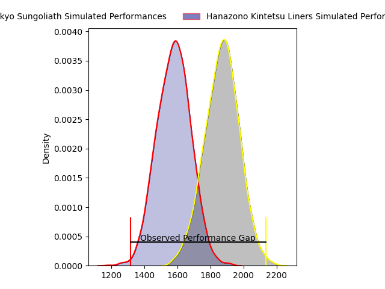
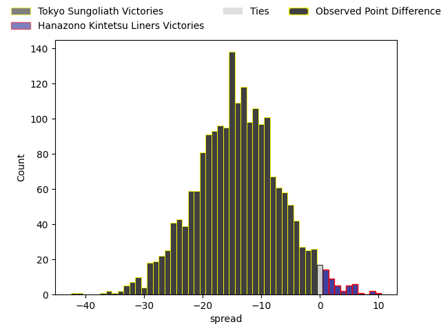
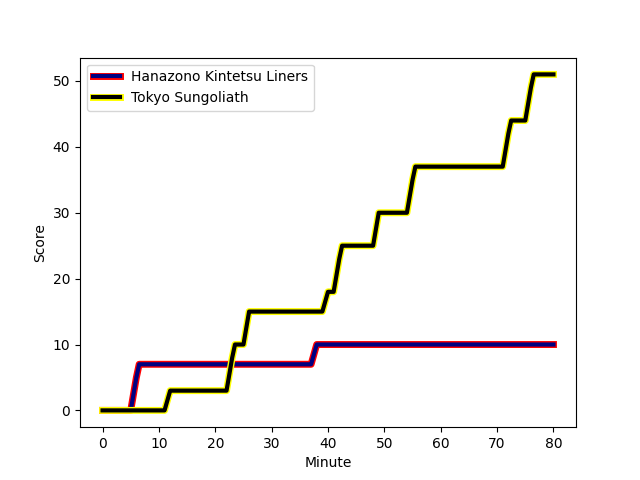
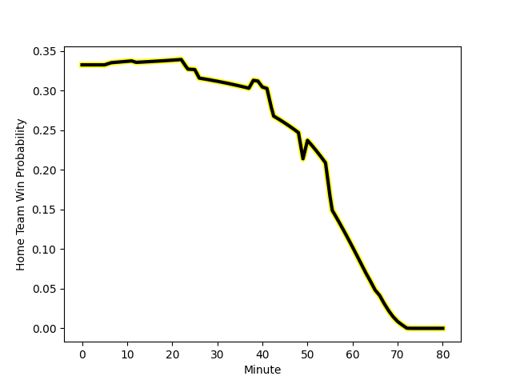

---  
layout: page  
title: Tokyo Sungoliath at Hanazono Kintetsu Liners; 51-10  
date: 2023-01-22 04:00:00 18:00:00 -0500  
categories: match review  
---
# Tokyo Sungoliath at Hanazono Kintetsu Liners; 51-10

# Club Level Predictions

The first set of predictions treats a club as the smallest object, as the club develops its members, organizes a gameplan, and deploys its players as needed for each match. This club model has a prediction of 0.17, which translates to predicting Tokyo Sungoliath to win by 14.5.

Each club has a rating and a rating deviation (simiar to a Glicko system), and expected performances can be generated. This allows for simulated matches and spreads like the ones below.
## Projected Performances

## Projected Spreads

# Player Level Predictions

Treating teams instead as an entity made up of the currently active players, I have ratings for each player in an altogether different system. These can be combined to form team ratings once teamsheets are announced, weighting starters a bit higher than the reserves. After the match is played, players can be weighted by their minutes on the field, allowing for an accurate measure of the team's composition. With these compiled team ratings, we can make predictions, measure inaccuracy, and update the individual player ratings.
## Prediction with Player Minutes: Tokyo Sungoliath by 26.2

Tokyo Sungoliath by 30.2 on a neutral field
## Scores over Time

## Win Probability over Time

## Prediction without Player Minutes: Tokyo Sungoliath by 27.9

Tokyo Sungoliath by 31.9 on a neutral pitch

|   Away Minutes | Away Player                                                       |   Away elo |   Away Percentile |   Number |   Home Percentile |   Home elo | Home Player                                                               |   Home Minutes |
|---------------:|:------------------------------------------------------------------|-----------:|------------------:|---------:|------------------:|-----------:|:--------------------------------------------------------------------------|---------------:|
|             40 | [Shintaro Ishihara](..//playerfiles//ShintaroIshihara_cleaned.md) |     112.39 |                88 |        1 |                 5 |      74.05 | [Shun Sasaki](..//playerfiles//ShunSasaki_cleaned.md)                     |             64 |
|             64 | [Shunta Nakamura](..//playerfiles//ShuntaNakamura_cleaned.md)     |     133.57 |                98 |        2 |                38 |      91.36 | [Keiichi Kaneko](..//playerfiles//KeiichiKaneko_cleaned.md)               |             50 |
|             64 | [Ryosuke Iwaihara](..//playerfiles//RyosukeIwaihara_cleaned.md)   |      98.23 |               nan |        3 |                11 |      80.61 | [Lata Tangimana](..//playerfiles//LataTangimana_cleaned.md)               |             40 |
|             80 | [Tom Savage](..//playerfiles//TomSavage_cleaned.md)               |     127.27 |                94 |        4 |                42 |      93.2  | [Tsuyoshi Murata](..//playerfiles//TsuyoshiMurata_cleaned.md)             |             64 |
|             74 | [Harry Hockings](..//playerfiles//HarryHockings_cleaned.md)       |     139.48 |                98 |        5 |                97 |     132.07 | [Ben Toolis](..//playerfiles//BenToolis_cleaned.md)                       |             80 |
|             80 | [Kanji Shimokawa](..//playerfiles//KanjiShimokawa_cleaned.md)     |     113.9  |                76 |        6 |                37 |      91.37 | [Takahito Sugahara](..//playerfiles//TakahitoSugahara_cleaned.md)         |             80 |
|             50 | [Naoki Ozawa](..//playerfiles//NaokiOzawa_cleaned.md)             |     128.37 |                95 |        7 |                47 |      94.93 | [Hayato Yokoi](..//playerfiles//HayatoYokoi_cleaned.md)                   |             80 |
|             80 | [Tevita Tatafu](..//playerfiles//TevitaTatafu_cleaned.md)         |      98.01 |                51 |        8 |                69 |     103.3  | [Jed Brown](..//playerfiles//JedBrown_cleaned.md)                         |             64 |
|             40 | [Naoto Saito](..//playerfiles//NaotoSaito_cleaned.md)             |      95.78 |                48 |        9 |                26 |      88.1  | [Will Genia](..//playerfiles//WillGenia_cleaned.md)                       |             66 |
|             80 | [Keisuke Moriya](..//playerfiles//KeisukeMoriya_cleaned.md)       |     138.53 |                97 |       10 |                57 |      96.59 | [Takumi Yoshimoto](..//playerfiles//TakumiYoshimoto_cleaned.md)           |             80 |
|             80 | [Ryosuke Kawase](..//playerfiles//RyosukeKawase_cleaned.md)       |      95.97 |               nan |       11 |               nan |      94.32 | [Ren Takano](..//playerfiles//RenTakano_cleaned.md)                       |             80 |
|             64 | [Isaiah Punivai](..//playerfiles//IsaiahPunivai_cleaned.md)       |     101.97 |                61 |       12 |                 9 |      76.52 | [Koji Okamura](..//playerfiles//KojiOkamura_cleaned.md)                   |             66 |
|             80 | [Shogo Nakano](..//playerfiles//ShogoNakano_cleaned.md)           |     100.03 |                61 |       13 |                10 |      78.06 | [Siosaia Fifita](..//playerfiles//SiosaiaFifita_cleaned.md)               |             80 |
|             50 | [Takaaki Nakazuru](..//playerfiles//TakaakiNakazuru_cleaned.md)   |     131.14 |                96 |       14 |                59 |      92.42 | [Joshua Nohra](..//playerfiles//JoshuaNohra_cleaned.md)                   |             80 |
|             80 | [Seiya Ozaki](..//playerfiles//SeiyaOzaki_cleaned.md)             |     121.87 |                91 |       15 |                56 |      98.09 | [Semisi Masirewa](..//playerfiles//SemisiMasirewa_cleaned.md)             |             66 |
|             40 | [Kenta Kobayashi](..//playerfiles//KentaKobayashi_cleaned.md)     |      98.6  |               nan |       16 |                43 |      93.45 | [Kota Mitake](..//playerfiles//KotaMitake_cleaned.md)                     |             40 |
|             40 | [Yutaka Nagare](..//playerfiles//YutakaNagare_cleaned.md)         |     108.33 |                73 |       17 |                96 |     118.63 | [Atsushi Kashimoto](..//playerfiles//AtsushiKashimoto_cleaned.md)         |             30 |
|             30 | [Koji Iino](..//playerfiles//KojiIino_cleaned.md)                 |     112.65 |                84 |       18 |                78 |      97.19 | [Kenta Tanaka](..//playerfiles//KentaTanaka_cleaned.md)                   |             16 |
|             30 | [Hiroki Kumoyama](..//playerfiles//HirokiKumoyama_cleaned.md)     |      95    |               nan |       19 |                16 |      78.78 | [Patrick Tafa](..//playerfiles//PatrickTafa_cleaned.md)                   |             16 |
|             16 | [Kan Nakano](..//playerfiles//KanNakano_cleaned.md)               |     103.98 |                76 |       20 |                 6 |      72.61 | [Daiki Miyashita](..//playerfiles//DaikiMiyashita_cleaned.md)             |             16 |
|             16 | [Kienori Go](..//playerfiles//KienoriGo_cleaned.md)               |      93.95 |               nan |       21 |                71 |      96.87 | [Keitaro Hitora](..//playerfiles//KeitaroHitora_cleaned.md)               |             14 |
|             16 | [Ryoto Nakamura](..//playerfiles//RyotoNakamura_cleaned.md)       |     108.58 |                78 |       22 |                78 |     110.76 | [Jackson Garden-Bachop](..//playerfiles//JacksonGarden-Bachop_cleaned.md) |             14 |
|              6 | [Yasuaki Katakura](..//playerfiles//YasuakiKatakura_cleaned.md)   |      95    |               nan |       23 |                66 |     100.47 | [Tevita Tupou](..//playerfiles//TevitaTupou_cleaned.md)                   |             14 |

