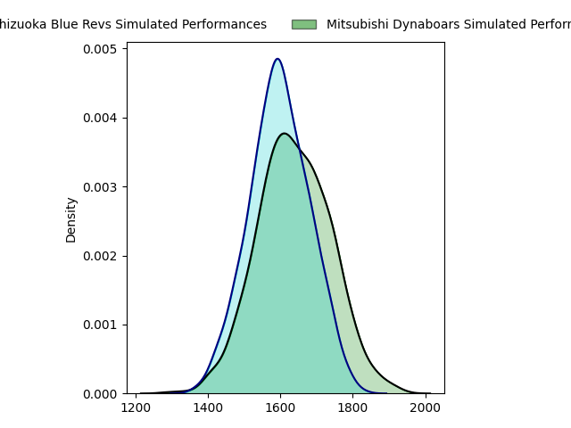
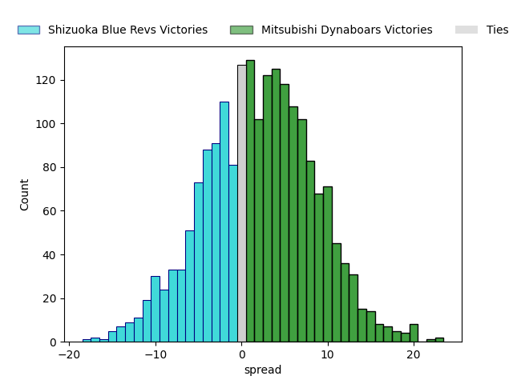
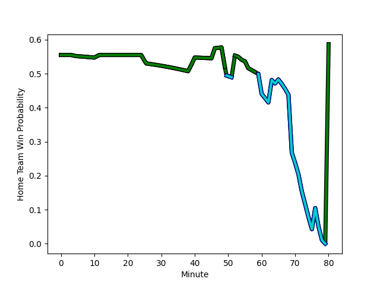

---  
layout: page  
title: Shizuoka Blue Revs at Mitsubishi Dynaboars; 27-27  
date: 2023-01-22 06:00:00 18:00:00 -0500  
categories: match review  
---
# Shizuoka Blue Revs at Mitsubishi Dynaboars; 27-27

# Club Level Predictions

The first set of predictions treats a club as the smallest object, as the club develops its members, organizes a gameplan, and deploys its players as needed for each match. This club model has a prediction of 0.563, which translates to predicting Mitsubishi Dynaboars to win by 2.3.

Each club has a rating and a rating deviation (simiar to a Glicko system), and expected performances can be generated. This allows for simulated matches and spreads like the ones below.
## Projected Performances

## Projected Spreads

# Player Level Predictions

Treating teams instead as an entity made up of the currently active players, I have ratings for each player in an altogether different system. These can be combined to form team ratings once teamsheets are announced, weighting starters a bit higher than the reserves. After the match is played, players can be weighted by their minutes on the field, allowing for an accurate measure of the team's composition. With these compiled team ratings, we can make predictions, measure inaccuracy, and update the individual player ratings.
## Prediction with Player Minutes: Mitsubishi Dynaboars by 13.6

Mitsubishi Dynaboars by 9.6 on a neutral field
## Scores over Time

## Win Probability over Time

## Prediction without Player Minutes: Mitsubishi Dynaboars by 11.5

Mitsubishi Dynaboars by 7.5 on a neutral pitch

|   Away Minutes | Away Player                                                         |   Away elo |   Away Percentile |   Number |   Home Percentile |   Home elo | Home Player                                                                 |   Home Minutes |
|---------------:|:--------------------------------------------------------------------|-----------:|------------------:|---------:|------------------:|-----------:|:----------------------------------------------------------------------------|---------------:|
|             65 | [Kazuhiro Kawata](..//playerfiles//KazuhiroKawata_cleaned.md)       |      92.32 |                38 |        1 |                75 |     103.36 | [Naoki Kawamata](..//playerfiles//NaokiKawamata_cleaned.md)                 |             60 |
|             72 | [Takeshi Hino](..//playerfiles//TakeshiHino_cleaned.md)             |      98.28 |                58 |        2 |                18 |      84.54 | [Yuki Miyazato](..//playerfiles//YukiMiyazato_cleaned.md)                   |             52 |
|             65 | [Heiichiro Ito](..//playerfiles//HeiichiroIto_cleaned.md)           |      97.8  |                57 |        3 |                41 |      93.04 | [Jun Morimoto](..//playerfiles//JunMorimoto_cleaned.md)                     |             52 |
|             80 | [Yuya Odo](..//playerfiles//YuyaOdo_cleaned.md)                     |     109.39 |                80 |        4 |                51 |      95.85 | [Daniel Linde](..//playerfiles//DanielLinde_cleaned.md)                     |             80 |
|             60 | [Eishin Kuwano](..//playerfiles//EishinKuwano_cleaned.md)           |     102.33 |                66 |        5 |                76 |     106.74 | [Walt Steenkamp](..//playerfiles//WaltSteenkamp_cleaned.md)                 |             56 |
|             80 | [Riki Sugihara](..//playerfiles//RikiSugihara_cleaned.md)           |      84.85 |                19 |        6 |                95 |     128.85 | [Masataka Tsuruya](..//playerfiles//MasatakaTsuruya_cleaned.md)             |             80 |
|             69 | [Richard Goh Jones](..//playerfiles//RichardGohJones_cleaned.md)    |      84.05 |                18 |        7 |                45 |      93.97 | [Yusuke Sakamoto](..//playerfiles//YusukeSakamoto_cleaned.md)               |             80 |
|             80 | [Kwagga Smith](..//playerfiles//KwaggaSmith_cleaned.md)             |     124.22 |                92 |        8 |                82 |     112.09 | [Jackson Hemopo](..//playerfiles//JacksonHemopo_cleaned.md)                 |             80 |
|             80 | [Bryn Hall](..//playerfiles//BrynHall_cleaned.md)                   |     120.73 |                94 |        9 |                94 |     121.62 | [Kota Iwamura](..//playerfiles//KotaIwamura_cleaned.md)                     |             80 |
|             80 | [Sho Kiyohara](..//playerfiles//ShoKiyohara_cleaned.md)             |      62.62 |                 3 |       10 |                83 |     114.8  | [James Shillcock](..//playerfiles//JamesShillcock_cleaned.md)               |             80 |
|             80 | [Malo Tuitama](..//playerfiles//MaloTuitama_cleaned.md)             |     105.11 |                71 |       11 |                74 |     106.15 | [Honeti Taumoha'apai](..//playerfiles//HonetiTaumoha'apai_cleaned.md)       |             54 |
|             80 | [Viliami Tahitu'a](..//playerfiles//ViliamiTahitu'a_cleaned.md)     |      88.79 |                31 |       12 |                 5 |      70.69 | [Brackin Karauria-Henry](..//playerfiles//BrackinKarauria-Henry_cleaned.md) |             80 |
|             72 | [Hiroto Kobayashi](..//playerfiles//HirotoKobayashi_cleaned.md)     |     108.32 |                77 |       13 |                60 |      99.69 | [Matt Vaega](..//playerfiles//MattVaega_cleaned.md)                         |             72 |
|             80 | [Tomokazu Kira](..//playerfiles//TomokazuKira_cleaned.md)           |      87.08 |                24 |       14 |                58 |      98.57 | [Tomoyuki Ochiai](..//playerfiles//TomoyukiOchiai_cleaned.md)               |             80 |
|             80 | [Futo Yamaguchi](..//playerfiles//FutoYamaguchi_cleaned.md)         |      95    |               nan |       15 |                62 |     102.14 | [Roland Alaiasa](..//playerfiles//RolandAlaiasa_cleaned.md)                 |             80 |
|             20 | [Samuela Anise](..//playerfiles//SamuelaAnise_cleaned.md)           |      76.98 |                12 |       16 |                89 |     115.32 | [Yoshimitsu Yasue](..//playerfiles//YoshimitsuYasue_cleaned.md)             |             28 |
|             15 | [Shintaro Okamoto](..//playerfiles//ShintaroOkamoto_cleaned.md)     |      90.97 |               nan |       17 |                99 |     149.8  | [Tomoaki Ishii](..//playerfiles//TomoakiIshii_cleaned.md)                   |             28 |
|             15 | [Sohei Nishimura](..//playerfiles//SoheiNishimura_cleaned.md)       |      68.94 |                 2 |       18 |                23 |      86.37 | [Heiden Bedwell-Curtis](..//playerfiles//HeidenBedwell-Curtis_cleaned.md)   |             24 |
|             11 | [Ryosuke Funahashi](..//playerfiles//RyosukeFunahashi_cleaned.md)   |     124.85 |                94 |       19 |                59 |     100.25 | [Kazuki Ishida](..//playerfiles//KazukiIshida_cleaned.md)                   |             26 |
|              8 | [Kenta Shikao](..//playerfiles//KentaShikao_cleaned.md)             |     127.75 |                96 |       20 |                53 |      96.41 | [Shunsuke Sakamoto](..//playerfiles//ShunsukeSakamoto_cleaned.md)           |             20 |
|              8 | [Richmond Tongatama](..//playerfiles//RichmondTongatama_cleaned.md) |      93.75 |               nan |       21 |                26 |      87.27 | [Curtis Rona](..//playerfiles//CurtisRona_cleaned.md)                       |              8 |

