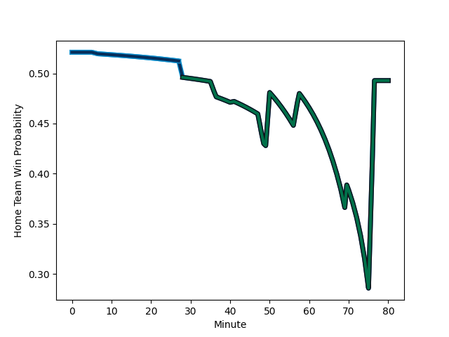

---  
layout: page  
title: London Irish at Montpellier Herault; 21-21  
date: 2023-01-22 14:00:00 18:00:00 -0500  
categories: match review  
---
# London Irish (1560.56) at Montpellier Herault (1597.36); 21-21

# Prediction: Montpellier Herault by 7.7

Montpellier Herault by 3.7 on a neutral field
## Scores over Time

## Win Probability over Time

# Pre-Match Prediction: Montpellier Herault by 8.0

Montpellier Herault by 4.0 on a neutral pitch

|   Away Minutes | Away Player                                                                       |   Away elo |   Away Percentile |   Number |   Home Percentile |   Home elo | Home Player                                                                         |   Home Minutes |
|---------------:|:----------------------------------------------------------------------------------|-----------:|------------------:|---------:|------------------:|-----------:|:------------------------------------------------------------------------------------|---------------:|
|             70 | [Danilo Fischetti](..//playerfiles//DaniloFischetti_cleaned.md)                   |      88.84 |                25 |        1 |                89 |     116.43 | [Simon-Pierre Chauvac](..//playerfiles//Simon-PierreChauvac_cleaned.md)             |             50 |
|             49 | [Agustin Creevy](..//playerfiles//AgustinCreevy_cleaned.md)                       |     122.86 |                95 |        2 |                55 |      97.17 | [Brandon Paenga-Amosa](..//playerfiles//BrandonPaenga-Amosa_cleaned.md)             |             41 |
|             28 | [Lovejoy Chawatama](..//playerfiles//LovejoyChawatama_cleaned.md)                 |      86.91 |                22 |        3 |                18 |      84.68 | [Mohamed Haouas](..//playerfiles//MohamedHaouas_cleaned.md)                         |             50 |
|             80 | [Rob Simmons](..//playerfiles//RobSimmons_cleaned.md)                             |     129.96 |                96 |        4 |                97 |     130.31 | [Bastien Chalureau](..//playerfiles//BastienChalureau_cleaned.md)                   |             50 |
|             70 | [Adam Coleman](..//playerfiles//AdamColeman_cleaned.md)                           |     141.33 |                98 |        5 |                98 |     137.39 | [Paul Willemse](..//playerfiles//PaulWillemse_cleaned.md)                           |             80 |
|             80 | [Josh Basham](..//playerfiles//JoshBasham_cleaned.md)                             |     101.19 |                67 |        6 |                93 |     125.08 | [Nicolaas Janse van Rensburg](..//playerfiles//NicolaasJansevanRensburg_cleaned.md) |             64 |
|             80 | [Juan Martin Gonzalez](..//playerfiles//JuanMartinGonzalez_cleaned.md)            |     103.51 |                70 |        7 |                92 |     121.1  | [Yacouba Camara](..//playerfiles//YacoubaCamara_cleaned.md)                         |             80 |
|             69 | [Chandler Cunningham-South](..//playerfiles//ChandlerCunningham-South_cleaned.md) |      92.81 |                51 |        8 |                60 |     101.59 | [Zach Mercer](..//playerfiles//ZachMercer_cleaned.md)                               |             80 |
|             73 | [Joe Powell](..//playerfiles//JoePowell_cleaned.md)                               |      85.07 |                18 |        9 |                70 |     103.44 | [Léo Coly](..//playerfiles//LéoColy_cleaned.md)                                     |             50 |
|             80 | [Paddy Jackson](..//playerfiles//PaddyJackson_cleaned.md)                         |     130.94 |                94 |       10 |                57 |     100.17 | [Louis Carbonel](..//playerfiles//LouisCarbonel_cleaned.md)                         |             80 |
|             80 | [Ollie Hassell-Collins](..//playerfiles//OllieHassell-Collins_cleaned.md)         |      85.97 |                21 |       11 |                95 |     128.31 | [Vincent Rattez](..//playerfiles//VincentRattez_cleaned.md)                         |             80 |
|             80 | [Rory Jennings](..//playerfiles//RoryJennings_cleaned.md)                         |      96.71 |                48 |       12 |                95 |     128.89 | [Geoffrey Doumayrou](..//playerfiles//GeoffreyDoumayrou_cleaned.md)                 |             28 |
|             70 | [Luca Morisi](..//playerfiles//LucaMorisi_cleaned.md)                             |     103.38 |                67 |       13 |                20 |      84.3  | [Thomas Darmon](..//playerfiles//ThomasDarmon_cleaned.md)                           |             80 |
|             56 | [Michael Dykes](..//playerfiles//MichaelDykes_cleaned.md)                         |      93.93 |               nan |       14 |                14 |      79.95 | [Gabriel Ngandebe](..//playerfiles//GabrielNgandebe_cleaned.md)                     |             80 |
|             80 | [Lucio Cinti](..//playerfiles//LucioCinti_cleaned.md)                             |      95.06 |                46 |       15 |                66 |     104.43 | [Anthony Bouthier](..//playerfiles//AnthonyBouthier_cleaned.md)                     |             80 |
|             52 | [Oli Hoskins](..//playerfiles//OliHoskins_cleaned.md)                             |     108.59 |                84 |       16 |                29 |      87.12 | [Pierre Lucas](..//playerfiles//PierreLucas_cleaned.md)                             |             52 |
|             31 | [Mike Willemse](..//playerfiles//MikeWillemse_cleaned.md)                         |      84.75 |                19 |       17 |                53 |      96.78 | [Elliott Stooke](..//playerfiles//ElliottStooke_cleaned.md)                         |             30 |
|             24 | [James Stokes](..//playerfiles//JamesStokes_cleaned.md)                           |      99.51 |                57 |       18 |                71 |     103.49 | [Cobus Reinach](..//playerfiles//CobusReinach_cleaned.md)                           |             30 |
|             10 | [Eddie Poolman](..//playerfiles//EddiePoolman_cleaned.md)                         |      95    |               nan |       19 |                42 |      93.34 | [Titi Lamositele](..//playerfiles//TitiLamositele_cleaned.md)                       |             30 |
|             10 | [Facundo Gigena](..//playerfiles//FacundoGigena_cleaned.md)                       |      89.54 |                30 |       20 |                62 |      99.2  | [Enzo Forletta](..//playerfiles//EnzoForletta_cleaned.md)                           |             30 |
|              7 | [Caolan Englefield](..//playerfiles//CaolanEnglefield_cleaned.md)                 |     104.79 |                69 |       21 |                19 |      84.78 | [Clément Doumenc](..//playerfiles//ClémentDoumenc_cleaned.md)                       |             16 |
|             10 | [Chunya Munga](..//playerfiles//ChunyaMunga_cleaned.md)                           |     117.72 |                91 |       22 |                80 |     107.62 | [Vincent Giudicelli](..//playerfiles//VincentGiudicelli_cleaned.md)                 |             39 |
|             11 | [Ben Donnell](..//playerfiles//BenDonnell_cleaned.md)                             |     116.72 |                89 |       23 |               nan |     nan    | nan                                                                                 |            nan |

