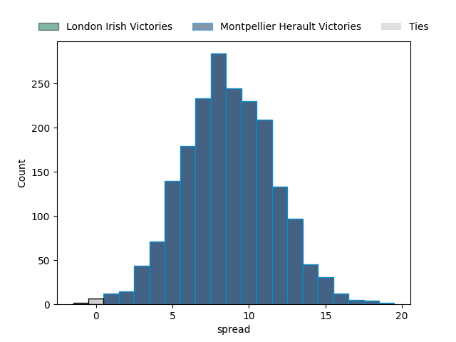
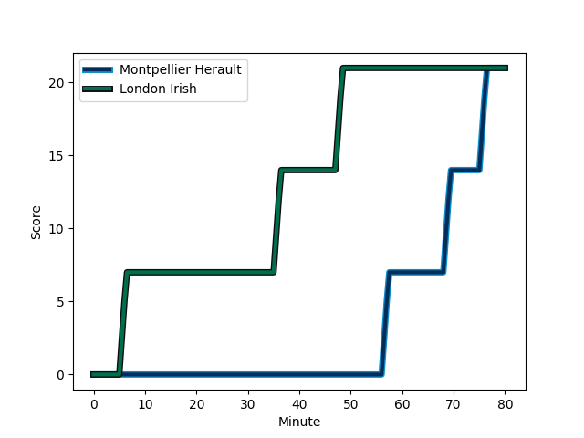
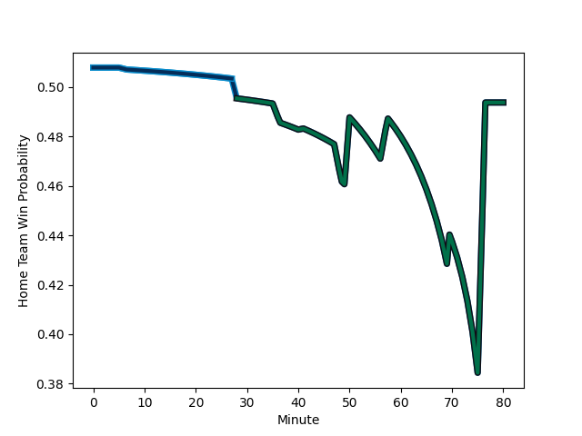

---  
layout: page  
title: London Irish at Montpellier Herault; 21-21  
date: 2023-01-22 14:00:00 18:00:00 -0500  
categories: match review  
---
# London Irish at Montpellier Herault; 21-21

# Club Level Predictions

The first set of predictions treats a club as the smallest object, as the club develops its members, organizes a gameplan, and deploys its players as needed for each match. This club model has a prediction of 0.727, which translates to predicting Montpellier Herault to win by 8.6.

Each club has a rating and a rating deviation (simiar to a Glicko system), and expected performances can be generated. This allows for simulated matches and spreads like the ones below.
## Projected Performances

## Projected Spreads

## Projected Results

# Player Level Predictions

Treating teams instead as an entity made up of the currently active players, I have ratings for each player in an altogether different system. These can be combined to form team ratings once teamsheets are announced, weighting starters a bit higher than the reserves. After the match is played, players can be weighted by their minutes on the field, allowing for an accurate measure of the team's composition. With these compiled team ratings, we can make predictions, measure inaccuracy, and update the individual player ratings.
## Prediction with Player Minutes: Montpellier Herault by 5.4

Montpellier Herault by 1.4 on a neutral field
## Scores over Time

## Win Probability over Time

## Prediction without Player Minutes: Montpellier Herault by 5.8

Montpellier Herault by 1.8 on a neutral pitch

|   Away Minutes | Away Player                                                                       |   Away elo |   Away Percentile |   Number |   Home Percentile |   Home elo | Home Player                                                                         |   Home Minutes |
|---------------:|:----------------------------------------------------------------------------------|-----------:|------------------:|---------:|------------------:|-----------:|:------------------------------------------------------------------------------------|---------------:|
|             70 | [Danilo Fischetti](..//playerfiles//DaniloFischetti_cleaned.md)                   |      89.18 |                25 |        1 |                89 |     116.43 | [Simon-Pierre Chauvac](..//playerfiles//Simon-PierreChauvac_cleaned.md)             |             50 |
|             49 | [Agustin Creevy](..//playerfiles//AgustinCreevy_cleaned.md)                       |     122.86 |                95 |        2 |                55 |      97.17 | [Brandon Paenga-Amosa](..//playerfiles//BrandonPaenga-Amosa_cleaned.md)             |             41 |
|             28 | [Lovejoy Chawatama](..//playerfiles//LovejoyChawatama_cleaned.md)                 |      89.68 |                30 |        3 |                18 |      84.68 | [Mohamed Haouas](..//playerfiles//MohamedHaouas_cleaned.md)                         |             50 |
|             80 | [Rob Simmons](..//playerfiles//RobSimmons_cleaned.md)                             |     130.94 |                97 |        4 |                96 |     130.31 | [Bastien Chalureau](..//playerfiles//BastienChalureau_cleaned.md)                   |             50 |
|             70 | [Adam Coleman](..//playerfiles//AdamColeman_cleaned.md)                           |     141.33 |                98 |        5 |                98 |     137.39 | [Paul Willemse](..//playerfiles//PaulWillemse_cleaned.md)                           |             80 |
|             80 | [Josh Basham](..//playerfiles//JoshBasham_cleaned.md)                             |     105.15 |                76 |        6 |                94 |     125.08 | [Nicolaas Janse van Rensburg](..//playerfiles//NicolaasJansevanRensburg_cleaned.md) |             64 |
|             80 | [Juan Martin Gonzalez](..//playerfiles//JuanMartinGonzalez_cleaned.md)            |     103.55 |                70 |        7 |                92 |     121.1  | [Yacouba Camara](..//playerfiles//YacoubaCamara_cleaned.md)                         |             80 |
|             69 | [Chandler Cunningham-South](..//playerfiles//ChandlerCunningham-South_cleaned.md) |      94.83 |                51 |        8 |                60 |     101.59 | [Zach Mercer](..//playerfiles//ZachMercer_cleaned.md)                               |             80 |
|             73 | [Joe Powell](..//playerfiles//JoePowell_cleaned.md)                               |      85.32 |                18 |        9 |                70 |     103.44 | [Léo Coly](..//playerfiles//LéoColy_cleaned.md)                                     |             50 |
|             80 | [Paddy Jackson](..//playerfiles//PaddyJackson_cleaned.md)                         |     130.94 |                94 |       10 |                57 |     100.17 | [Louis Carbonel](..//playerfiles//LouisCarbonel_cleaned.md)                         |             80 |
|             80 | [Ollie Hassell-Collins](..//playerfiles//OllieHassell-Collins_cleaned.md)         |      91.53 |                38 |       11 |                95 |     128.31 | [Vincent Rattez](..//playerfiles//VincentRattez_cleaned.md)                         |             80 |
|             80 | [Rory Jennings](..//playerfiles//RoryJennings_cleaned.md)                         |     102.26 |                63 |       12 |                95 |     128.89 | [Geoffrey Doumayrou](..//playerfiles//GeoffreyDoumayrou_cleaned.md)                 |             28 |
|             70 | [Luca Morisi](..//playerfiles//LucaMorisi_cleaned.md)                             |     104.36 |                70 |       13 |                21 |      84.3  | [Thomas Darmon](..//playerfiles//ThomasDarmon_cleaned.md)                           |             80 |
|             56 | [Michael Dykes](..//playerfiles//MichaelDykes_cleaned.md)                         |      93.79 |               nan |       14 |                14 |      79.95 | [Gabriel Ngandebe](..//playerfiles//GabrielNgandebe_cleaned.md)                     |             80 |
|             80 | [Lucio Cinti](..//playerfiles//LucioCinti_cleaned.md)                             |      96.02 |                49 |       15 |                66 |     104.43 | [Anthony Bouthier](..//playerfiles//AnthonyBouthier_cleaned.md)                     |             80 |
|             52 | [Oli Hoskins](..//playerfiles//OliHoskins_cleaned.md)                             |     109.16 |                84 |       16 |                29 |      87.12 | [Pierre Lucas](..//playerfiles//PierreLucas_cleaned.md)                             |             52 |
|             31 | [Mike Willemse](..//playerfiles//MikeWillemse_cleaned.md)                         |      87.68 |                26 |       17 |                54 |      96.78 | [Elliott Stooke](..//playerfiles//ElliottStooke_cleaned.md)                         |             30 |
|             24 | [James Stokes](..//playerfiles//JamesStokes_cleaned.md)                           |      99.67 |                57 |       18 |                71 |     103.49 | [Cobus Reinach](..//playerfiles//CobusReinach_cleaned.md)                           |             30 |
|             10 | [Eddie Poolman](..//playerfiles//EddiePoolman_cleaned.md)                         |      95    |               nan |       19 |                42 |      93.34 | [Titi Lamositele](..//playerfiles//TitiLamositele_cleaned.md)                       |             30 |
|             10 | [Facundo Gigena](..//playerfiles//FacundoGigena_cleaned.md)                       |      89.54 |                30 |       20 |                62 |      99.2  | [Enzo Forletta](..//playerfiles//EnzoForletta_cleaned.md)                           |             30 |
|              7 | [Caolan Englefield](..//playerfiles//CaolanEnglefield_cleaned.md)                 |     104.79 |                69 |       21 |                19 |      84.78 | [Clément Doumenc](..//playerfiles//ClémentDoumenc_cleaned.md)                       |             16 |
|             10 | [Chunya Munga](..//playerfiles//ChunyaMunga_cleaned.md)                           |     122.95 |                94 |       22 |                80 |     107.62 | [Vincent Giudicelli](..//playerfiles//VincentGiudicelli_cleaned.md)                 |             39 |
|             11 | [Ben Donnell](..//playerfiles//BenDonnell_cleaned.md)                             |     116.72 |                89 |       23 |               nan |     nan    | nan                                                                                 |            nan |

