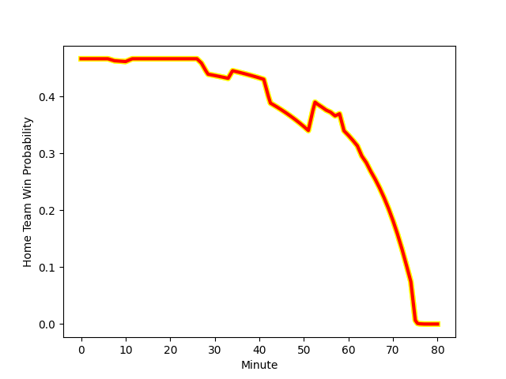

---  
layout: page  
title: Kyuden Voltex at Skyactivs Hiroshima; 38-14  
date: 2023-01-22 00:00:00 18:00:00 -0500  
categories: match review  
---
# Kyuden Voltex (1373.13) at Skyactivs Hiroshima (1315.19); 38-14

# Prediction: Kyuden Voltex by 1.8

Kyuden Voltex by 5.8 on a neutral field
## Scores over Time

## Win Probability over Time

# Pre-Match Prediction: Kyuden Voltex by 4.7

Kyuden Voltex by 8.7 on a neutral pitch

|   Away Minutes | Away Player                                                                 |   Away elo |   Away Percentile |   Number |   Home Percentile |   Home elo | Home Player                                                         |   Home Minutes |
|---------------:|:----------------------------------------------------------------------------|-----------:|------------------:|---------:|------------------:|-----------:|:--------------------------------------------------------------------|---------------:|
|             56 | [Samuel Nozomu Faialaga](..//playerfiles//SamuelNozomuFaialaga_cleaned.md)  |      98.46 |                59 |        1 |                85 |     109.58 | [Tomonori Koyanagi](..//playerfiles//TomonoriKoyanagi_cleaned.md)   |             58 |
|             59 | [Daigo Asato](..//playerfiles//DaigoAsato_cleaned.md)                       |      87.18 |                24 |        2 |                11 |      80.13 | [Tomohiro Takeda](..//playerfiles//TomohiroTakeda_cleaned.md)       |             63 |
|             59 | [Shinpei Kamata](..//playerfiles//ShinpeiKamata_cleaned.md)                 |      96.33 |                53 |        3 |                 6 |      75.46 | [Tomoya Otake](..//playerfiles//TomoyaOtake_cleaned.md)             |             58 |
|             56 | [Tomotaka Ishimatsu](..//playerfiles//TomotakaIshimatsu_cleaned.md)         |      97.51 |                55 |        4 |                53 |      96.89 | [Kaiha Noda](..//playerfiles//KaihaNoda_cleaned.md)                 |             73 |
|             80 | [Tom Rowe](..//playerfiles//TomRowe_cleaned.md)                             |      82.36 |                16 |        5 |                 8 |      75.06 | [Lachlan Osborne](..//playerfiles//LachlanOsborne_cleaned.md)       |             53 |
|             80 | [Yuuki Yamada](..//playerfiles//YuukiYamada_cleaned.md)                     |      95.88 |                49 |        6 |                35 |      92.54 | [Rame Sato](..//playerfiles//RameSato_cleaned.md)                   |             80 |
|             80 | [Colby Fainga'a](..//playerfiles//ColbyFainga'a_cleaned.md)                 |      79.92 |                12 |        7 |                86 |     113.87 | [Tevin Ferris](..//playerfiles//TevinFerris_cleaned.md)             |             80 |
|             73 | [Walker Alex Takuya](..//playerfiles//WalkerAlexTakuya_cleaned.md)          |      89.64 |                32 |        8 |                12 |      79.59 | [Iori Suzuki](..//playerfiles//IoriSuzuki_cleaned.md)               |             80 |
|             56 | [Shunta Takenouchi](..//playerfiles//ShuntaTakenouchi_cleaned.md)           |      88.04 |                26 |        9 |                47 |      95.46 | [Rikuto Nakashima](..//playerfiles//RikutoNakashima_cleaned.md)     |             80 |
|             34 | [Phil Burleigh](..//playerfiles//PhilBurleigh_cleaned.md)                   |     117.61 |                86 |       10 |                 1 |      58.81 | [Ginjiro Sakiguchi](..//playerfiles//GinjiroSakiguchi_cleaned.md)   |             76 |
|             59 | [Naoki Takaya](..//playerfiles//NaokiTakaya_cleaned.md)                     |      90.31 |                32 |       11 |                67 |     102.01 | [Tevita Tai](..//playerfiles//TevitaTai_cleaned.md)                 |             80 |
|             80 | [Noriaki Nakazuru](..//playerfiles//NoriakiNakazuru_cleaned.md)             |      71.31 |                 6 |       12 |               nan |      95    | [Ren Ouchi](..//playerfiles//RenOuchi_cleaned.md)                   |             80 |
|             80 | [Sam Vaka](..//playerfiles//SamVaka_cleaned.md)                             |      99.85 |                60 |       13 |                 1 |      59.55 | [Shuhei Lee](..//playerfiles//ShuheiLee_cleaned.md)                 |             58 |
|             80 | [Yasunari Isoda](..//playerfiles//YasunariIsoda_cleaned.md)                 |      88.47 |                28 |       14 |                52 |      97.08 | [Haruki Kitajima](..//playerfiles//HarukiKitajima_cleaned.md)       |             80 |
|             80 | [Yusuke Aramaki](..//playerfiles//YusukeAramaki_cleaned.md)                 |      96.78 |                49 |       15 |                12 |      82.64 | [Kotaro Tatsuno](..//playerfiles//KotaroTatsuno_cleaned.md)         |             65 |
|             46 | [Shinhichiro Matsushita](..//playerfiles//ShinhichiroMatsushita_cleaned.md) |      87.26 |                26 |       16 |                 5 |      73.48 | [Isi Manu](..//playerfiles//IsiManu_cleaned.md)                     |             27 |
|             24 | [Kazuto Tokunaga](..//playerfiles//KazutoTokunaga_cleaned.md)               |     116.31 |                94 |       17 |               nan |      76.84 | [Koshiro Shigenobu](..//playerfiles//KoshiroShigenobu_cleaned.md)   |             22 |
|             24 | [Ray Tatafu](..//playerfiles//RayTatafu_cleaned.md)                         |      72.51 |                 6 |       18 |               nan |      95.55 | [Yuji Takahashi](..//playerfiles//YujiTakahashi_cleaned.md)         |             22 |
|             24 | [Daisuke Kodama](..//playerfiles//DaisukeKodama_cleaned.md)                 |      90.39 |                40 |       19 |                40 |      94.63 | [Seigo Kubo](..//playerfiles//SeigoKubo_cleaned.md)                 |             22 |
|             21 | [Kazuma Ono](..//playerfiles//KazumaOno_cleaned.md)                         |      98.6  |                61 |       20 |                 0 |      63.27 | [Yusuke Kitobayashi](..//playerfiles//YusukeKitobayashi_cleaned.md) |             17 |
|             21 | [Genki Nakamura](..//playerfiles//GenkiNakamura_cleaned.md)                 |      87.71 |               nan |       21 |                 7 |      76.21 | [Ryoutarou Saito](..//playerfiles//RyoutarouSaito_cleaned.md)       |             15 |
|             21 | [Akihito Yamada](..//playerfiles//AkihitoYamada_cleaned.md)                 |     134.98 |               nan |       22 |                46 |      94.58 | [Yutaro Tanaka](..//playerfiles//YutaroTanaka_cleaned.md)           |              7 |
|              7 | [Wataru Obara](..//playerfiles//WataruObara_cleaned.md)                     |      88.54 |               nan |       23 |               nan |      76.16 | [Yuki Mori](..//playerfiles//YukiMori_cleaned.md)                   |              4 |

