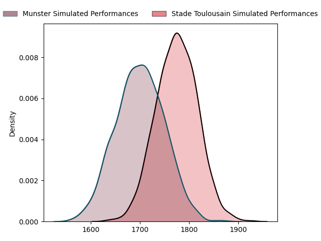
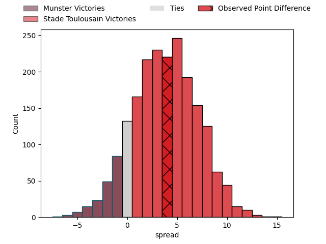
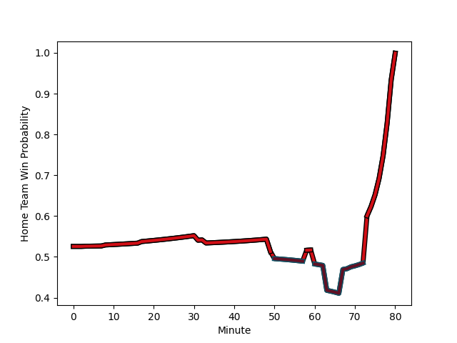

---  
layout: page  
title: Munster at Stade Toulousain; 16-20  
date: 2023-01-22 16:15:00 18:00:00 -0500  
categories: match review  
---
# Munster at Stade Toulousain; 16-20

# Club Level Predictions

The first set of predictions treats a club as the smallest object, as the club develops its members, organizes a gameplan, and deploys its players as needed for each match. This club model has a prediction of 0.607, which translates to predicting Stade Toulousain to win by 3.8.

Each club has a rating and a rating deviation (simiar to a Glicko system), and expected performances can be generated. This allows for simulated matches and spreads like the ones below.
## Projected Performances

## Projected Spreads

# Player Level Predictions

Treating teams instead as an entity made up of the currently active players, I have ratings for each player in an altogether different system. These can be combined to form team ratings once teamsheets are announced, weighting starters a bit higher than the reserves. After the match is played, players can be weighted by their minutes on the field, allowing for an accurate measure of the team's composition. With these compiled team ratings, we can make predictions, measure inaccuracy, and update the individual player ratings.
## Prediction with Player Minutes: Stade Toulousain by 8.4

Stade Toulousain by 4.4 on a neutral field
## Scores over Time

## Win Probability over Time

## Prediction without Player Minutes: Stade Toulousain by 6.6

Stade Toulousain by 2.6 on a neutral pitch

|   Away Minutes | Away Player                                                   |   Away elo |   Away Percentile |   Number |   Home Percentile |   Home elo | Home Player                                                             |   Home Minutes |
|---------------:|:--------------------------------------------------------------|-----------:|------------------:|---------:|------------------:|-----------:|:------------------------------------------------------------------------|---------------:|
|             60 | [Dave Kilcoyne](..//playerfiles//DaveKilcoyne_cleaned.md)     |     130    |                98 |        1 |                86 |     110.9  | [Cyril Baille](..//playerfiles//CyrilBaille_cleaned.md)                 |             50 |
|             58 | [Niall Scannell](..//playerfiles//NiallScannell_cleaned.md)   |     111.01 |                85 |        2 |                79 |     106.89 | [Julien Marchand](..//playerfiles//JulienMarchand_cleaned.md)           |             75 |
|             58 | [John Ryan](..//playerfiles//JohnRyan_cleaned.md)             |      97.36 |                57 |        3 |                77 |     104.63 | [Dorian Aldegheri](..//playerfiles//DorianAldegheri_cleaned.md)         |             63 |
|             80 | [Jean Kleyn](..//playerfiles//JeanKleyn_cleaned.md)           |      94.96 |                48 |        4 |                57 |      98.34 | [Richie Arnold](..//playerfiles//RichieArnold_cleaned.md)               |             69 |
|             80 | [Tadhg Beirne](..//playerfiles//TadhgBeirne_cleaned.md)       |     124.96 |                94 |        5 |                76 |     106.61 | [Emmanuel Meafou](..//playerfiles//EmmanuelMeafou_cleaned.md)           |             60 |
|             80 | [Peter O'Mahony](..//playerfiles//PeterO'Mahony_cleaned.md)   |      78.8  |                10 |        6 |                37 |      91.34 | [Anthony Jelonch](..//playerfiles//AnthonyJelonch_cleaned.md)           |             80 |
|             63 | [John Hodnett](..//playerfiles//JohnHodnett_cleaned.md)       |      99.41 |                63 |        7 |                96 |     129.69 | [Jack Willis](..//playerfiles//JackWillis_cleaned.md)                   |             80 |
|             80 | [Gavin Coombes](..//playerfiles//GavinCoombes_cleaned.md)     |     109.66 |                78 |        8 |                98 |     142.14 | [Alexandre Roumat](..//playerfiles//AlexandreRoumat_cleaned.md)         |             80 |
|             60 | [Craig Casey](..//playerfiles//CraigCasey_cleaned.md)         |     106.6  |                77 |        9 |                89 |     115.13 | [Antoine Dupont](..//playerfiles//AntoineDupont_cleaned.md)             |             80 |
|             50 | [Joey Carbery](..//playerfiles//JoeyCarbery_cleaned.md)       |     102.38 |                64 |       10 |                83 |     114.09 | [Romain Ntamack](..//playerfiles//RomainNtamack_cleaned.md)             |             80 |
|             80 | [Shane Daly](..//playerfiles//ShaneDaly_cleaned.md)           |     123.29 |                92 |       11 |                83 |     111.93 | [Dimitri Delibes](..//playerfiles//DimitriDelibes_cleaned.md)           |             80 |
|             80 | [Jack Crowley](..//playerfiles//JackCrowley_cleaned.md)       |     109.98 |                79 |       12 |                44 |      93.49 | [Pita Ahki](..//playerfiles//PitaAhki_cleaned.md)                       |             67 |
|             80 | [Antoine Frisch](..//playerfiles//AntoineFrisch_cleaned.md)   |      97.6  |                54 |       13 |                57 |      98.69 | [Pierre-Louis Barassi](..//playerfiles//Pierre-LouisBarassi_cleaned.md) |             80 |
|             80 | [Calvin Nash](..//playerfiles//CalvinNash_cleaned.md)         |     124.97 |                93 |       14 |                72 |     104.79 | [Juan Cruz Mallia](..//playerfiles//JuanCruzMallia_cleaned.md)          |             80 |
|             26 | [Mike Haley](..//playerfiles//MikeHaley_cleaned.md)           |      86.7  |                28 |       15 |                94 |     131.26 | [Melvyn Jaminet](..//playerfiles//MelvynJaminet_cleaned.md)             |             80 |
|             20 | [Josh Wycherley](..//playerfiles//JoshWycherley_cleaned.md)   |      83.85 |                20 |       16 |                33 |      93.4  | [Rodrigue Neti](..//playerfiles//RodrigueNeti_cleaned.md)               |             30 |
|             22 | [Diarmuid Barron](..//playerfiles//DiarmuidBarron_cleaned.md) |     120.41 |                93 |       17 |                19 |      86.8  | [Guillaume Cramont](..//playerfiles//GuillaumeCramont_cleaned.md)       |              5 |
|             22 | [Roman Salanoa](..//playerfiles//RomanSalanoa_cleaned.md)     |     101.31 |                68 |       18 |                71 |     105.04 | [Joshua Brennan](..//playerfiles//JoshuaBrennan_cleaned.md)             |             11 |
|             17 | [Alex Kendellen](..//playerfiles//AlexKendellen_cleaned.md)   |     103.61 |                68 |       19 |                72 |     101.66 | [David Ainu'u](..//playerfiles//DavidAinu'u_cleaned.md)                 |             17 |
|             20 | [Conor Murray](..//playerfiles//ConorMurray_cleaned.md)       |     137.62 |                99 |       20 |                99 |     155.83 | [Francois Cros](..//playerfiles//FrancoisCros_cleaned.md)               |             20 |
|             30 | [Ben Healy](..//playerfiles//BenHealy_cleaned.md)             |      95.21 |                45 |       21 |                72 |     104.33 | [Ange Capuozzo](..//playerfiles//AngeCapuozzo_cleaned.md)               |             13 |
|             54 | [Malakai Fekitoa](..//playerfiles//MalakaiFekitoa_cleaned.md) |     125.73 |                94 |       22 |               nan |     nan    | nan                                                                     |            nan |

