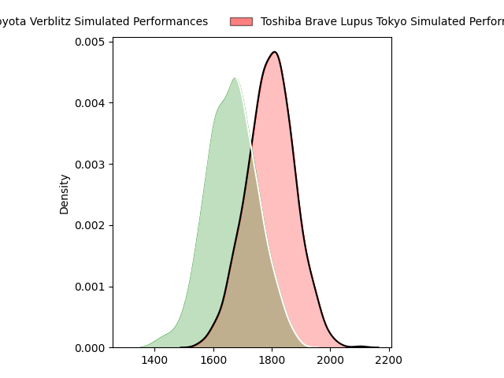
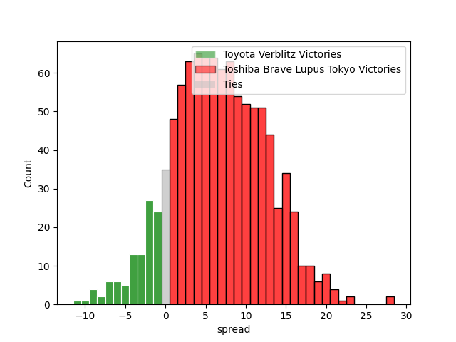
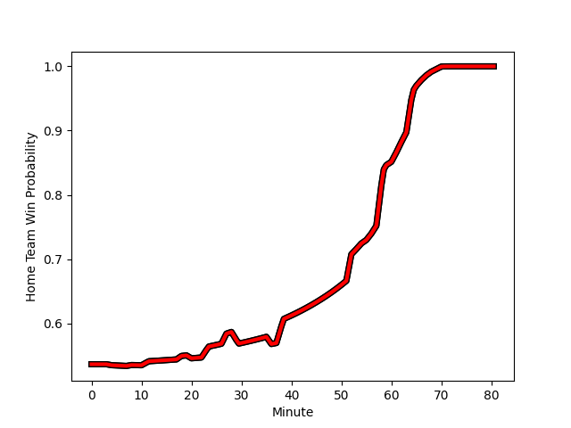

---  
layout: page  
title: Toyota Verblitz at Toshiba Brave Lupus Tokyo; 25-63  
date: 2023-01-22 06:00:00 18:00:00 -0500  
categories: match review  
---
# Toyota Verblitz at Toshiba Brave Lupus Tokyo; 25-63

# Club Level Predictions

The first set of predictions treats a club as the smallest object, as the club develops its members, organizes a gameplan, and deploys its players as needed for each match. This club model has a prediction of 0.679, which translates to predicting Toshiba Brave Lupus Tokyo to win by 6.7.

Each club has a rating and a rating deviation (simiar to a Glicko system), and expected performances can be generated. This allows for simulated matches and spreads like the ones below.
## Projected Performances

## Projected Spreads

# Player Level Predictions

Treating teams instead as an entity made up of the currently active players, I have ratings for each player in an altogether different system. These can be combined to form team ratings once teamsheets are announced, weighting starters a bit higher than the reserves. After the match is played, players can be weighted by their minutes on the field, allowing for an accurate measure of the team's composition. With these compiled team ratings, we can make predictions, measure inaccuracy, and update the individual player ratings.
## Prediction with Player Minutes: Toshiba Brave Lupus Tokyo by 10.4

Toshiba Brave Lupus Tokyo by 6.4 on a neutral field
## Scores over Time

## Win Probability over Time

## Prediction without Player Minutes: Toshiba Brave Lupus Tokyo by 10.0

Toshiba Brave Lupus Tokyo by 6.0 on a neutral pitch

|   Away Minutes | Away Player                                                                            |   Away elo |   Away Percentile |   Number |   Home Percentile |   Home elo | Home Player                                                         |   Home Minutes |
|---------------:|:---------------------------------------------------------------------------------------|-----------:|------------------:|---------:|------------------:|-----------:|:--------------------------------------------------------------------|---------------:|
|             77 | [Shogo Miura](..//playerfiles//ShogoMiura_cleaned.md)                                  |      99.3  |                62 |        1 |                81 |     106.02 | [Masataka Mikami](..//playerfiles//MasatakaMikami_cleaned.md)       |             55 |
|             52 | [Ryusei Kato](..//playerfiles//RyuseiKato_cleaned.md)                                  |      88.13 |                36 |        2 |                15 |      83.55 | [Daigo Hashimoto](..//playerfiles//DaigoHashimoto_cleaned.md)       |             65 |
|             52 | [Yusuke Kizu](..//playerfiles//YusukeKizu_cleaned.md)                                  |     104.87 |                78 |        3 |                72 |     102.33 | [Yuta Kokaji](..//playerfiles//YutaKokaji_cleaned.md)               |             65 |
|             80 | [Daichi Akiyama](..//playerfiles//DaichiAkiyama_cleaned.md)                            |      89.76 |                32 |        4 |                62 |     100.21 | [Warner Dearns](..//playerfiles//WarnerDearns_cleaned.md)           |             80 |
|             80 | [Michael Allardice](..//playerfiles//MichaelAllardice_cleaned.md)                      |     103    |                68 |        5 |                93 |     121.57 | [Jacob Pierce](..//playerfiles//JacobPierce_cleaned.md)             |             71 |
|             80 | [Pieter-Steph du Toit](..//playerfiles//Pieter-StephduToit_cleaned.md)                 |      85.66 |                21 |        6 |                48 |      95.7  | [Yoshitaka Tokunaga](..//playerfiles//YoshitakaTokunaga_cleaned.md) |             80 |
|             52 | [Kyo Yoshida](..//playerfiles//KyoYoshida_cleaned.md)                                  |     116.99 |                91 |        7 |                99 |     148.03 | [Matt Todd](..//playerfiles//MattTodd_cleaned.md)                   |             80 |
|             60 | [Lautaimi Fetuani](..//playerfiles//LautaimiFetuani_cleaned.md)                        |      99.7  |                55 |        8 |                93 |     125.21 | [Michael Leitch](..//playerfiles//MichaelLeitch_cleaned.md)         |             60 |
|             67 | [Kenta Fukuda](..//playerfiles//KentaFukuda_cleaned.md)                                |      96.39 |                49 |        9 |                54 |      97.61 | [Takahiro Ogawa](..//playerfiles//TakahiroOgawa_cleaned.md)         |             57 |
|             60 | [Masahiro Kitamura](..//playerfiles//MasahiroKitamura_cleaned.md)                      |      95    |               nan |       10 |                61 |     101.73 | [Tom Taylor](..//playerfiles//TomTaylor_cleaned.md)                 |             80 |
|             80 | [Viliame Tuidraki](..//playerfiles//ViliameTuidraki_cleaned.md)                        |      93.21 |               nan |       11 |                51 |      96.85 | [Masaki Hamada](..//playerfiles//MasakiHamada_cleaned.md)           |             80 |
|             72 | [Rob Thompson](..//playerfiles//RobThompson_cleaned.md)                                |     129.49 |                95 |       12 |                57 |      98.51 | [Nicholas McCurran](..//playerfiles//NicholasMcCurran_cleaned.md)   |             80 |
|             80 | [Vatiliai Tuidraki](..//playerfiles//VatiliaiTuidraki_cleaned.md)                      |      97.06 |                53 |       13 |                85 |     113.89 | [Seta Tamanivalu](..//playerfiles//SetaTamanivalu_cleaned.md)       |             62 |
|             80 | [Taichi Takahashi](..//playerfiles//TaichiTakahashi_cleaned.md)                        |      86.63 |                22 |       14 |                48 |      95.67 | [Jone Naikabula](..//playerfiles//JoneNaikabula_cleaned.md)         |             80 |
|             80 | [Willie le Roux](..//playerfiles//WillieleRoux_cleaned.md)                             |     134.06 |                95 |       15 |                50 |      97.19 | [Takuro Matsunaga](..//playerfiles//TakuroMatsunaga_cleaned.md)     |             65 |
|             28 | [Yoshikatsu Hikosaka](..//playerfiles//YoshikatsuHikosaka_cleaned.md)                  |     111.4  |                86 |       16 |                57 |      97.94 | [Sena Kimura](..//playerfiles//SenaKimura_cleaned.md)               |             25 |
|             28 | [Shunsuke Asaoka](..//playerfiles//ShunsukeAsaoka_cleaned.md)                          |      96.34 |                55 |       17 |                65 |     101.43 | [Yuhei Sugiyama](..//playerfiles//YuheiSugiyama_cleaned.md)         |             23 |
|             28 | [Will Tupou](..//playerfiles//WillTupou_cleaned.md)                                    |      86.97 |                23 |       18 |               nan |      94.91 | [Takeshi Sasaki](..//playerfiles//TakeshiSasaki_cleaned.md)         |             20 |
|             20 | [Masato Furukawa](..//playerfiles//MasatoFurukawa_cleaned.md)                          |      94.17 |                54 |       19 |                89 |     117.45 | [Burger Odendaal](..//playerfiles//BurgerOdendaal_cleaned.md)       |             18 |
|             20 | [Ryang Jong Chu](..//playerfiles//RyangJongChu_cleaned.md)                             |      97.19 |               nan |       20 |                66 |     104.64 | [Shohei Toyoshima](..//playerfiles//ShoheiToyoshima_cleaned.md)     |             15 |
|             13 | [Shuhei Yamaguchi](..//playerfiles//ShuheiYamaguchi_cleaned.md)                        |      95    |               nan |       21 |                54 |      94.46 | [Mamoru Harada](..//playerfiles//MamoruHarada_cleaned.md)           |             15 |
|              8 | [Jone Turaganivalu Nabetelevu](..//playerfiles//JoneTuraganivaluNabetelevu_cleaned.md) |      86.92 |                28 |       22 |               nan |      95.16 | [Latu Taufa](..//playerfiles//LatuTaufa_cleaned.md)                 |             15 |
|              3 | [Runya Choi](..//playerfiles//RunyaChoi_cleaned.md)                                    |      95    |               nan |       23 |                 6 |      70.48 | [Kyosuke Kajikawa](..//playerfiles//KyosukeKajikawa_cleaned.md)     |              9 |

