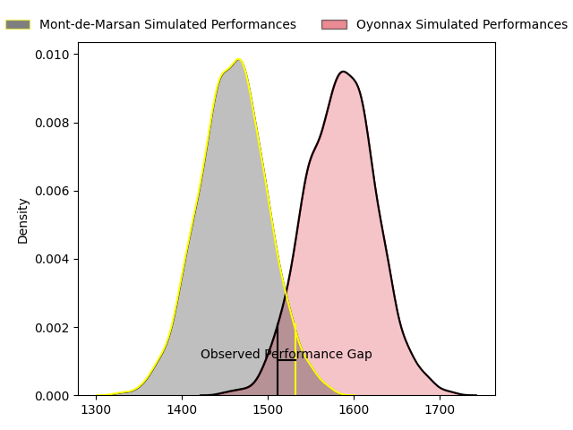
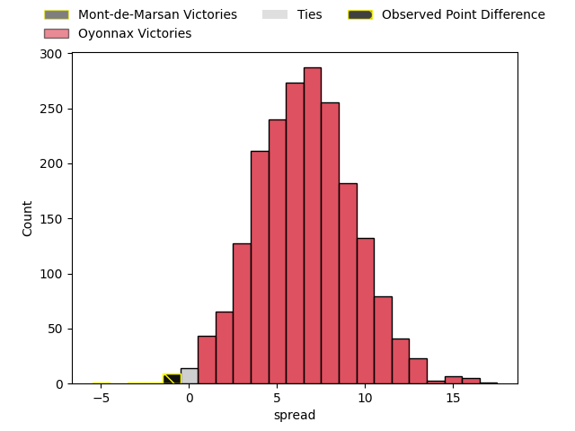
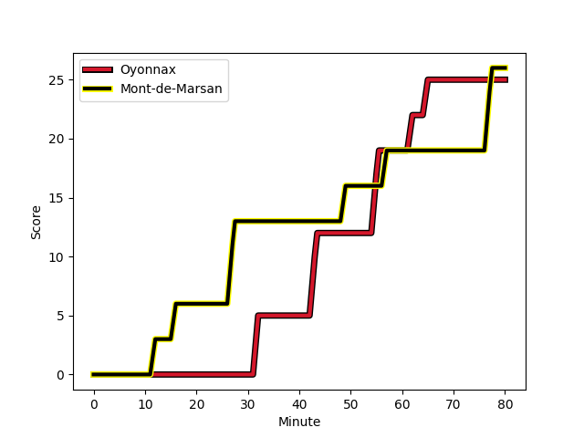
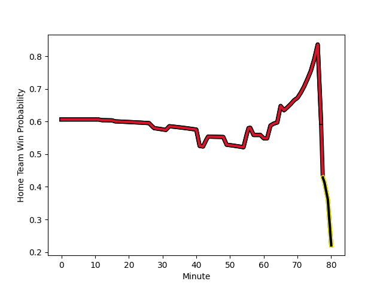

---  
layout: page  
title: Mont-de-Marsan at Oyonnax; 26-25  
date: 2023-01-26 21:00:00 18:00:00 -0500  
categories: match review  
---
# Mont-de-Marsan at Oyonnax; 26-25

# Club Level Predictions

The first set of predictions treats a club as the smallest object, as the club develops its members, organizes a gameplan, and deploys its players as needed for each match. This club model has a prediction of 0.673, which translates to predicting Oyonnax to win by 6.3.

Each club has a rating and a rating deviation (simiar to a Glicko system), and expected performances can be generated. This allows for simulated matches and spreads like the ones below.
## Projected Performances

## Projected Spreads

# Player Level Predictions

Treating teams instead as an entity made up of the currently active players, I have ratings for each player in an altogether different system. These can be combined to form team ratings once teamsheets are announced, weighting starters a bit higher than the reserves. After the match is played, players can be weighted by their minutes on the field, allowing for an accurate measure of the team's composition. With these compiled team ratings, we can make predictions, measure inaccuracy, and update the individual player ratings.
## Prediction with Player Minutes: Oyonnax by 27.2

Oyonnax by 23.2 on a neutral field
## Scores over Time

## Win Probability over Time

## Prediction without Player Minutes: Oyonnax by 27.3

Oyonnax by 23.3 on a neutral pitch

|   Away Minutes | Away Player                                                                      |   Away elo |   Away Percentile |   Number |   Home Percentile |   Home elo | Home Player                                                           |   Home Minutes |
|---------------:|:---------------------------------------------------------------------------------|-----------:|------------------:|---------:|------------------:|-----------:|:----------------------------------------------------------------------|---------------:|
|             41 | [Jean-Luc Innocente](..//playerfiles//Jean-LucInnocente_cleaned.md)              |      64.25 |                 1 |        1 |                11 |      80.29 | [Tommy Raynaud](..//playerfiles//TommyRaynaud_cleaned.md)             |             74 |
|             41 | [Simon Labouyrie](..//playerfiles//SimonLabouyrie_cleaned.md)                    |      76.89 |                 7 |        2 |                69 |     101.82 | [Benjamin Geledan](..//playerfiles//BenjaminGeledan_cleaned.md)       |             49 |
|             41 | [Lasha Macharashvili](..//playerfiles//LashaMacharashvili_cleaned.md)            |      79.95 |                10 |        3 |                81 |     106.7  | [Thomas Laclayat](..//playerfiles//ThomasLaclayat_cleaned.md)         |             74 |
|             80 | [Romain Durand](..//playerfiles//RomainDurand_cleaned.md)                        |     109.65 |                80 |        4 |                97 |     133.89 | [Tom Murday](..//playerfiles//TomMurday_cleaned.md)                   |             66 |
|             41 | [Andrei Ostrikov](..//playerfiles//AndreiOstrikov_cleaned.md)                    |      87.44 |                27 |        5 |                71 |     104.19 | [Hugo Fabregue](..//playerfiles//HugoFabregue_cleaned.md)             |             80 |
|             41 | [Yann Brethous](..//playerfiles//YannBrethous_cleaned.md)                        |     105.39 |                74 |        6 |                95 |     128.46 | [Wandrille Picault](..//playerfiles//WandrillePicault_cleaned.md)     |             49 |
|             80 | [Léo Banos](..//playerfiles//LéoBanos_cleaned.md)                                |      81.53 |                15 |        7 |                76 |     108.6  | [Loïc Credoz](..//playerfiles//LoïcCredoz_cleaned.md)                 |             57 |
|             63 | [Veresa Tuqovu Ramototabua](..//playerfiles//VeresaTuqovuRamototabua_cleaned.md) |     108.71 |                79 |        8 |                97 |     133.51 | [Rory Grice](..//playerfiles//RoryGrice_cleaned.md)                   |             80 |
|             70 | [Christophe Loustalot](..//playerfiles//ChristopheLoustalot_cleaned.md)          |      69.62 |                 4 |        9 |               nan |      87.06 | [Ilan El Khattabi](..//playerfiles//IlanElKhattabi_cleaned.md)        |             80 |
|             80 | [Joris Pialot](..//playerfiles//JorisPialot_cleaned.md)                          |      94.84 |                40 |       10 |                83 |     114.18 | [Jules Soulan](..//playerfiles//JulesSoulan_cleaned.md)               |             80 |
|             60 | [Julien Cabannes](..//playerfiles//JulienCabannes_cleaned.md)                    |     113.73 |                85 |       11 |                94 |     128    | [Aurelien Callandret](..//playerfiles//AurelienCallandret_cleaned.md) |             80 |
|             80 | [Jules Even](..//playerfiles//JulesEven_cleaned.md)                              |      67.15 |                 3 |       12 |                 7 |      74.71 | [Gaby Lovobalavu](..//playerfiles//GabyLovobalavu_cleaned.md)         |             80 |
|             80 | [Simon Renda](..//playerfiles//SimonRenda_cleaned.md)                            |     105.25 |                72 |       13 |                78 |     108.85 | [Theo Millet](..//playerfiles//TheoMillet_cleaned.md)                 |             80 |
|             80 | [Pierre Sayerse](..//playerfiles//PierreSayerse_cleaned.md)                      |      90.9  |                35 |       14 |                87 |     116.21 | [Joe Ravouvou](..//playerfiles//JoeRavouvou_cleaned.md)               |             57 |
|             80 | [Alexandre de Nardi](..//playerfiles//AlexandredeNardi_cleaned.md)               |      88.52 |                28 |       15 |                78 |     110.49 | [Darren Sweetnam](..//playerfiles//DarrenSweetnam_cleaned.md)         |             80 |
|             39 | [Thibault Tauleigne](..//playerfiles//ThibaultTauleigne_cleaned.md)              |      93.82 |                40 |       16 |                45 |      91.8  | [Manu Leiataua](..//playerfiles//ManuLeiataua_cleaned.md)             |             31 |
|             39 | [Aurélien Lisena](..//playerfiles//AurélienLisena_cleaned.md)                    |     110.08 |                73 |       17 |                92 |     123.34 | [Filimo Taofifenua](..//playerfiles//FilimoTaofifenua_cleaned.md)     |             31 |
|             39 | [Max Curie](..//playerfiles//MaxCurie_cleaned.md)                                |      98.1  |                58 |       18 |               100 |     155.39 | [Luke Hamilton](..//playerfiles//LukeHamilton_cleaned.md)             |             23 |
|             39 | [Anthony Alves](..//playerfiles//AnthonyAlves_cleaned.md)                        |     117.39 |                93 |       19 |                62 |     103.27 | [Justin Bouraux](..//playerfiles//JustinBouraux_cleaned.md)           |             23 |
|             39 | [Vincent Dolier](..//playerfiles//VincentDolier_cleaned.md)                      |      95    |               nan |       20 |                28 |      87.98 | [Victor Lebas](..//playerfiles//VictorLebas_cleaned.md)               |             14 |
|             20 | [Yoann Laousse Azpiazu](..//playerfiles//YoannLaousseAzpiazu_cleaned.md)         |     140.26 |                97 |       21 |                30 |      92.78 | [Antoine Abraham](..//playerfiles//AntoineAbraham_cleaned.md)         |              6 |
|             17 | [Raphaël Robic](..//playerfiles//RaphaëlRobic_cleaned.md)                        |     101.67 |                61 |       22 |                53 |      96.16 | [Thibault Berthaud](..//playerfiles//ThibaultBerthaud_cleaned.md)     |              6 |
|             10 | [Baptiste Canut](..//playerfiles//BaptisteCanut_cleaned.md)                      |      94.52 |                44 |       23 |               nan |     nan    | nan                                                                   |            nan |

