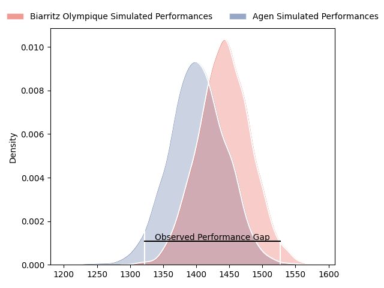
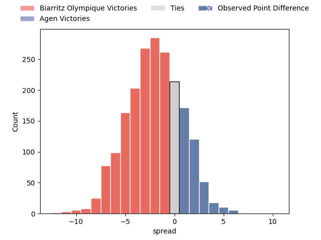
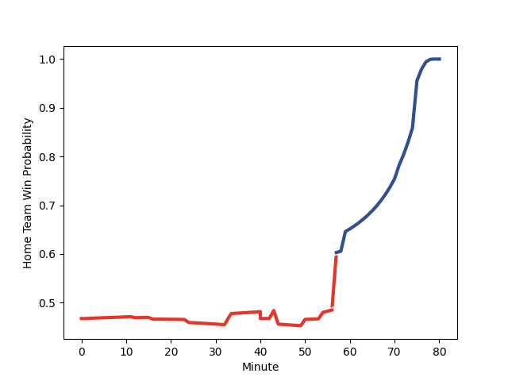

---  
layout: page  
title: Biarritz Olympique at Agen; 17-27  
date: 2023-01-27 21:00:00 18:00:00 -0500  
categories: match review  
---
# Biarritz Olympique at Agen; 17-27

# Club Level Predictions

The first set of predictions treats a club as the smallest object, as the club develops its members, organizes a gameplan, and deploys its players as needed for each match. This club model has a prediction of 0.491, which translates to predicting Biarritz Olympique to win by 0.3.

Each club has a rating and a rating deviation (simiar to a Glicko system), and expected performances can be generated. This allows for simulated matches and spreads like the ones below.
## Projected Performances

## Projected Spreads

## Projected Results

# Player Level Predictions

Treating teams instead as an entity made up of the currently active players, I have ratings for each player in an altogether different system. These can be combined to form team ratings once teamsheets are announced, weighting starters a bit higher than the reserves. After the match is played, players can be weighted by their minutes on the field, allowing for an accurate measure of the team's composition. With these compiled team ratings, we can make predictions, measure inaccuracy, and update the individual player ratings.
## Prediction with Player Minutes: Biarritz Olympique by 1.7

Biarritz Olympique by 5.7 on a neutral field
## Scores over Time

## Win Probability over Time

## Prediction without Player Minutes: Biarritz Olympique by 1.4

Biarritz Olympique by 5.4 on a neutral pitch

|   Away Minutes | Away Player                                                                    |   Away elo |   Away Percentile |   Number |   Home Percentile |   Home elo | Home Player                                                             |   Home Minutes |
|---------------:|:-------------------------------------------------------------------------------|-----------:|------------------:|---------:|------------------:|-----------:|:------------------------------------------------------------------------|---------------:|
|             75 | [Baptiste Erdocio](..//playerfiles//BaptisteErdocio_cleaned.md)                |      99.38 |                60 |        1 |                20 |      86.09 | [Hans Lombard-Buret](..//playerfiles//HansLombard-Buret_cleaned.md)     |             71 |
|             71 | [Thomas Sauveterre](..//playerfiles//ThomasSauveterre_cleaned.md)              |     113.07 |                88 |        2 |                63 |      99.86 | [Clement Martinez](..//playerfiles//ClementMartinez_cleaned.md)         |             54 |
|             57 | [Quentin Samaran](..//playerfiles//QuentinSamaran_cleaned.md)                  |      87.59 |                24 |        3 |                44 |      94.53 | [Alex Burin](..//playerfiles//AlexBurin_cleaned.md)                     |             65 |
|             57 | [Adrian Motoc](..//playerfiles//AdrianMotoc_cleaned.md)                        |      95.72 |                50 |        4 |                63 |     100.8  | [Evan Olmstead](..//playerfiles//EvanOlmstead_cleaned.md)               |             54 |
|             57 | [Josh Tyrell](..//playerfiles//JoshTyrell_cleaned.md)                          |     103.21 |                69 |        5 |                61 |      99.93 | [William Demotte](..//playerfiles//WilliamDemotte_cleaned.md)           |             54 |
|             80 | [Dave O'Callaghan](..//playerfiles//DaveO'Callaghan_cleaned.md)                |      83.86 |                18 |        6 |                85 |     114.93 | [Fotu Lokotui](..//playerfiles//FotuLokotui_cleaned.md)                 |             50 |
|             80 | [Thomas Hebert](..//playerfiles//ThomasHebert_cleaned.md)                      |     108.08 |                78 |        7 |                90 |     120.02 | [Antoine Erbani](..//playerfiles//AntoineErbani_cleaned.md)             |             80 |
|             65 | [Elliot Dixon](..//playerfiles//ElliotDixon_cleaned.md)                        |     108.8  |                75 |        8 |                49 |      97.44 | [Martin Devergie](..//playerfiles//MartinDevergie_cleaned.md)           |             80 |
|             65 | [Barnabe Couilloud](..//playerfiles//BarnabeCouilloud_cleaned.md)              |      89.54 |                34 |        9 |                33 |      90.22 | [Tane Takulua](..//playerfiles//TaneTakulua_cleaned.md)                 |             77 |
|             80 | [Baptiste Germain](..//playerfiles//BaptisteGermain_cleaned.md)                |      94.01 |                42 |       10 |                83 |     115.82 | [Thomas Vincent](..//playerfiles//ThomasVincent_cleaned.md)             |             80 |
|             80 | [Steeve Barry](..//playerfiles//SteeveBarry_cleaned.md)                        |     117.93 |                89 |       11 |                77 |     108.39 | [Iban Etcheverry](..//playerfiles//IbanEtcheverry_cleaned.md)           |             80 |
|             80 | [Auguste Cadot](..//playerfiles//AugusteCadot_cleaned.md)                      |     112.39 |                82 |       12 |                60 |     100.13 | [Kolinio Ramoka](..//playerfiles//KolinioRamoka_cleaned.md)             |             80 |
|             80 | [Ilian Perraux](..//playerfiles//IlianPerraux_cleaned.md)                      |     116.36 |                86 |       13 |                20 |      83.68 | [Clement Garrigues](..//playerfiles//ClementGarrigues_cleaned.md)       |             80 |
|             57 | [Henry Speight](..//playerfiles//HenrySpeight_cleaned.md)                      |     135.48 |                97 |       14 |                45 |      94.79 | [Tevita Railevu](..//playerfiles//TevitaRailevu_cleaned.md)             |             80 |
|             80 | [Joe Jonas](..//playerfiles//JoeJonas_cleaned.md)                              |     109.01 |                74 |       15 |                59 |     100.54 | [Jean-Marcelin Buttin](..//playerfiles//Jean-MarcelinButtin_cleaned.md) |             50 |
|             23 | [Johnny Dyer](..//playerfiles//JohnnyDyer_cleaned.md)                          |      83.18 |                17 |       16 |                85 |     115.5  | [Elton Jantjies](..//playerfiles//EltonJantjies_cleaned.md)             |             30 |
|             23 | [Nafi Ma'afu](..//playerfiles//NafiMa'afu_cleaned.md)                          |     100.22 |               nan |       17 |               nan |      95.73 | [Beau Farrance](..//playerfiles//BeauFarrance_cleaned.md)               |             26 |
|             23 | [Luka Azariashvili](..//playerfiles//LukaAzariashvili_cleaned.md)              |      79.42 |                10 |       18 |                 6 |      71.29 | [Joe Maksymiw](..//playerfiles//JoeMaksymiw_cleaned.md)                 |             26 |
|             23 | [Baptiste Fariscot](..//playerfiles//BaptisteFariscot_cleaned.md)              |      99.73 |                60 |       19 |                57 |      97.5  | [Mike Sosene-Feagai](..//playerfiles//MikeSosene-Feagai_cleaned.md)     |             26 |
|             15 | [Temo Matiu](..//playerfiles//TemoMatiu_cleaned.md)                            |     106.46 |                77 |       20 |                71 |     103.12 | [Malik Hamadache](..//playerfiles//MalikHamadache_cleaned.md)           |             15 |
|             15 | [Kerman Aurrekoetxea](..//playerfiles//KermanAurrekoetxea_cleaned.md)          |      81.52 |                15 |       21 |                48 |      93.33 | [Richard Barrington](..//playerfiles//RichardBarrington_cleaned.md)     |              9 |
|              9 | [Leo Carella](..//playerfiles//LeoCarella_cleaned.md)                          |      95.75 |               nan |       22 |                17 |      79.64 | [Theo Idjellidaine](..//playerfiles//TheoIdjellidaine_cleaned.md)       |              3 |
|              5 | [Zhorzhi (Jorji) Saldadze](..//playerfiles//Zhorzhi(Jorji)Saldadze_cleaned.md) |      82.73 |                16 |       23 |               nan |      95    | [Valentin Gayraud](..//playerfiles//ValentinGayraud_cleaned.md)         |             30 |

