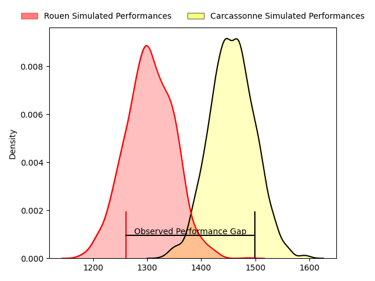
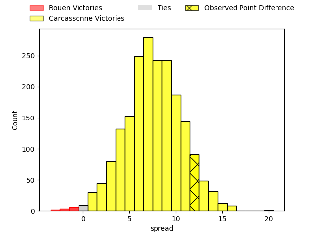

---  
layout: page  
title: Rouen at Carcassonne; 3-15  
date: 2023-01-27 19:30:00 18:00:00 -0500  
categories: match review  
---
# Rouen at Carcassonne; 3-15

# Club Level Predictions

The first set of predictions treats a club as the smallest object, as the club develops its members, organizes a gameplan, and deploys its players as needed for each match. This club model has a prediction of 0.705, which translates to predicting Carcassonne to win by 7.6.

Each club has a rating and a rating deviation (simiar to a Glicko system), and expected performances can be generated. This allows for simulated matches and spreads like the ones below.
## Projected Performances

## Projected Spreads

# Player Level Predictions

Treating teams instead as an entity made up of the currently active players, I have ratings for each player in an altogether different system. These can be combined to form team ratings once teamsheets are announced, weighting starters a bit higher than the reserves. After the match is played, players can be weighted by their minutes on the field, allowing for an accurate measure of the team's composition. With these compiled team ratings, we can make predictions, measure inaccuracy, and update the individual player ratings.
## Prediction with Player Minutes: Carcassonne by 10.6

Carcassonne by 6.6 on a neutral field
## Scores over Time

## Win Probability over Time

## Prediction without Player Minutes: Carcassonne by 12.5

Carcassonne by 8.5 on a neutral pitch

|   Away Minutes | Away Player                                                             |   Away elo |   Away Percentile |   Number |   Home Percentile |   Home elo | Home Player                                                              |   Home Minutes |
|---------------:|:------------------------------------------------------------------------|-----------:|------------------:|---------:|------------------:|-----------:|:-------------------------------------------------------------------------|---------------:|
|             32 | [Antoine Fournier](..//playerfiles//AntoineFournier_cleaned.md)         |      79.29 |                 6 |        1 |                 8 |      77.35 | [Jules Martinez](..//playerfiles//JulesMartinez_cleaned.md)              |             45 |
|             65 | [Jean-Étienne Lesueur](..//playerfiles//Jean-ÉtienneLesueur_cleaned.md) |      81.31 |                18 |        2 |                58 |      98.33 | [Luka Petriashvili](..//playerfiles//LukaPetriashvili_cleaned.md)        |             45 |
|             32 | [Cody Thomas](..//playerfiles//CodyThomas_cleaned.md)                   |     103.66 |                78 |        3 |                 0 |      53.74 | [Vakhtangi Akhobadze](..//playerfiles//VakhtangiAkhobadze_cleaned.md)    |             45 |
|             80 | [John-Charles Astle](..//playerfiles//John-CharlesAstle_cleaned.md)     |      52.13 |                 0 |        4 |                48 |      95.22 | [Come Clayver Joussain](..//playerfiles//ComeClayverJoussain_cleaned.md) |             45 |
|             80 | [Toby Salmon](..//playerfiles//TobySalmon_cleaned.md)                   |     108.39 |                79 |        5 |                56 |      97.88 | [Rynard Landman](..//playerfiles//RynardLandman_cleaned.md)              |             61 |
|             47 | [Jean Leleu](..//playerfiles//JeanLeleu_cleaned.md)                     |     104.15 |                66 |        6 |                40 |      94.18 | [Pierre Reynaud](..//playerfiles//PierreReynaud_cleaned.md)              |             80 |
|             80 | [Fabien Vincent](..//playerfiles//FabienVincent_cleaned.md)             |     105.03 |                73 |        7 |                77 |     107.19 | [Rob Harley](..//playerfiles//RobHarley_cleaned.md)                      |             80 |
|             80 | [Abdelkarim Fofana](..//playerfiles//AbdelkarimFofana_cleaned.md)       |      74.2  |                 6 |        8 |                85 |     113.04 | [Aaron Carroll](..//playerfiles//AaronCarroll_cleaned.md)                |             80 |
|             61 | [Florent Campeggia](..//playerfiles//FlorentCampeggia_cleaned.md)       |      74.98 |                 7 |        9 |                98 |     134.4  | [Samuel Marques](..//playerfiles//SamuelMarques_cleaned.md)              |             80 |
|             80 | [Franck Pourteau](..//playerfiles//FranckPourteau_cleaned.md)           |      97.91 |                51 |       10 |                39 |      93.09 | [Chris Hilsenbeck](..//playerfiles//ChrisHilsenbeck_cleaned.md)          |             61 |
|             80 | [Benito Masilevu](..//playerfiles//BenitoMasilevu_cleaned.md)           |     113.31 |                85 |       11 |                61 |      99.89 | [Clément Clavières](..//playerfiles//ClémentClavières_cleaned.md)        |             80 |
|             80 | [Taylor Gontineac](..//playerfiles//TaylorGontineac_cleaned.md)         |      90.81 |                36 |       12 |                65 |     102.08 | [Nick Grigg](..//playerfiles//NickGrigg_cleaned.md)                      |             80 |
|             80 | [JT Jackson](..//playerfiles//JTJackson_cleaned.md)                     |      89.81 |                33 |       13 |                 1 |      58.12 | [Pierre Aguillon](..//playerfiles//PierreAguillon_cleaned.md)            |             74 |
|             65 | [Malcolm Bertschy](..//playerfiles//MalcolmBertschy_cleaned.md)         |      97.28 |                52 |       14 |                93 |     123.75 | [Benoit Jasmin](..//playerfiles//BenoitJasmin_cleaned.md)                |             80 |
|             80 | [Paul Surano](..//playerfiles//PaulSurano_cleaned.md)                   |      91.68 |                38 |       15 |                25 |      85.45 | [Maxime Gianet](..//playerfiles//MaximeGianet_cleaned.md)                |             45 |
|             48 | [Ewan Clément](..//playerfiles//EwanClément_cleaned.md)                 |      95    |               nan |       16 |                28 |      91.57 | [Sami Mavinga](..//playerfiles//SamiMavinga_cleaned.md)                  |             35 |
|             15 | [Lucas Poisson](..//playerfiles//LucasPoisson_cleaned.md)               |      95    |               nan |       17 |                20 |      88.06 | [Raphael Carbou](..//playerfiles//RaphaelCarbou_cleaned.md)              |             35 |
|             48 | [Hugo Ndiaye](..//playerfiles//HugoNdiaye_cleaned.md)                   |     108.14 |                83 |       18 |                19 |      85.45 | [Soso Bekoshvili](..//playerfiles//SosoBekoshvili_cleaned.md)            |             35 |
|             33 | [Samuel Maximin](..//playerfiles//SamuelMaximin_cleaned.md)             |      65.09 |                 1 |       19 |                 3 |      62.59 | [Romain Manchia](..//playerfiles//RomainManchia_cleaned.md)              |             35 |
|             19 | [Theo Nanette](..//playerfiles//TheoNanette_cleaned.md)                 |      66.23 |                 2 |       20 |                 1 |      62.79 | [Stephane Onambele](..//playerfiles//StephaneOnambele_cleaned.md)        |             19 |
|             15 | [Marius Marty](..//playerfiles//MariusMarty_cleaned.md)                 |      76.13 |                10 |       21 |                23 |      86.36 | [Damien Añon](..//playerfiles//DamienAñon_cleaned.md)                    |             19 |
|            nan | nan                                                                     |     nan    |               nan |       22 |                 0 |      48.07 | [Jordan Puletua](..//playerfiles//JordanPuletua_cleaned.md)              |              6 |
|            nan | nan                                                                     |     nan    |               nan |       23 |                16 |      82.26 | [Baptiste Mouchous](..//playerfiles//BaptisteMouchous_cleaned.md)        |             35 |

