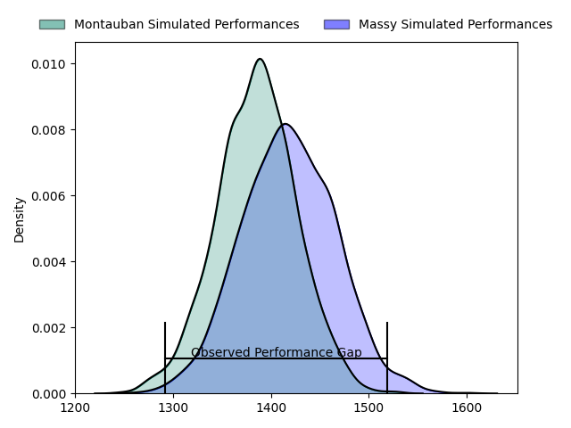
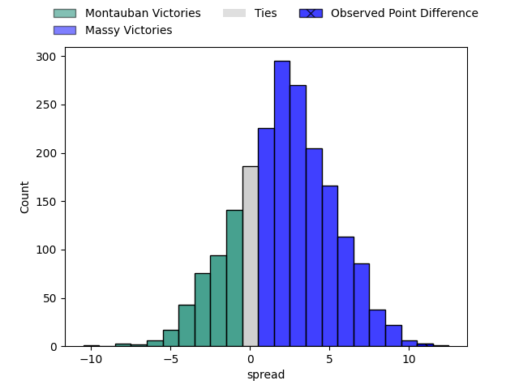
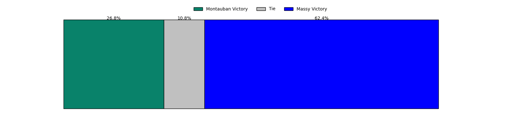
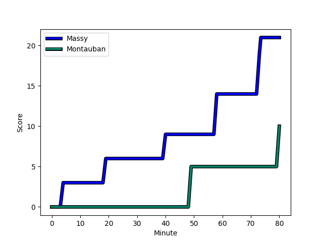
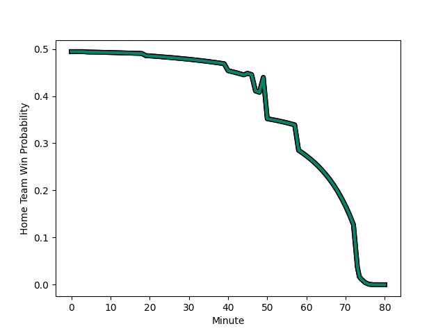

---  
layout: page  
title: Montauban at Massy; 10-21  
date: 2023-01-27 19:30:00 18:00:00 -0500  
categories: match review  
---
# Montauban at Massy; 10-21

# Club Level Predictions

The first set of predictions treats a club as the smallest object, as the club develops its members, organizes a gameplan, and deploys its players as needed for each match. This club model has a prediction of 0.545, which translates to predicting Massy to win by 1.6.

Each club has a rating and a rating deviation (simiar to a Glicko system), and expected performances can be generated. This allows for simulated matches and spreads like the ones below.
## Projected Performances

## Projected Spreads

## Projected Results

# Player Level Predictions

Treating teams instead as an entity made up of the currently active players, I have ratings for each player in an altogether different system. These can be combined to form team ratings once teamsheets are announced, weighting starters a bit higher than the reserves. After the match is played, players can be weighted by their minutes on the field, allowing for an accurate measure of the team's composition. With these compiled team ratings, we can make predictions, measure inaccuracy, and update the individual player ratings.
## Prediction with Player Minutes: Massy by 3.0

Montauban by 1.0 on a neutral field
## Scores over Time

## Win Probability over Time

## Prediction without Player Minutes: Massy by 6.8

Massy by 2.8 on a neutral pitch

|   Away Minutes | Away Player                                                         |   Away elo |   Away Percentile |   Number |   Home Percentile |   Home elo | Home Player                                                              |   Home Minutes |
|---------------:|:--------------------------------------------------------------------|-----------:|------------------:|---------:|------------------:|-----------:|:-------------------------------------------------------------------------|---------------:|
|             47 | [Nicolas Agnesi](..//playerfiles//NicolasAgnesi_cleaned.md)         |     119.23 |                94 |        1 |                43 |      93.68 | [Robin Poipy](..//playerfiles//RobinPoipy_cleaned.md)                    |             50 |
|             47 | [Kevin Firmin](..//playerfiles//KevinFirmin_cleaned.md)             |      94.57 |                60 |        2 |                94 |     121.8  | [Pierre Trassoudaine](..//playerfiles//PierreTrassoudaine_cleaned.md)    |             50 |
|             47 | [Mirian Burduli](..//playerfiles//MirianBurduli_cleaned.md)         |      99.07 |                70 |        3 |                81 |     108.24 | [Nicolas Ferrer](..//playerfiles//NicolasFerrer_cleaned.md)              |             45 |
|             47 | [Dimitri Vaotoa](..//playerfiles//DimitriVaotoa_cleaned.md)         |      93.32 |                43 |        4 |                61 |      99.69 | [Andrew Chauveau](..//playerfiles//AndrewChauveau_cleaned.md)            |             80 |
|             47 | [Alexandre Manukula](..//playerfiles//AlexandreManukula_cleaned.md) |      99.89 |                68 |        5 |                10 |      77.63 | [Dion Evrard Oulai](..//playerfiles//DionEvrardOulai_cleaned.md)         |             80 |
|             80 | [Frédéric Quercy](..//playerfiles//FrédéricQuercy_cleaned.md)       |      55.77 |                 0 |        6 |                47 |      94.93 | [Jean Maurice Decubber](..//playerfiles//JeanMauriceDecubber_cleaned.md) |             61 |
|             80 | [Stéphane Munoz](..//playerfiles//StéphaneMunoz_cleaned.md)         |      76.32 |                10 |        7 |                69 |     103.41 | [Samuel Nollet](..//playerfiles//SamuelNollet_cleaned.md)                |             54 |
|             47 | [Quentin Witt](..//playerfiles//QuentinWitt_cleaned.md)             |      95.52 |                48 |        8 |                29 |      88.23 | [Yohann Gbizie](..//playerfiles//YohannGbizie_cleaned.md)                |             80 |
|             80 | [Shaun Venter](..//playerfiles//ShaunVenter_cleaned.md)             |     120.66 |                93 |        9 |                92 |     118.36 | [Benjamin Prier](..//playerfiles//BenjaminPrier_cleaned.md)              |             51 |
|             80 | [Tedo Abzhandadze](..//playerfiles//TedoAbzhandadze_cleaned.md)     |     106.51 |                72 |       10 |                70 |     105.92 | [Massimo Ortolan](..//playerfiles//MassimoOrtolan_cleaned.md)            |             66 |
|             80 | [Bastien Guillemin](..//playerfiles//BastienGuillemin_cleaned.md)   |      97.68 |                54 |       11 |                43 |      93.98 | [Nathan Farissier](..//playerfiles//NathanFarissier_cleaned.md)          |             80 |
|             67 | [Taleta Tupuola](..//playerfiles//TaletaTupuola_cleaned.md)         |      80.38 |                14 |       12 |                 2 |      63.67 | [Mathieu Guillomot](..//playerfiles//MathieuGuillomot_cleaned.md)        |             80 |
|             80 | [Paul Bonnefond](..//playerfiles//PaulBonnefond_cleaned.md)         |      96.73 |                52 |       13 |                75 |     108.18 | [Arthur Seigneuret](..//playerfiles//ArthurSeigneuret_cleaned.md)        |             51 |
|             80 | [Semesa Rokoduguni](..//playerfiles//SemesaRokoduguni_cleaned.md)   |     127.73 |                95 |       14 |                42 |      93.38 | [Martin Carré](..//playerfiles//MartinCarré_cleaned.md)                  |             80 |
|             80 | [Segundo Tuculet](..//playerfiles//SegundoTuculet_cleaned.md)       |      75.75 |                10 |       15 |                16 |      80.34 | [Romain Clouté](..//playerfiles//RomainClouté_cleaned.md)                |             80 |
|             33 | [Malino Vanai](..//playerfiles//MalinoVanai_cleaned.md)             |      94.53 |                26 |       16 |                51 |      95.73 | [Tijde Visser](..//playerfiles//TijdeVisser_cleaned.md)                  |             35 |
|             33 | [Otar Giorgadze](..//playerfiles//OtarGiorgadze_cleaned.md)         |     112.54 |                84 |       17 |                13 |      81.31 | [Fernandez Correa](..//playerfiles//FernandezCorrea_cleaned.md)          |             30 |
|             33 | [Arnaud Feltrin](..//playerfiles//ArnaudFeltrin_cleaned.md)         |      79.71 |                10 |       18 |                44 |      93.89 | [Corentin Chabeaudie](..//playerfiles//CorentinChabeaudie_cleaned.md)    |             30 |
|             33 | [Kevin Gimeno](..//playerfiles//KevinGimeno_cleaned.md)             |      52.04 |                 0 |       19 |                78 |     107.54 | [Gaetan Pichon](..//playerfiles//GaetanPichon_cleaned.md)                |             29 |
|             33 | [Tjuee Uanivi](..//playerfiles//TjueeUanivi_cleaned.md)             |     104.8  |                72 |       20 |                54 |      97.45 | [JJ Taulagi](..//playerfiles//JJTaulagi_cleaned.md)                      |             29 |
|             33 | [Victor Laval](..//playerfiles//VictorLaval_cleaned.md)             |      92.64 |                39 |       21 |                10 |      76.62 | [Abongile Nonkontwana](..//playerfiles//AbongileNonkontwana_cleaned.md)  |             26 |
|             13 | [Maxime Mathy](..//playerfiles//MaximeMathy_cleaned.md)             |     120.06 |                91 |       22 |                 7 |      75.42 | [Dylan Lam](..//playerfiles//DylanLam_cleaned.md)                        |             19 |
|            nan | nan                                                                 |     nan    |               nan |       23 |                55 |     100.31 | [Will Haydon-Wood](..//playerfiles//WillHaydon-Wood_cleaned.md)          |             14 |

