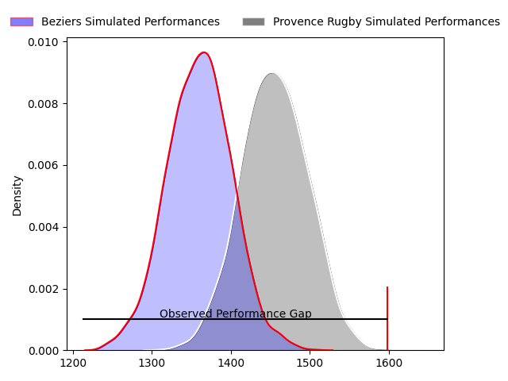
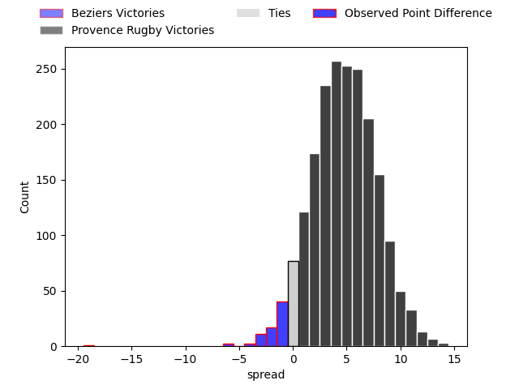
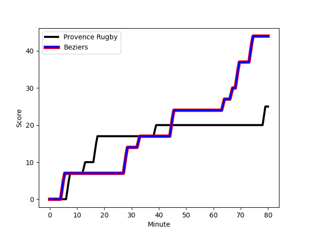
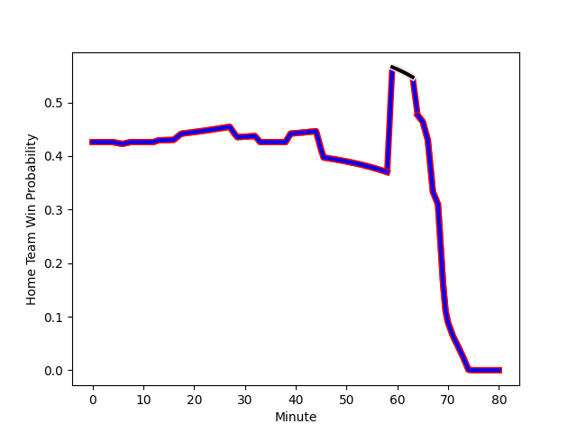

---  
layout: page  
title: Beziers at Provence Rugby; 44-25  
date: 2023-01-27 19:30:00 18:00:00 -0500  
categories: match review  
---
# Beziers at Provence Rugby; 44-25

# Club Level Predictions

The first set of predictions treats a club as the smallest object, as the club develops its members, organizes a gameplan, and deploys its players as needed for each match. This club model has a prediction of 0.599, which translates to predicting Provence Rugby to win by 3.5.

Each club has a rating and a rating deviation (simiar to a Glicko system), and expected performances can be generated. This allows for simulated matches and spreads like the ones below.
## Projected Performances

## Projected Spreads

## Projected Results

# Player Level Predictions

Treating teams instead as an entity made up of the currently active players, I have ratings for each player in an altogether different system. These can be combined to form team ratings once teamsheets are announced, weighting starters a bit higher than the reserves. After the match is played, players can be weighted by their minutes on the field, allowing for an accurate measure of the team's composition. With these compiled team ratings, we can make predictions, measure inaccuracy, and update the individual player ratings.
## Prediction with Player Minutes: Beziers by 8.1

Beziers by 12.1 on a neutral field
## Scores over Time

## Win Probability over Time

## Prediction without Player Minutes: Beziers by 8.3

Beziers by 12.3 on a neutral pitch

|   Away Minutes | Away Player                                                                          |   Away elo |   Away Percentile |   Number |   Home Percentile |   Home elo | Home Player                                                               |   Home Minutes |
|---------------:|:-------------------------------------------------------------------------------------|-----------:|------------------:|---------:|------------------:|-----------:|:--------------------------------------------------------------------------|---------------:|
|             41 | [Giorgi Akhaladze](..//playerfiles//GiorgiAkhaladze_cleaned.md)                      |      97.59 |                51 |        1 |                85 |     110.14 | [Federico Wegrzyn](..//playerfiles//FedericoWegrzyn_cleaned.md)           |             56 |
|             62 | [Wilmar Arnoldi](..//playerfiles//WilmarArnoldi_cleaned.md)                          |      83.1  |                19 |        2 |                 1 |      65.54 | [Loick Jammes](..//playerfiles//LoickJammes_cleaned.md)                   |             56 |
|             67 | [Jon Zabala Arrieta](..//playerfiles//JonZabalaArrieta_cleaned.md)                   |     112.3  |                88 |        3 |                11 |      80.78 | [Dave Lolohea](..//playerfiles//DaveLolohea_cleaned.md)                   |             66 |
|             80 | [Clément Bitz](..//playerfiles//ClémentBitz_cleaned.md)                              |     101.21 |                64 |        4 |                89 |     117.66 | [Clément Chartier](..//playerfiles//ClémentChartier_cleaned.md)           |             80 |
|             53 | [Pierre Gayraud](..//playerfiles//PierreGayraud_cleaned.md)                          |     111.63 |                83 |        5 |                12 |      77.53 | [Hans N'kinsi](..//playerfiles//HansN'kinsi_cleaned.md)                   |             80 |
|             80 | [William van Bost](..//playerfiles//WilliamvanBost_cleaned.md)                       |      96.59 |                52 |        6 |                62 |     100.36 | [Guillaume Piazzoli](..//playerfiles//GuillaumePiazzoli_cleaned.md)       |             41 |
|             80 | [Gillian Benoy](..//playerfiles//GillianBenoy_cleaned.md)                            |     112.66 |                84 |        7 |                 8 |      75.69 | [Jessy Jegerlehner](..//playerfiles//JessyJegerlehner_cleaned.md)         |             80 |
|             64 | [Thomas Hoarau](..//playerfiles//ThomasHoarau_cleaned.md)                            |     109.51 |                76 |        8 |                64 |     101    | [Carl Axtens](..//playerfiles//CarlAxtens_cleaned.md)                     |             80 |
|             67 | [Josh Valentine](..//playerfiles//JoshValentine_cleaned.md)                          |     114.71 |                89 |        9 |                12 |      79.62 | [Joris Cazenave](..//playerfiles//JorisCazenave_cleaned.md)               |             72 |
|             80 | [Victor Dreuille](..//playerfiles//VictorDreuille_cleaned.md)                        |      93.11 |                39 |       10 |                84 |     116.43 | [Enzo Selponi](..//playerfiles//EnzoSelponi_cleaned.md)                   |             70 |
|             80 | [Nicolas Plazy](..//playerfiles//NicolasPlazy_cleaned.md)                            |     124.55 |                92 |       11 |                82 |     112.46 | [Nadir Bouhedjeur](..//playerfiles//NadirBouhedjeur_cleaned.md)           |             80 |
|             52 | [James Tofa](..//playerfiles//JamesTofa_cleaned.md)                                  |      67.37 |                 3 |       12 |                97 |     133.29 | [Louis Marrou](..//playerfiles//LouisMarrou_cleaned.md)                   |             80 |
|             80 | [Maxime Espeut](..//playerfiles//MaximeEspeut_cleaned.md)                            |     138.09 |                98 |       13 |                89 |     119.15 | [Adrian Sanday](..//playerfiles//AdrianSanday_cleaned.md)                 |             80 |
|             80 | [Raffaele Storti](..//playerfiles//RaffaeleStorti_cleaned.md)                        |     111.06 |                80 |       14 |                88 |     117.58 | [Kevin Bly](..//playerfiles//KevinBly_cleaned.md)                         |             59 |
|             37 | [Gabin Lorre](..//playerfiles//GabinLorre_cleaned.md)                                |     112.21 |                82 |       15 |                 0 |      50.75 | [Adrien Lapegue-Lafaye](..//playerfiles//AdrienLapegue-Lafaye_cleaned.md) |             70 |
|             43 | [Charly Malie](..//playerfiles//CharlyMalie_cleaned.md)                              |      79.81 |                16 |       16 |                71 |     108.76 | [Jérôme Dufour](..//playerfiles//JérômeDufour_cleaned.md)                 |             39 |
|             39 | [Francisco Fernandes Moreira](..//playerfiles//FranciscoFernandesMoreira_cleaned.md) |     121.73 |                95 |       17 |                16 |      83.59 | [Julius Nostadt](..//playerfiles//JuliusNostadt_cleaned.md)               |             24 |
|             28 | [Watisoni Votu](..//playerfiles//WatisoniVotu_cleaned.md)                            |      97.67 |                53 |       18 |               nan |      95.8  | [Jeremie Martin](..//playerfiles//JeremieMartin_cleaned.md)               |             24 |
|             27 | [Yassine Maamry](..//playerfiles//YassineMaamry_cleaned.md)                          |      84.67 |                19 |       19 |                 5 |      75.44 | [Nicolas Mousties](..//playerfiles//NicolasMousties_cleaned.md)           |             21 |
|             18 | [Marco Pinto Ferrer](..//playerfiles//MarcoPintoFerrer_cleaned.md)                   |      88.98 |                28 |       20 |                34 |      95.52 | [Thomas Vernet](..//playerfiles//ThomasVernet_cleaned.md)                 |             14 |
|             16 | [Sias Koen](..//playerfiles//SiasKoen_cleaned.md)                                    |     100.5  |                59 |       21 |                38 |      94.99 | [Dorian Lavernhe](..//playerfiles//DorianLavernhe_cleaned.md)             |             10 |
|             13 | [Jean Victor Goillot](..//playerfiles//JeanVictorGoillot_cleaned.md)                 |     126.98 |                96 |       22 |                76 |     107.77 | [Léo Drouet](..//playerfiles//LéoDrouet_cleaned.md)                       |             10 |
|             13 | [Yannick Arroyo](..//playerfiles//YannickArroyo_cleaned.md)                          |     106.77 |                80 |       23 |                60 |      97.97 | [Simon Tarel](..//playerfiles//SimonTarel_cleaned.md)                     |              8 |

