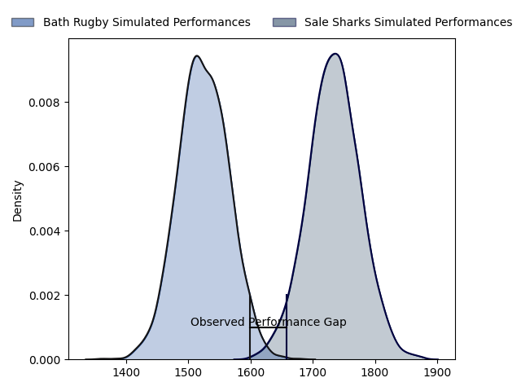
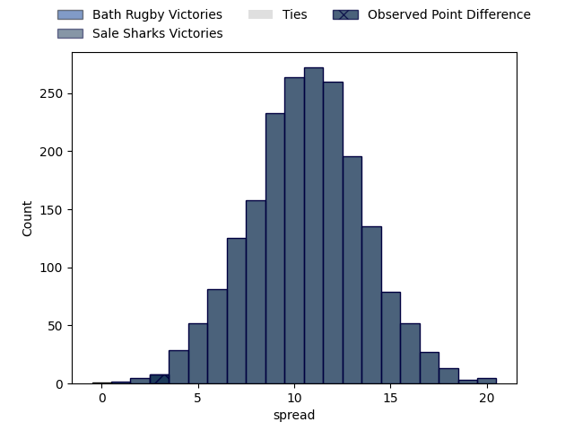
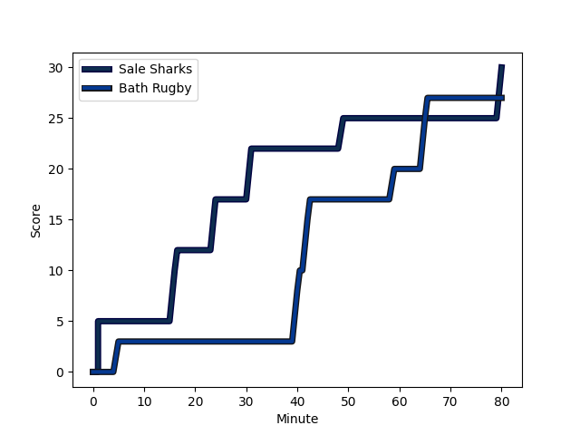
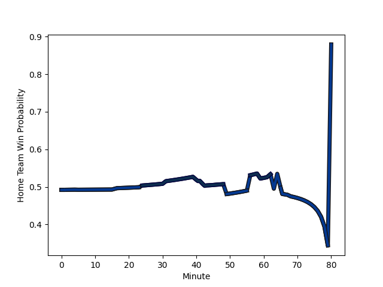

---  
layout: page  
title: Bath Rugby at Sale Sharks; 27-30  
date: 2023-01-27 20:45:00 18:00:00 -0500  
categories: match review  
---
# Bath Rugby at Sale Sharks; 27-30

# Club Level Predictions

The first set of predictions treats a club as the smallest object, as the club develops its members, organizes a gameplan, and deploys its players as needed for each match. This club model has a prediction of 0.77, which translates to predicting Sale Sharks to win by 10.6.

Each club has a rating and a rating deviation (simiar to a Glicko system), and expected performances can be generated. This allows for simulated matches and spreads like the ones below.
## Projected Performances

## Projected Spreads

## Projected Results

# Player Level Predictions

Treating teams instead as an entity made up of the currently active players, I have ratings for each player in an altogether different system. These can be combined to form team ratings once teamsheets are announced, weighting starters a bit higher than the reserves. After the match is played, players can be weighted by their minutes on the field, allowing for an accurate measure of the team's composition. With these compiled team ratings, we can make predictions, measure inaccuracy, and update the individual player ratings.
## Prediction with Player Minutes: Sale Sharks by 2.6

Bath Rugby by 1.4 on a neutral field
## Scores over Time

## Win Probability over Time

## Prediction without Player Minutes: Bath Rugby by 0.9

Bath Rugby by 4.9 on a neutral pitch

|   Away Minutes | Away Player                                                       |   Away elo |   Away Percentile |   Number |   Home Percentile |   Home elo | Home Player                                                      |   Home Minutes |
|---------------:|:------------------------------------------------------------------|-----------:|------------------:|---------:|------------------:|-----------:|:-----------------------------------------------------------------|---------------:|
|             56 | [Valery Morozov](..//playerfiles//ValeryMorozov_cleaned.md)       |      89.52 |                28 |        1 |                84 |     108.79 | [Simon McIntyre](..//playerfiles//SimonMcIntyre_cleaned.md)      |             59 |
|             80 | [Niall Annett](..//playerfiles//NiallAnnett_cleaned.md)           |      88.84 |                28 |        2 |                92 |     119.06 | [Tommy Taylor](..//playerfiles//TommyTaylor_cleaned.md)          |             59 |
|             64 | [D'Arcy Rae](..//playerfiles//D'ArcyRae_cleaned.md)               |      64.45 |                 1 |        3 |                21 |      86.42 | [Nic Schonert](..//playerfiles//NicSchonert_cleaned.md)          |             59 |
|             56 | [Dave Attwood](..//playerfiles//DaveAttwood_cleaned.md)           |     111.98 |                84 |        4 |                32 |      89.76 | [Cobus Wiese](..//playerfiles//CobusWiese_cleaned.md)            |             46 |
|             62 | [Josh McNally](..//playerfiles//JoshMcNally_cleaned.md)           |     126.37 |                95 |        5 |                84 |     112.24 | [Josh Beaumont](..//playerfiles//JoshBeaumont_cleaned.md)        |             80 |
|             80 | [Ted Hill](..//playerfiles//TedHill_cleaned.md)                   |      97.78 |                55 |        6 |                59 |      98.91 | [Jono Ross](..//playerfiles//JonoRoss_cleaned.md)                |             80 |
|             48 | [Chris Cloete](..//playerfiles//ChrisCloete_cleaned.md)           |     136.51 |                98 |        7 |                54 |      91.71 | [Sam Dugdale](..//playerfiles//SamDugdale_cleaned.md)            |             80 |
|             80 | [Miles Reid](..//playerfiles//MilesReid_cleaned.md)               |     130.85 |                96 |        8 |                75 |     107.91 | [Jean-Luc du Preez](..//playerfiles//Jean-LucduPreez_cleaned.md) |             80 |
|             80 | [Ben Spencer](..//playerfiles//BenSpencer_cleaned.md)             |      99.95 |                60 |        9 |                29 |      88.78 | [Gus Warr](..//playerfiles//GusWarr_cleaned.md)                  |             49 |
|             80 | [Orlando Bailey](..//playerfiles//OrlandoBailey_cleaned.md)       |      77.81 |                13 |       10 |                19 |      86.26 | [Robert du Preez](..//playerfiles//RobertduPreez_cleaned.md)     |             80 |
|             68 | [Will Butt](..//playerfiles//WillButt_cleaned.md)                 |      96.76 |                51 |       11 |                92 |     123.42 | [Tom O'Flaherty](..//playerfiles//TomO'Flaherty_cleaned.md)      |             63 |
|             80 | [Max Ojomoh](..//playerfiles//MaxOjomoh_cleaned.md)               |      73.97 |                 7 |       12 |                 9 |      76.53 | [Ryan Mills](..//playerfiles//RyanMills_cleaned.md)              |             80 |
|             80 | [Jonathan Joseph](..//playerfiles//JonathanJoseph_cleaned.md)     |     114.58 |                86 |       13 |                99 |     152.44 | [Sam James](..//playerfiles//SamJames_cleaned.md)                |             80 |
|             43 | [Joe Cokanasiga](..//playerfiles//JoeCokanasiga_cleaned.md)       |     115.92 |                86 |       14 |                63 |     100.4  | [Tom Roebuck](..//playerfiles//TomRoebuck_cleaned.md)            |             80 |
|             80 | [Matt Gallagher](..//playerfiles//MattGallagher_cleaned.md)       |     135.24 |                95 |       15 |                14 |      78.27 | [Joe Carpenter](..//playerfiles//JoeCarpenter_cleaned.md)        |             80 |
|             24 | [Beno Obano](..//playerfiles//BenoObano_cleaned.md)               |     104.38 |                77 |       16 |                97 |     131.23 | [Ross Harrison](..//playerfiles//RossHarrison_cleaned.md)        |             21 |
|             16 | [Johannes Jonker](..//playerfiles//JohannesJonker_cleaned.md)     |      90.99 |                34 |       17 |                27 |      87.98 | [Ewan Ashman](..//playerfiles//EwanAshman_cleaned.md)            |             21 |
|             24 | [Will Spencer](..//playerfiles//WillSpencer_cleaned.md)           |      96.15 |                51 |       18 |                44 |      95.67 | [Joe Jones](..//playerfiles//JoeJones_cleaned.md)                |             21 |
|             18 | [Fergus Lee-Warner](..//playerfiles//FergusLee-Warner_cleaned.md) |      85.97 |                24 |       19 |                36 |      90.92 | [Rouben Birch](..//playerfiles//RoubenBirch_cleaned.md)          |             34 |
|             32 | [Sam Underhill](..//playerfiles//SamUnderhill_cleaned.md)         |      95.11 |                47 |       20 |                66 |     101.76 | [Raffi Quirke](..//playerfiles//RaffiQuirke_cleaned.md)          |             31 |
|             12 | [Louis Schreuder](..//playerfiles//LouisSchreuder_cleaned.md)     |     109.04 |                82 |       21 |                93 |     123.58 | [Arron Reed](..//playerfiles//ArronReed_cleaned.md)              |             17 |
|             37 | [Cameron Redpath](..//playerfiles//CameronRedpath_cleaned.md)     |     112.48 |                83 |       22 |               nan |     nan    | nan                                                              |            nan |

