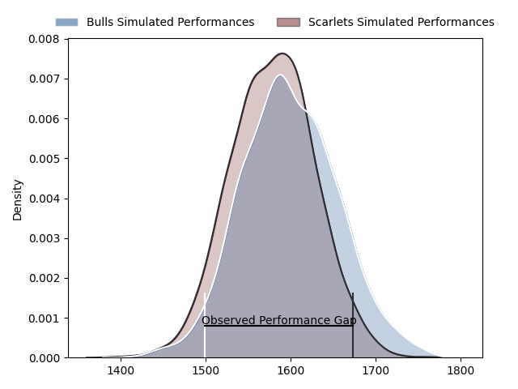
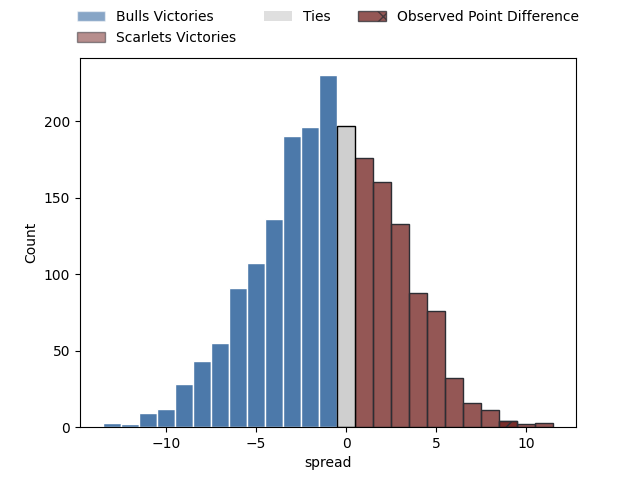

---  
layout: page  
title: Bulls at Scarlets; 28-37  
date: 2023-01-27 20:35:00 18:00:00 -0500  
categories: match review  
---
# Bulls at Scarlets; 28-37

# Club Level Predictions

The first set of predictions treats a club as the smallest object, as the club develops its members, organizes a gameplan, and deploys its players as needed for each match. This club model has a prediction of 0.472, which translates to predicting Bulls to win by 1.0.

Each club has a rating and a rating deviation (simiar to a Glicko system), and expected performances can be generated. This allows for simulated matches and spreads like the ones below.
## Projected Performances

## Projected Spreads

# Player Level Predictions

Treating teams instead as an entity made up of the currently active players, I have ratings for each player in an altogether different system. These can be combined to form team ratings once teamsheets are announced, weighting starters a bit higher than the reserves. After the match is played, players can be weighted by their minutes on the field, allowing for an accurate measure of the team's composition. With these compiled team ratings, we can make predictions, measure inaccuracy, and update the individual player ratings.
## Prediction with Player Minutes: Bulls by 1.5

Bulls by 5.5 on a neutral field
## Scores over Time

## Win Probability over Time

## Prediction without Player Minutes: Bulls by 9.3

Bulls by 13.3 on a neutral pitch

|   Away Minutes | Away Player                                                          |   Away elo |   Away Percentile |   Number |   Home Percentile |   Home elo | Home Player                                                     |   Home Minutes |
|---------------:|:---------------------------------------------------------------------|-----------:|------------------:|---------:|------------------:|-----------:|:----------------------------------------------------------------|---------------:|
|             60 | [Gerhard Steenekamp](..//playerfiles//GerhardSteenekamp_cleaned.md)  |     105.04 |                81 |        1 |                38 |      94.28 | [Kemsley Mathias](..//playerfiles//KemsleyMathias_cleaned.md)   |             80 |
|             71 | [Johan Grobbelaar](..//playerfiles//JohanGrobbelaar_cleaned.md)      |     136.45 |                99 |        2 |                27 |      87.97 | [Dafydd Hughes](..//playerfiles//DafyddHughes_cleaned.md)       |             77 |
|             60 | [Mornay Smith](..//playerfiles//MornaySmith_cleaned.md)              |      92.65 |                45 |        3 |               nan |      90.35 | [Sam Wainwright](..//playerfiles//SamWainwright_cleaned.md)     |             58 |
|             71 | [Ruan Vermaak](..//playerfiles//RuanVermaak_cleaned.md)              |      82.25 |                16 |        4 |                95 |     126.99 | [Vaea Fifita](..//playerfiles//VaeaFifita_cleaned.md)           |             80 |
|             80 | [Ruan Nortje](..//playerfiles//RuanNortje_cleaned.md)                |      98.86 |                59 |        5 |                95 |     126.96 | [Sam Lousi](..//playerfiles//SamLousi_cleaned.md)               |             80 |
|             80 | [Marco van Staden](..//playerfiles//MarcovanStaden_cleaned.md)       |      97.18 |                53 |        6 |                45 |      94.21 | [Aaron Shingler](..//playerfiles//AaronShingler_cleaned.md)     |             66 |
|             60 | [Cyle Brink](..//playerfiles//CyleBrink_cleaned.md)                  |      94.08 |                45 |        7 |                87 |     114.53 | [Dan Davis](..//playerfiles//DanDavis_cleaned.md)               |             71 |
|             80 | [Elrigh Louw](..//playerfiles//ElrighLouw_cleaned.md)                |      94.66 |                42 |        8 |                50 |      97.79 | [Sione Kalamafoni](..//playerfiles//SioneKalamafoni_cleaned.md) |             80 |
|             60 | [Zak Burger](..//playerfiles//ZakBurger_cleaned.md)                  |     108.77 |                81 |        9 |                 1 |      64.71 | [Gareth Davies](..//playerfiles//GarethDavies_cleaned.md)       |             58 |
|             80 | [Chris Smith](..//playerfiles//ChrisSmith_cleaned.md)                |     111.94 |                80 |       10 |                 8 |      78.08 | [Sam Costelow](..//playerfiles//SamCostelow_cleaned.md)         |             80 |
|             71 | [Stravino Jacobs](..//playerfiles//StravinoJacobs_cleaned.md)        |      78.35 |                11 |       11 |                77 |     107.44 | [Ryan Conbeer](..//playerfiles//RyanConbeer_cleaned.md)         |             80 |
|             80 | [Harold Vorster](..//playerfiles//HaroldVorster_cleaned.md)          |     126.39 |                94 |       12 |                37 |      92.01 | [Ioan Nicholas](..//playerfiles//IoanNicholas_cleaned.md)       |             80 |
|             74 | [Lionel Mapoe](..//playerfiles//LionelMapoe_cleaned.md)              |     114.21 |                86 |       13 |                52 |      96.76 | [Joe Roberts](..//playerfiles//JoeRoberts_cleaned.md)           |             80 |
|             80 | [David Kriel](..//playerfiles//DavidKriel_cleaned.md)                |     123.36 |                92 |       14 |                82 |     111.03 | [Steffan Evans](..//playerfiles//SteffanEvans_cleaned.md)       |             80 |
|             80 | [Johan Goosen](..//playerfiles//JohanGoosen_cleaned.md)              |      88.58 |                24 |       15 |                88 |     117.32 | [Johnny McNicholl](..//playerfiles//JohnnyMcNicholl_cleaned.md) |             80 |
|             20 | [Francois Klopper](..//playerfiles//FrancoisKlopper_cleaned.md)      |      87.79 |                24 |       16 |                 1 |      63.82 | [Dane Blacker](..//playerfiles//DaneBlacker_cleaned.md)         |             22 |
|             20 | [Simphiwe Matanzima](..//playerfiles//SimphiweMatanzima_cleaned.md)  |     100.98 |                67 |       17 |                 6 |      77.24 | [Harri O'Connor](..//playerfiles//HarriO'Connor_cleaned.md)     |             22 |
|             20 | [Embrose Papier](..//playerfiles//EmbrosePapier_cleaned.md)          |     107.12 |                77 |       18 |                 0 |      52.13 | [Morgan Jones](..//playerfiles//MorganJones_cleaned.md)         |             14 |
|             20 | [Nizaam Carr](..//playerfiles//NizaamCarr_cleaned.md)                |      79.27 |                12 |       19 |                29 |      88.86 | [Carwyn Tuipulotu](..//playerfiles//CarwynTuipulotu_cleaned.md) |              9 |
|              9 | [Jan Hendrik Wessels](..//playerfiles//JanHendrikWessels_cleaned.md) |      74.71 |                 4 |       20 |                13 |      81.22 | [Taylor Davies](..//playerfiles//TaylorDavies_cleaned.md)       |              3 |
|              9 | [Janko Swanepoel](..//playerfiles//JankoSwanepoel_cleaned.md)        |      91.33 |                37 |       21 |               nan |     nan    | nan                                                             |            nan |
|              9 | [Cornal Hendricks](..//playerfiles//CornalHendricks_cleaned.md)      |      97.54 |                54 |       22 |               nan |     nan    | nan                                                             |            nan |
|              6 | [Wandisile Simelane](..//playerfiles//WandisileSimelane_cleaned.md)  |      98.01 |                55 |       23 |               nan |     nan    | nan                                                             |            nan |

