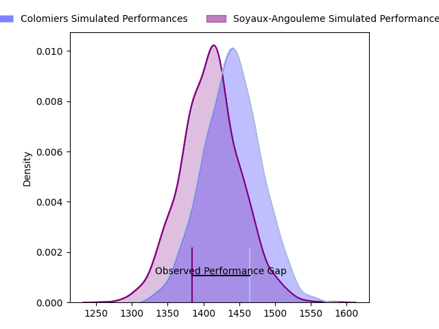
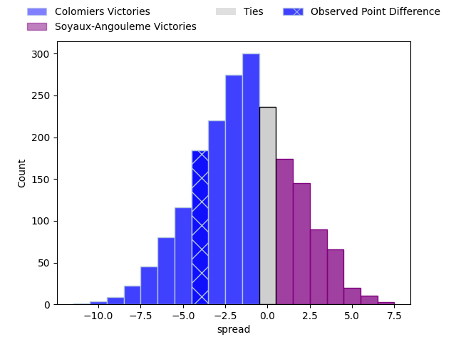
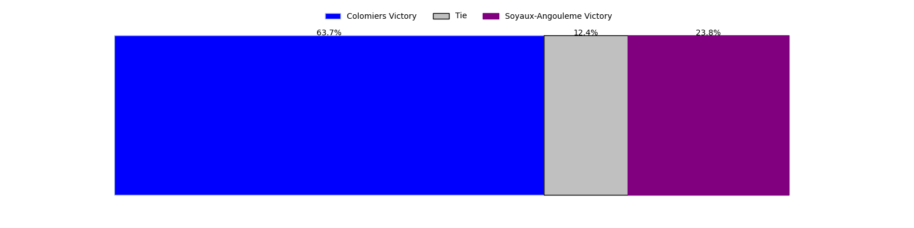
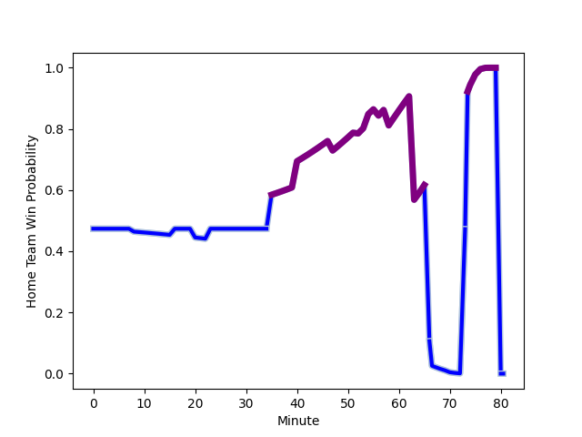

---  
layout: page  
title: Colomiers at Soyaux-Angouleme; 25-21  
date: 2023-01-27 19:30:00 18:00:00 -0500  
categories: match review  
---
# Colomiers at Soyaux-Angouleme; 25-21

# Club Level Predictions

The first set of predictions treats a club as the smallest object, as the club develops its members, organizes a gameplan, and deploys its players as needed for each match. This club model has a prediction of 0.468, which translates to predicting Colomiers to win by 1.1.

Each club has a rating and a rating deviation (simiar to a Glicko system), and expected performances can be generated. This allows for simulated matches and spreads like the ones below.
## Projected Performances

## Projected Spreads

## Projected Results

# Player Level Predictions

Treating teams instead as an entity made up of the currently active players, I have ratings for each player in an altogether different system. These can be combined to form team ratings once teamsheets are announced, weighting starters a bit higher than the reserves. After the match is played, players can be weighted by their minutes on the field, allowing for an accurate measure of the team's composition. With these compiled team ratings, we can make predictions, measure inaccuracy, and update the individual player ratings.
## Prediction with Player Minutes: Colomiers by 0.6

Colomiers by 4.6 on a neutral field
## Scores over Time

## Win Probability over Time

## Prediction without Player Minutes: Colomiers by 2.4

Colomiers by 6.4 on a neutral pitch

|   Away Minutes | Away Player                                                         |   Away elo |   Away Percentile |   Number |   Home Percentile |   Home elo | Home Player                                                                |   Home Minutes |
|---------------:|:--------------------------------------------------------------------|-----------:|------------------:|---------:|------------------:|-----------:|:---------------------------------------------------------------------------|---------------:|
|             52 | [Hugo Djehi](..//playerfiles//HugoDjehi_cleaned.md)                 |      84.62 |                16 |        1 |                40 |      93.04 | [Khatchik Vartanov](..//playerfiles//KhatchikVartanov_cleaned.md)          |             52 |
|             52 | [Thomas Larrieu](..//playerfiles//ThomasLarrieu_cleaned.md)         |     129.15 |                98 |        2 |                98 |     133.23 | [Ole Avei](..//playerfiles//OleAvei_cleaned.md)                            |             80 |
|             52 | [Hugo Pirlet](..//playerfiles//HugoPirlet_cleaned.md)               |      60.53 |                 1 |        3 |                43 |      90.48 | [Shota Gogisvanidze](..//playerfiles//ShotaGogisvanidze_cleaned.md)        |             54 |
|             52 | [Jean Thomas](..//playerfiles//JeanThomas_cleaned.md)               |     110.7  |                83 |        4 |                84 |     112.13 | [Sikeli Nabou](..//playerfiles//SikeliNabou_cleaned.md)                    |             80 |
|             80 | [Maxime Granouillet](..//playerfiles//MaximeGranouillet_cleaned.md) |     108.09 |                77 |        5 |                17 |      81.76 | [Ian Kitwanga](..//playerfiles//IanKitwanga_cleaned.md)                    |             52 |
|             80 | [Anthony Coletta](..//playerfiles//AnthonyColetta_cleaned.md)       |      76.68 |                 8 |        6 |                14 |      81.43 | [Gautier Gibouin](..//playerfiles//GautierGibouin_cleaned.md)              |             80 |
|             80 | [Aldric Lescure](..//playerfiles//AldricLescure_cleaned.md)         |     103.2  |                69 |        7 |                49 |      95.71 | [Germain Burgaud](..//playerfiles//GermainBurgaud_cleaned.md)              |             47 |
|             56 | [Yann Peysson](..//playerfiles//YannPeysson_cleaned.md)             |      77.84 |                10 |        8 |                15 |      78.86 | [Matt Va'ai](..//playerfiles//MattVa'ai_cleaned.md)                        |             70 |
|             58 | [Ugo Seguela](..//playerfiles//UgoSeguela_cleaned.md)               |     103.98 |                69 |        9 |                78 |     106.19 | [Manu Saubusse](..//playerfiles//ManuSaubusse_cleaned.md)                  |             70 |
|             58 | [Maxime Javaux](..//playerfiles//MaximeJavaux_cleaned.md)           |      64.41 |                 2 |       10 |                83 |     115.69 | [Matthieu Ugalde](..//playerfiles//MatthieuUgalde_cleaned.md)              |             80 |
|             80 | [Alexis Palisson](..//playerfiles//AlexisPalisson_cleaned.md)       |     105.31 |                72 |       11 |                51 |      96.36 | [Maxime Laforgue](..//playerfiles//MaximeLaforgue_cleaned.md)              |             80 |
|             80 | [Johan Deysel (Jnr)](..//playerfiles//JohanDeysel(Jnr)_cleaned.md)  |     129.06 |                95 |       12 |                75 |     106.92 | [Nasoni Naqiri Kunavore](..//playerfiles//NasoniNaqiriKunavore_cleaned.md) |             80 |
|             56 | [Michele Campagnaro](..//playerfiles//MicheleCampagnaro_cleaned.md) |     100.57 |                61 |       13 |                 2 |      66.39 | [Ledua Mau](..//playerfiles//LeduaMau_cleaned.md)                          |             80 |
|             80 | [Peni Rokoduguni](..//playerfiles//PeniRokoduguni_cleaned.md)       |      84.01 |                16 |       14 |               nan |      95    | [Junior Ratuva](..//playerfiles//JuniorRatuva_cleaned.md)                  |             70 |
|             80 | [Thomas Girard](..//playerfiles//ThomasGirard_cleaned.md)           |      98.5  |                62 |       15 |                10 |      74.5  | [Pierre Lafitte](..//playerfiles//PierreLafitte_cleaned.md)                |             80 |
|             28 | [Andrew Ready](..//playerfiles//AndrewReady_cleaned.md)             |     101.97 |                69 |       16 |                 9 |      77.18 | [Nicolas Martins](..//playerfiles//NicolasMartins_cleaned.md)              |             33 |
|             28 | [Alexandre Ricard](..//playerfiles//AlexandreRicard_cleaned.md)     |      96.14 |                51 |       17 |                 5 |      73.94 | [Elias El Ansari](..//playerfiles//EliasElAnsari_cleaned.md)               |             28 |
|             28 | [Thomas Dubois](..//playerfiles//ThomasDubois_cleaned.md)           |      85.96 |                19 |       18 |                75 |     106.6  | [Saba Pesvianidze](..//playerfiles//SabaPesvianidze_cleaned.md)            |             28 |
|             28 | [Marco Fepulea'i](..//playerfiles//MarcoFepulea'i_cleaned.md)       |     134.29 |                98 |       19 |                81 |     106.64 | [Manasa Saulo Romumu](..//playerfiles//ManasaSauloRomumu_cleaned.md)       |             26 |
|             24 | [Jorick Dastugue](..//playerfiles//JorickDastugue_cleaned.md)       |     103.86 |                70 |       20 |                 3 |      68.22 | [Adrien Bau](..//playerfiles//AdrienBau_cleaned.md)                        |             10 |
|             24 | [Fabien Perrin](..//playerfiles//FabienPerrin_cleaned.md)           |      96.57 |                52 |       21 |                15 |      77.74 | [Matt Beukeboom](..//playerfiles//MattBeukeboom_cleaned.md)                |             10 |
|             22 | [Max Auriac](..//playerfiles//MaxAuriac_cleaned.md)                 |     101.65 |                62 |       22 |                10 |      77.08 | [Hugo Le Gall](..//playerfiles//HugoLeGall_cleaned.md)                     |             10 |
|             22 | [Edoardo Gori](..//playerfiles//EdoardoGori_cleaned.md)             |     106.41 |                76 |       23 |               nan |     nan    | nan                                                                        |            nan |

