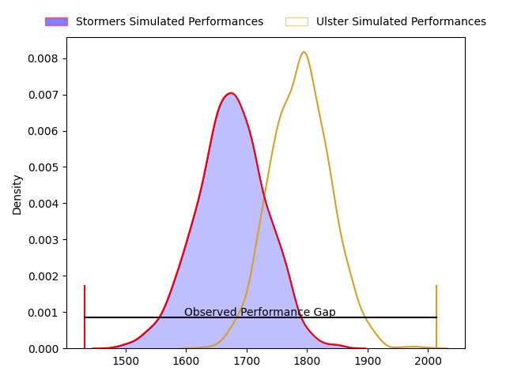
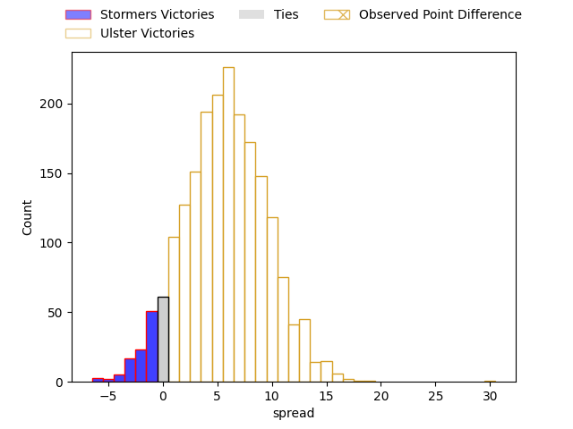
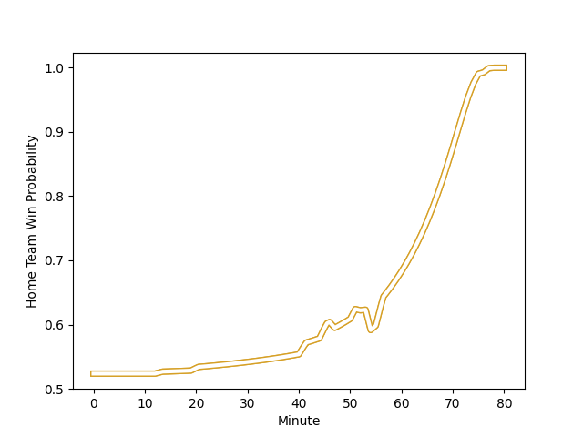

---  
layout: page  
title: Stormers at Ulster; 5-35  
date: 2023-01-27 20:35:00 18:00:00 -0500  
categories: match review  
---
# Stormers at Ulster; 5-35

# Club Level Predictions

The first set of predictions treats a club as the smallest object, as the club develops its members, organizes a gameplan, and deploys its players as needed for each match. This club model has a prediction of 0.659, which translates to predicting Ulster to win by 5.8.

Each club has a rating and a rating deviation (simiar to a Glicko system), and expected performances can be generated. This allows for simulated matches and spreads like the ones below.
## Projected Performances

## Projected Spreads

## Projected Results

# Player Level Predictions

Treating teams instead as an entity made up of the currently active players, I have ratings for each player in an altogether different system. These can be combined to form team ratings once teamsheets are announced, weighting starters a bit higher than the reserves. After the match is played, players can be weighted by their minutes on the field, allowing for an accurate measure of the team's composition. With these compiled team ratings, we can make predictions, measure inaccuracy, and update the individual player ratings.
## Prediction with Player Minutes: Ulster by 7.5

Ulster by 3.5 on a neutral field
## Scores over Time

## Win Probability over Time

## Prediction without Player Minutes: Ulster by 8.5

Ulster by 4.5 on a neutral pitch

|   Away Minutes | Away Player                                                                      |   Away elo |   Away Percentile |   Number |   Home Percentile |   Home elo | Home Player                                                         |   Home Minutes |
|---------------:|:---------------------------------------------------------------------------------|-----------:|------------------:|---------:|------------------:|-----------:|:--------------------------------------------------------------------|---------------:|
|             54 | [Alistair Vermaak](..//playerfiles//AlistairVermaak_cleaned.md)                  |     108.7  |                84 |        1 |                32 |      89.53 | [Eric O'Sullivan](..//playerfiles//EricO'Sullivan_cleaned.md)       |             54 |
|              3 | [JJ Kotze](..//playerfiles//JJKotze_cleaned.md)                                  |      94.21 |                57 |        2 |                15 |      82.62 | [Tom Stewart](..//playerfiles//TomStewart_cleaned.md)               |             52 |
|             53 | [Brok Harris](..//playerfiles//BrokHarris_cleaned.md)                            |     135.25 |                99 |        3 |                90 |     114.42 | [Jeff Toomaga-Allen](..//playerfiles//JeffToomaga-Allen_cleaned.md) |             64 |
|             80 | [Ben-Jason Dixon](..//playerfiles//Ben-JasonDixon_cleaned.md)                    |     103.29 |                68 |        4 |                86 |     114.24 | [Alan O'Connor](..//playerfiles//AlanO'Connor_cleaned.md)           |             80 |
|             58 | [Marvin Orie](..//playerfiles//MarvinOrie_cleaned.md)                            |     104.29 |                71 |        5 |                85 |     113.62 | [Sam Carter](..//playerfiles//SamCarter_cleaned.md)                 |             52 |
|             80 | [Marcel Theunissen](..//playerfiles//MarcelTheunissen_cleaned.md)                |      87.02 |                25 |        6 |                41 |      92.68 | [Harry Sheridan](..//playerfiles//HarrySheridan_cleaned.md)         |             54 |
|             80 | [Willie Engelbrecht](..//playerfiles//WillieEngelbrecht_cleaned.md)              |     102.39 |                68 |        7 |                91 |     119.68 | [Nick Timoney](..//playerfiles//NickTimoney_cleaned.md)             |             80 |
|             22 | [Evan Roos](..//playerfiles//EvanRoos_cleaned.md)                                |     110.89 |                82 |        8 |                86 |     115.52 | [Duane Vermeulen](..//playerfiles//DuaneVermeulen_cleaned.md)       |             80 |
|             53 | [Stefan Ungerer](..//playerfiles//StefanUngerer_cleaned.md)                      |      73.64 |                 6 |        9 |                 3 |      69.1  | [Nathan Doak](..//playerfiles//NathanDoak_cleaned.md)               |             51 |
|             22 | [Jean-Luc du Plessis](..//playerfiles//Jean-LucduPlessis_cleaned.md)             |      81.61 |                16 |       10 |                84 |     115.26 | [Billy Burns](..//playerfiles//BillyBurns_cleaned.md)               |             70 |
|             80 | [Cornel Smit](..//playerfiles//CornelSmit_cleaned.md)                            |      94.32 |                46 |       11 |                44 |      95.75 | [Ben Moxham](..//playerfiles//BenMoxham_cleaned.md)                 |             80 |
|             80 | [Sacha Mngomezulu](..//playerfiles//SachaMngomezulu_cleaned.md)                  |      97.75 |                48 |       12 |                86 |     114.45 | [Stewart Moore](..//playerfiles//StewartMoore_cleaned.md)           |             80 |
|             80 | [Ruhan Nel](..//playerfiles//RuhanNel_cleaned.md)                                |     106    |                74 |       13 |                77 |     107.88 | [James Hume](..//playerfiles//JamesHume_cleaned.md)                 |             80 |
|             80 | [Suleiman  Hartzenberg](..//playerfiles//SuleimanHartzenberg_cleaned.md)         |      87.13 |                24 |       14 |                86 |     115.63 | [Rob Lyttle](..//playerfiles//RobLyttle_cleaned.md)                 |             57 |
|             80 | [Clayton Blommetjies](..//playerfiles//ClaytonBlommetjies_cleaned.md)            |      97.91 |                52 |       15 |                49 |      96.88 | [Michael Lowry](..//playerfiles//MichaelLowry_cleaned.md)           |             80 |
|             44 | [Scarra Ntubeni](..//playerfiles//ScarraNtubeni_cleaned.md)                      |     136.15 |                99 |       16 |                54 |      97.43 | [John Cooney](..//playerfiles//JohnCooney_cleaned.md)               |             29 |
|             58 | [Juan de Jongh](..//playerfiles//JuandeJongh_cleaned.md)                         |     113.26 |                84 |       17 |                62 |      99.85 | [Kieran Treadwell](..//playerfiles//KieranTreadwell_cleaned.md)     |             28 |
|             58 | [Ruben van Heerden](..//playerfiles//RubenvanHeerden_cleaned.md)                 |     112.7  |                83 |       18 |                21 |      85.2  | [John Andrew](..//playerfiles//JohnAndrew_cleaned.md)               |             28 |
|             33 | [Andre-Hugo Venter](..//playerfiles//Andre-HugoVenter_cleaned.md)                |     108.09 |                80 |       19 |                92 |     121.23 | [Jordi Murphy](..//playerfiles//JordiMurphy_cleaned.md)             |             26 |
|             27 | [Sazi Sandi](..//playerfiles//SaziSandi_cleaned.md)                              |      91.14 |                27 |       20 |                77 |     104.57 | [Rory Sutherland](..//playerfiles//RorySutherland_cleaned.md)       |             26 |
|             27 | [Herschel Jantjies](..//playerfiles//HerschelJantjies_cleaned.md)                |     115.91 |                90 |       21 |                29 |      88.23 | [Ethan McIlroy](..//playerfiles//EthanMcIlroy_cleaned.md)           |             23 |
|             26 | [Kwenzokuhle Ndumiso Blose](..//playerfiles//KwenzokuhleNdumisoBlose_cleaned.md) |      91.3  |                36 |       22 |                65 |     100.21 | [Andrew Warwick](..//playerfiles//AndrewWarwick_cleaned.md)         |             16 |
|             22 | [Connor Evans](..//playerfiles//ConnorEvans_cleaned.md)                          |      95.1  |                48 |       23 |                24 |      88.26 | [Ian Madigan](..//playerfiles//IanMadigan_cleaned.md)               |             10 |

