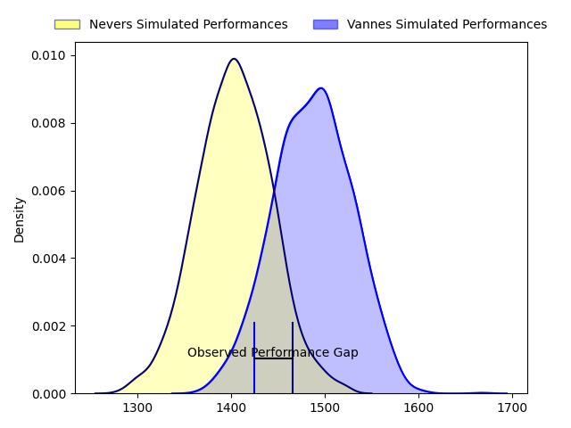
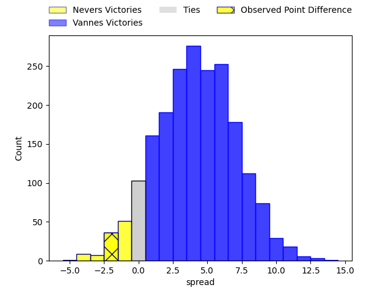
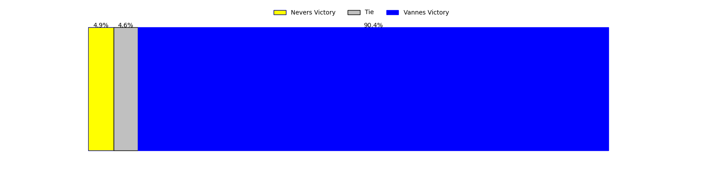
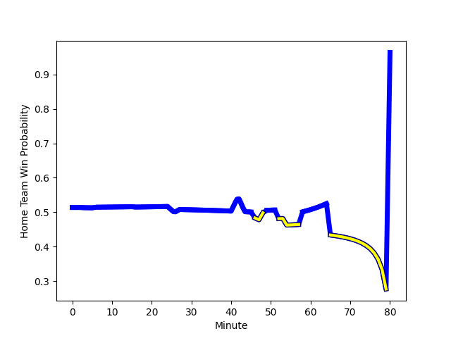

---  
layout: page  
title: Nevers at Vannes; 24-22  
date: 2023-01-27 19:30:00 18:00:00 -0500  
categories: match review  
---
# Nevers at Vannes; 24-22

# Club Level Predictions

The first set of predictions treats a club as the smallest object, as the club develops its members, organizes a gameplan, and deploys its players as needed for each match. This club model has a prediction of 0.606, which translates to predicting Vannes to win by 3.8.

Each club has a rating and a rating deviation (simiar to a Glicko system), and expected performances can be generated. This allows for simulated matches and spreads like the ones below.
## Projected Performances

## Projected Spreads

## Projected Results

# Player Level Predictions

Treating teams instead as an entity made up of the currently active players, I have ratings for each player in an altogether different system. These can be combined to form team ratings once teamsheets are announced, weighting starters a bit higher than the reserves. After the match is played, players can be weighted by their minutes on the field, allowing for an accurate measure of the team's composition. With these compiled team ratings, we can make predictions, measure inaccuracy, and update the individual player ratings.
## Prediction with Player Minutes: Vannes by 5.2

Vannes by 1.2 on a neutral field
## Scores over Time

## Win Probability over Time

## Prediction without Player Minutes: Vannes by 6.6

Vannes by 2.6 on a neutral pitch

|   Away Minutes | Away Player                                                                   |   Away elo |   Away Percentile |   Number |   Home Percentile |   Home elo | Home Player                                                               |   Home Minutes |
|---------------:|:------------------------------------------------------------------------------|-----------:|------------------:|---------:|------------------:|-----------:|:--------------------------------------------------------------------------|---------------:|
|             47 | [Kamaliele Tufele](..//playerfiles//KamalieleTufele_cleaned.md)               |      91.65 |                39 |        1 |                46 |      94.99 | [Charles-Henri Berguet](..//playerfiles//Charles-HenriBerguet_cleaned.md) |             62 |
|             54 | [Elia Elia](..//playerfiles//EliaElia_cleaned.md)                             |      89.52 |                32 |        2 |                77 |     105.3  | [Pat Leafa](..//playerfiles//PatLeafa_cleaned.md)                         |             52 |
|             57 | [Ilia Kaikatsishvili](..//playerfiles//IliaKaikatsishvili_cleaned.md)         |      93.3  |                31 |        3 |                45 |      94.68 | [Phil Kite](..//playerfiles//PhilKite_cleaned.md)                         |             46 |
|             80 | [Christiaan van der Merwe](..//playerfiles//ChristiaanvanderMerwe_cleaned.md) |      62.2  |                 2 |        4 |                 0 |      51.49 | [Eric Marks](..//playerfiles//EricMarks_cleaned.md)                       |             80 |
|             54 | [Lado Chachanidze](..//playerfiles//LadoChachanidze_cleaned.md)               |      96.93 |                53 |        5 |                49 |      95.63 | [Ewan Thomas Johnson](..//playerfiles//EwanThomasJohnson_cleaned.md)      |             80 |
|             49 | [Luka Plataret](..//playerfiles//LukaPlataret_cleaned.md)                     |      78.6  |                 9 |        6 |                 4 |      70.4  | [Karl Chateau](..//playerfiles//KarlChateau_cleaned.md)                   |             59 |
|             80 | [Shaun Adendorff](..//playerfiles//ShaunAdendorff_cleaned.md)                 |     103.7  |                71 |        7 |                99 |     147.93 | [Francisco Gorrissen](..//playerfiles//FranciscoGorrissen_cleaned.md)     |             80 |
|             80 | [Jason-Colin Fraser](..//playerfiles//Jason-ColinFraser_cleaned.md)           |     128.18 |                95 |        8 |                88 |     118.19 | [Léon Boulier](..//playerfiles//LéonBoulier_cleaned.md)                   |             46 |
|             16 | [Guillaume Manevy](..//playerfiles//GuillaumeManevy_cleaned.md)               |     107.14 |                78 |        9 |                18 |      83.28 | [Will Percillier](..//playerfiles//WillPercillier_cleaned.md)             |             52 |
|             80 | [Shaun Reynolds](..//playerfiles//ShaunReynolds_cleaned.md)                   |      78.09 |                 9 |       10 |                66 |     103    | [Maxime Lafage](..//playerfiles//MaximeLafage_cleaned.md)                 |             59 |
|             80 | [Christian Erasmus](..//playerfiles//ChristianErasmus_cleaned.md)             |     110.5  |                80 |       11 |                50 |      96.06 | [Théo Bastardie](..//playerfiles//ThéoBastardie_cleaned.md)               |             80 |
|             52 | [Leonard Paris](..//playerfiles//LeonardParis_cleaned.md)                     |     109.69 |                79 |       12 |                40 |      92.4  | [Sacha Valleau](..//playerfiles//SachaValleau_cleaned.md)                 |             80 |
|             80 | [Alifereti Loaloa](..//playerfiles//AliferetiLoaloa_cleaned.md)               |      84.8  |                21 |       13 |                26 |      86.39 | [Nicolas Freitas](..//playerfiles//NicolasFreitas_cleaned.md)             |             80 |
|             80 | [Christian Ambadiang](..//playerfiles//ChristianAmbadiang_cleaned.md)         |      81.53 |                14 |       14 |                22 |      86.42 | [Nathanael Hulleu](..//playerfiles//NathanaelHulleu_cleaned.md)           |             80 |
|             80 | [Kylian Jaminet](..//playerfiles//KylianJaminet_cleaned.md)                   |     119.45 |                89 |       15 |                40 |      92.58 | [Romaric Camou](..//playerfiles//RomaricCamou_cleaned.md)                 |             49 |
|             64 | [Arthurs Barbier](..//playerfiles//ArthursBarbier_cleaned.md)                 |     101.28 |                62 |       16 |                98 |     124.56 | [Paga Tafili](..//playerfiles//PagaTafili_cleaned.md)                     |             34 |
|             33 | [Tornike Mataradze](..//playerfiles//TornikeMataradze_cleaned.md)             |      90.28 |                31 |       17 |                52 |      98.63 | [Joe Edwards](..//playerfiles//JoeEdwards_cleaned.md)                     |             34 |
|             31 | [Julien Kazubek](..//playerfiles//JulienKazubek_cleaned.md)                   |      92.49 |                44 |       18 |                12 |      78.86 | [Branden Holder](..//playerfiles//BrandenHolder_cleaned.md)               |             31 |
|             28 | [Rudy Derrieux](..//playerfiles//RudyDerrieux_cleaned.md)                     |      82.13 |                17 |       19 |                53 |     100.44 | [Théo Beziat](..//playerfiles//ThéoBeziat_cleaned.md)                     |             28 |
|             26 | [Makatuki Polutele](..//playerfiles//MakatukiPolutele_cleaned.md)             |      48.93 |                 0 |       20 |                41 |      92.86 | [Alexandre Gouaux](..//playerfiles//AlexandreGouaux_cleaned.md)           |             28 |
|             26 | [Issam Hamel](..//playerfiles//IssamHamel_cleaned.md)                         |      93.27 |                43 |       21 |                14 |      81.06 | [Gregoire Bazin](..//playerfiles//GregoireBazin_cleaned.md)               |             21 |
|             23 | [Sosefo Falatea](..//playerfiles//SosefoFalatea_cleaned.md)                   |      76.41 |                 8 |       22 |                31 |      90.97 | [Dan Hollinshead](..//playerfiles//DanHollinshead_cleaned.md)             |             21 |
|            nan | nan                                                                           |     nan    |               nan |       23 |                40 |      91.99 | [Ximun Bessonart](..//playerfiles//XimunBessonart_cleaned.md)             |             18 |

