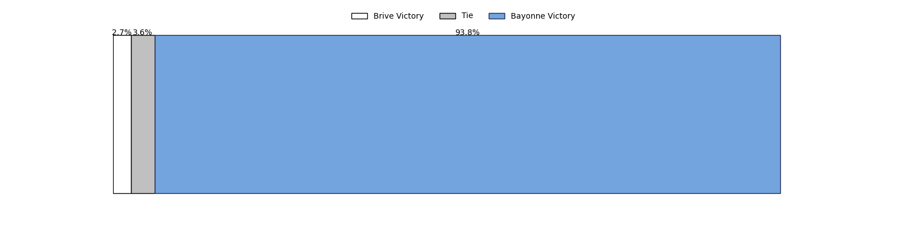

---  
layout: page  
title: Brive at Bayonne; 9-37  
date: 2023-01-28 17:00:00 18:00:00 -0500  
categories: match review  
---
# Brive at Bayonne; 9-37

# Club Level Predictions

The first set of predictions treats a club as the smallest object, as the club develops its members, organizes a gameplan, and deploys its players as needed for each match. This club model has a prediction of 0.646, which translates to predicting Bayonne to win by 5.3.

Each club has a rating and a rating deviation (simiar to a Glicko system), and expected performances can be generated. This allows for simulated matches and spreads like the ones below.
## Projected Performances

## Projected Spreads

## Projected Results

# Player Level Predictions

Treating teams instead as an entity made up of the currently active players, I have ratings for each player in an altogether different system. These can be combined to form team ratings once teamsheets are announced, weighting starters a bit higher than the reserves. After the match is played, players can be weighted by their minutes on the field, allowing for an accurate measure of the team's composition. With these compiled team ratings, we can make predictions, measure inaccuracy, and update the individual player ratings.
## Prediction with Player Minutes: Bayonne by 11.7

Bayonne by 7.7 on a neutral field
## Scores over Time

## Win Probability over Time

## Prediction without Player Minutes: Bayonne by 10.0

Bayonne by 6.0 on a neutral pitch

|   Away Minutes | Away Player                                                           |   Away elo |   Away Percentile |   Number |   Home Percentile |   Home elo | Home Player                                                                  |   Home Minutes |
|---------------:|:----------------------------------------------------------------------|-----------:|------------------:|---------:|------------------:|-----------:|:-----------------------------------------------------------------------------|---------------:|
|             52 | [Tietie Tuimauga](..//playerfiles//TietieTuimauga_cleaned.md)         |      95.14 |                45 |        1 |                60 |      96.74 | [Swan Cormenier](..//playerfiles//SwanCormenier_cleaned.md)                  |             52 |
|             65 | [Motu Matu'u](..//playerfiles//MotuMatu'u_cleaned.md)                 |      82.84 |                15 |        2 |                45 |      93.3  | [Facundo Bosch](..//playerfiles//FacundoBosch_cleaned.md)                    |             71 |
|             62 | [Marcel van der Merwe](..//playerfiles//MarcelvanderMerwe_cleaned.md) |      92.12 |                37 |        3 |                36 |      94.53 | [Pascal Cotet](..//playerfiles//PascalCotet_cleaned.md)                      |             71 |
|             80 | [Tevita Ratuva](..//playerfiles//TevitaRatuva_cleaned.md)             |      97.07 |                51 |        4 |                99 |     164.03 | [Denis Marchois](..//playerfiles//DenisMarchois_cleaned.md)                  |             67 |
|             46 | [Julien Delannoy](..//playerfiles//JulienDelannoy_cleaned.md)         |      86.28 |                25 |        5 |                98 |     139.64 | [Thomas Ceyte](..//playerfiles//ThomasCeyte_cleaned.md)                      |             80 |
|             52 | [Retief Marais](..//playerfiles//RetiefMarais_cleaned.md)             |     124.2  |                92 |        6 |                32 |      89.6  | [Pierre Huguet](..//playerfiles//PierreHuguet_cleaned.md)                    |             80 |
|             80 | [Said Hireche](..//playerfiles//SaidHireche_cleaned.md)               |     156.45 |                99 |        7 |                91 |     120.35 | [Baptiste Heguy](..//playerfiles//BaptisteHeguy_cleaned.md)                  |             80 |
|             80 | [Esteban Abadie](..//playerfiles//EstebanAbadie_cleaned.md)           |     126.01 |                93 |        8 |                66 |     103.94 | [Uzair Cassiem](..//playerfiles//UzairCassiem_cleaned.md)                    |             74 |
|             62 | [Paul Abadie](..//playerfiles//PaulAbadie_cleaned.md)                 |     101.75 |                65 |        9 |                80 |     108.76 | [Guillaume Rouet Piffard](..//playerfiles//GuillaumeRouetPiffard_cleaned.md) |             65 |
|             69 | [Enzo Herve](..//playerfiles//EnzoHerve_cleaned.md)                   |     139.99 |                98 |       10 |                98 |     136.95 | [Camille Lopez](..//playerfiles//CamilleLopez_cleaned.md)                    |             80 |
|             80 | [Axel Muller](..//playerfiles//AxelMuller_cleaned.md)                 |      99.83 |                61 |       11 |                88 |     117.76 | [Remy Baget](..//playerfiles//RemyBaget_cleaned.md)                          |             80 |
|             46 | [Setareki Bituniyata](..//playerfiles//SetarekiBituniyata_cleaned.md) |     119.96 |                89 |       12 |                39 |      91.63 | [Eneriko Buliruarua](..//playerfiles//EnerikoBuliruarua_cleaned.md)          |             65 |
|             80 | [Seta Tuicuvu](..//playerfiles//SetaTuicuvu_cleaned.md)               |      93.7  |                43 |       13 |                75 |     106.73 | [Sireli Maqala](..//playerfiles//SireliMaqala_cleaned.md)                    |             74 |
|             80 | [Arthur Bonneval](..//playerfiles//ArthurBonneval_cleaned.md)         |     101.56 |                65 |       14 |                78 |     108.93 | [Arnaud Erbinartegaray](..//playerfiles//ArnaudErbinartegaray_cleaned.md)    |             80 |
|             80 | [Mathis Ferté](..//playerfiles//MathisFerté_cleaned.md)               |      93.8  |                43 |       15 |                94 |     131.92 | [Luke Morahan](..//playerfiles//LukeMorahan_cleaned.md)                      |             80 |
|             34 | [Oskar Rixen](..//playerfiles//OskarRixen_cleaned.md)                 |      94.17 |                42 |       16 |                30 |      89.95 | [Pieter Scholtz](..//playerfiles//PieterScholtz_cleaned.md)                  |             28 |
|             34 | [Nico Lee](..//playerfiles//NicoLee_cleaned.md)                       |     122.72 |                91 |       17 |                16 |      81.57 | [Guillaume Martocq](..//playerfiles//GuillaumeMartocq_cleaned.md)            |             15 |
|             28 | [Abraham Papali'i](..//playerfiles//AbrahamPapali'i_cleaned.md)       |     105.41 |                69 |       18 |                77 |     107.28 | [Maxime Machenaud](..//playerfiles//MaximeMachenaud_cleaned.md)              |             15 |
|             28 | [Daniel Brennan](..//playerfiles//DanielBrennan_cleaned.md)           |     100.19 |                62 |       19 |                50 |      95.9  | [Manuel Leindekar](..//playerfiles//ManuelLeindekar_cleaned.md)              |             13 |
|             18 | [Pietro Ceccarelli](..//playerfiles//PietroCeccarelli_cleaned.md)     |     105.99 |                77 |       20 |                 1 |      58.91 | [Matis Perchaud](..//playerfiles//MatisPerchaud_cleaned.md)                  |              9 |
|             18 | [Leo Carbonneau](..//playerfiles//LeoCarbonneau_cleaned.md)           |      86.83 |                27 |       21 |                76 |     101.6  | [Thomas Acquier](..//playerfiles//ThomasAcquier_cleaned.md)                  |              9 |
|             15 | [Nathan Fraissenon](..//playerfiles//NathanFraissenon_cleaned.md)     |     103.96 |                57 |       22 |                40 |      93.33 | [Mateaki Kafatolu](..//playerfiles//MateakiKafatolu_cleaned.md)              |              6 |
|             11 | [Tanguy Lacoste](..//playerfiles//TanguyLacoste_cleaned.md)           |      83.18 |               nan |       23 |                11 |      78.67 | [Jason Robertson](..//playerfiles//JasonRobertson_cleaned.md)                |              6 |

