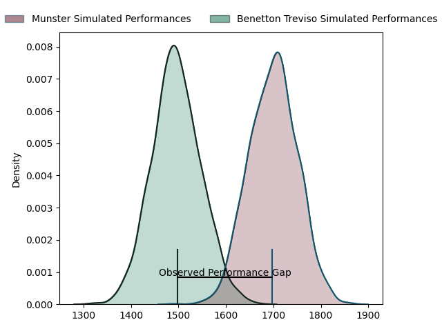
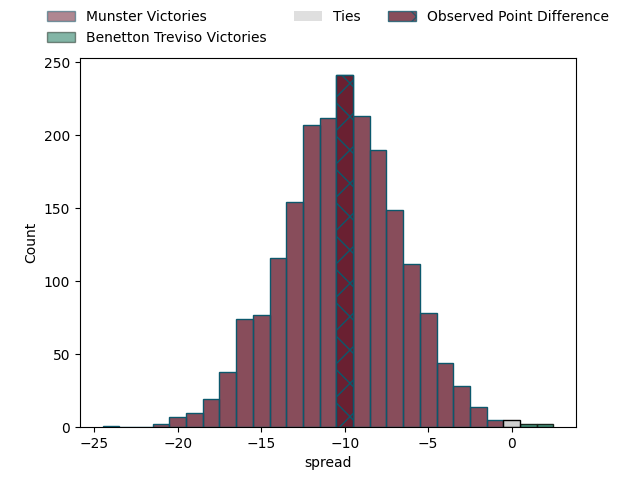
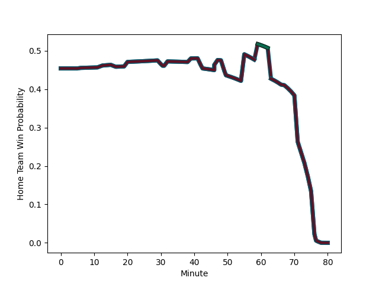

---  
layout: page  
title: Munster at Benetton Treviso; 40-30  
date: 2023-01-28 15:30:00 18:00:00 -0500  
categories: match review  
---
# Munster at Benetton Treviso; 40-30

# Club Level Predictions

The first set of predictions treats a club as the smallest object, as the club develops its members, organizes a gameplan, and deploys its players as needed for each match. This club model has a prediction of 0.238, which translates to predicting Munster to win by 10.2.

Each club has a rating and a rating deviation (simiar to a Glicko system), and expected performances can be generated. This allows for simulated matches and spreads like the ones below.
## Projected Performances

## Projected Spreads

# Player Level Predictions

Treating teams instead as an entity made up of the currently active players, I have ratings for each player in an altogether different system. These can be combined to form team ratings once teamsheets are announced, weighting starters a bit higher than the reserves. After the match is played, players can be weighted by their minutes on the field, allowing for an accurate measure of the team's composition. With these compiled team ratings, we can make predictions, measure inaccuracy, and update the individual player ratings.
## Prediction with Player Minutes: Munster by 4.0

Munster by 8.0 on a neutral field
## Scores over Time

## Win Probability over Time

## Prediction without Player Minutes: Munster by 11.1

Munster by 15.1 on a neutral pitch

|   Away Minutes | Away Player                                                     |   Away elo |   Away Percentile |   Number |   Home Percentile |   Home elo | Home Player                                                              |   Home Minutes |
|---------------:|:----------------------------------------------------------------|-----------:|------------------:|---------:|------------------:|-----------:|:-------------------------------------------------------------------------|---------------:|
|             72 | [Josh Wycherley](..//playerfiles//JoshWycherley_cleaned.md)     |      85.11 |                20 |        1 |                78 |     105.17 | [Nahuel Tetaz Chaparro](..//playerfiles//NahuelTetazChaparro_cleaned.md) |             47 |
|             55 | [Niall Scannell](..//playerfiles//NiallScannell_cleaned.md)     |     111.65 |                86 |        2 |                48 |      94.43 | [Siua Maile](..//playerfiles//SiuaMaile_cleaned.md)                      |             55 |
|             55 | [Roman Salanoa](..//playerfiles//RomanSalanoa_cleaned.md)       |     102.69 |                69 |        3 |                63 |     100.28 | [Tiziano Pasquali](..//playerfiles//TizianoPasquali_cleaned.md)          |             63 |
|             55 | [Jean Kleyn](..//playerfiles//JeanKleyn_cleaned.md)             |      95.84 |                51 |        4 |                 2 |      61.77 | [Marco Lazzaroni](..//playerfiles//MarcoLazzaroni_cleaned.md)            |             47 |
|             80 | [Fineen Wycherley](..//playerfiles//FineenWycherley_cleaned.md) |      92.09 |                38 |        5 |               nan |      93.69 | [Riccardo Favretto](..//playerfiles//RiccardoFavretto_cleaned.md)        |             80 |
|             73 | [Jack O'Sullivan](..//playerfiles//JackO'Sullivan_cleaned.md)   |     102.25 |                58 |        6 |                94 |     126.81 | [Giovanni Pettinelli](..//playerfiles//GiovanniPettinelli_cleaned.md)    |             80 |
|             80 | [John Hodnett](..//playerfiles//JohnHodnett_cleaned.md)         |     103.36 |                69 |        7 |                 5 |      74.34 | [Alessandro Izekor](..//playerfiles//AlessandroIzekor_cleaned.md)        |             80 |
|             80 | [Alex Kendellen](..//playerfiles//AlexKendellen_cleaned.md)     |     104.68 |                69 |        8 |                10 |      78.49 | [Henry Time-Stowers](..//playerfiles//HenryTime-Stowers_cleaned.md)      |             51 |
|             77 | [Paddy Patterson](..//playerfiles//PaddyPatterson_cleaned.md)   |     100.17 |                65 |        9 |                94 |     122.85 | [Dewaldt Duvenage](..//playerfiles//DewaldtDuvenage_cleaned.md)          |             73 |
|             80 | [Joey Carbery](..//playerfiles//JoeyCarbery_cleaned.md)         |     102.93 |                65 |       10 |                70 |     106.57 | [Jacob Umaga](..//playerfiles//JacobUmaga_cleaned.md)                    |             80 |
|             80 | [Liam Coombes](..//playerfiles//LiamCoombes_cleaned.md)         |      89.46 |                31 |       11 |                 9 |      76.18 | [Mattia Bellini](..//playerfiles//MattiaBellini_cleaned.md)              |             32 |
|             67 | [Malakai Fekitoa](..//playerfiles//MalakaiFekitoa_cleaned.md)   |     126.33 |                94 |       12 |                36 |      90.38 | [Filippo Drago](..//playerfiles//FilippoDrago_cleaned.md)                |             80 |
|             80 | [Antoine Frisch](..//playerfiles//AntoineFrisch_cleaned.md)     |     102.61 |                66 |       13 |                89 |     118.69 | [Marco Zanon](..//playerfiles//MarcoZanon_cleaned.md)                    |             80 |
|             20 | [Calvin Nash](..//playerfiles//CalvinNash_cleaned.md)           |     129.98 |                96 |       14 |                16 |      83.34 | [Ignacio Mendy](..//playerfiles//IgnacioMendy_cleaned.md)                |             80 |
|             80 | [Shane Daly](..//playerfiles//ShaneDaly_cleaned.md)             |     124.17 |                93 |       15 |                72 |     107.15 | [Rhyno Smith](..//playerfiles//RhynoSmith_cleaned.md)                    |             80 |
|             60 | [Ben Healy](..//playerfiles//BenHealy_cleaned.md)               |      97.09 |                44 |       16 |                80 |     109.53 | [Marcus Watson](..//playerfiles//MarcusWatson_cleaned.md)                |             48 |
|             25 | [Stephen Archer](..//playerfiles//StephenArcher_cleaned.md)     |      92.75 |                39 |       17 |                69 |     100.64 | [Thomas Gallo](..//playerfiles//ThomasGallo_cleaned.md)                  |             33 |
|             25 | [Cian Hurley](..//playerfiles//CianHurley_cleaned.md)           |      92.47 |               nan |       18 |                23 |      85.93 | [Carl Wegner](..//playerfiles//CarlWegner_cleaned.md)                    |             33 |
|             13 | [Rory Scannell](..//playerfiles//RoryScannell_cleaned.md)       |     112.05 |                82 |       19 |                12 |      79.74 | [Braam Steyn](..//playerfiles//BraamSteyn_cleaned.md)                    |             29 |
|              7 | [Ruadhan Quinn](..//playerfiles//RuadhanQuinn_cleaned.md)       |      96.37 |               nan |       20 |                64 |     101.85 | [Manfredi Albanese](..//playerfiles//ManfrediAlbanese_cleaned.md)        |              7 |
|              8 | [Mark Donnelly](..//playerfiles//MarkDonnelly_cleaned.md)       |      95    |               nan |       21 |                41 |      93.41 | [Filippo Alongi](..//playerfiles//FilippoAlongi_cleaned.md)              |             17 |
|              3 | [Neil Cronin](..//playerfiles//NeilCronin_cleaned.md)           |     107.88 |                78 |       22 |                55 |      96.81 | [Bautista Bernasconi](..//playerfiles//BautistaBernasconi_cleaned.md)    |             25 |
|             25 | [Diarmuid Barron](..//playerfiles//DiarmuidBarron_cleaned.md)   |     121.79 |                94 |       23 |               nan |     nan    | nan                                                                      |            nan |

