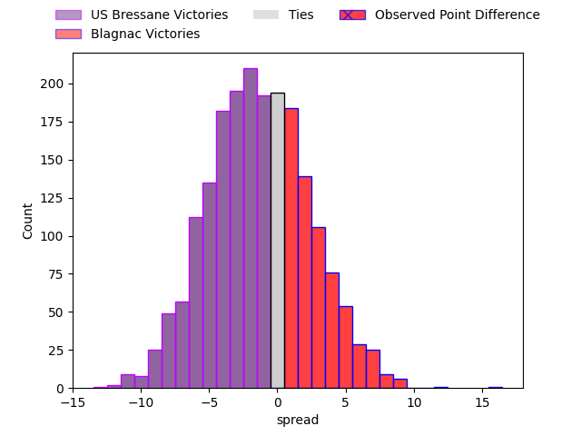
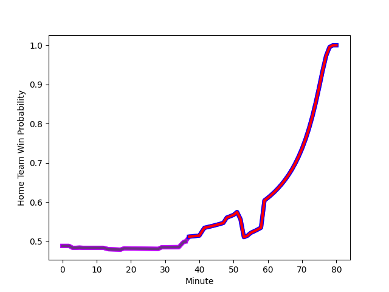

---  
layout: page  
title: US Bressane at Blagnac; 15-31  
date: 2023-01-28 16:00:00 18:00:00 -0500  
categories: match review  
---
# US Bressane at Blagnac; 15-31

# Club Level Predictions

The first set of predictions treats a club as the smallest object, as the club develops its members, organizes a gameplan, and deploys its players as needed for each match. This club model has a prediction of 0.486, which translates to predicting US Bressane to win by 0.5.

Each club has a rating and a rating deviation (simiar to a Glicko system), and expected performances can be generated. This allows for simulated matches and spreads like the ones below.
## Projected Performances

## Projected Spreads

## Projected Results

# Player Level Predictions

Treating teams instead as an entity made up of the currently active players, I have ratings for each player in an altogether different system. These can be combined to form team ratings once teamsheets are announced, weighting starters a bit higher than the reserves. After the match is played, players can be weighted by their minutes on the field, allowing for an accurate measure of the team's composition. With these compiled team ratings, we can make predictions, measure inaccuracy, and update the individual player ratings.
## Prediction with Player Minutes: Blagnac by 2.0

US Bressane by 2.0 on a neutral field
## Scores over Time

## Win Probability over Time

## Prediction without Player Minutes: US Bressane by 0.0

US Bressane by 4.0 on a neutral pitch

|   Away Minutes | Away Player                                                                       |   Away elo |   Away Percentile |   Number |   Home Percentile |   Home elo | Home Player                                                              |   Home Minutes |
|---------------:|:----------------------------------------------------------------------------------|-----------:|------------------:|---------:|------------------:|-----------:|:-------------------------------------------------------------------------|---------------:|
|             64 | [Teo Bordenave](..//playerfiles//TeoBordenave_cleaned.md)                         |      82.74 |                14 |        1 |                 9 |      79.98 | [Jean-Baptiste Martin](..//playerfiles//Jean-BaptisteMartin_cleaned.md)  |             55 |
|             63 | [Clement Jullien](..//playerfiles//ClementJullien_cleaned.md)                     |      86.57 |                21 |        2 |                61 |     102.46 | [Gabin Villerouge](..//playerfiles//GabinVillerouge_cleaned.md)          |             55 |
|             59 | [Zauri Tevdorashvili](..//playerfiles//ZauriTevdorashvili_cleaned.md)             |      82    |                19 |        3 |                47 |      95.35 | [Fabien Lorenzon](..//playerfiles//FabienLorenzon_cleaned.md)            |             51 |
|             51 | [Marius Antonescu](..//playerfiles//MariusAntonescu_cleaned.md)                   |     110.72 |                81 |        4 |                11 |      70.94 | [Lucas Tolofua](..//playerfiles//LucasTolofua_cleaned.md)                |             67 |
|             80 | [Cyril Veyret](..//playerfiles//CyrilVeyret_cleaned.md)                           |     126.95 |                94 |        5 |                61 |     100.04 | [Vincent Mutel](..//playerfiles//VincentMutel_cleaned.md)                |             80 |
|             51 | [Thomas Déliance](..//playerfiles//ThomasDéliance_cleaned.md)                     |      99.22 |                58 |        6 |                60 |     100.26 | [Nikita Bekov](..//playerfiles//NikitaBekov_cleaned.md)                  |             80 |
|             80 | [Louis Bruinsma](..//playerfiles//LouisBruinsma_cleaned.md)                       |      76.85 |                11 |        7 |                63 |     100.19 | [Baptiste Collet](..//playerfiles//BaptisteCollet_cleaned.md)            |             53 |
|             59 | [Wael May](..//playerfiles//WaelMay_cleaned.md)                                   |      91.84 |                36 |        8 |                57 |     100.16 | [Mathieu Vachon](..//playerfiles//MathieuVachon_cleaned.md)              |             80 |
|             37 | [Nicolas Faure](..//playerfiles//NicolasFaure_cleaned.md)                         |     128.07 |                97 |        9 |                82 |     110.33 | [Paul Ravier](..//playerfiles//PaulRavier_cleaned.md)                    |              3 |
|             80 | [Christian Lacombe](..//playerfiles//ChristianLacombe_cleaned.md)                 |      55.3  |                 1 |       10 |                51 |      99.67 | [Ugo Seunes](..//playerfiles//UgoSeunes_cleaned.md)                      |             80 |
|             80 | [Kavekini Tabu](..//playerfiles//KavekiniTabu_cleaned.md)                         |      87.93 |                26 |       11 |                 5 |      68.4  | [Benjamin Daurau Bedin](..//playerfiles//BenjaminDaurauBedin_cleaned.md) |             80 |
|             80 | [Parataiso Silafai-Lea'ana](..//playerfiles//ParataisoSilafai-Lea'ana_cleaned.md) |     125.53 |                94 |       12 |                40 |      92.44 | [Aurelien Labau](..//playerfiles//AurelienLabau_cleaned.md)              |             80 |
|             51 | [Maile Mamao](..//playerfiles//MaileMamao_cleaned.md)                             |      84.23 |                20 |       13 |                55 |      97.99 | [Clément Vareilles](..//playerfiles//ClémentVareilles_cleaned.md)        |             80 |
|             80 | [Audric Sanlaville](..//playerfiles//AudricSanlaville_cleaned.md)                 |      87.21 |                24 |       14 |                32 |      89.68 | [Lukas Doyhenard](..//playerfiles//LukasDoyhenard_cleaned.md)            |             69 |
|             80 | [Pierre Berard](..//playerfiles//PierreBerard_cleaned.md)                         |     101.97 |                62 |       15 |                 6 |      72.87 | [Antoine Renaud](..//playerfiles//AntoineRenaud_cleaned.md)              |             80 |
|             16 | [Willem Johannes Harmse](..//playerfiles//WillemJohannesHarmse_cleaned.md)        |      83.58 |                15 |       16 |                73 |     103.81 | [Alexis Decaux](..//playerfiles//AlexisDecaux_cleaned.md)                |             25 |
|             17 | [Louis Dasalmartini](..//playerfiles//LouisDasalmartini_cleaned.md)               |      94.42 |               nan |       17 |                48 |      93.92 | [Florian Bertrand](..//playerfiles//FlorianBertrand_cleaned.md)          |             25 |
|             21 | [Erich de Jager](..//playerfiles//ErichdeJager_cleaned.md)                        |      95.03 |                49 |       18 |                35 |      92.98 | [Marco Trauth](..//playerfiles//MarcoTrauth_cleaned.md)                  |             29 |
|             29 | [Monty Leverstein](..//playerfiles//MontyLeverstein_cleaned.md)                   |      90.13 |                37 |       19 |                66 |     101.99 | [Nekolo Tolofua](..//playerfiles//NekoloTolofua_cleaned.md)              |             13 |
|             29 | [Nail Ait Naceur](..//playerfiles//NailAitNaceur_cleaned.md)                      |      97.54 |                61 |       20 |                70 |     103.24 | [Lilian Rousset](..//playerfiles//LilianRousset_cleaned.md)              |             27 |
|             21 | [Sione Anga'aelangi](..//playerfiles//SioneAnga'aelangi_cleaned.md)               |      96.86 |                57 |       21 |                38 |      91    | [Corentin Penc'hoat](..//playerfiles//CorentinPenc'hoat_cleaned.md)      |             77 |
|             43 | [Robin Graulle](..//playerfiles//RobinGraulle_cleaned.md)                         |      81.27 |                15 |       22 |                93 |     130.16 | [Jean-Andre Vernetti](..//playerfiles//Jean-AndreVernetti_cleaned.md)    |             11 |
|             29 | [Alexandre Badet](..//playerfiles//AlexandreBadet_cleaned.md)                     |      77.06 |                10 |       23 |               nan |     nan    | nan                                                                      |            nan |

