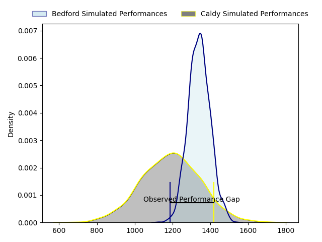
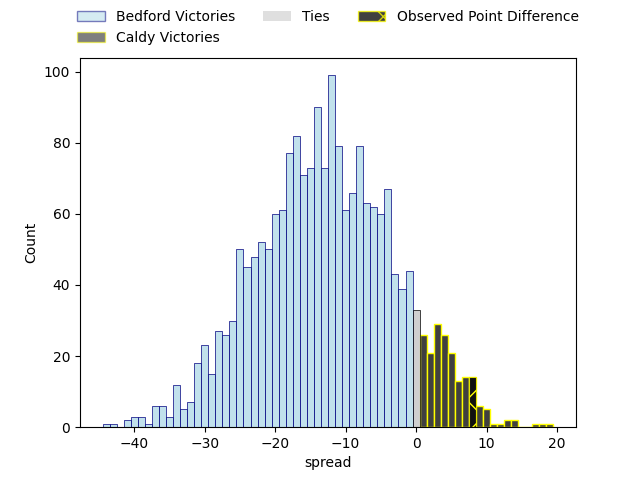
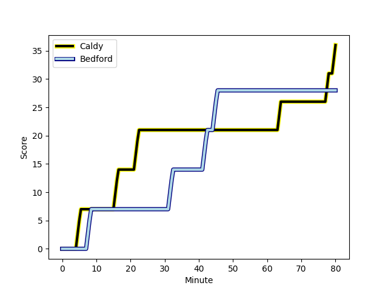
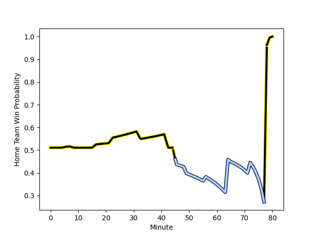

---  
layout: page  
title: Bedford at Caldy; 28-36  
date: 2023-01-28 15:00:00 18:00:00 -0500  
categories: match review  
---
# Bedford at Caldy; 28-36

# Club Level Predictions

The first set of predictions treats a club as the smallest object, as the club develops its members, organizes a gameplan, and deploys its players as needed for each match. This club model has a prediction of 0.183, which translates to predicting Bedford to win by 13.2.

Each club has a rating and a rating deviation (simiar to a Glicko system), and expected performances can be generated. This allows for simulated matches and spreads like the ones below.
## Projected Performances

## Projected Spreads

## Projected Results

# Player Level Predictions

Treating teams instead as an entity made up of the currently active players, I have ratings for each player in an altogether different system. These can be combined to form team ratings once teamsheets are announced, weighting starters a bit higher than the reserves. After the match is played, players can be weighted by their minutes on the field, allowing for an accurate measure of the team's composition. With these compiled team ratings, we can make predictions, measure inaccuracy, and update the individual player ratings.
## Prediction with Player Minutes: Caldy by 2.8

Bedford by 1.2 on a neutral field
## Scores over Time

## Win Probability over Time

## Prediction without Player Minutes: Caldy by 5.4

Caldy by 1.4 on a neutral pitch

|   Away Minutes | Away Player                                                            |   Away elo |   Away Percentile |   Number |   Home Percentile |   Home elo | Home Player                                                     |   Home Minutes |
|---------------:|:-----------------------------------------------------------------------|-----------:|------------------:|---------:|------------------:|-----------:|:----------------------------------------------------------------|---------------:|
|             64 | [Joey Conway](..//playerfiles//JoeyConway_cleaned.md)                  |      98.62 |                57 |        1 |                73 |     103.97 | [Adam Aigbokhae](..//playerfiles//AdamAigbokhae_cleaned.md)     |             65 |
|             72 | [Jack Hughes](..//playerfiles//JackHughes_cleaned.md)                  |     105.82 |                78 |        2 |                79 |     106.69 | [Oliver Hearn](..//playerfiles//OliverHearn_cleaned.md)         |             78 |
|             80 | [Corrie Barrett](..//playerfiles//CorrieBarrett_cleaned.md)            |      97.58 |                54 |        3 |                63 |     100.41 | [Nathan Rushton](..//playerfiles//NathanRushton_cleaned.md)     |             49 |
|             56 | [Robin Williams](..//playerfiles//RobinWilliams_cleaned.md)            |     111.88 |                83 |        4 |                44 |      94.88 | [Josiah Dickinson](..//playerfiles//JosiahDickinson_cleaned.md) |             80 |
|             80 | [Luke Frost](..//playerfiles//LukeFrost_cleaned.md)                    |     119.35 |                89 |        5 |                62 |     100.37 | [Thomas Sanders](..//playerfiles//ThomasSanders_cleaned.md)     |             56 |
|             80 | [Jac Arthur](..//playerfiles//JacArthur_cleaned.md)                    |      88.31 |                27 |        6 |               nan |      95.64 | [Nyle Davidson](..//playerfiles//NyleDavidson_cleaned.md)       |             80 |
|             64 | [Kieran Curran](..//playerfiles//KieranCurran_cleaned.md)              |      99.07 |               nan |        7 |                75 |     106.53 | [Callum Ridgway](..//playerfiles//CallumRidgway_cleaned.md)     |             64 |
|             80 | [Tui Uru](..//playerfiles//TuiUru_cleaned.md)                          |      93.63 |                41 |        8 |                86 |     115.31 | [Sam Dickinson](..//playerfiles//SamDickinson_cleaned.md)       |             80 |
|             64 | [Alex Day](..//playerfiles//AlexDay_cleaned.md)                        |     128.09 |                97 |        9 |                64 |     101.09 | [Chris Pilgrim](..//playerfiles//ChrisPilgrim_cleaned.md)       |             56 |
|             72 | [William Maisey](..//playerfiles//WilliamMaisey_cleaned.md)            |     136.7  |                97 |       10 |                61 |     100.95 | [Rhys Hayes](..//playerfiles//RhysHayes_cleaned.md)             |             80 |
|             72 | [Dean Adamson](..//playerfiles//DeanAdamson_cleaned.md)                |     108.86 |                78 |       11 |                81 |     111.54 | [Louis Beer](..//playerfiles//LouisBeer_cleaned.md)             |             49 |
|             80 | [Michael Le Bourgeois](..//playerfiles//MichaelLeBourgeois_cleaned.md) |     119.06 |                89 |       12 |                80 |     111.2  | [Michael Barlow](..//playerfiles//MichaelBarlow_cleaned.md)     |             49 |
|             80 | [Jamie Elliott](..//playerfiles//JamieElliott_cleaned.md)              |     103.27 |                68 |       13 |                53 |      97.29 | [Dan Bibby](..//playerfiles//DanBibby_cleaned.md)               |             80 |
|             80 | [Sean French](..//playerfiles//SeanFrench_cleaned.md)                  |      87.55 |                18 |       14 |                72 |     104.42 | [Nick Royle](..//playerfiles//NickRoyle_cleaned.md)             |             80 |
|             80 | [Matthew Worley](..//playerfiles//MatthewWorley_cleaned.md)            |      78.98 |                12 |       15 |                76 |     109.82 | [Elliott Gourlay](..//playerfiles//ElliottGourlay_cleaned.md)   |             80 |
|             24 | [Charles Rylands](..//playerfiles//CharlesRylands_cleaned.md)          |      85.92 |                32 |       16 |                51 |     103.43 | [Ryan Higginson](..//playerfiles//RyanHigginson_cleaned.md)     |             31 |
|             16 | [Lewis Holsey](..//playerfiles//LewisHolsey_cleaned.md)                |      99.07 |                47 |       17 |               nan |      98.63 | [Lewis Barker](..//playerfiles//LewisBarker_cleaned.md)         |             31 |
|             16 | [Jake Garside](..//playerfiles//JakeGarside_cleaned.md)                |      97.36 |                46 |       18 |                30 |      90.34 | [Michael Cartmill](..//playerfiles//MichaelCartmill_cleaned.md) |             31 |
|             16 | [Tom Lockett](..//playerfiles//TomLockett_cleaned.md)                  |     106.35 |                74 |       19 |                62 |     105.39 | [Martin Gerrard](..//playerfiles//MartinGerrard_cleaned.md)     |             24 |
|              8 | [Callum Burns](..//playerfiles//CallumBurns_cleaned.md)                |      95.6  |               nan |       20 |                39 |      94.47 | [Joseph Murray](..//playerfiles//JosephMurray_cleaned.md)       |             24 |
|              8 | [Louis Grimoldby](..//playerfiles//LouisGrimoldby_cleaned.md)          |      89.47 |                22 |       21 |                43 |      93.3  | [Harrison Crowe](..//playerfiles//HarrisonCrowe_cleaned.md)     |             16 |
|              8 | [Patrick Tapley](..//playerfiles//PatrickTapley_cleaned.md)            |      83.99 |                18 |       22 |               nan |      98.69 | [Jack Parker](..//playerfiles//JackParker_cleaned.md)           |             15 |
|            nan | nan                                                                    |     nan    |               nan |       23 |               nan |      93.82 | [Thomas Clarke](..//playerfiles//ThomasClarke_cleaned.md)       |              2 |

