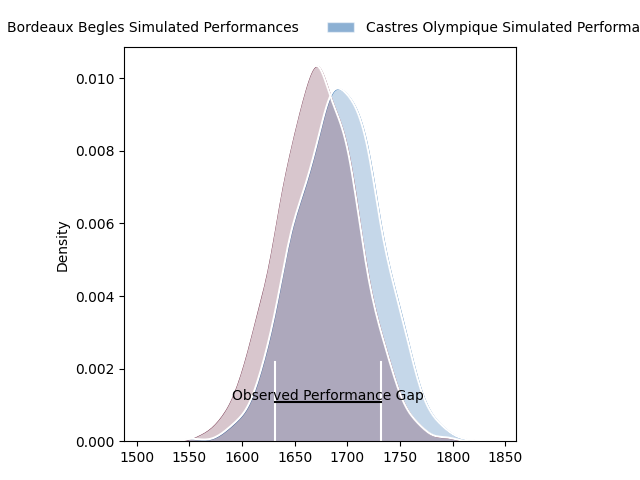
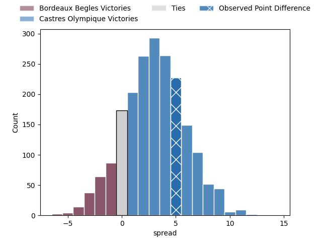
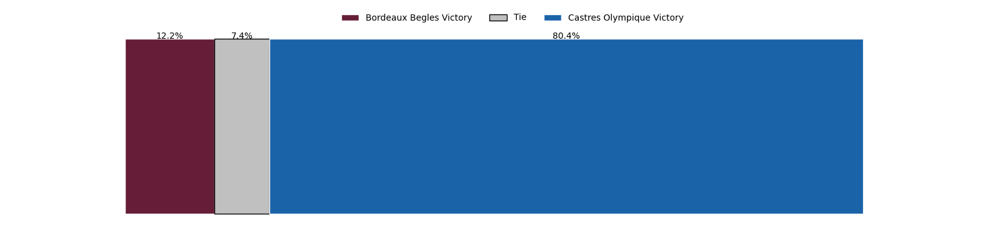
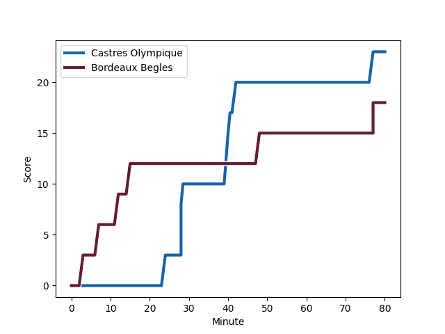
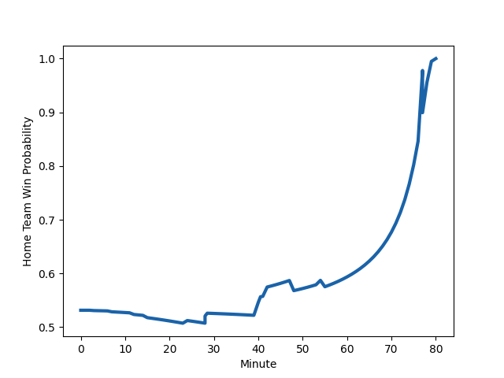

---  
layout: page  
title: Bordeaux Begles at Castres Olympique; 18-23  
date: 2023-01-28 17:00:00 18:00:00 -0500  
categories: match review  
---
# Bordeaux Begles at Castres Olympique; 18-23

# Club Level Predictions

The first set of predictions treats a club as the smallest object, as the club develops its members, organizes a gameplan, and deploys its players as needed for each match. This club model has a prediction of 0.58, which translates to predicting Castres Olympique to win by 2.8.

Each club has a rating and a rating deviation (simiar to a Glicko system), and expected performances can be generated. This allows for simulated matches and spreads like the ones below.
## Projected Performances

## Projected Spreads

## Projected Results

# Player Level Predictions

Treating teams instead as an entity made up of the currently active players, I have ratings for each player in an altogether different system. These can be combined to form team ratings once teamsheets are announced, weighting starters a bit higher than the reserves. After the match is played, players can be weighted by their minutes on the field, allowing for an accurate measure of the team's composition. With these compiled team ratings, we can make predictions, measure inaccuracy, and update the individual player ratings.
## Prediction with Player Minutes: Castres Olympique by 9.5

Castres Olympique by 5.5 on a neutral field
## Scores over Time

## Win Probability over Time

## Prediction without Player Minutes: Castres Olympique by 9.2

Castres Olympique by 5.2 on a neutral pitch

|   Away Minutes | Away Player                                                                      |   Away elo |   Away Percentile |   Number |   Home Percentile |   Home elo | Home Player                                                                       |   Home Minutes |
|---------------:|:---------------------------------------------------------------------------------|-----------:|------------------:|---------:|------------------:|-----------:|:----------------------------------------------------------------------------------|---------------:|
|             55 | [Lekso Kaulashvili](..//playerfiles//LeksoKaulashvili_cleaned.md)                |      99.81 |                62 |        1 |                90 |     114.27 | [Quentin Walcker](..//playerfiles//QuentinWalcker_cleaned.md)                     |             60 |
|             55 | [Maxime Lamothe](..//playerfiles//MaximeLamothe_cleaned.md)                      |      96.5  |                60 |        2 |                54 |      97.2  | [Pierre Colonna](..//playerfiles//PierreColonna_cleaned.md)                       |             60 |
|             55 | [Vadim Cobilas](..//playerfiles//VadimCobilas_cleaned.md)                        |     103.58 |                72 |        3 |                63 |     100.29 | [Wilfrid Hounkpatin](..//playerfiles//WilfridHounkpatin_cleaned.md)               |             60 |
|             65 | [Cyril Cazeaux](..//playerfiles//CyrilCazeaux_cleaned.md)                        |     108.3  |                78 |        4 |                59 |      99.2  | [Gauthier Maravat](..//playerfiles//GauthierMaravat_cleaned.md)                   |             60 |
|             80 | [Jandré Marais](..//playerfiles//JandréMarais_cleaned.md)                        |     125.12 |                94 |        5 |                62 |     100.26 | [Tom Staniforth](..//playerfiles//TomStaniforth_cleaned.md)                       |             80 |
|             55 | [Antoine Miquel](..//playerfiles//AntoineMiquel_cleaned.md)                      |     113.05 |                84 |        6 |                50 |      96.16 | [Mathieu Babillot](..//playerfiles//MathieuBabillot_cleaned.md)                   |             80 |
|             80 | [Mahamadou Diaby](..//playerfiles//MahamadouDiaby_cleaned.md)                    |     108.17 |                77 |        7 |                25 |      87.47 | [Nick Champion de Crespigny](..//playerfiles//NickChampiondeCrespigny_cleaned.md) |             54 |
|             80 | [Bastien Vergnes Taillefer](..//playerfiles//BastienVergnesTaillefer_cleaned.md) |     117.87 |                91 |        8 |                79 |     111.79 | [Tyler Ardron](..//playerfiles//TylerArdron_cleaned.md)                           |             80 |
|             68 | [Jules Gimbert](..//playerfiles//JulesGimbert_cleaned.md)                        |      73.35 |                 6 |        9 |                64 |     101.16 | [Santiago Arata](..//playerfiles//SantiagoArata_cleaned.md)                       |             73 |
|             80 | [Zack Holmes](..//playerfiles//ZackHolmes_cleaned.md)                            |     107.86 |                76 |       10 |                76 |     108.61 | [Benjamin Urdapilleta](..//playerfiles//BenjaminUrdapilleta_cleaned.md)           |             80 |
|             80 | [Santiago Cordero](..//playerfiles//SantiagoCordero_cleaned.md)                  |      80.26 |                13 |       11 |                85 |     115.07 | [Filipo Nakosi](..//playerfiles//FilipoNakosi_cleaned.md)                         |             80 |
|             80 | [Remi Lamerat](..//playerfiles//RemiLamerat_cleaned.md)                          |     110.53 |                79 |       12 |                34 |      89.92 | [Vilimoni Botitu](..//playerfiles//VilimoniBotitu_cleaned.md)                     |             73 |
|             57 | [Jean-Baptiste Dubie](..//playerfiles//Jean-BaptisteDubie_cleaned.md)            |      82.63 |                19 |       13 |                98 |     137.94 | [Adrea Cocagi](..//playerfiles//AdreaCocagi_cleaned.md)                           |             80 |
|             80 | [Madosh Tambwe](..//playerfiles//MadoshTambwe_cleaned.md)                        |     115.29 |                86 |       14 |                95 |     128.16 | [Geoffrey Palis](..//playerfiles//GeoffreyPalis_cleaned.md)                       |             80 |
|             80 | [Louis Bielle-Biarrey](..//playerfiles//LouisBielle-Biarrey_cleaned.md)          |      91.57 |                37 |       15 |                74 |     108.69 | [Julien Dumora](..//playerfiles//JulienDumora_cleaned.md)                         |             80 |
|             25 | [Ben Tameifuna](..//playerfiles//BenTameifuna_cleaned.md)                        |     143.55 |                99 |       16 |                56 |      98.7  | [Baptiste Delaporte](..//playerfiles//BaptisteDelaporte_cleaned.md)               |             26 |
|             25 | [Tom Willis](..//playerfiles//TomWillis_cleaned.md)                              |      97.78 |                50 |       17 |                54 |      97.71 | [Levan Chilachava](..//playerfiles//LevanChilachava_cleaned.md)                   |             20 |
|             25 | [Jefferson Poirot](..//playerfiles//JeffersonPoirot_cleaned.md)                  |     101.54 |                67 |       18 |                87 |     116.24 | [Florent Vanverberghe](..//playerfiles//FlorentVanverberghe_cleaned.md)           |             20 |
|             25 | [Clement Maynadier](..//playerfiles//ClementMaynadier_cleaned.md)                |     113.48 |                89 |       19 |                58 |      98.91 | [Antoine Tichit](..//playerfiles//AntoineTichit_cleaned.md)                       |             20 |
|             23 | [Tani Vili](..//playerfiles//TaniVili_cleaned.md)                                |      94.69 |                46 |       20 |               nan |     105.78 | [Brice Humbert](..//playerfiles//BriceHumbert_cleaned.md)                         |             20 |
|             15 | [Thomas Jolmes](..//playerfiles//ThomasJolmes_cleaned.md)                        |      70.94 |                 6 |       21 |                14 |      82.6  | [Louis Le Brun](..//playerfiles//LouisLeBrun_cleaned.md)                          |              7 |
|             12 | [Hugo Zabalza](..//playerfiles//HugoZabalza_cleaned.md)                          |      86.17 |                27 |       22 |                50 |      96.13 | [Gauthier Doubrere](..//playerfiles//GauthierDoubrere_cleaned.md)                 |              7 |

